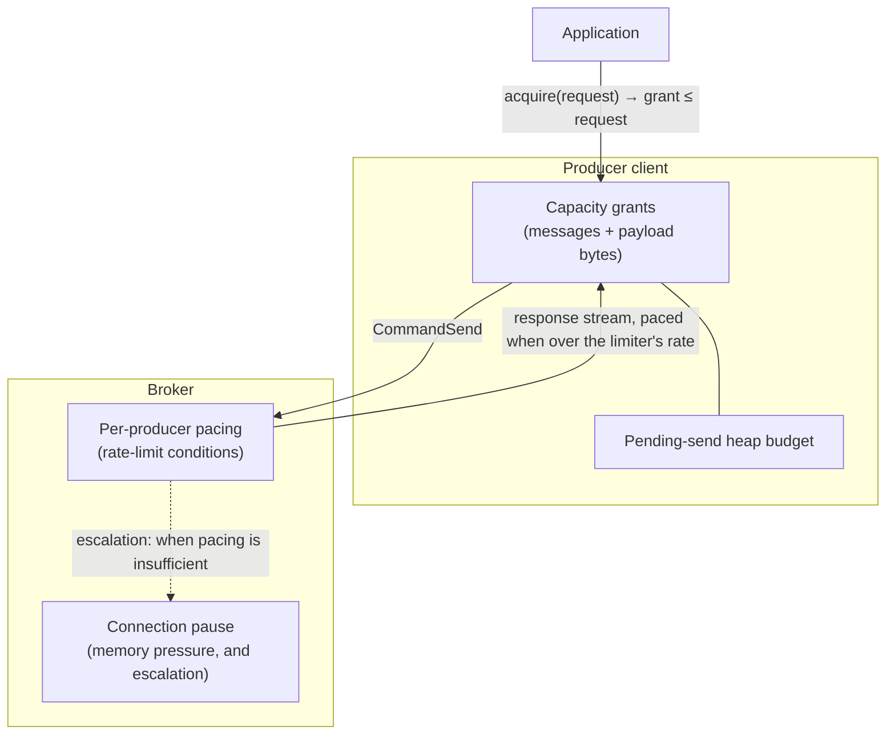

# PIP-494: Produce backpressure: capacity grants and per-producer pacing

# Background knowledge

Publishing to Pulsar crosses three boundaries, and each can be overrun independently:

1. **Application → producer client.** The application hands messages to a `Producer`; the client holds them until the broker acknowledges them.
2. **Producer client → broker.** The client writes `CommandSend` frames onto a TCP connection shared with the client's other producers and consumers; the broker holds them until they are persisted.
3. **Broker → storage.** The broker writes entries to BookKeeper and holds them until the write completes.

"Backpressure" here means: when a downstream boundary cannot keep up, the pressure is transmitted upstream so the upstream party slows down, rather than accumulating unbounded work in the middle.

## What exists today

**At boundary 1**, a producer has two behaviours, selected by `blockIfQueueFull`:

- `false` (the default, `ProducerConfigurationData:87`): a send that exceeds available capacity **fails** with `ProducerQueueIsFullError` / `MemoryBufferIsFullError`.
- `true`: the send **parks the calling thread** until capacity exists.

What bounds that capacity is easy to get wrong. `maxPendingMessages` defaults to **`0` — no message-count limit at all** (`ProducerConfigurationData:55`); `PulsarClientImpl:819` substitutes 1000 only when the client memory limit is disabled. So on stock defaults, on **both** the v4 and V5 clients, the client memory limit is the sole bound on a producer's in-flight window.

That limit is `ClientBuilder.memoryLimit`, and it is documented as **a limit on direct memory** (`ClientBuilder:483`, default 64 MiB). It is charged in `ProducerImpl.canEnqueueRequest` in units of `uncompressedSize` — the payload, and only the payload, charged uncompressed even when the buffer retained is the compressed one. (Batching adds a second charge for the batch buffer itself, via `BatchMessageContainerImpl.updateAndReserveBatchAllocatedSize`; what no charge covers is the per-send bookkeeping, which is the subject of the heap budget proposed below.)

**Inside the broker**, `ServerCnxThrottleTracker.ThrottleType` enumerates seven throttling conditions:

| Condition | Blast radius | Publish path? |
|---|---|---|
| `TopicPublishRate` | connection | yes |
| `ResourceGroupPublishRate` | connection | yes |
| `BrokerPublishRate` | connection | yes |
| `IOThreadMaxPendingPublishBytesExceeded` | **every connection on the IO thread** | yes |
| `ConnectionMaxPendingPublishRequestsExceeded` | connection | yes |
| `ConnectionOutboundBufferFull` | connection | indirect — channel writability |
| `ConnectionPauseReceivingCooldownRateLimit` | connection | all commands |

The last two are gated on `pulsarChannelPauseReceivingRequestsIfUnwritable`, default `false` (`ServiceConfiguration:1076`), so neither fires on a stock broker. Of the five that remain, the two memory-pressure conditions are enabled by default — though the IO-thread one can be switched off with `maxMessagePublishBufferSizeInMB=-1` (`ServiceConfiguration:1917`) — while the three **rate** conditions fire only where an operator configured a rate: `maxPublishRatePerTopicInMessages`/`InBytes` and `brokerPublisherThrottlingMaxMessageRate`/`MaxByteRate` all default to `0`, meaning off (`ServiceConfiguration:1286`, `1293`, `1248`, `1255`). Everything below concerns deployments that set them — which is what multi-tenant operation requires.

**The only action any of them has** is `setAutoRead(false)` on a connection. `ServerCnxThrottleTracker.markThrottled` applies it on the transition into the throttled state. `IOThreadMaxPendingPublishBytesExceeded` is worse than connection-scoped: it iterates `cnxsPerThread` and throttles **every connection sharing that IO thread** (`ServerCnx:305-312`).

## What has already been done

Much of this ground was surveyed in *[Apache Pulsar service level objectives and rate limiting](https://codingthestreams.com/pulsar/2023/11/22/pulsar-slos-and-rate-limiting.html)* (2023), and most of that survey's rate-limiting programme has since shipped:

- The publish and dispatch limiters were consolidated onto a lock-free token bucket, `org.apache.pulsar.broker.qos.AsyncTokenBucket`. `PublishRateLimiterImpl` now holds `tokenBucketOnMessage` and `tokenBucketOnByte`; the separate "precise" limiter, and the Netty-IO-thread lock contention that made it degrade unrelated topics, are gone.
- Throttle conditions are tracked individually per `ThrottleType` in `ServerCnxThrottleTracker`, so one condition clearing cannot resume a connection another still holds.

What that programme did not deliver is what this proposal is about: the same article proposed explicit per-producer flow control, by analogy with the permits Pulsar consumers already use, and optional per-producer connection isolation. Neither was built.

# Motivation

Pulsar does not lack limits. The problems are that they collapse into one blunt action applied at the wrong scope, that the client-side ones offer no usable third option, that heap retention is neither bounded nor accounted, and that on the newest client the bound does not engage at all. The consequence reaches past stability: a tenant whose tail latency is decided by whoever it is multiplexed with cannot be given a service objective anyone can promise.

### The lever is connection-scoped; three of the five conditions are not

`TopicPublishRate`, `ResourceGroupPublishRate` and `BrokerPublishRate` describe a topic, a resource group and a broker. All are enforced by pausing a connection.

With `connectionsPerBroker = 1`, an application producing to twenty topics through one client has all twenty share a connection. One topic breaching its publish rate stops reads for the other nineteen and for every consumer on that client. A well-behaved tenant's latency is decided by the worst-behaved topic it shares a connection with. This is [#23403](https://github.com/apache/pulsar/issues/23403); [PIP-385](https://github.com/apache/pulsar/pull/23398) documents the same problem.

### The mechanism cannot attribute cause, and its own metric shows it

`setAutoRead(false)` transmits no information: the client sees latency and cannot distinguish throttling from a slow network, a slow bookie, or a GC pause. Neither does the pacing this proposal puts in its place, and that limitation is not fixed here — only an explicit signal fixes it (*Alternatives*). What can be fixed without one is who else the decision lands on, and whether the application sees the pressure as capacity instead of as latency. Those are the two claims made below; being told the cause is not among them.

Metrics exist — a connection rate-limit counter, a throttled-connections gauge, and a per-topic publish-rate-limit counter (`OpenTelemetryTopicStats:69`). What is missing is attribution and duration. The per-topic counter is fed by `ServerCnx.increasePublishLimitedTimesForTopics()` (`ServerCnx:4471-4480`), which iterates **every producer on the connection** and increments the counter on **every topic it finds** — culprit and victims alike. The metric is systematically misattributed because the mechanism it reports on cannot tell them apart either, and the connection counter is not labelled by condition.

### The client offers no third option

`blockIfQueueFull` forces a choice between discarding work and parking a thread. Neither suits an asynchronous application: failing throws away work that could have been paced; parking defeats the point of an async API and can wedge a shared executor. There is no way to say *"tell me when you have room; I will decide what to do meanwhile."* This is [#26343](https://github.com/apache/pulsar/issues/26343).

Parking has produced real deadlocks: a send issued from a client IO thread parks that thread on memory only that same thread can release ([#26344](https://github.com/apache/pulsar/issues/26344)).

### Heap retention is neither bounded nor accounted

`memoryLimit` bounds direct memory. A pending unbatched send also retains **heap** — the `MessageMetadata`, the `MessageImpl`, the `OpSendMsg`, the send callback, and the chain of `CompletableFuture` stages carrying the result back — on the order of 1–2 KiB per pending send depending on message shape and JVM settings (measured on JDK 21 with ZGC, where compressed oops are off).

Nothing bounds that heap. Because the direct charge counts payload only, a producer of small messages exhausts heap long before it approaches its direct-memory limit. Measured on a heap dump of a client that died this way: the limiter read **92,335,360 of 209,715,200 bytes — 44% of its configured budget — when a 2 GiB heap was exhausted**, with 1,285,311 sends outstanding and **not one message acknowledged**. Even had every outstanding send been charged, the total would have been 164 MiB against a 200 MiB limit: the direct-memory limit could not have engaged, because direct memory was never the resource running out.

### On the V5 client there is no boundary-1 backpressure at all

`ScalableTopicProducer.sendInternalAsync` appends to a per-segment dispatch chain and returns, so a caller that does not await the returned futures is not slowed while the chain is behind — whatever the underlying producer's limit is.

When that limit does engage, neither outcome is usable backpressure. With the default `blockIfQueueFull(false)`, `ProducerQueueIsFullError` surfaces asynchronously on the returned future, long after the caller has moved on. With `blockIfQueueFull(true)` it is worse: once the chain has caught up, `appendToDispatchChain` runs the dispatch inline on the calling thread **while holding the dispatch lock**, so the caller parks holding a lock every other producer thread needs — which is [#26344](https://github.com/apache/pulsar/issues/26344). The absence of boundary-1 backpressure on V5 is [#26470](https://github.com/apache/pulsar/issues/26470).

## Goals

### In Scope

- A non-blocking way for an application to learn how much it may publish, and to be told when that changes.
- A bounded, accounted heap budget for pending sends, without redefining `memoryLimit`.
- Boundary-1 backpressure that works on the V5 client.
- Applying the **rate-limit** conditions to the producer that caused them rather than to a connection, and delivering the resulting slowdown to the application **as capacity** rather than as latency. These are one change, not two — see *Layer 2*.
- Making throttling attributable: which topic, which condition, how long.

**What this costs, stated up front.** A rate limit stops being enforced by an instrument the client cannot refuse. Pacing withholds receipts; a client that does not slow down keeps sending, and the broker keeps persisting, until one of the pacing queue's two bounds escalates to a connection pause. The configured rate therefore becomes best-effort between the trip and the escalation, where today it is immediate and involuntary. That is the price of not stopping unrelated tenants on the same connection, it is bounded rather than open-ended, and `producerScopedPublishThrottlingEnabled` reverts to today's behaviour. It is stated again with its mechanism under *Security Considerations*.

**And who gets it.** Layer 1 is a Java client API. C++, Go, Python and Node producers get Layer 2 without it, as do Java producers that never call `capacity()`. For them the rate decision still lands on the right producer instead of the connection — which is the larger of the two benefits — but it arrives as latency rather than as capacity, exactly as it does today. Layer 1b is a Java client setting too, so neither helps them: their pacing authority is whatever bound their own client already provides, and that is not a language question — the Node client, for one, defaults to a 1000-message pending queue where Java's message-count limit defaults to disabled. An updated Java client benefits from Layer 1b whether or not it ever calls `capacity()`. Ports of the grant API are additive and out of scope here.

### Out of Scope

- **Consumer-side flow control.** `CommandFlow` permits already exist for dispatch and are unchanged.
- **The memory-pressure conditions** (`IOThreadMaxPendingPublishBytesExceeded`, `ConnectionMaxPendingPublishRequestsExceeded`). Pausing remains correct there — see *Pacing does not apply to memory pressure*.
- **A fairness or weighted-allocation policy.** Analysed in *Fairness* and deliberately deferred; this proposal is its precondition, not its delivery.
- **Replacing the rate limiters.** `PublishRateLimiterImpl` and `ResourceGroupPublishLimiter` keep computing what they compute; this changes what happens when they trip.
- **A per-producer connection-isolation API**, tracked as #23403 and independently shippable.
- **A new binary protocol command.** See *Alternatives*.
- **Boundary 3, broker to storage.** Nothing here changes how the broker absorbs BookKeeper slowness; the memory-pressure conditions above are what respond to it, and they keep pausing.

# High Level Design

One organising idea: **capacity is expressed as a grant, never as a limit.** A grant answers "how much may I publish right now" — a number, valid now, possibly smaller than requested. It is never a published ceiling a caller can read and cache, and it never names where the capacity came from. That is what lets the source change later — to a broker that vends capacity explicitly — without changing the interface the application uses.

**Why a grant, and not a limit.** Today's instruments are all-or-nothing: pause the connection, or (backlog quota's `producer_request_hold`, `BacklogQuotaManager:131-135`) disconnect the producers. Neither lets an application publish *less*. A grant is where a rate decision can land while the application can still drop, sample or slow down.



**Layer 1 — application to client: capacity grants.** The application asks for capacity for a range with a deadline and receives a grant in that range, or a timeout. A grant smaller than the maximum *is* the signal that capacity is short; no separate "near your limit" notification is proposed, because the grant carries it.

**Layer 1b — a heap budget.** A separate, explicitly named budget bounds the heap that pending sends retain. `memoryLimit` keeps its documented meaning.

**Layer 2 — broker to client: pacing the response stream.** The existing limiters already decide *whether* to throttle, and which producer tripped the limit. This proposal changes only what happens next: instead of pausing that producer's connection, the broker paces that producer's responses. Its in-flight window drains more slowly, so it slows. No protocol change, and **no new allocation policy**.

Layer 2's control authority over a client is proportional to how tightly that client's in-flight window is bounded: by `maxPendingMessages` where an application sets it, by nothing on stock defaults, where the window is bounded only in direct memory and only by payload bytes. Layer 1b supplies that bound by default, and #26470 is what makes any of this work on V5. **The two halves ship independently:** Layers 1 and 1b are useful against today's broker, and Layer 2 needs not the grant API but *some* correctly accounted client bound, which any client with `maxPendingMessages` set already has.

# Detailed Design

## Design & Implementation Details

### Layer 1: capacity grants on the client

```java
/** Reached from the producer: {@code producer.capacity()}. */
public interface ProducerCapacity {
CompletableFuture<CapacityGrant> acquire(CapacityRequest request);
}

/** Value object so the request can gain dimensions without an overload explosion. */
public final class CapacityRequest {
    public static Builder builder();
    public interface Builder {
Builder minMessages(int min);       // default 1
Builder maxMessages(int max);       // required
Builder maxPayloadBytes(long max);  // default: unbounded
Builder timeout(Duration timeout);  // required
CapacityRequest build();
    }
}

public interface CapacityGrant {
    int messages();
    /** Application payload bytes this grant covers. */
    long payloadBytes();
    /** Return the unused remainder. Idempotent. */
    void releaseUnused();
}
```

**A grant is consumed by passing it to a send.** This is the part an implementer cannot infer:

```java
CapacityGrant grant = producer.capacity().acquire(request).get();
producer.newMessage().capacity(grant).value(payload).sendAsync();
```

It is a **message-builder** method rather than a `newMessage(CapacityGrant)` overload because v4 `Producer` already carries `newMessage()`, `newMessage(Schema)`, `newMessage(Transaction)` and `newMessage(Schema, Transaction)`; a grant variant of each is the overload explosion this proposal rejects elsewhere. One builder method composes with all four. On the V5 client it belongs on `AsyncMessageBuilder`, reached from `Producer.async()` — the view the motivation is about — and `capacity()` is reached from the same async view.

Implicit "the next sends from this producer consume the grant" accounting is not specifiable under concurrency — two callers holding two grants on one producer cannot be told apart, and one would consume the other's reservation. Explicit ownership is the only unambiguous option. The rules:

- A send carrying a grant debits that grant, and debits nothing else. It does not re-enter the ordinary admission path, so it cannot be double-charged or blocked on capacity it already holds.
- A send carrying a grant with insufficient remaining capacity fails with `IllegalArgumentException`; it does not silently fall back.
- A grant presented to a different producer fails with `IllegalArgumentException`. A grant acquired from a `Producer` and spent through its `async()` view is the *same* producer and is valid.
- Capacity a grant covers is released as its sends complete; whatever is left is released by `releaseUnused()`.
- **Unspent capacity is always reclaimed, whether or not the application asks.** A grant carries a validity deadline; when it passes, unspent capacity returns to the budget and a send presenting that grant fails with `PulsarClientException.CapacityGrantExpiredException`. Unspent capacity is also reclaimed when the producer closes. Reclaim is idempotent with `releaseUnused()`, so the two cannot double-release.
- `newMessage()` without a grant behaves exactly as today.

Why the rest is shaped this way:

- **A minimum.** An application batching 100 cannot act on a grant of 3. Without `min` it must busy-retry, and busy-retry against a bounded deferral queue manufactures queue-full errors under exactly the load the feature exists for.
- **A deadline that returns control.** This is the third mode #26343 asks for, and the one thing neither `blockIfQueueFull` setting provides. On expiry: `PulsarClientException.CapacityTimeoutException`. If the deferral queue is full: `PulsarClientException.CapacityQueueFullException`, immediately.

- **A grant expires** because a `releaseUnused()` forgotten on an exception path would otherwise shrink the client's budget permanently; RSocket's `LEASE` frame takes the same position with a mandatory time-to-live.
- **`releaseUnused()`, not `AutoCloseable`.** `AutoCloseable` invites `try (grant) { …sendAsync(); }`, where the block exits long before the sends complete; a reader takes that to mean the grant is finished with, and the sends still holding it would be the ones to suffer. A named method says what it does, and it is **idempotent** because an unspecified release reproduces [#26469](https://github.com/apache/pulsar/issues/26469).
- **`payloadBytes()` is application-facing payload**, never payload-plus-overhead. An application asking for 1 MiB means a megabyte of its own data; anything else makes its arithmetic silently wrong, and wrong by a different factor whenever client internals change.

**Interaction rule.** When `minMessages` and `maxPayloadBytes` are jointly unsatisfiable, the request waits until both can be met and times out if they cannot. It never returns fewer than `minMessages`. The two dimensions are otherwise independent: the grant does not infer a byte budget from the producer's message-size history, because an application that sent large messages and now wants many small ones would be made to wait for capacity it does not need, on evidence it cannot see.

**Relationship to `AsyncSemaphore`.** This *builds on* `org.apache.pulsar.common.semaphore.AsyncSemaphore` and `AsyncDualMemoryLimiter` (`pulsar-common`, already on the dependency path of both clients) but is not a drop-in use of them. Three extensions are part of this proposal's work:

1. **Per-call timeout.** Today the timeout is fixed per instance (`AsyncSemaphoreImpl:79`), not per `acquire`.
2. **Partial grant.** `acquire(permits)` is all-or-nothing (`AsyncSemaphore:38`); `min..max` has no expression.
3. **Multi-dimensional acquire.** `AsyncDualMemoryLimiter` acquires **one category at a time** (`AsyncDualMemoryLimiter:45`). Messages, payload bytes and heap must be acquired atomically, or in a specified order with a specified rollback — otherwise the deadlock is left for the implementer to invent.

Heap is a third resource but not a third request dimension: an application does not know the client's per-send retention and should not be asked to. It is charged against the `messages()` dimension using the client's own running estimate of per-send retention, so a grant of *n* messages reserves *n* messages' worth of heap. That estimate is internal and unconfigurable by design — see the decision record on `pendingSendOverheadBytes`.

The deferral queue is bounded, and that bound is part of this proposal's specification rather than a property inherited from `AsyncSemaphore`.

### Layer 1b: a heap budget, not a redefinition

`ClientBuilder.memoryLimit` is documented as a limit on **direct memory**. Charging retained heap against it would change the resource being limited, not merely improve its accuracy — a silent, incompatible redefinition of a public knob, which `CODING.md:219` rules out by default regardless of release.

Instead: **`memoryLimit` is unchanged, known inaccuracies included**, and a separate `pendingSendHeapLimit` bounds the heap that pending sends retain. `AsyncDualMemoryLimiter` already models `HEAP_MEMORY` and `DIRECT_MEMORY` as distinct categories; this gives the heap category the bound it never had.

Because the overhead varies with message shape (properties, ordering key, schema version) and with batching, an implementation must state its accounting model and avoid double-charging buffers already charged to the direct budget.

### Layer 2: pacing the response stream

When a rate limiter would throttle, the broker paces the responsible producer's responses rather than pausing its connection. `PublishRateLimiterImpl.handlePublishThrottling` already calls `throttleAction.accept(producer)` with the producer whose publish drained the bucket, and queues that same producer for unthrottling: the limiter's decision, and the producer it already names, are unchanged, and only the action is. The two are one change rather than two, because applying a decision per producer *requires* a per-producer action, and pausing — the only action available today — is not one. **No weights, no demand estimation, no new entitlement, and no contract about how the slowdown distributes** among producers sharing a limit; see *Fairness*.

**What is paced is an ordered per-producer response stream, not an isolated receipt.** This is the invariant an implementer most needs. `SendReceipt` and `SendError` travel the same stream, and `ProducerImpl.ackReceived` (`ProducerImpl:1362-1371`) **closes the connection** when it sees a sequence id greater than the head of its pending queue:

```java
if (sequenceId > op.sequenceId) {
    // Force connection closing so that messages can be re-transmitted in a new connection
    cnx.channel().close();
```

**Every response for a paced producer goes through its queue**, including the errors raised before the rate limiter is ever consulted — `checkAndStartPublish` answers shadow-topic mismatch, a closed producer, checksum failure and encryption-required, and `publishMessage` answers `lowestSequenceId > highestSequenceId`, all ahead of `startPublishOperation`. A response that must not wait forces a flush of everything before it rather than jumping the queue. Skipping the queue is not an available shortcut, because the client's reaction to an out-of-order response is not a warning:

**Per producer, responses of every kind must be delivered in non-decreasing sequence-id order.** Reordering a receipt drops the connection. Reordering an *error* is worse, because it is silent: `ClientCnx.handleSendError` routes each kind differently, and for a sequence id that is not at the head of the pending queue, `recoverNotAllowedError` **discards the error entirely** — the message keeps its window slot until the send timeout fails the whole window — while `recoverChecksumError` falls through to `resendMessages`, a **full-window retransmit** that duplicates messages when deduplication is off. So an implementation paces a queue, not individual messages, and the queue carries receipts and errors together.

**Why pacing reaches the application.** The client releases its own capacity on receipt — `ackReceived` calls `releaseSemaphoreForSendOp` (`ProducerImpl:1389`). Pacing is therefore spent out of the client's Layer-1 budget: holding a producer at rate `r` for delay `D` forces it to retain roughly `r · D` messages' worth, and when that exceeds its budget the application receives a partial grant or a timeout. That is the backpressure arriving where a decision can be made about it.

**What holds a response, and what releases it.** Pacing invents no schedule of its own. A producer's responses are held while a limiter has that producer queued for unthrottling, and released when the limiter releases it: `unthrottleQueuedProducers` already polls its queue only while `calculateThrottlingDurationNanos()` is zero (`PublishRateLimiterImpl:140-162`), so the release instant is the one the limiter computes today. What changes is the action — `unthrottleAction` drains that producer's queued responses instead of clearing a connection flag.

Several limiters can throttle the same producer: `AbstractTopic.handlePublishThrottling` iterates `activeRateLimiters`, which holds the topic limiter, the broker limiter and, where configured, the resource group's (`AbstractTopic:1101-1116`). Each queues and releases the producer independently, and — this is the part an implementation gets wrong by default — **a limiter queues the producer again on every over-limit publish, not once per episode.** So the pacing state is a count of outstanding throttle events, not a flag, and the queue drains when the count reaches zero. That is the same treatment `ServerCnxThrottleTracker` already gives the reentrant types (`TopicPublishRate` and `ResourceGroupPublishRate` are constructed reentrant; `BrokerPublishRate` is not), applied to a producer instead of a connection. The effective delay is then the longest of the active limiters' without this proposal having to invent a composition rule.

**Where broker-side accounting completes.** A paced response is queued *after* its publish completes, not instead of completing it. `completedSendOperation` (`ServerCnx:4483-4489`) decrements the connection's pending-request count **and** the IO-thread-wide pending-byte total. Deferring those would let rate pacing trip `IOThreadMaxPendingPublishBytesExceeded` — which pauses every connection on that IO thread, the widest blast radius in the system and the one this proposal exists to avoid. So the requirement is stated as a constraint on the implementation rather than as an observation: **pacing must not extend the publish-accounting or payload-ownership lifetime.** Publish accounting completes as it does today, and what the pacing queue holds is detached response data — never a publish context, a payload reference, or anything whose release the managed ledger still owns. (`OpAddEntry.completeAdd` invokes the callback before releasing the entry buffer, so a queue that captured the context could outlive the buffer's intended lifetime.) Failed and non-persistent publishes complete on their own paths and are queued the same way.

That has a consequence which must be stated rather than assumed: **the pacing queues are outside the broker's existing pending-publish limits.** They hold responses, not payloads, but a producer whose client does not slow down keeps filling one, so each carries its own bound — `producerResponsePacingMaxQueuedResponses`, checked alongside the age bound below, with the same flush-then-pause escalation. Without it a queue would be bounded only by arrival rate times the age bound, which for a client that ignores its own window is not a bound at all.

**A per-producer bound is not enough, because the condition this proposal exists for is fleet-wide.** A broker hosting thousands of producers, all of them paced at once, would hold thousands of separately-bounded queues and nothing would cap the sum. So the retained total is bounded too, by `producerResponsePacingMaxTotalQueuedBytes` across all producers on the broker. Every enqueue takes a reservation against that budget, including responses from publishes that were already in flight when it filled — those complete whether or not reads are paused, so "stop pacing new decisions" alone would leave them with nowhere to go. A reservation that fails puts its producer into the same ordered flush-and-pause state, covering the response that failed and everything completing behind it. Releasing queue bytes does not by itself clear a throttle hold. Degrading to today's behaviour under memory pressure is the correct failure direction, and it is the same one the memory-pressure conditions already take. `pulsar.broker.producer.response.pacing.queued.bytes` reports the total so the bound can be set and watched rather than guessed at.

Pacing does not tell a client *why* it is slow; only an explicit signal would (*Alternatives*).

**What pacing is not.** It is a delay control, not a rate controller, and could not be one: `CommandProducer` carries no window field, a finite delay bound cannot realise arbitrarily small rates against a large window, and below window saturation added delay may not slow a producer at all.
- Batching makes the client's window move in lumps the client chooses. It charges one permit per message before batching (`ProducerImpl:1124-1132`) but releases `numMessagesInBatch` of them on a single receipt (`ProducerImpl:1441`), so releasing one response can relieve the client by any amount up to `batchingMaxMessages`. The broker sees that count — `CommandSend.num_messages` (`PulsarApi.proto:549`) — but never the window it is charged against, so **how much a release relieves a client is not something the broker can predict**. When it releases is unaffected: that comes from the limiter, whose `calculateThrottlingDurationNanos` already takes the longer of the message and byte buckets.
- **Per-producer pacing does not give per-producer isolation on the client.** A paced producer's sends keep occupying the client-wide memory budget (`ProducerImpl:1126-1144`), so it can still prevent unrelated producers on the same client from enqueueing — even though its connection is being read. Pacing removes the *broker-side* head-of-line blocking, not the client-side shared budget.

**A bound is required, and it bounds the right quantity.** `producerResponsePacingMaxAgeMillis` bounds **how long a producer's oldest response is deliberately held**, not the per-response increment — and deliberately held is the most it can bound, since `sendSendReceiptResponse` (`PulsarCommandSenderImpl:113`) writes through `writeAndFlushWithVoidPromise` (`:427`), so the broker never learns when the client received one. At saturation head-of-queue age is `window / rate` regardless of the increment: a 50 ms increment with 1000 in flight is 50 seconds of head age. **Escalation is a state, not an event.** Beyond either bound — response age, or `producerResponsePacingMaxQueuedResponses` — the broker **flushes that producer's pacing queue and then pauses the connection**, and stays in that state until the limiter says otherwise. A drained queue is deliberately *not* a resumption condition: a producer could otherwise fill the queue, be flushed, regain client capacity and refill it immediately, turning sustained overload into a burst/pause cycle that repays no debt. Resumption instead waits for the condition that already ends throttling today — `unthrottleQueuedProducers` releases producers only while `calculateThrottlingDurationNanos()` is zero, so accumulated token debt must be repaid first (`PublishRateLimiterImpl:126-162`) — and remains subject to any other throttle reason holding the same connection. Pacing is re-entered only after resumption.

The honest consequence: under overload sustained beyond what pacing can absorb, the steady state is today's behaviour, a paused connection. Pacing buys the interval before that, and `pulsar.broker.producer.throttle.escalation.count` is how an operator sees the interval being exhausted. Flushing first is what makes the bound mean anything: pausing reads stops new sends arriving but does not deliver responses already held, so a pause on its own would let the very age the bound exists to cap go on growing. Delivering them completes that acknowledged work and releases the capacity it held on the client; pausing reads is what keeps the producer throttled. It does not reset the client's send timer, which `ProducerImpl.run(Timeout)` measures from the remaining head's original `createdAt` — flushing removes the messages it acknowledges from that queue, nothing more.

The bound exists because `sendTimeoutMs` (default 30 s) is a **cliff, not a slope**: `ProducerImpl.run(Timeout)` measures from the first pending message's creation and on expiry calls `failPendingMessages`, failing the producer's **entire in-flight window**. Pacing slightly too hard would discard a whole window and have it retry into a broker already short of capacity — worse than the pause it replaces. The bound reduces that risk; it **cannot eliminate it**, because a message may already have spent most of its timeout in batching, transit or persistence before pacing adds anything.

#### Pacing does not apply to memory pressure

For `IOThreadMaxPendingPublishBytesExceeded` and `ConnectionMaxPendingPublishRequestsExceeded` the broker is **already over budget when the condition fires**. Pacing relieves nothing for a full round trip. A memory watermark is a guard, not a scheduling preference.

For those conditions pausing remains the instrument, unchanged: with no window primitive to shrink it is the only one available, and PIP-385 reached the same conclusion.

`producerScopedPublishThrottlingEnabled` gates the change. It is a safety guard with its escape valve: this alters who gets served on a loaded broker, with no wire signal and no client-visible error, and an operator meeting that at 03:00 needs a config flip rather than a rollback.

#### Consequences that must be stated

- **The duplicate window widens.** `brokerDeduplicationEnabled` defaults to `false` (`ServiceConfiguration:988`). Today the gap between "persisted" and "receipt delivered" is one scheduling hop; pacing widens it deliberately, on the busiest producers. On reconnect the client replays its pending queue, duplicating those messages on the topic. Operators who cannot tolerate this must enable deduplication; the pacing bound also bounds this exposure.
- **Transactional sends are exempt, and the exemption is per send.** A commit awaits every send future and `TransactionImpl` times out independently (default 60 s), so accumulated pacing could abort committed-intent work. But transactionality is a property of `CommandSend` (`ServerCnx:2765` tests `hasTxnidMostBits`), not of the producer — one producer can interleave transactional and ordinary sends, and the broker-side `Producer` carries no transaction flag. Exempting a *producer* is therefore not implementable, and exempting a message by letting its response overtake the queue would break the ordering invariant above. The rule is instead that a transactional send **flushes the producer's queue and then answers immediately** — and, if that producer currently has outstanding throttle holds, **escalates**, pausing the connection until they clear. The second half is not optional. Without it the exemption is a way around the rate limit altogether: a producer alternating ordinary and transactional sends would flush often enough that neither pacing bound is ever reached, while its token debt grew without limit. Exemption from the *delay* must not become exemption from *enforcement*. Flushing also cannot deliver a response that does not exist yet, so an exempt flush still orders behind any earlier send still awaiting persistence.
- **Chunked messages are paced per chunk, not as a unit.** The tempting rule — hold every chunk's response until the last is due — was rejected twice over: the broker can see *that* a send is a chunk — `CommandSend.is_chunk` (`PulsarApi.proto:555`) reaches the publish path — but not where it sits in its run, since `chunk_id` and `num_chunks_from_msg` live in `MessageMetadata`, which the publish path does not parse, and the premise is wrong anyway, because `ackReceived` releases capacity per chunk (`releaseSemaphoreForSendOp`) even though the application's callback fires once on the last. What is true, and is enough, is that a chunked message completes no sooner than its slowest-paced chunk.
- **On producer close or topic unload the pacing queue is flushed, not discarded**, and flushed *before* the producer is removed. A discarded response is a guaranteed client-side timeout cliff; flushing too late is a different bug, because `MessagePublishContext.run` completes `publishOperationCompleted` after writing the receipt, and that is what releases `pendingPublishAcks` and lets a close finish. Deferring the response separates those two events, so the ordering has to be stated rather than inherited.

### Fairness

The user-visible goal beyond overload avoidance is that a loaded broker share capacity predictably rather than by arrival order. This proposal is the **precondition** for that and deliberately does not deliver it: you cannot allocate fairly until you can throttle a producer at all, which today you cannot.

A fairness policy would first have to choose an **allocation identity**, and that choice is a behaviour contract that cannot be changed after ship: dividing a *shared* budget — a resource group's, or a broker's — equally between producers hands a tenant running 100 producers a hundred times the capacity of one running a single producer, so producer count is not an entitlement and authentication does not make it one. That choice is not made here; a follow-up PIP can consume this proposal's per-producer pacing. Nor is a pluggable policy seam the interim answer: PIP-310 (*Support Custom Publish Rate Limiters*) asked the same of the rate limiters and was not adopted, on the grounds that fragmenting the implementation serves users worse than fixing the built-in one. The same holds here.

**AIMD is not proposed** for the broker side, for two reasons.

AIMD is a *search* law: it finds a capacity nobody can compute. Breakwater uses it that way — centrally, on the server's own queueing-delay measurement against an SLO-derived target, with a decrease floored rather than blindly halved — and that is when AIMD is right. It is not this case: every condition Layer 2 acts on already carries a rate an operator configured, so there is no capacity to search for. Discovering an *unconfigured* safe limit is a real problem (Kora triggers backpressure on request-queue depth because CPU cannot be attributed to a tenant), but it is a different proposal with a different signal, and out of scope here.

The second reason holds whatever the setpoint: AIMD has no fixed point. The sawtooth *is* the mechanism, and deliberate overshoot is how it locates capacity. An overshoot here is not a retransmitted segment but `failPendingMessages` on an entire in-flight window, retried into a broker that has just signalled it is short of capacity. Multiplicative decrease also points the wrong way: halving a producer's admitted rate roughly doubles the head-of-queue age that runs into `sendTimeoutMs`. A search strategy built on overshoot is the wrong shape for a control path with a cliff.

AIMD remains the right tool for a party inferring capacity unaided, and that party is not in this proposal: a Layer-1 grant is drawn from a budget the client knows exactly.

### Connection sharing

The fix proposed here is to stop using a connection-scoped instrument for conditions that are not connection-scoped — not to give every producer its own connection.

`connectionsPerBroker` is client-wide: raising it spreads everything across more connections and cannot isolate one producer. A per-producer isolation API ([#23403](https://github.com/apache/pulsar/issues/23403)) would address the residue and is independently shippable, but is not specified here: with Layer 2 in place the broker-side reason for isolation largely goes away, the client-side residue cannot be sized until Layer 2 ships, and specifying isolation first would make it the workaround people build on. Nor can isolation deliver what it appears to: `IOThreadMaxPendingPublishBytesExceeded` throttles every connection sharing an IO thread (`ServerCnx:305-312`), and a paced producer still occupies the client-wide memory budget. A dedicated socket isolates a socket, not client memory, an IO thread, or storage.

## Public-facing Changes

### Public API

- New: `ProducerCapacity`, `CapacityRequest`, `CapacityGrant`; `capacity()` on the producer (the async view on V5) and `capacity(CapacityGrant)` on the message builder.
- New: `PulsarClientException.CapacityTimeoutException`, `PulsarClientException.CapacityQueueFullException`, `PulsarClientException.CapacityGrantExpiredException`.
- New: `ClientBuilder.pendingSendHeapLimit(long)`.
- `Producer` and `TypedMessageBuilder` are `@InterfaceStability.Stable` extensibility surfaces, so every added method ships as a `default`. `CODING.md:207-211` asks first for a default that delegates to an existing method, and failing that for a capability-query method. Neither fits: no existing method yields capacity, and a per-method `supportsX()` would multiply across the surface. So the default throws `UnsupportedOperationException` — this proposal's choice under that guidance, not something it prescribes. Third-party implementations keep compiling, and a caller reaching `capacity()` on one gets a clear failure rather than a silently wrong answer.
- No existing method changes signature or semantics. `memoryLimit` keeps its documented meaning.

### Binary protocol

**None.** Layer 2 paces responses that already exist.

### Configuration

Client:

- `pendingSendHeapLimit` — bound on heap retained by pending sends. **Default 0, meaning disabled, in the release that introduces it; 64 MiB thereafter**, matching `memoryLimit`'s default so that the two budgets are the same size and an operator has one number to reason about rather than two. See *Upgrade* for why it ships disabled.

Broker:

- `producerResponsePacingMaxAgeMillis` — bound on the age of a producer's oldest undelivered response before escalating to a connection pause. **Default 5000.** The value must be well below the smallest `sendTimeoutMs` in the fleet (client default 30 s, `ProducerConfigurationData:76`), because a paced message may already have spent most of its timeout in batching, transit or persistence. The broker cannot see that value, so this is a fleet-wide constant until the timeout is advertised — see *Alternatives*.
- `producerResponsePacingMaxQueuedResponses` — bound on the number of responses held for one producer, escalating the same way. **Default 1000**, matching `maxPendingPublishRequestsPerConnection`, which is the existing bound on the same shape of per-connection accumulation.
- `producerResponsePacingMaxTotalQueuedBytes` — broker-wide bound on the memory held by all pacing queues together. **Default 64 MiB.** On exhaustion the broker stops pacing new decisions and pauses connections instead, which is today's behaviour. Without this the per-producer bounds multiply by the producer count, and the case they multiply in is exactly the fleet-wide overload this proposal addresses.

These are proposals, not derivations: 5000 ms leaves five sixths of a default `sendTimeoutMs` for batching, transit and persistence; 1000 matches the neighbouring per-connection bound; 64 MiB matches `memoryLimit`'s default order of magnitude. The two pacing metrics exist so an operator can replace all of them with measured values, and so the project can revise the defaults on evidence rather than argument.
- `producerScopedPublishThrottlingEnabled` — whether rate-limit decisions are applied per producer or, as today, by pausing the connection. **Default `false` in the release that introduces it, `true` in the next**, on the same staged pattern as the client-side `pendingSendHeapLimit`: the metrics ship first so the change is adopted on evidence. It is the escape valve thereafter.

### Metrics

Named in the current OTel convention, not the deprecated `pulsar_*` snake-case style — a metric rename inside five years breaks every dashboard built on it.

- `pulsar.broker.producer.response.pacing.queued.bytes` (gauge) — total memory held by all pacing queues, against `producerResponsePacingMaxTotalQueuedBytes`. The saturation signal for the one budget with no other backstop; when it reaches the bound, pacing has stopped and connection pausing has resumed.
- `pulsar.broker.producer.response.pacing.age` (histogram; attribute: topic) — the age of a producer's oldest undelivered response, recorded on delivery and on escalation. This is the quantity `producerResponsePacingMaxAgeMillis` bounds, and without it an operator learns the bound is wrong only afterwards, as escalations or as whole-window send timeouts.
- `pulsar.broker.producer.throttled.duration` (histogram; attributes: topic, `reason` ∈ the three rate-limit conditions) — **elapsed time per producer throttling episode**, from first pacing to resumption, not per response. Topic cardinality is bounded by the existing topic-level metric configuration. Overlapping conditions are recorded separately, one episode per reason, so durations under different reasons may overlap and do not sum to producer wall time. One implementation constraint follows from continuing to read: `PublishRateLimiterImpl` offers the producer to an **unbounded** `unthrottlingQueue` on every over-limit publish (`PublishRateLimiterImpl:42,92`), not once per episode. Today a throttled connection stops delivering publishes, which limits how often that happens; under pacing it does not. The implementation must coalesce those offers without losing throttle accounting — deduplicating offers while still counting every throttle increment would strand a producer whose count can never reach zero.

There is deliberately no first-cause rule: attributing a whole episode to whichever condition happened to start it is the misattribution this proposal exists to fix.
- `pulsar.broker.producer.throttle.escalation.count` (counter; attributes: topic, reason) — how often pacing was insufficient and the connection was paused.
- `pulsar.client.producer.pending.send.heap.usage` (gauge, client side) — heap currently retained by pending sends. Reported whether or not `pendingSendHeapLimit` is enforcing. No client-side grant-ratio metric is reported; see *Design decisions*.

# Monitoring

`pulsar.broker.producer.throttled.duration` answers the operator's question — *is anything throttled, why, and is it getting worse* — per producer, by condition, with a trend. `pulsar.broker.producer.throttle.escalation.count` should be near zero; sustained escalation means pacing is not containing load and connections are being paused, the condition this proposal exists to remove. Alert on it.

# Testing

The failure modes are timing-dependent connection closes and whole-window send failures, so a clean local run is weak evidence. The proposal is not implementable without at least:

- A paced producer's responses remain non-decreasing in sequence id under interleaved `SendError`; **every error reaches its own message's callback** and the connection is not closed. Asserting only "the connection stays open" would pass against an implementation that silently discards a reordered `NotAllowedError`.
- Pacing a producer to its bound surfaces at the application as a partial grant or timeout, not a send timeout — the budget-coupling claim.
- A producer paced to the configured age bound escalates to a pause rather than exceeding it.
- A transactional send flushes the producer's queue and is answered immediately, and escalates if that producer has outstanding throttle holds — so alternating ordinary and transactional sends cannot hold a producer over its rate indefinitely without escalating.
- Chunks are paced individually, and a chunked message's callback still fires only after its last chunk's response.
- Pacing one producer does not delay another producer's sends on the same connection — the property that justifies the design.
- A grant is debited exactly once; `releaseUnused()` twice is a no-op; a grant presented to the wrong producer is rejected.
- `pendingSendHeapLimit` binds where the direct-memory limit does not: a small-message producer is bounded in heap, and the reported usage matches what is retained.
- Coverage for small `sendTimeout`, batching, disabled limits, multiple producers per connection, and connection churn.

# Security Considerations

Throttling decisions are per producer, and a producer is already authenticated and authorised for its topic. No new entitlement is introduced: the change redistributes a slowdown the limiter already decided on, from an unrelated tenant sharing the connection to the producers actually publishing. That is not a fairness guarantee: a tenant running many producers obtains more of a shared rate than one running one, before and after this change (see *Fairness*).

Enforcement does, however, become **best-effort where it was involuntary**, and the proposal should not pretend otherwise. `setAutoRead(false)` physically stops a client; pacing only withholds receipts, so a client whose window is large or unbounded keeps sending and the broker keeps persisting, exceeding the configured rate until something involuntary intervenes. What bounds it is the escalation, and only the escalation: because accounting completes at publish rather than at delivery (see *Layer 2*), a paced producer does not accumulate against the connection's pending-publish counters, so no existing memory-pressure condition backstops it. The pacing queue's own two bounds — response age and queued responses — are therefore load-bearing for enforcement and not merely for latency, and crossing either restores the unconditional instrument by pausing the connection. The overshoot is bounded by those, it is real in between, and `producerScopedPublishThrottlingEnabled` is the switch back to unconditional enforcement.

No new endpoints, commands or credentials are introduced.

# Backward & Forward Compatibility

## Upgrade

Layer 2 is broker-side and needs no client change; `producerScopedPublishThrottlingEnabled` disables it. Layer 1 is additive client-side API.

`pendingSendHeapLimit` is a **new** limit, so nothing silently changes meaning. It does bind on workloads that were previously unbounded in heap — which is the point — so it ships disabled by default in its first release, with `pulsar.client.producer.pending.send.heap.usage` reporting what *would* have been charged so operators can see where it would bind on their own traffic. It is enabled by default in the next feature release, on the evidence that metric provides.

Other changes worth stating: a paced producer sees higher send-completion latency and greater timeout exposure; client memory occupancy rises for the duration of pacing; and lower admitted capacity surfaces as earlier queue-full errors or longer waits, not only as lower throughput.

## Downgrade / Rollback

Reverting the broker restores connection-scoped pausing; reverting the client restores the previous accounting. No persisted state and no wire format changes, so rollback is unconditional.

## Pulsar Geo-Replication Upgrade & Downgrade/Rollback Considerations

Replicator producers publish through the same path and are paced by the same mechanism — this proposal does not add geo-replication-specific throttling, which remains out of scope. Two specifics: replicator responses carry replication sequence pairs rather than a producer sequence id, so the pacing queue's ordering key differs; and the replicator disables its send timeout and sets a pending-message limit, which makes the timeout cliff inapplicable to it. Nothing crosses the replication wire format, so mixed-version clusters are unaffected.

# Alternatives

**An explicit throttling command in the protocol (PIP-385).** The strongest argument for it is that **acknowledging completed work and authorising future work are different responsibilities.** A paced receipt makes a client retain a message the broker already knows is persisted, consuming client memory and spending the message's timeout budget to communicate a different fact: slow down. An explicit command says that directly; it can reach a producer before its next burst, name the cause, and let the client apply its own timeout policy — none of which pacing can do. PIP-385 also supports incremental deployment through feature negotiation with a connection-pausing fallback, so "every language must implement it first" overstates its cost.

The honest accounting is that "no protocol change" is not free: it buys avoiding a visible protocol addition at the price of an implicit timing contract, window estimation, a response queue with ordering rules, and timeout interactions — and adding an explicit command later would leave three mechanisms to maintain rather than two.

Kafka is the strongest evidence for the explicit command, because it tried the other way first and retreated. Its original quota design throttled by delaying the response; [KIP-219](https://cwiki.apache.org/confluence/display/KAFKA/KIP-219+-+Improve+quota+communication) replaced that after production failures, in which a producer hit its request timeout before the delayed response arrived, disconnected and retried, was throttled again, and "the pattern continues indefinitely putting more and more load on the cluster" . The diagnosis is one this proposal has to own, because it is the same criticism this document makes of connection pausing: "clients have no way to distinguish between timeout scenarios (such as network partitions) and quota violation scenarios." Kafka's replacement answers immediately with a `throttle_time_ms` field and *then* mutes the channel, and it explicitly rejected raising the client timeout as the fix.

Two things follow, and neither reverses the choice. `producerResponsePacingMaxAgeMillis` is not a nicety but the whole defence against that spiral — which is why escalation flushes before it pauses, arriving at the same order KIP-219 settled on. And Pulsar's spiral would be worse, since `failPendingMessages` fails an entire window rather than one request. What this buys is a broker-side improvement that works against clients already deployed; what it does not buy is the ability to tell a client *why* it is slow. That remains the explicit command's, and Kafka's experience is the reason to sequence it next rather than never.

This proposal still chooses pacing, and the affirmative reason is not that it is simpler. Per-producer throttle decisions and a per-producer ordered response queue are the substrate an explicit command needs anyway: a `ThrottleProducer` has to name a producer, and something has to sequence what that producer is owed. Building them is the first half of PIP-385's own path rather than a detour from it, and unlike the command it improves every client already deployed, in every language, without waiting for a rollout none of those clients has begun. The two are complementary: an explicit command can be added over the same per-producer mechanism. A smaller step is also available and not taken here: a client could advertise its `sendTimeoutMs` through the existing `CommandProducer.metadata` field (`PulsarApi.proto:516`), with no proto change, letting `producerResponsePacingMaxAgeMillis` be derived per producer instead of being one conservative constant for the whole fleet. Adding it later forecloses nothing.

**Keep connection pausing and add connection isolation only.** Isolation would reduce noisy neighbours but not overload, attribution or fairness.

**Redefine `memoryLimit` to cover heap.** Rejected as a silent redefinition of a documented direct-memory limit (`CODING.md:219`); see *Layer 1b*.

**A blocking permit acquire.** Already achievable with `blockIfQueueFull(true)`. Rejected because it does not give the application control, and parking threads on the client's own executors has produced deadlocks (#26344).

# Design decisions

Recorded so a later pass does not re-litigate them.

**Cut — a `pendingSendOverheadBytes` tuning knob.** The overhead is message-shape dependent and split across heap and direct pools, so no single global scalar is right and nothing produces the number an operator would type. *Add-back:* purely additive later. *Tradeoff:* deployments tune `pendingSendHeapLimit`, which is the quantity they actually care about.

**Cut — a client-side `granted / requested` ratio metric.** It is undefined for the case that matters — a timeout produces no grant, so the distribution omits the worst outcomes and reads *better* under starvation than under mild pressure — and a caller requesting `min=max=1` can wait seconds and still report 1. *Add-back:* client-side and additive. *Tradeoff:* applications instrument their own call site, where they also know what they did about it.

# General Notes

Two client-side bugs are prerequisites rather than parts of this proposal: [#26470](https://github.com/apache/pulsar/issues/26470) (V5 has no boundary-1 backpressure) and [#26469](https://github.com/apache/pulsar/issues/26469) (a double release that can permanently disable the client memory limit). Layer 2 assumes a bounded, correctly-accounted client window; neither can be left unfixed.

# Links

- [#26343](https://github.com/apache/pulsar/issues/26343) — no non-blocking backpressure mode; admission control blocks internal threads
- [#26344](https://github.com/apache/pulsar/issues/26344) — V5 producer self-deadlocks a Netty IO thread
- [#26470](https://github.com/apache/pulsar/issues/26470) — V5 async producer applies no backpressure
- [#26469](https://github.com/apache/pulsar/issues/26469) — memory reservation released twice
- [#23403](https://github.com/apache/pulsar/issues/23403) — isolated connections for producers and consumers
- PIP-385: [#23398](https://github.com/apache/pulsar/pull/23398) — rate limit semantics in the protocol
- [RSocket protocol, `LEASE` frame](https://github.com/rsocket/rsocket/blob/master/Protocol.md) — a credit grant with a mandatory time-to-live
- [KIP-219](https://cwiki.apache.org/confluence/display/KAFKA/KIP-219+-+Improve+quota+communication) — Kafka's retreat from throttling by delayed response, and the retry spiral that forced it
- Hotari, L., *[Apache Pulsar service level objectives and rate limiting](https://codingthestreams.com/pulsar/2023/11/22/pulsar-slos-and-rate-limiting.html)*, 2023 — the connection-multiplexing problem, the token-bucket work that has since shipped, and the per-producer flow-control and connection-isolation remedies that have not
- Cho, I. et al., *[Overload Control for μs-scale RPCs with Breakwater](https://www.usenix.org/system/files/osdi20-cho.pdf)*, OSDI 2020, §3.2.1 — central, credit-based AIMD driven by measured queueing delay, i.e. the case this proposal is not
- Povzner, A. et al., *[Kora: A Cloud-Native Event Streaming Platform for Kafka](https://www.vldb.org/pvldb/vol16/p3822-povzner.pdf)*, PVLDB 16(12), 2023, §5.2.1 — why a CPU limit is triggered on queue depth rather than on CPU
- Mailing list discussion: TBD
- Vote thread: TBD
