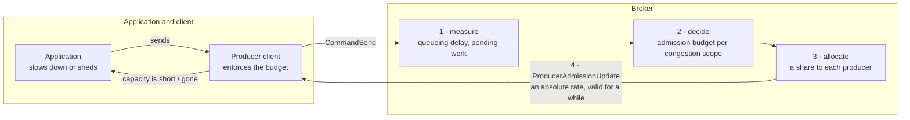
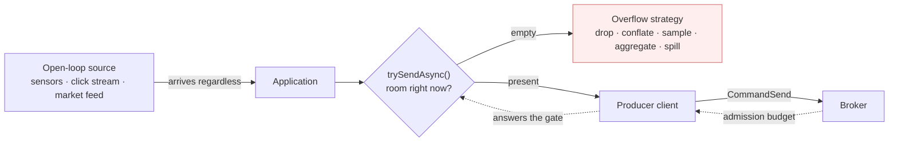
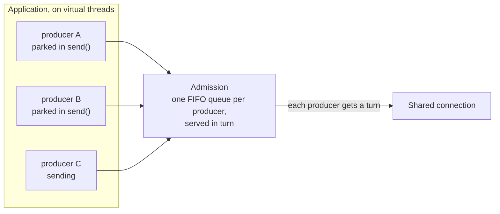

# PIP-495: End-to-end produce backpressure

A Pulsar broker knows when it is struggling and has no way to say so. Its two instruments are a rate an
operator configured before the traffic arrived and `setAutoRead(false)`, which stops it reading from a socket
and tells the client nothing. This proposal closes the loop: the broker measures its own queueing delay,
a controller turns that into a per-producer admission budget, the budget travels to the client as an absolute
rate — on the send receipt where one is due — and the client surfaces it to the application through two
contracts, one that may refuse for sources that can drop and one that never refuses for sources that must keep
order. Read throttling stays as the involuntary backstop. This is the publish half of PIP-460's commitment to
application-level flow control.

**If you are reading only part of this:** *Motivation* is why the current instruments cannot work, and its
subsection on ordering is the argument the client API is derived from. *The application boundary* is the API.
*What the broker measures* is the controller. *What should be voted on, and in what order* is the part to read
first if your question is whether this is one proposal or seven — it is seven, and it says which.

# Background knowledge

Publishing to Pulsar crosses three boundaries, and each can be overrun independently:

1. **Application → producer client.** The application hands messages to a `Producer`; the client holds them until the broker acknowledges them.
2. **Producer client → broker.** The client writes `CommandSend` frames onto a TCP connection shared with the client's other producers and consumers; the broker holds them until they are persisted.
3. **Broker → storage.** The broker writes entries to BookKeeper and holds them until the write completes.

"Backpressure" here means: when a downstream boundary cannot keep up, the pressure is transmitted upstream so the upstream party slows down, rather than accumulating unbounded work in the middle.

## What exists today

**Between an application and its producer**, a producer has two behaviours, selected by `blockIfQueueFull`:

- `false` (the default, `ProducerConfigurationData:87`): a send that exceeds available capacity **fails** with `ProducerQueueIsFullError` / `MemoryBufferIsFullError`.
- `true`: the send **parks the calling thread** until capacity exists.

What bounds that capacity is easy to get wrong. `maxPendingMessages` defaults to **`0` — no message-count limit at all** (`ProducerConfigurationData:55`); `PulsarClientImpl:813-819` substitutes 1000 only for an application that left it unset on a client whose memory limit is disabled. So on stock defaults the client memory limit is the sole bound on a v4 producer's in-flight window. On V5 it is the sole bound on the *underlying* producers' accounting and does not bound the dispatch backlog in front of them at all — see *Motivation*.

That limit is `ClientBuilder.memoryLimit`, and it is documented as **a limit on direct memory** (`ClientBuilder:484-485`, default 64 MiB). It is charged in `ProducerImpl.canEnqueueRequest` in units of `uncompressedSize` — the uncompressed payload size, even when the buffer retained is the compressed one — plus, for a batching producer, the batch buffer's own allocation via `BatchMessageContainerImpl.updateAndReserveBatchAllocatedSize`. What no charge covers is the per-send heap bookkeeping.

**Inside the broker**, `ServerCnxThrottleTracker.ThrottleType` enumerates seven throttling conditions:

| Condition | Blast radius | Publish path? |
|---|---|---|
| `TopicPublishRate` | connection | yes |
| `ResourceGroupPublishRate` | connection | yes |
| `BrokerPublishRate` | connection | yes |
| `IOThreadMaxPendingPublishBytesExceeded` | **every connection on the IO thread** | yes |
| `ConnectionMaxPendingPublishRequestsExceeded` | connection | yes |
| `ConnectionOutboundBufferFull` | connection | indirect — channel writability |
| `ConnectionPauseReceivingCooldownRateLimit` | connection | all commands except `PING`/`PONG` |

The last two are gated on `pulsarChannelPauseReceivingRequestsIfUnwritable`, default `false` (`ServiceConfiguration:1076`), so neither fires on a stock broker. Which of the remaining five are enabled by default, and what that leaves, is the subject of *Motivation*.

**The only action any of them has** is `setAutoRead(false)` on the connection (`ServerCnxThrottleTracker:310`), applied on the transition into the throttled state and lifted only when every active condition has cleared. It stops the broker reading from the socket, so TCP backpressure builds toward the client; it does not close the connection, stop outbound writes, or affect requests already read.

## What has already been done

Much of this ground was surveyed in *[Apache Pulsar service level objectives and rate limiting](https://codingthestreams.com/pulsar/2023/11/22/pulsar-slos-and-rate-limiting.html)* (2023). Its rate-limiting programme has since shipped — the publish and dispatch limiters run on a lock-free token bucket, `org.apache.pulsar.broker.qos.AsyncTokenBucket`, and `ServerCnxThrottleTracker` tracks throttle conditions individually per `ThrottleType`, so one condition clearing cannot resume a connection another still holds. What it proposed and was never built is what this proposal develops: explicit per-producer flow control, by analogy with consumer permits. Per-producer connection isolation was proposed alongside it and remains separate work.

# Motivation

A Pulsar broker has two instruments for regulating how much is published to it: a rate an operator configured
before the traffic arrived, and `setAutoRead(false)`, which stops the broker reading from a TCP connection.
The first cannot change when conditions do. The second carries no information — a client cannot tell it from a
slow network — and it acts on a connection, which is not the scope of any condition that triggers it. Nothing
the broker measures about its own load reaches a producer, so a producer cannot publish less, and an
application never gets the chance to decide what to give up. The rest of this section is what follows from
that: clusters sized for peak rather than for load, throttling that lands on the wrong tenants, and a client
error model an ordered producer cannot recover from.

### The publish limits a stock broker applies are out-of-memory guards, not capacity management

Two of the five publish-path throttling conditions are enabled by default, and both are memory-occupancy
guards: a connection's pending publish requests (`maxPendingPublishRequestsPerConnection`, default 1000,
`ServiceConfiguration:889`), and pending publish bytes per IO thread — `maxMessagePublishBufferSizeInMB`,
whose default is the larger of 64 MiB and half the maximum direct memory (`:1917-1918`), divided by the IO
thread count (`ServerCnx:388-389`). Setting it to `-1` disables that bound entirely (`ServerCnx:308`).

The other three are rate limits, and all four settings behind them default to `0`, meaning off:
`maxPublishRatePerTopicInMessages`/`InBytes` (`ServiceConfiguration:1286`, `1293`) and
`brokerPublisherThrottlingMaxMessageRate`/`MaxByteRate` (`:1248`, `:1255`). So on a stock broker there is no
publish rate limiting, and what remains fires only once memory is already committed. Between "nothing is
wrong" and "half of direct memory is pending" a stock broker holds no opinion about how much it ought to be
admitting, and no way to express one. The only defence against a peak is to have bought enough hardware to
survive it.

### A configured rate is one number that has to be right for every state the cluster is ever in

Where an operator does set a rate, it is a constant. `PublishRateLimiterImpl.updateTokenBuckets` builds its
token buckets from the configured rate and from nothing else; `ResourceGroupPublishLimiter` does the same from
its resource group's. Resource groups look like the exception and are not:
`ResourceQuotaCalculatorImpl.computeLocalQuota` divides the **configured** total across brokers in proportion
to measured usage — a distribution loop over a number an operator supplied, not a discovery loop over what the
cluster can serve. Confluent's Kora reports the same distinction from the other side: it began with a static
even division of a tenant quota across brokers, which "worked reasonably well on lower subscribed clusters"
and, as clusters scaled, "proved increasingly ineffective … especially true for imbalanced workloads with hot
partitions which sometimes shift over time", because "each broker's quota share may end up being relatively
small, so imbalanced workloads may cause some brokers to throttle excessively, even when overall cluster usage
is below the tenant-wide quota" (§5.2.2). Pulsar's proportional redistribution is a better starting point than
Kora's original static split. It is still distribution of a number, not discovery of one.

That number then has to hold for every state the cluster is subsequently in: every workload mix, every message
size and batch shape, a bookie in recovery, a compaction running, a co-tenant arriving, a GC pause. Set it
near what a healthy cluster serves and it will not fire in a degraded one — the only state in which it was
needed. Set it at what a degraded cluster serves and the difference is hardware idle in every normal hour.
Two of the four knobs are per topic and two are broker-scoped, so topics each obediently under a
conservative per-topic limit can still overload a broker together unless the broker-scoped pair is also set.

Configured rates are not only capacity guesses — they are also ceilings a tenant has purchased, and the
project's own survey names the bet that makes them valuable: rate limiting "constrains tenant usage to
specified quotas, enabling accurate planning and **over-commitment of resources**." This proposal keeps them
for that purpose. What the bet lacks is any way to notice itself going wrong in time to respond
proportionately, which is the gap the same survey names while arguing against PIP-310 — custom limiters
"operate on a topic or namespace, ignoring cluster-wide resource usage and contention" — before calling for
"Pulsar cluster wide capacity management".

No utilisation figure is claimed here, because the project publishes none and one deployment's number would
prove nothing about another's. That is itself the point: with only a configured constant and an emergency
stop, the headroom a conservative constant leaves unused is not a quantity anyone can currently measure. This
proposal therefore ships the queueing-delay and budget metrics, enabled, one release before the controller
that acts on them (*Upgrade*), so the question is settled on each operator's own data.

### Spiky load on an already-loaded cluster, where the balancer does not arrive at all

The failure this proposal is really about is not a steady overload; it is a spike arriving at brokers whose
bookies are already busy. Nothing throttles until memory is committed, at which point the broker stops reading
from connections and publish latency rises for every tenant sharing them.

The load balancer is the mechanism that is supposed to relieve this, and three properties of its shipped
defaults mean it will not.

**Its load number contains nothing about storage.** With default weights — CPU 1.0, bandwidth in and out 1.0,
direct memory 0 — a broker's reported load reduces to `max(CPU%, NIC-in%, NIC-out%)` (`LocalBrokerData:259-265`,
`ServiceConfiguration:3224,3231,3281,3298`). No bookie latency, no pending-add depth, no journal state. **A
cluster whose bottleneck is BookKeeper is invisible to its own load balancer.**

**Its default trigger is relative, so a correlated spike does not fire it.** `ThresholdShedder` skips a broker
unless its smoothed usage reaches the cluster mean plus `loadBalancerBrokerThresholdShedderPercentage`,
default 10 points (`ThresholdShedder:79`). Raise every broker together and the mean rises with them, so
nothing is shed. `AvgShedder` (max–min score gap) and the extensible `TransferShedder` (load standard
deviation above 0.25) behave the same way. `AvgShedder` compares a max–min score gap, and `TransferShedder`
has an imbalance branch on load standard deviation above 0.25 alongside its underloaded- and
overloaded-broker branches. The one strategy that fires on a genuinely absolute signal is `OverloadShedder`, at
a raw 85% resource usage, and it is not the default; `UniformLoadShedder` is not an alternative here either,
since its tests are also relative — a max/min message-rate difference and a throughput ratio — and it has no
resource-usage gate at all. So for the case that matters most, the honest statement is not that shedding
reacts badly: **it does not react.**

**And when it is imbalanced enough to fire, it is slow and it pays in the resource that is already scarce.**
Its input is smoothed as `historyUsage * historyPercentage + (1 - historyPercentage) * resourceUsage`
(`ThresholdShedder:177`) with `loadBalancerHistoryResourcePercentage` defaulting to **0.9**, a half-life of
about 6.6 samples. A sample here is a **shedding pass**, not a load report: the average is advanced when the
shedder runs (`ThresholdShedder:69,152-177`), reusing whatever report it finds, and the shedder runs once a
minute. So the smoothed number a shedding decision is taken on has a half-life of roughly **six and a half
minutes**. Then unloading a bundle fences and closes each topic, fails its
managed ledger's in-flight adds with `ManagedLedgerAlreadyClosedException` (`ManagedLedgerImpl:1667`), persists
and closes every cursor, and on the destination performs a **recovering open of the last data ledger** and creates a new one. Not all
of that lands on BookKeeper — managed-ledger and cursor state can persist to the metadata store instead
(`ManagedCursorImpl:2932-2960`), and a recovered cursor may not need a ledger at all — but the recovering open
and the new ledger do, and they are spent on the bookie cluster that was the constraint. The classic shedding path also
has **no in-flight transfer accounting**: `preallocatedBundleData` is written only by `preallocateBundle`,
reached only from `selectBrokerForAssignment`, and a shed bundle's destination is carried instead through a
one-shot affinity map that `ModularLoadManagerWrapper.getLeastLoaded` consumes and returns before any
preallocation happens — so several bundles shed in one pass can be aimed at one broker on reports that reflect
none of them.

Two things this proposal must **not** claim. Shedding is not generally the cause of outages here: a producer
whose topic is fenced receives a `PersistenceError`, which routes into the reconnect path, and the client
resends its whole pending queue transparently. The failure is conditional — it happens when the stall outlives
what is left of `sendTimeoutMs`, and because that clock runs from the head message's creation, a message 25
seconds into a 30-second budget has five seconds, after which `failPendingMessages` fails the entire window.
And where the problem genuinely *is* placement imbalance, shedding is the right answer and this proposal does
not replace it.

What is missing is anything that acts on the timescale of the spike, on the resource that is actually
saturated. Rebalancing is a minutes-scale response to a placement problem, driven by a signal that cannot see
storage. The only party that can act in seconds is the producer, and today it is told nothing.

### When the estimate is wrong, the broker stops reading from the connection

Overload arrives anyway — from a limit set too high, from a limit never set, from a co-tenant, from a slow
bookie. Every condition in *Background* then ends in the same place: `setAutoRead(false)` on a connection
(`ServerCnxThrottleTracker:310`). That instrument has connection resolution, and its problems follow from
that.

**Its blast radius is a connection, and three of the five conditions are not.** `TopicPublishRate`,
`ResourceGroupPublishRate` and `BrokerPublishRate` describe a topic, a resource group and a broker; all three
are enforced by pausing reads on a connection. With `connectionsPerBroker = 1`, an application producing to
twenty topics on one broker through one client has all twenty share one connection, so one topic breaching its
publish rate pauses reading for the other nineteen and for every consumer of that client on that broker.
(`ConnectionPool` keys a connection by logical address, physical address and slot, so the sharing is per
broker, not per client.) A well-behaved tenant's latency
is decided by the worst-behaved topic it shares a connection with. This is
[#23403](https://github.com/apache/pulsar/issues/23403); [PIP-385](https://github.com/apache/pulsar/pull/23398)
documents the same problem. `IOThreadMaxPendingPublishBytesExceeded` is wider still, pausing reads on every
connection sharing the IO thread (`ServerCnx:305-312`).

**Pausing reads transmits no information.** The client observes latency and cannot distinguish throttling from
a slow network, a slow bookie, or a GC pause. Nothing the broker can do to a TCP connection changes that,
which is why this proposal adds a signal rather than a better way to stop bytes.

**And it cannot attribute cause, as its own metric demonstrates.** A per-topic publish-rate-limit counter
exists (`OpenTelemetryTopicStats:70`), fed by `ServerCnx.increasePublishLimitedTimesForTopics()`, which
iterates **every producer on the connection** and increments the counter on **every topic it finds** — culprit
and victims alike. The metric cannot tell them apart because the mechanism it reports on cannot either.

Read throttling is kept by this proposal, unchanged, as the involuntary backstop for clients that exceed a
budget they were given or never negotiated one (*Security Considerations*). What changes is that it stops
being the *first* thing that happens.

### The client's error model does not compose with ordered publishing

Start with what is *not* wrong, because the draft of this proposal previously got it wrong. Both admission
failures are delivered **synchronously, on the calling thread, before `sendAsync` returns**: `ProducerImpl:576`
calls `canEnqueueRequest`, which completes the callback in place (`:1132-1143`), which completes the returned
future exceptionally (`:490`) before `internalSendAsync` hands it back (`:419-420`). A refused message never
reaches `pendingMessages` and never consumes a sequence id. This holds on V5 too in the steady state, where
`thenApply` on an already-complete chain head runs inline on the caller (`ScalableTopicProducer:374-379`).

So strict ordering is achievable today, and the honest statement is that the available patterns are awkward
rather than that they are impossible. A caller that inspects each returned future *before* issuing the next
send never advances past a refusal, and — since the refusal is already visible when `sendAsync` returns — it
can keep pipelining the sends it has already made while it retries the refused one. That is not synchronous
delivery; it is a correct asynchronous pattern that nothing in the API asks for, documents, or makes natural. And `send()` **with `blockIfQueueFull(true)`** never refuses,
because that is the only configuration in which admission waits rather than fails; it parks the calling
thread, which is how an application deadlocks a client IO thread
([#26344](https://github.com/apache/pulsar/issues/26344)). Note the qualification: on the default
`blockIfQueueFull(false)`, blocking `send()` is `sendAsync()` followed by `get()`
(`TypedMessageBuilderImpl:105-120`), so it fails on admission exactly as the asynchronous form does. "Use the
blocking API" is not by itself an answer to this.

**The defect is that the API invites the shape in which the check comes too late, and never says the check is
load-bearing.** The natural asynchronous loop collects futures, or attaches a handler, and moves on:

```java
for (Record r : source) {
    futures.add(producer.newMessage().value(r).sendAsync());   // message 5 is refused here
}
```

Message 5 is refused because the client memory limit is momentarily full. Message 6 is offered a moment later,
by which time a broker receipt has arrived on the connection's event loop and released capacity
(`ProducerImpl:1388-1389` → `:1443`), so 6 is accepted and published. The refusal was synchronous; the *release*
that made 6 succeed was not, and that asymmetry is enough. The topic now holds 1–4, 6, and the application has
two ways to try to fix it:

- **Resend 5 without an explicit sequence id.** `updateMessageMetadataSequenceId` assigns a fresh, higher one,
  so 5 is published after 6. Order is broken, silently.
- **Resend 5 with its original sequence id** — what an application publishing an ordered, deduplicated stream
  actually does. On a topic with deduplication enabled, `MessageDeduplication.isDuplicateNormal` finds
  `sequenceId <= lastSequenceIdPersisted` and returns `Dup` (`MessageDeduplication:500`), and `PersistentTopic`
  **acknowledges it without persisting it**: `publishContext.completed(null, -1, -1)`, commented "Immediately
  acknowledge duplicated message" (`PersistentTopic:704`). The client logs a warning and completes the send
  future **successfully**, with a message id whose ledger and entry are both `-1`
  (`ClientCnx:857-867`, `:877-878` → `ProducerImpl:1407,1423,496`). The application is told its retry
  succeeded. The message is not in the topic.

Silent reordering or silent loss, and the application cannot tell which it got without comparing message ids
it has no reason to inspect.

**Not every mid-stream failure is equally unrecoverable, and the distinction identifies the fix.** A failure
that takes down the *whole* in-flight window — a send timeout through `failPendingMessages`
(`ProducerImpl:2380-2425`), a close, a terminate — fails the outstanding operations in FIFO order and admits none
behind them. That does **not** mean those messages were not published: `failPendingMessages` fails and releases
local operations, it does not retract commands already written, so a message whose receipt was merely late may
well be in the topic. What a whole-window failure gives an application is a *contiguous* set of unresolved
outcomes with a defined boundary, which stable sequence ids and broker deduplication can turn into a safe
replay. It is recoverable in the sense that a protocol for recovering exists.

One error is worth naming because it looks like a whole-window failure and is not. A broker
`PersistenceError` takes `ClientCnx.handleSendError`'s default branch and closes the connection
(`ClientCnx:1208-1220`), after which the producer reconnects and **retransmits its pending queue** — the
application's sends are not failed at all. Retransmission, not failure, is the ordinary response to a
persistence problem, which is why deduplication exists.

The failures with no such protocol are the ones that resolve **exactly one message as failed and keep
publishing the rest**. An admission refusal is one. A per-message validation failure is the other: an
incompatible schema removes the offending operation and continues with its successors
(`ProducerImpl:2692-2740`), and the behaviour that pauses instead is enabled only for replication producers
(`:215`). A gap of this kind is unrecoverable precisely because the client kept going, and because the retry
is then either reordered or, under deduplication, silently discarded.

That gives the rule the client API needs. **A gap that the application can be prevented from creating is worth
more than any protocol for repairing one.** Admission is the one such gap the client can simply decline to
open, because unlike a schema mismatch it has no per-message cause: capacity returns. Blocking `send()` with
`blockIfQueueFull(true)` is correct today for exactly that reason, not because parking is desirable.
It follows that an API which *may* refuse is safe only for a source whose answer to refusal is to **drop** —
where the gap is deliberate and the application knows exactly which records it gave up — and that an API which
must preserve order must **accept the message and separately tell the application to stop**. Those are two
different contracts, and *Detailed Design* gives them two different methods.

### The client's memory limit is shared by every producer and allocated to none

`ClientBuilder.memoryLimit` is one `MemoryLimitController` on the client (`PulsarClientImpl:354`), and every
producer draws on it through the same counter. There is no per-producer or per-topic sub-allocation of it.
Charge is taken at admission and released **on acknowledgement from the broker**, not on transmission:
`ackReceived` removes the operation and calls `releaseSemaphoreForSendOp` (`ProducerImpl:1388-1389`, `:1443`).

So the share of the budget a producer holds is proportional to its own round-trip time, and a producer whose
broker is slow or whose connection has dropped keeps its charge for as long as it stays slow — a disconnected
producer is still permitted to enqueue (`ProducerImpl:1098`), so it can go on taking budget it will not
return soon. One stalled destination can therefore occupy most of the client's memory and make every other
producer, on healthy brokers, fail with `MemoryBufferIsFullError` or park.

The predecessor did not have this failure, and the distinction is narrower than it first looks.
`maxPendingMessages` builds a semaphore per `ProducerImpl` — per producer object, per topic partition
(`ProducerImpl:216-220`) — so exhausting one producer's window left every other producer's intact. It was not
removed: it is un-deprecated, still honoured, and still ANDed with the memory limit inside `canEnqueueRequest`.
What changed is the default. PIP-120 (commit `11bfc0e95dc`, #13344) enabled the memory limit and set both
message-count defaults to `0`, for a good reason: a message count is not a memory bound, and it forces an
operator to guess a number per producer on a client that may open hundreds.

That trade should not be reverted, and this proposal does not propose reverting it. What the default change
gave up — accidentally, since a message count was never intended as an isolation mechanism — is **isolation
between producers**, and a single shared byte counter provides none at all. Restoring isolation without
restoring the guessing is the goal.

Three distinctions matter for the fix, and the draft of this proposal previously got all three wrong.

- **Fair access to admission is not a fair share of retained memory.** A round-robin that gives every producer
  an equal turn still lets the producer with the slowest acknowledgements accumulate far more retained bytes
  than its neighbours, because a turn schedules the next reservation while retention is about how long the
  last one is held.
- **A floor is not capacity.** If one producer borrowed 90 MiB of a 100 MiB budget while its neighbours were
  idle, declaring a 50 MiB floor each when a neighbour wakes does not produce the missing 40 MiB — and if the
  borrower is disconnected, the loan is not reclaimable at all. An allocator that promises an immediately
  usable share has to hold capacity back, not derive it retrospectively.
- **The starvation in `MemoryLimitController` is by arrival order, not by size.** Its gate tests
  `current > memoryLimit` and never `current + size > memoryLimit`, so the requested size plays no part and one
  request of any size may cross the limit. What starves a waiter is that `reserveMemory` calls
  `tryReserveMemory` *before* acquiring the mutex, and the non-blocking path calls it directly, so freed
  capacity goes to whoever asks next rather than to whoever has waited longest — against an unfair
  `ReentrantLock` woken by `signalAll()`. A parked waiter of any size can be overtaken indefinitely.

### Heap retention is neither bounded nor accounted

`memoryLimit` is documented as a limit on direct memory (`ClientBuilder:484`). What it charges is the
uncompressed payload plus, for batching producers, the batch buffer's allocation
(`BatchMessageContainerImpl.updateAndReserveBatchAllocatedSize`). What nothing charges is the heap a pending
send retains — the futures, callbacks, metadata and dispatch state per message — so a producer of small
messages exhausts heap long before it approaches its direct-memory limit.

The evidence is a heap dump from a production client that died this way, and it is offered as a measurement
from one incident rather than as something a reader can re-derive from the source: the limiter read
**92,335,360 of 209,715,200 bytes — 44% of its configured budget — when a 2 GiB heap was exhausted**, with
1,285,311 sends outstanding and **not one message acknowledged**. Even had every outstanding send been charged, the total would have been 164 MiB
against a 200 MiB limit. The direct-memory limit could not have engaged, because direct memory was never the
resource running out.

### On the V5 client nothing bounds what the application hands over

`ScalableTopicProducer.sendInternalAsync` records a future and appends the send to a per-segment dispatch
chain, then returns. The chain advances after invoking the underlying producer's `sendAsync` without waiting
for its acknowledgement, so a caller that does not await the returned futures is not slowed while the chain is
behind, and the retained dispatch state — the futures, the queued closures, the `inFlightSends` bookkeeping —
is charged against nothing.

The underlying producer's memory limit does engage; what it does not bound is the backlog in front of it. Nor
is there a message-count bound to fall back on: `ProducerBuilderV5` never sets `maxPendingMessages`, so the
semaphore is never constructed (`ProducerImpl:216`), and V5 segment creation bypasses the builder step that
would otherwise substitute 1,000 when the memory limit is disabled (`ProducerBuilderImpl:123`,
`PulsarClientImpl:904-915`). A V5 client with the memory limit turned off has no bound of any kind between the application and the wire.

Neither outcome of the underlying limit is usable backpressure. With the default `blockIfQueueFull(false)`,
the failure surfaces on the returned future — inline on the caller while the segment chain head is already
complete, and on some other thread while a segment producer is still being created, so an application cannot
even rely on the synchronous behaviour v4 happens to have. With `blockIfQueueFull(true)` it is worse: when the predecessor is
already complete, the dispatch runs inline on the calling thread **while `dispatchLock` is held**, so the
caller parks holding a lock every other sender on that producer needs. That is
[#26344](https://github.com/apache/pulsar/issues/26344); the absence of application-facing backpressure on V5 is
[#26470](https://github.com/apache/pulsar/issues/26470).

## Goals

### In Scope

- **An application-visible admission signal that does not break ordering.** A way for an application to learn
  that it should stop, which does not require the client to refuse a message it was asked to send — and a
  separate, explicitly refusing call for sources whose answer to congestion is to drop. *Motivation* shows why
  these have to be two contracts and not one. Pulsar's own geo-replicator has hand-built the first of them
  against an implementation method, which is both the proof that the shape is right and the reason it should
  be public (*The application boundary*).
- **A broker-side admission budget derived from measurement**, not from a rate an operator configured in
  advance, so that a cluster can be run closer to its capacity than peak provisioning requires.
- **An explicit per-producer budget on the wire**, absolute and idempotent, so every client language can
  enforce it and no client has to infer it from timing.
- **Proportional shedding**: when the budget falls, each publishing producer's share falls by roughly the same
  fraction.
- **Client-side adaptation that reduces the load rather than merely rationing it.** A budget denominated in
  batches lets a client answer pressure by forming fewer, larger entries — spending latency the application
  has declared it can spare, to reduce the per-entry work the broker and the bookies actually pay.
- **A blocking publishing mode that can batch.** Today a blocking `send()` force-closes the batch after every
  message, so a single-threaded ordered publisher emits one entry per message and pays a broker round trip for
  each. A staged blocking mode gives that publisher the batching the asynchronous API already has, and gives
  it per-message outcomes, which `flush()` cannot report.
- **Isolation of the client's memory budget between topics, and scheduling turns between producers.** One
  shared counter with no sub-allocation lets a single stalled producer hold most of it until its own broker
  acknowledges. The goal is isolation without reintroducing a per-producer message count for an operator to
  guess — and it is deliberately stated at the granularity the allocator delivers: retained bytes are isolated
  between logical-topic accounts, and producers within one account get fair *access* to admission but share
  that account's memory. Isolating retained memory between partitions of one topic would need a second
  allocation level and is not attempted.
- **A bounded, accounted heap budget** for pending sends, without redefining `memoryLimit`.
- **Separating the three deadlines that `sendTimeoutMs` conflates**, so that each can be kept: the wait for
  **admission**, which today has no bound at all and on whose expiry nothing has been published; the
  **delivery** deadline for a message already transmitted, which is what `sendTimeoutMs` should mean; and the
  client's own **transport watchdog**, which detects a connection making no progress. Today one 30-second
  number stands for all three, and expiring fails the entire in-flight window.

**What this costs, stated up front.** It adds a broker-to-client command and its negotiation, which every
client eventually has to implement, and it puts a feedback controller on the publish path, with the tuning and
instability risk any controller carries. It also adds application-facing API to interfaces the project cannot
later remove methods from.

### Out of Scope

- **Consumer-side flow control.** `CommandFlow` permits already exist for dispatch and are unchanged.
- **Tenant entitlement.** Three things travel under the word "fairness" here and only two are delivered.
  *Proportionality* — every producer's share falls by roughly the same fraction — and *isolation* — a
  badly-behaved producer cannot durably deny service to a well-behaved one — are delivered. *Entitlement* — a
  tenant is due some share regardless of what it has been using — is not, because it requires choosing an
  allocation identity, and that is a behaviour contract the project cannot change once it ships.
- **Replacing the configured rate limiters.** `PublishRateLimiterImpl` and `ResourceGroupPublishLimiter` remain as configured ceilings; the adaptive budget is a second constraint below them, never above.
- **Topic-granular placement and the load balancer.** The measurements added here are what a placement decision would need, but changing how topics are assigned to brokers is separate work.
- **A per-producer connection-isolation API**, tracked as [#23403](https://github.com/apache/pulsar/issues/23403) and independently shippable.
- **An ordered-publishing guarantee for clients with very many producers.** `submitAsync()` funds its
  never-refuse promise from a per-producer reservation, so the number of producers that can hold one is
  `budget / envelope`. A proxy, a Functions runtime or a connector writing to a topic per tenant is fanning out
  rather than publishing one ordered stream, and is served by `trySendAsync()` and `sendAsync()`, which reserve
  nothing. Making the guarantee available at that scale would need a different funding model and is not
  attempted here.
- **Ports of the client API to C++, Go, Python and Node.** The wire signal is language-neutral and those clients can enforce it; exposing it to applications is additive per client.

# High Level Design

**One organising idea: close the loop.** Today the broker knows it is overloaded and the application
never finds out. Every mechanism in *Background* ends at the socket — `setAutoRead(false)` stops bytes
and says nothing — so the application learns about congestion as latency, and eventually as a timeout.
An application cannot adapt to a signal it never receives, so the only way to survive peak load is to
buy enough brokers that peak never arrives. That is the overprovisioning this proposal is trying to
remove.

The loop has four parts, and the proposal is the whole loop rather than any one of them:



1. **Measure.** The broker measures how congested it actually is, per congestion scope, from queueing delay
   and outstanding work — not from a rate an operator guessed at in advance. For a topic, the scope that
   matters is its managed ledger and the bookies in that ledger's current ensemble.
2. **Decide.** A controller per scope turns that measurement into an admission budget, raising it while
   there is headroom and cutting it in proportion to how far over it is.
3. **Allocate.** The budget is divided among the producers actually publishing, in proportion to what
   each is already admitted to send.
4. **Tell the client, and let the client tell the application.** The share travels as an explicit, absolute
   number the producer may publish at. The client enforces it and surfaces it to the application — which is
   the part that makes the loop end-to-end, and the part that has to be designed so that acting on it does
   not itself break message ordering.

One argument for making the budget explicit is easy to miss. **A queue controller that works erodes the
evidence a cooperative client would otherwise have used.** FQ-CoDel makes the related observation (RFC 8290
§6.3) that a successful delay-controlling queue removes the delay signal that delay-sensitive senders such as
LEDBAT depend on, pushing them onto loss-based behaviour instead. The analogue here is direct: the whole
purpose of this controller is to keep the queue short, so a client inferring congestion from latency sees a
healthy system right up until it is refused. That does not prove an explicit budget is the only possible
answer — a client could be made to infer congestion some other way — but it does mean inference gets *harder*
as the controller gets better, which is an odd property to build a cooperative design on.

**Budgets act before read throttling is needed; read throttling stays as the last resort.** A configured rate
limit answers demand it cannot serve by pausing reads on a connection. A budget answers it by telling the
producer what it may have, which the application can respond to while it still has choices: a source that can
be slowed is slowed, and a source that cannot is sampled, conflated or dropped by the party that knows which
of its messages matter. Nothing here is voluntary at the bottom, though. Configured rate limits remain
ceilings, the existing occupancy guards keep protecting the broker regardless of client cooperation, and a
client that exceeds its budget — or never negotiated one — exhausts a bounded allowance and then has reads
paused on its connection exactly as today. The budget changes what happens *first*, and gives the application
a decision it can make in advance; it does not remove the involuntary instrument behind it.

# Detailed Design

## Design & Implementation Details

### Prior art, in one place

This design borrows heavily and the borrowings are scattered through the sections that use them. They are
collected here so a reviewer can see at a glance what is taken from where, and — more usefully — where each
analogy stops. Nothing in this table is load-bearing on its own; the arguments live where the decisions do.

| System | What it does | Taken here | Where it differs |
|---|---|---|---|
| **Breakwater** (OSDI'20) | Server-driven AIMD on its own queueing delay, actuating a pool of credits | The central loop, the proportional decrease with a per-step floor, and the evidence that a server must *search* for a capacity it cannot compute | Its actuator is a credit window with no rate and no capacity reference; it has no confirmation gate and no headroom band, and no *absolute* floor on the credit pool in the paper — the implementation floors at a capacity-derived constant. It is not a stability proof: it offers parameter robustness, which is the shape of the acceptance criterion here |
| **DAGOR** (SoCC'18) | Per-server admission on average queueing time, level carried on existing responses | Queueing delay over response time, with its measured evidence of premature shedding; the compound time-or-volume observation window; carrying the signal on a frame already being sent; and the warning that a client-resettable identity gets reset | Its additive step is 1% of *incoming traffic*, an absolute step, not 1% of a factor over a reference |
| **Kora** (PVLDB'23) | Broker-wide limits with per-tenant quotas auto-tuned beneath them | That a queue is the right signal where a resource cannot be attributed; that static division of a quota across brokers fails as clusters scale; and that this class of loop needs damping in production | Its lazy threshold is tenant usage against quota, not consecutive delay windows; its quotas are proportional to allocation, which needs quotas to exist |
| **DynamoDB GAC** (ATC'22) | Local token bucket per request router, refilled every few seconds from a central estimator | The arrangement, and independent corroboration of the few-seconds refill cadence | GAC distributes a quota that is *known*; this controller has to discover one. Its buckets live in the service's own routers, not in clients it does not control |
| **CoDel / FQ-CoDel** (RFC 8289, 8290) | Minimum sojourn over an interval, with a target and an interval | The statistic, the queue-empty handling, and the observation that a working queue controller erodes the delay signal a cooperative sender would infer from | CoDel signals by dropping *or* ECN marking, at the transport; this sends an explicit application-level rate |
| **DCTCP** | Reconstructs congestion *extent* from one-bit ECN marks | The argument that extent, not presence, is what a sender needs | It proves a number per message is *not* required. The case for sending one here is that it is cheap, not that it is necessary |
| **QUIC** (RFC 9000) | Absolute cumulative flow-control limits | That an absolute grant is duplicate- and reorder-safe by construction | Its limits only increase, so largest-wins is complete. A budget must go down, which is why `update_sequence` exists |
| **Kafka** (KIP-219) | Retreated from throttling by delayed response; mutes the channel after answering | Acknowledge promptly and regulate future work explicitly; keep an involuntary backstop | Its signal schedules a pause until a deadline and says nothing about the sustained rate after resumption |
| **Netty / Vert.x** | Accept the write, flip writability at a high watermark, restore at a low one | The accept-and-signal shape, and the low-water mark | Both let a writer ignore the signal indefinitely; here the second submission throws |
| **JDBC `executeBatch`** | Indexed outcomes for a staged group | `stage()`/`collect()`'s index-correlated outcomes | JDBC permits either continuation policy and specifies reporting for both. Here staging *initiates* work before collection, so a collection must report sends that are still live as well as completed ones |
| **Amazon Builders' Library** | Shed locally and cheaply; measure sojourn at dequeue | That shedding suppresses the signal a rebalancer needs, that the false-positive target is zero, and the objection to usage-proportional allocation | LIFO and expiry-based dropping are unusable under an ordered contract. Workload isolation is not — moving a whole producer's FIFO elsewhere preserves its order — and is closer to what a per-producer connection would do |
| **Pulsar itself** | `PersistentReplicator` gates cursor reads on `isWritable()` plus its own pending window and dispatch limiter; `AsyncTokenBucket` resumes on a threshold; PIP-322's producer turn queue; `AsyncSemaphore`'s head-served queue | All four, as existing implementations to follow rather than designs to invent | The one input the replicator lacks is the cluster's: `ProducerImpl.isWritable()` reports connection writability and nothing about storage or the broker's own load |

The sections below follow the loop **backwards**, from the application to storage, because that is the order in
which the design is derived rather than the order in which it executes. What an application can do decides what
the client must offer it; what the client must offer decides what the broker has to send; what the broker sends
decides what it has to measure. A reader who prefers the execution order should read
*What the broker measures* first and work back up.

### What an application can do about backpressure depends on its source

The property that decides which API an application needs is **whether backpressure can reach its
origin** — whether the loop is closed or open. The reactive lineage calls these *cold* and *hot*
sources, and those names are useful shorthand as long as their ambiguity is acknowledged: "hot" is also
used to mean multicast, and the two senses usually travel together but are not the same claim.

**When the loop can be closed, backpressure is lossless.** A file, a database cursor, a topic being
replayed: if the application stops pulling, the source waits. Demand propagates all the way back, and
nothing has to be discarded — the data is produced later instead.


**When it cannot, backpressure is lossy, and the application must choose how.** Sensor readings, clock
ticks, UDP market data, an inbound connection someone else owns: the data arrives whether or not there
is room. "Slow down" is not actionable, because there is no dial. What the application can do is decide
*what to give up* — and the established strategies are all it has: bounded buffering, spilling,
dropping oldest or newest, **conflation** (latest-wins, per key), sampling or pre-aggregation, or
failing fast. Only the application knows which is right for its data.



This is also what a broker is *for*: **a durable log converts an open-loop source into a closed-loop
one.** The topic absorbs the producer's pace, and a consumer with its own cursor reads at whatever rate
it likes and can replay. Consumers already get the closed-loop side, through permits and cursors. This
proposal is about giving producers the same standing — and about being honest that when the log itself
cannot keep up, the conversion has a limit, and the application is the only party that can decide what
happens at it.

**Blocking is the third shape, and virtual threads make it a good one again.** An application whose
calling thread may wait should be able to write the obvious loop. Blocking is the closed-loop model with
the demand signal hidden inside the call; `SubmissionPublisher.submit` and `offer` are the same two
modes side by side in the JDK.



### The application boundary

*Motivation* established the rule this section implements: **ordering survives exactly when the client does
not refuse a message it was asked to send and then accept its successor.** That splits the application-facing
surface in two, by what the application does when there is no capacity.

- A source whose answer is to **drop** wants a call that refuses. The gap is deliberate, the application knows
  which records it gave up, and nothing needs to be replayed.
- A source that must **keep order** wants a call that never refuses. It accepts the message and separately
  says "stop after this one", so there is no gap to repair.

Those are `trySendAsync()` and `submitAsync()`. An application uses one or the other for a given stream; the
mistake the API has to prevent is reaching for the refusing one and then retrying the refusal.

```java
public interface TypedMessageBuilder<T> extends Serializable {

    /**
     * Send only if the producer can admit this message now. An empty result means, and only
     * means, "no capacity at this instant": nothing was enqueued and no sequence id was
     * consumed. Every other outcome returns a present future that behaves as sendAsync().
     *
     * <p>Safe for a source that responds to an empty result by dropping, sampling or
     * conflating. Retrying an empty result on a stream that must stay ordered is a defect:
     * the next message may already have been published. Use submitAsync() instead. Nor
     * should an empty result be answered by trying another partition or producer, which
     * steers traffic toward whichever scope is least congested only until everyone does it.
     */
    default Optional<CompletableFuture<MessageId>> trySendAsync() { … }

    /**
     * Accept this message and report whether the producer wants the caller to stop.
     * Never refuses for lack of capacity, so capacity can never be the reason a gap
     * appears in an ordered stream. Other causes of a gap are not removed: see the
     * scope of the ordering guarantee in the PIP.
     *
     * <p>The returned submission always carries the acknowledgement future. It carries a
     * whenSendable() future only when the producer has run out of budget with this message;
     * the caller must await that future before submitting again.
     *
     * <p>Requires the producer to have declared a submissionEnvelope, which is what funds
     * the reservation the never-refuse guarantee rests on. Throws IllegalStateException on
     * a producer that did not, because the guarantee cannot be offered without it.
     */
    default SendSubmission submitAsync() { … }
}

/** The outcome of submitAsync(): what happened to this message, and whether to continue. */
public interface SendSubmission {

    /** Completes with the message id once persisted, or fails. Acceptance is not delivery. */
    CompletableFuture<MessageId> messageId();

    /**
     * Empty means the producer will accept another message now. Present means it will not:
     * await this future before the next submitAsync() on this producer. Its presence is
     * fixed when the submission is returned; the future may already be complete.
     *
     * <p>It completes on a resume threshold, not on the first available token, so a producer
     * released at the exact moment capacity appears does not immediately pause again.
     */
    Optional<CompletableFuture<Void>> whenSendable();
}
```

**Pulsar already runs this pattern internally, which is the strongest evidence that it is the right one.**
The geo-replicator is the most demanding closed-loop producer in the codebase — a cursor it can stop reading —
and it does not use the public producer API's backpressure at all. It bounds its own in-flight window with
`maxPendingMessages` and disables the send timeout (`AbstractReplicator:157-158`), and then gates its reads on
`ProducerImpl.isWritable()`, an implementation method with no counterpart on the `Producer` interface
(`ProducerImpl:1331-1333`). The control law it hand-built is exactly the one proposed here:

- it stops reading when the producer is not writable after a send (`PersistentReplicator:446-452`);
- it resumes when the window drains below a threshold set at 90% of the queue — a low-water mark distinct from
  the high-water mark that stopped it (`:144`, `:510-511`);
- and when it is not writable but the window is empty, it reads exactly **one** message as a probe rather than
  stalling (`:315-320`).

Accept, signal separately, resume on a lower threshold, probe with one message rather than deadlock. That is
this proposal's design, already in Pulsar, written by hand because the API offered nothing. Two things follow.
The first is that the replicator becomes the first in-tree consumer of the public API and stops reaching into
`ProducerImpl`. The second is the more interesting one: **`isWritable()` is only TCP writability** — it is
`cnx.channel().isWritable()` and nothing more, so the replicator's flow control is blind to the client's memory
limit, to the broker's admission budget and to storage. It backs off when the socket is full and not when the
cluster is. The mechanism is right and the signal it is fed is the narrowest one available, which is a fair
summary of the problem this proposal is trying to fix.

**Why it can promise never to refuse: a reserved submission slot per producer.** A budget cannot be enforced
by a call that always accepts unless the accepting call is also the one that closes the gate. An
admission-capable producer therefore holds a reservation outside the capacity available to ordinary
admission; ordinary sends draw on the rest. When a submission finds the ordinary budget exhausted it takes the
reservation, and the same atomic step that installs the message closes the gate and populates
`whenSendable()`.

**What the reservation has to cover is a whole message, not one permit**, and that is the first place a naive
version of this breaks. A chunked message is not one message to the admission path: the non-blocking path
pre-acquires `totalChunks - 1` further permits before transmitting anything (`ProducerImpl:656-664`), and a
batching producer's container allocates and grows a buffer of its own. So the reservation is defined against a
declared **submission envelope** — a maximum logical-message size the producer advertises at creation — and
covers the pending-message positions, the accounted bytes and the retained heap that a message within that
envelope can require, chunks included. A message larger than the envelope is not a capacity refusal; it is a
validation failure, reported as one, exactly as an over-large message is today.

The invariant that makes this a state machine rather than a heuristic is that **a closure is only ever
delivered as the `whenSendable()` of an admitted send.** Admission can close for two quite different reasons:
because of this producer's own send, or for reasons nothing to do with it — a neighbour filling the shared
pool, or a `ProducerAdmissionUpdate` landing on the IO thread while this producer is idle. The first closes
the gate on the send that crossed, and that send carries the signal. The second cannot signal anyone, because
no call is in progress; it instead arms the gate, and the *next* submission is admitted — out of the
reservation if necessary — and carries the signal. So an application never has to poll, and never learns about
a closure through a refusal.

**The gate reopens on a threshold, never on the first token**, and Pulsar's own token bucket already works
this way. `AsyncTokenBucket.calculateThrottlingDuration()` does not wait for one token; it waits for
`getTargetAmountOfTokensAfterThrottling()`, which for the dynamic-rate bucket is `rate × 0.01` — one per cent
of a second's worth of tokens by default (`DynamicRateAsyncTokenBucketBuilder:33`). Resuming at the first token
unthrottles a producer that can send one message and must then be stopped again, and each transition costs
something. A `whenSendable()` completing on one available token would reproduce that on the client, one message
at a time.

So the two readiness futures get **one predicate each, and they are different predicates** — an earlier draft
described the gate reopening three incompatible ways.

- `SendSubmission.whenSendable()` completes when the producer can accept another submission, which needs
  **both** conditions: the reservation restored, *and* `sendResumeThreshold` worth of budget accumulated, or
  at minimum one entry's worth. Concretely it is
  `min(burst capacity, max(one entry, rate × sendResumeThreshold))`: the floor of one entry is not optional,
  since at a low enough rate the duration is less than a single entry and an unfloored threshold waits forever,
  and the clamp to burst capacity matters because a producer whose burst is smaller than the threshold would
  otherwise also wait forever. At rates low enough that the floor binds, the producer resumes one entry at a
  time, which is the honest consequence of a bucket that cannot dispense a fraction of a message. Pulsar's own bucket has exactly this
  floor: `calculateThrottlingDuration()` targets `Math.max(1, …)` tokens (`AsyncTokenBucket:274-275`), so
  "never on the first token" is the general rule and one token is the floor beneath it. The same applies when
  a configured burst is smaller than the threshold: the threshold is clamped to the burst.
- `Producer.whenSendable()` completes when the producer has **ordinary** admission capacity, because its job
  is to tell a caller whether to go and fetch a message. It deliberately does not consider the reservation:
  a producer whose only remaining capacity is its reservation should not be encouraged to pull more work.

(One nearby mechanism is worth not confusing with the threshold: tokens are recomputed only every 16 ms by
default, `AsyncTokenBucket.DEFAULT_ADD_TOKENS_RESOLUTION_NANOS`, which is a measure against CAS contention.)

Three consequences follow, and none of them is optional:

- **The gate reopens on the reservation, not on ordinary capacity.** It is not enough for another producer to
  free bytes: the producer must have restored a reservation sufficient for the next submission, atomically.
  Otherwise a producer that obeyed the contract can be woken by a neighbour's release, find that neighbour has
  taken the capacity again, and have neither ordinary capacity nor an unused reservation.
- **The reservation is held for the producer's lifetime, including while idle.** Releasing it on idleness and
  re-acquiring it on wake-up would reintroduce precisely the unfunded-admission race it exists to prevent.
  A disconnected producer keeps it too, since its charge is not released until acknowledgement or terminal
  cleanup.
- **Therefore the number of admission-capable producers on a client is bounded**, and the bound is a
  *minimum over budgets* rather than a division: with a reservation vector of `v_direct` bytes, `v_heap` bytes
  and `v_positions` pending slots, it is
  `min(⌊D_available / v_direct⌋, ⌊H_available / v_heap⌋, ⌊P_available / v_positions⌋)`. Writing it as
  `budget / envelope` would understate it, because the envelope is payload bytes and the funding includes
  metadata, batch growth, retained heap and one position per chunk. This is a real limit and the proposal
  states it rather than leaving it to be discovered in production: a client that opens ten thousand producers
  cannot fund ten thousand reservations out of a 64 MiB default budget. It does not need to. `submitAsync()` exists for a producer publishing **one ordered stream**,
  and a client with ten thousand producers is fanning out, not publishing one ordered stream; that shape is
  served by `trySendAsync()` and `sendAsync()`, neither of which reserves anything. Producer creation fails
  when a reservation cannot be funded, so the limit is discovered at creation and not at the first message.

Within the envelope, that bounds the overshoot exactly: **at most one message per admission-capable producer
beyond the ordinary budget.** It is the same shape as a Netty write-buffer high watermark, where a write past
the mark is still queued and writability goes false — with one deliberate departure. Netty and Vert.x let a
writer keep writing indefinitely after the mark; here the second `submitAsync()` while a `whenSendable()` is
outstanding throws `SendNotReadyException` **synchronously, and before the builder is consumed** — this is a
check on producer state, not on capacity, so unlike an admission decision it does not need the message's size
and can be taken before any serialisation work. Ignoring the signal is a programming error, and reporting it
through the returned future would recreate the late-discovery problem this API exists to remove.

**Two consequences of the gate being per producer object.** On a partitioned or scalable producer the gate is
the *union* of its parts: if any partition or segment cannot accept, the producer says stop. That is
head-of-line blocking across partitions, and it is the price of a single ordered contract on an object that
routes. An application that wants partition independence should hold a producer per partition or use
`trySendAsync()`, which makes no cross-partition promise. And **mixing `sendAsync()` with `submitAsync()` on
one producer weakens the guarantee**: the legacy path neither observes the gate nor closes it, so its traffic
can push the shared bounds past the point where the gate would have closed. The two can coexist on a client;
on one producer, one of them should own the stream.

**`submitAsync()` requires one serialised submission coordinator per producer — which is not the same as one
thread.** A coordinator may hop executors between messages, and a single producer may carry several
independently ordered streams as long as something serialises their submissions. What the contract forbids is
two coordinators racing, which has no meaning for an ordered stream anyway. Integrations have to respect this
rather than being exempt from it: a Reactive Streams adapter that has already requested several items when the
gate closes must hold them in its own bounded queue, because rule 2.13 does not permit an exception to escape
`onNext`. That is an integration requirement, not an argument against the contract — the alternative, a
rejection reported through the returned future, would make a non-accepted message structurally
indistinguishable from an accepted one whose delivery failed, which is the failure this API exists to remove.

**`Producer.whenSendable()` survives, but only for one job.** A producer-level readiness signal is largely
subsumed by the submission, and in the post-send case it is worse than subsumed — it is dangerous, because
between its completion and the send another producer sharing the client's budget can take the capacity. What
it is still needed for is the *pre-pull* case: a closed-loop application should be able to learn that it can publish
**before** it fetches the next record from its source, opens a cursor, or asks its upstream for another item.
Deleting it would force an application to acquire a message in order to find out that it should not have. So
it stays, narrowed to that, and it is honest about what it is not:

```java
public interface Producer<T> extends Closeable {
    /**
     * Advisory: completes when this producer has ordinary admission capacity, so a caller can
     * decide whether to acquire the next message. Not a reservation — another producer sharing
     * the client's budget may take the capacity first. submitAsync() is what actually admits,
     * and it holds a reserved slot precisely so that a race here cannot cost you the message.
     */
    default CompletableFuture<Void> whenSendable() { … }
}
```

The reserved slot is what makes this composition safe: the advisory can be wrong about capacity without
costing the application the message it fetched on the strength of it.

**The three modes.**

| Source | What the application does | On congestion |
|---|---|---|
| Ordered, can be slowed | `whenSendable()` to decide whether to pull; `submitAsync()` to publish; await `whenSendable()` when present | Slows; nothing is lost, nothing reordered |
| Can be dropped | `trySendAsync()`, and on empty apply its overflow strategy | Loses deliberately, by the application's own rule |
| Blocking | `send()`, or `stage()` + `collect()` when batching matters | Waits, bounded by `maxSendBlockTime` |

```java
// Drop: 200k spans/s from a source that cannot be slowed. Shed, never reorder, never time out.
void onSpan(Span span) {
    var sent = producer.newMessage().value(span).trySendAsync();
    if (sent.isEmpty()) { dropped.increment(); return; }   // the shed decision
    sent.get().exceptionally(e -> { failed.increment(); return null; });
}
```

```java
// Ordered: publish until told to stop, then resume when told it may.
void pump() {
    while (true) {
        var submission = producer.newMessage().value(source.next()).submitAsync();
        submission.messageId().exceptionally(this::onSendFailed);

        var pause = submission.whenSendable();
        if (pause.isPresent()) {                  // out of budget; this message was still accepted
            pause.get().thenRunAsync(this::pump, appExecutor);
            return;
        }
    }
}
```

That example is the whole argument in ten lines. `source.next()` is consumed unconditionally, because
`submitAsync()` cannot have refused it for want of capacity — there is no state in which the application is
left holding a record the client would not take and has to decide where to put. Consuming is not the same as
*committing*, and the example is deliberately silent about the source's checkpoint: acceptance is not delivery,
so an application that must not lose data still advances its durable read position on `messageId()`, not here.
What this removes is the need for a second, different recovery path for the case where the client simply had
no room. The loop is tight while there is budget and costs
one executor hop when there is not, instead of one per message. And the only place `Producer.whenSendable()`
is needed is *before* the first iteration, or after a long idle period, where the application would otherwise
have to pull a record from its source in order to discover that it should not have.

### Blocking publishing that can batch

The blocking API has a defect that is independent of everything above, and it is worth stating exactly,
because the usual description of it is wrong. Blocking `send()` does **not** wait out
`batchingMaxPublishDelayMicros`. It force-closes the batch: `TypedMessageBuilderImpl.send()` calls
`producer.triggerFlush()` whenever the returned future is not already complete (`:110-114`), which runs
`batchMessageAndSend` on the shared container (`ProducerImpl:2460-2466`), and
`BatchMessageContainerImpl.createOpSendMsg` then takes its `messages.size() == 1` branch (`:296`) and emits a
plain, un-batched entry.

So a single-threaded blocking publisher — which is what an ordered publisher is — produces **one entry per
message and pays a broker round trip for each**, for ordinary non-chunked sends to a persistent topic. It is
round-trip-bound, not clock-bound. Two qualifications keep this honest: with M concurrent blocking senders, batches of up to M do
form, because one thread's `triggerFlush` sweeps up what the others have already enqueued — so batching is
uncontrollable rather than impossible; and a blocking caller can already batch today by issuing N
`sendAsync()` calls and then `flush()`. What that pattern cannot do is tell the caller **which** message
failed.

`flush()` cannot be extended to tell it, and the reason is not only that the name is taken. Its v4
implementation closes the batch and then returns a future derived solely from `lastSendFuture`, wrapped so
that it reports that one future's exception **at most once** (`ProducerImpl:2445-2457`, `:1225-1232`). It
observes one message and forgets its failure after one caller. The V5 async view's `flush()` has a third
semantics again — it waits on a snapshot of caller-visible futures without forcing the batch closed
(`ScalableTopicProducer:432-434`). A results-returning `flush()` would contradict both.

The new operation is therefore separate: stage a message without waiting for it, then collect the outcomes.

```java
public interface TypedMessageBuilder<T> extends Serializable {
    /**
     * Stage this message for batched transmission and return once it has been accepted,
     * without waiting for the broker. Returns an index identifying it in the list collect()
     * will return. Blocks while admission is unavailable, bounded by maxSendBlockTime;
     * throws if maxStagedMessages outcomes are already awaiting collection.
     */
    default long stage() throws PulsarClientException { … }
}

public interface Producer<T> extends Closeable {
    /**
     * Close the current batch, wait for every message staged before this call to reach a
     * terminal outcome, and return them in staging order. Does not stop at the first failure.
     */
    default List<SendOutcome> collect() throws PulsarClientException { … }

    /**
     * As collect(), but returns after at most the given time. Outcomes not yet terminal are
     * returned with status UNRESOLVED and remain live: their eventual outcome is retained and
     * returned by the next collect() rather than discarded.
     */
    default List<SendOutcome> collect(Duration timeout) throws PulsarClientException { … }

    /**
     * Resume staging after a failure stopped it, discarding retained outcomes for messages the
     * application has decided about. Until this is called, stage() continues to fail.
     */
    default void resumeStaging() { … }
}

public interface SendOutcome {
    long index();                      // as returned by stage(), so the caller can map back to its source record
    Optional<MessageId> messageId();   // present iff acknowledged
    Optional<Throwable> error();
    PublicationStatus status();        // ACKNOWLEDGED, NOT_PUBLISHED, UNKNOWN, or UNRESOLVED
}
```

`stage()` is a terminal operation on the builder, like `send()` and `submitAsync()`, so the staged mode reads
the same way as every other publishing mode:

```java
// Blocking, batched, ordered. Collect at least every maxStagedMessages.
for (var batch : source.batches()) {
    for (var record : batch) {
        producer.newMessage().value(record).stage();
    }
    for (var outcome : producer.collect()) {
        if (outcome.status() != ACKNOWLEDGED) { recover(outcome); }
    }
}
```

**Whether `stage()` blocks or throws is not a preference; each bound admits only one answer.** There are two
different bounds and they behave oppositely:

- **Outstanding sends** are bounded by admission. `stage()` **blocks** here, because what releases admission —
  an acknowledgement, a terminal failure, a batch flush — happens on the client's own threads whether or not
  the caller ever calls `collect()`. Waiting can make progress, so waiting is correct.
- **Uncollected outcomes** are bounded by `maxStagedMessages`. `stage()` **throws** here, because the only
  thing that can drain that buffer is the caller's own `collect()`. Waiting cannot make progress, so waiting
  would deadlock the one thread able to release it.

That is what makes "you must collect every N messages" a contract rather than a convention: the client can
detect the omission and say so, at the point where it happened.

**"Waiting can make progress" is a conditional, and the conditions are load-bearing.** It is false if nothing
will ever resolve the outstanding sends, and that state is reachable today: a connection that is down, a
`sendTimeoutMs` of `0`, and `maxSendBlockTime` at its unbounded default leave `stage()` waiting with no
acknowledgement coming and no timeout task installed (`ProducerImpl:281`). Two rules close it. A staged
producer must have a **finite admission deadline**, and that means `maxSendBlockTime` specifically:
`sendTimeoutMs` does not substitute for it, because as *Three clocks* establishes it does not cover the
admission wait at all — a producer with no pending operations can wait indefinitely behind another producer's
retained memory with its send timeout never having started. `stage()` therefore fails before consuming its
builder on a producer with no finite `maxSendBlockTime`, rather than accepting the message and waiting. And a
staged batch must retain an **autonomous flush**: today's batch timer is scheduled
independently of any application call (`ProducerImpl:2469-2481`), and an implementation that instead held a
batch until `collect()` would introduce exactly the caller-dependent deadlock this design is arguing against.
`collect()` needs the same treatment — it takes an optional deadline, and on expiry returns the outcomes it
has with the rest marked `UNKNOWN` rather than waiting forever.

Three lifecycle rules go with those signatures, because a collection API is mostly its lifecycle.
`collect()` covers exactly the messages staged **before the call**, so a message staged concurrently belongs to
the next collection rather than racing into this one. `UNRESOLVED` is not a terminal status and is the one
thing the timed overload can return that the untimed one cannot: those sends are still live, the client keeps
their outcomes, and the next `collect()` returns them. And staging stopped by a failure is re-armed only by
`resumeStaging()`, which is deliberate — an application that has not decided what to do about the failure
should not be able to continue by accident.

**Ordering across a failure is the point of collecting in order.** On the first failure the buffer stops
accepting new staged messages. Messages already accepted run to their terminal outcomes and appear in the
returned list, so the application can see exactly where the break is and what happened after it.

That transition is between threads — failures are recorded on an IO thread while `stage()` runs on the
caller's — so it has to be specified rather than assumed. **Recording the first failure and accepting a staged
message are serialised by the same state machine**: a `stage()` that is waiting for admission is woken when a
failure is recorded and re-checks that state as part of committing acceptance, not on entry. A check at method
entry, or a separately visible failure flag, would let a message be accepted after the failure it was supposed
to stop at. Outcome capacity is reserved at acceptance, including for sends that have not completed, so a
staged message can always be reported. The list must
not pretend the suffix was never executed — it was — which is why `status()` distinguishes `NOT_PUBLISHED`,
usable only where the client can prove the message never reached the broker, from `UNKNOWN`, which is what a
timeout or a lost acknowledgement produces. An application that needs an all-or-nothing unit wraps the unit in
a transaction and commits after collecting; that is what transactions are for, and this API does not
approximate them.

This shape is JDBC's `addBatch`/`executeBatch` — index-correlated outcomes for a staged group — with the one
place JDBC is wrong for us corrected: JDBC lets a driver choose whether to continue after a failure, and here
the successors have already been transmitted, so the outcome list has to say what became of them rather than
leave it implementation-defined.

### What the client bounds

**A rate and a window compose by conjunction.** The budget the broker sends is a rate with a burst
allowance — a token bucket. Every bound the client already has is a *window*: bytes outstanding
(`memoryLimit`), messages outstanding (`maxPendingMessages`), heap retained (`pendingSendHeapLimit`). A
send is admitted only if it fits **all** of them, so `trySendAsync()` refuses when the token bucket is empty
*or* any window is full, `submitAsync()` returns a present `whenSendable()` in the same condition, and that
future completes when the binding constraint relents. The application is not told **which** one was binding:
the refusal is a plain empty `Optional` and the signal a plain `CompletableFuture<Void>`, because that reason
is operational rather than something an application should branch on — a program that behaved differently
according to whether the broker or its own heap stopped it would be encoding a fact about its deployment into
its control flow. It is reported to operators instead, as an attribute on
`pulsar.client.producer.send.refused`, which is what separates "the broker cut my budget" from "my own heap
limit is full". (`Producer.currentBudget()` is not in tension with this: it reports the broker's allocation
for an application that wants to *plan*, and says nothing about which constraint is currently binding.)

**The reservation is a vector, not a number, and it sits outside the ordinary ceilings rather than inside
them.** `submitAsync()` can promise never to refuse only because capacity for one whole submission is held
back at producer creation, and "one whole submission" is three quantities rather than one: the **pending
positions** it may consume — more than one if the message chunks — the **direct bytes** it may charge, and the
**heap** it may retain. Producer creation computes that vector from the declared envelope together with the
things that make a message cost more than its payload: the bounded size of its properties and metadata, the
batching and chunking configuration, and the broker's negotiated maximum message size, which is what decides
how many chunks a message of that size becomes. Creation succeeds only if every enabled budget can fund the
whole vector, so an unfundable configuration fails at creation rather than at the first message.

Two rules keep the reservation coherent with the per-account ceilings, and an earlier draft had them
contradicting each other. Reservations are **separately accounted and non-borrowable**: they are not drawn
from an account's elastic ceiling, so a ceiling that shrinks stops the account's *ordinary* admission without
revoking a reservation that was already funded. And a producer that has been told it may send one more message
is always able to send it — that is the whole promise — so the reservation survives a reduction that lands
between the signal completing and the submission arriving.

**A routed producer reserves once at the parent, and lends it.** An earlier draft said the opposite — once per
underlying producer — and that is both wasteful and unfundable: a partitioned producer would reserve a hundred
envelopes to make one guarantee, and a V5 producer routing to a segment created on demand
(`ScalableTopicProducer:374`) or a topic gaining partitions could need a reservation the client can no longer
fund, long after creation succeeded.

The contract makes the cheaper answer available. Because the gate is the union of the parts and at most one
un-signalled submission is outstanding on a producer at a time, **one reservation per parent is exactly
enough**: it is lent to whichever underlying producer the next submission routes to, and returned when that
submission is accounted for. A new partition or segment therefore needs no new funding, and the number of
admission-capable producers a client can support counts parents rather than partitions.

Two transitions still need stating. A reconnect that negotiates a **smaller maximum message size** raises the
chunk count an envelope implies and so raises the reservation; if the client cannot fund the larger vector, the
producer's guarantee is suspended — `submitAsync()` fails rather than silently degrading to a refusing call —
and resumes when it can. And a message already accepted is never invalidated by such a transition.

**A heap budget, not a redefinition.** `ClientBuilder.memoryLimit` is documented as a limit on direct
memory, so charging retained heap against it would silently change the resource being limited.
`pendingSendHeapLimit` is a separate, explicitly named budget for what pending sends retain on the heap, and
admission folds it in with the others. It is the bound that matters most on the V5 client, whose dispatch
chain retains futures and queued closures that no existing charge covers at all.

**Two different problems share the word "fair" here, and they need different mechanisms.** *Motivation* set
them apart: scheduling **who admits next** is not the same as bounding **how much each producer may still be
holding**. A round-robin turn does nothing about a producer whose acknowledgements are slow, because a turn
governs the next reservation while retention governs how long the last one is kept.

One half of this is not new to Pulsar either. PIP-322 already gives the broker a queue: "fairness is achieved
by using a queue to track which producer is given a turn to produce while the rate limit has been exceeded"
(`pip/pip-322.md:167-168`). Turn-taking under a shared limit is an established pattern here with a shipped
implementation to follow. What is missing is the client
side, and the memory dimension on either.

**Scheduling: admission is per producer and served in turn.** `connectionsPerBroker` defaults to 1, so a
client's producers share a connection, and capacity handed out in arrival order lets one busy producer hold
every neighbour behind it. Waiters are held in one FIFO queue **per producer** — FIFO within a producer
because Pulsar requires per-producer send order anyway — and those queues are served round-robin with a byte
quantum. This is the two-level shape HTTP/2 uses for its connection and stream windows, and one rule makes it
a liveness guarantee rather than a heuristic: the arbiter services *producers, not waiters*, so a producer
with a thousand parked callers gets one producer's share and not a thousand. It also fixes today's
arrival-order barging, because a parked waiter holds a position rather than re-racing whoever asks next.

**Allocation: retained bytes are capped per account, with borrowing.** The client's memory budget — direct and
heap alike — is divided by a demand-aware max-min rule rather than by usage share. Each account competing for
capacity gets an equal share of the budget less a reserve; unused shares are lent to accounts that have
demand; and a lent share comes back as the borrower's own sends complete. Two properties are what the
proportional rule used on the broker cannot give here. It does not entrench an incumbent, which matters
because the client's problem is precisely that one stalled producer took most of the budget while its
neighbours were idle. And the client can act on a new ceiling without waiting for a network round trip,
because it sees every charge and release locally.

Three definitions have to be pinned down or this is not implementable, and the draft previously left all three
open.

- **An account is a logical topic**, so that partition producers and V5 segment producers inherit one share
  rather than each opening a top-level one — otherwise a client enlarges its own entitlement by partitioning.
  The consequence is that this delivers **isolation between topics, not between producers on one topic**: a
  stalled partition can still consume the share of its healthy siblings. Anything finer needs a second
  allocation level, and this proposal does not add one.
- **Demand is an explicit registration, not an inference.** An account has demand if it holds retained bytes,
  has a blocking waiter, has an outstanding `whenSendable()`, or was refused by `trySendAsync()` within a
  bounded recent window. The last case has to be recorded deliberately, because a refusing call leaves no
  enqueued send from which demand could otherwise be observed.
- **Allocation runs off the per-message path.** Recomputing a max-min division on every acquisition would be
  work proportional to the account population on the hot path. Shares are recomputed on membership change and
  on an interval, and acquisitions are made against issued credit under an epoch.

  The invariant it must hold at every point, including mid-transition, is
  **`retained + unspent issued credit + reserved capacity ≤ budget`**, and four rules are what establish it —
  an earlier draft listed the obligations without discharging them:

  1. **Revoked credit stays owned and charged until acknowledged.** Reducing an account's ceiling does not
     move its unspent credit anywhere; the credit remains charged to that account under its old epoch until
     the account acknowledges the revocation by returning it.
  2. **Only acknowledged credit is reissued.** The allocator may not grant to B what it has revoked from A
     until A has returned it, which is what prevents the sum exceeding the budget during a transition.
  3. **Acquisition validates and transfers atomically.** A single step checks the epoch and moves credit from
     unspent to retained. An acquisition that commits under a superseded epoch is valid — the credit was
     genuinely held — and simply reduces what A has left to return; one that has *not* committed is retried
     against the new epoch.
  4. **Demand is a quantity and is counted once.** It is the account's outstanding request in bytes and
     positions — not the boolean the controller uses for its admission-limited test — and a unit that is
     reserved is not also counted as demanded.

  These are ordinary ledger mechanics rather than a novel protocol, which is the point: the allocator needs
  no consensus and no coordination beyond one owner per account.

Three rules make it implementable rather than aspirational:

- **The reserve is not borrowable.** *Motivation* showed that a floor derived retrospectively is not capacity:
  once a producer has borrowed 90 MiB of a 100 MiB budget, declaring a share for a waking neighbour does not
  produce the bytes, and if the borrower is disconnected they are not reclaimable at all. Only capacity held
  back is immediately usable, so a bounded reserve is withheld from borrowing and is what a newly active
  producer draws on.
- **Shrinking a ceiling never lowers usage, and never touches a reservation.** When an account's ceiling falls
  below what it currently holds, its *ordinary* admission is refused until it drains; its funded submission
  reservations are untouched, because those were promised on a different account and revoking one would break
  the guarantee that made them worth having. Its charge is not adjusted, because the bytes are really
  retained, and allocation therefore *converges* after a membership change rather than reclaiming instantly.
- **Every path that spends the budget honours the reservations.** This is the rule that makes the arithmetic
  true rather than nominal. Today a batch container grows its buffer through `forceReserveMemory`
  (`BatchMessageContainerImpl:385-394`), which increments usage without testing capacity at all, and key-based
  batching creates one such container per key. Left alone, that lets ordinary sends consume bytes the design
  was treating as reserved. So admission reserves conservatively for what a message will *become* — payload
  retention, batch-buffer growth, chunk operations and the per-send heap — and later allocations draw on that
  reservation and reconcile the unused part, instead of adding to the counter behind admission's back.

A message larger than its account's current ceiling is the case a strict fit test cannot serve, and it is why
the reservation is accounted separately: it draws on the reservation rather than on the ceiling, which is
sized for the declared envelope precisely so that this case terminates rather than looping. A message larger
than the *envelope* is a validation failure, not a capacity decision, and is reported as one.

**A queue per producer has a known ceiling, and the escape is named rather than specified.** This is
McKenney's fairness queuing — a separate FCFS queue per conversation, serviced round-robin — and its cost is
`O(producers)` queues and `O(producers)` work per round. At the scale most clients run, tens of producers,
that is the right trade. It stops being so for a client fanning out to very many producers, and the standard
escape is *stochastic* fairness queuing: a fixed pool of queues with producers hashed onto them, `O(1)` in
both, with the hash periodically perturbed so that two producers that collide do not collide permanently.
This proposal specifies the per-producer queue and records SFQ as the follow-up if producer counts justify it,
without claiming the two are interchangeable — the scheduler's ordering and liveness rules are part of the
contract, and a different scheduler would have to re-establish them.

Today's `MemoryLimitController` cannot support this and is replaced — for every path that charges it, not
only the blocking one, since the bypasses above are on the non-blocking path. The reason it cannot support it is
worth stating precisely because an earlier draft of this proposal got it wrong. Its gate tests
`current > memoryLimit` and never `current + size > memoryLimit`, so the requested size plays no part in
admission and one request of any size is explicitly allowed to cross the limit. The defect is not size
starvation but **arrival-order barging**: `reserveMemory` calls `tryReserveMemory` before acquiring the mutex,
and the non-blocking path calls it directly, so freed capacity goes to whoever asks next rather than to
whoever has waited longest — against an unfair `ReentrantLock` with a single condition woken by `signalAll()`.
Under a steady stream of arrivals a parked waiter of any size can be overtaken indefinitely.

**Admission is *decided* when a send is accepted, never when it is transmitted.** The byte dimension is
charged at acceptance, where the size is known. The batch dimension cannot be: a batch does not exist until it
is closed, so its token is charged as a **post-paid debt** at the moment a `CommandSend` is formed, and the
bucket may go negative.

**The units have to be named exactly, because client and broker do not currently measure the same thing.** The
byte dimension is charged at the client in the units the client can know at acceptance — the message's
uncompressed payload plus its metadata — while the cost the broker actually incurs is the `headersAndPayload`
it hands to storage, after compression and batching. Those differ, sometimes by a lot. The budget is therefore
denominated in **broker-side bytes**, and the client charges its estimate at acceptance and reconciles against
the actual serialized size when the `CommandSend` is formed, returning or charging the difference in the same
step that settles the batch token. A client that systematically under-estimates is corrected by the
reconciliation rather than by the broker, which is what keeps the two ends agreeing about what was spent.

Three cases produce no entry and must not be charged as one: a message the broker deduplicates, a publish to a
non-persistent topic, and a rejected publish. All three are known only at the broker, so the batch token is
refunded by the receipt rather than at the client — which is another reason the receipt is the natural carrier
for admission information. A scope whose traffic is entirely non-persistent has no entry denominator at all,
and its batch dimension is inert; the byte dimension still binds.

**Acceptance must therefore reserve the entry *liability* it creates, not assume it is one.** A naive reading
of the rule above — accept now, charge one token later — is wrong for two shapes that already exist. Key-based
batching holds a separate container per key (`BatchMessageKeyBasedContainer:50-52`), so a run of accepted
messages across `k` keys becomes `k` entries when they flush, from one admission decision. A chunked message
becomes one entry per chunk. So admission reserves entry liability **incrementally**, and the distinction between per message and per
container is the difference between this working and it defeating the adaptive batching it sits beside.
Reserving one entry per accepted message would exhaust a budget-limited producer's entry credit long before
those messages could share an entry — which is the opposite of what the batch denomination exists to encourage.
So: **one unit when a message opens a new batch container, zero when it joins an existing one**, and the
bounded chunk count for a message that chunks. Key-based batching adds a container per new key and none for a
key already present (`BatchMessageKeyBasedContainer:49-52`), so the liability tracks the key count as it
grows rather than assuming it. Closing a batch settles the reserved liability against the entry it actually
produced, exactly once, and any operation that splits or replaces a container settles the old reservation and
opens a new one.

Without that, "at most one message of overshoot" is not a bound on entries at all. That is why the budget is a rate with a burst rather than a
window — a debt that settles is meaningless in a window — and it is why nothing downstream of acceptance
re-gates a send. The technique is not unusual: Amazon describes the same pattern for requests whose cost is
not known until they are served, charging every request as the cheapest possible and reconciling once the true
cost is known.

**Three clocks, where there was one.** `sendTimeoutMs` (default 30 s) is often described as bounding a send
end to end, and it does not. Its only implementable shape is a whole-window cliff:
`ProducerImpl.run(Timeout)` measures from the head operation's `createdAt` and calls `failPendingMessages`
(`ProducerImpl:2329-2347`, `:2356-2358`), failing every in-flight message including one accepted milliseconds ago.

What it covers, and what it does not, both matter here, and an earlier draft of this proposal got both wrong.

It does **not** cover waiting for client admission. The reservation happens first, in `canEnqueueRequest`
(`ProducerImpl:576`, `:1124-1130`), and the operation whose `createdAt` starts the clock is not created until
afterwards (`:1661`, `:1675`, `:1695`). A producer blocked in `MemoryLimitController.reserveMemory` is waiting
on a condition with no deadline of any kind (`MemoryLimitController:112-116`). **The most important wait an
application can experience is the one clock that does not exist.**

Nor is the problem that a budget cut leaves accepted messages draining slowly: admission is decided at
acceptance and nothing re-gates a message afterwards, so accepted work transmits as fast as the connection
allows.

What *is* true is that the clock starts before transmission. `createdAt` is set when the operation is created,
and for a producer whose batch has not been flushed the timer instead uses the container's first-added
timestamp plus the configured batching delay (`ProducerImpl:2341-2342`) — so a message can spend its budget
waiting to be sent rather than waiting for the broker. This proposal makes that larger deliberately, because
adaptive batching widens the accretion window precisely when the producer is budget-limited. A deadline that
runs from operation creation measures two unrelated waits added together and answers the sum by failing the
whole window. So the deadline is separated by what it actually measures:

| Clock | Expiry means | Owned by |
|---|---|---|
| `maxSendBlockTime`, on the blocking paths `send()` and `stage()` | Permission did not arrive in time for **this** message; nothing was published and nothing is pending for it, so the application may sample, drop or defer with no partial state | the caller |
| A bound the caller puts on waiting for `whenSendable()` | Permission to send the **next** message did not arrive. It says nothing about the message already accepted, whose outcome is on `messageId()` | the caller |
| Delivery deadline, from first transmission | The outcome is unresolved — it does **not** mean the message was not persisted | the caller, optional |
| Connection watchdog | The transport or the broker has stopped making progress; recover | the client |

Two of those need their start and their blast radius stated, or they are slogans rather than clocks.

The **delivery deadline** starts when an operation is first written to the socket, not when it is accepted, and
runs from that first transmission as a **total** bound — it is not restarted by a retransmission, because a
producer reconnecting repeatedly would otherwise never reach it. For a
chunked message it starts at the first chunk and covers the whole logical message, since a partial message is
not a delivery. Accepted work that has not yet been transmitted has **no clock running at all** — admission is
over, and an earlier draft's claim that the admission deadline covers it was wrong, since `maxSendBlockTime`
expires with nothing pending by construction and cannot fail work already accepted. What bounds that
work's residence is the client's own windows, which stop it accumulating, and `maxSendBlockTime` on the *next*
submission, which stops the application adding to it. On expiry the delivery deadline fails **that operation
and the ones behind it on the same producer**, because a gap in the middle is the outcome *Motivation* rules
out — the blast radius is the same as today's, and what changes is when the clock starts.

The **connection watchdog** is a property of the connection, not of a producer, and must not be satisfied by
another producer's traffic on the same socket: it observes whether the broker is responding at all, which the
existing keep-alive already measures. It fails the connection and lets the reconnect path replay, rather than
failing sends.

`sendTimeoutMs` keeps its present meaning for applications that do not opt in — it is already disabled when
set to zero, and replicators already run that way with a bounded pending count (`AbstractReplicator:157-158`).
The new API opts in by construction: `maxSendBlockTime` bounds the blocking waits in `send()` and `stage()`,
where expiry means nothing was published; the delivery deadline runs from first transmission; and the
asynchronous path needs no new setting at all, because a wait on `whenSendable()` is a `CompletableFuture` the
application can bound itself. That is a simplification worth noting: the deadline that mattered most is the one
the application can now express on its own terms.

One implementation rule goes with it. The readiness future is **shared** — the same instance is handed to every
caller — so an application must not call `orTimeout` on it directly: `orTimeout` completes *that* future
exceptionally and returns the same object, so one caller's deadline would fail every other caller's wait and
could not later complete normally. The client therefore hands out a `copy()` rather than its internal future,
and its own gate state never depends on what a caller does to the object it was given. An application bounds
its wait on the copy.

**A budget-limited client should batch harder, and this is the largest single lever in the proposal.**
Denominating the budget in batches is what makes it possible, because it prices the thing the broker and
the bookies actually pay for. A batch is one entry, and an entry carries a fixed cost independent of how many
messages ride in it: one add-entry operation and its completion tracking on each bookie in the write quorum,
one journal record, one index update, one ledger slot, one entry in the broker's cache, and downstream one
dispatch unit and one acknowledgement unit.

**What halving the entry rate does not halve is physical storage IO**, and the proposal should not claim it
does. BookKeeper's journal already groups entries into shared writes and fsyncs, so the durability cost is
amortised across whatever arrives in the same window whether or not the client batched it. What batching
removes is the *per-entry* work above — protocol frames, completion objects, index and metadata entries, cache
occupancy, and ack-set state — which is real, is what the batch dimension prices, and is a smaller effect than
a naive "half the entries, half the work" would suggest.

The headroom is not marginal, because **today's default batch is delay-bound, not size-bound**.
`batchingMaxPublishDelayMicros` defaults to **1 ms**, against caps of 1000 messages and 128 KiB
(`ProducerConfigurationData:176,183-184`). A producer at 10,000 messages a second accumulates about ten
messages in a millisecond and closes the batch there — one per cent of the message cap. The entry rate is
set by the clock, not by capacity, and there are roughly two orders of magnitude between the batch a
producer forms today and the batch it is already configured to allow.

**The rule is that a client may spend latency it was given, and no more.** A new
`adaptiveBatchingMaxDelay(Duration)` states the delay the application can tolerate, as distinct from the
delay it prefers; unset, which is the default, nothing changes. When it is set and the producer is
budget-limited, the client extends accretion toward that bound — filling larger entries rather than
sending smaller ones it has no budget for. When the budget is not binding it closes batches as it does
today, so the latency is spent only when it buys something. This deliberately does not reinterpret
`batchingMaxPublishDelayMicros`, whose meaning applications already depend on.

Three properties keep it safe, and each answers a way it could go wrong:

- **It cannot chase the controller.** Three cadences are involved and they are deliberately separate: the
  controller's period (`adaptivePublishControlPeriodMillis`, 100 ms), how often an update is *sent*, and how
  often the client re-evaluates its accretion window (`adaptiveBatchingReevaluation`, default 1000).
  `valid_for_ms` is none of these — it is how long a budget stays good, not how often one arrives. The client
  re-evaluates on its own interval rather than per send, and it is kept an order of magnitude slower than the
  controller deliberately: sparser arrivals lower measured queueing delay, which raises the budget, which would
  narrow the window again, so the two loops are coupled and the separation is what keeps that coupling slow. A
  period ratio is not by itself a stability proof, and this is one of the interactions the staged rollout
  exists to measure.
- **It cannot grow the client's memory without bound.** A wider window holds more messages in the batch
  container, and that is heap. `pendingSendHeapLimit` is what bounds it — which is the answer to whether
  the heap budget belongs in this proposal: adaptive batching is only safe *because* the heap it widens
  is being bounded for the first time. The byte budget bounds the other axis, though not quite as
  absolutely as an earlier draft claimed: once the charge is in serialized broker-side bytes, repacking *can*
  reduce it, by amortising per-entry framing and by compressing a larger window better. What it cannot do is
  make the payload disappear, so batching buys a bounded efficiency gain rather than unlimited headroom — a
  producer that batches better legitimately publishes somewhat more logical messages for the same budget, which
  is the behaviour the batch denomination is trying to encourage.
- **It cannot exceed what the broker will accept.** Batch growth is capped by `batchingMaxBytes` and by
  the broker's maximum message size, both of which already exist.

**What it does not help.** Chunked messages bypass batching and each chunk becomes its own entry, so a
producer whose messages chunk into `k` pieces is hard-capped at `B/k` entries' worth of throughput with
no adaptation available. That is a real consequence of pricing entries rather than messages, and it is
stated rather than hidden. Nor does a larger batch come free downstream: it is one dispatch unit and one
acknowledgement unit, and for `Key_Shared` subscriptions a 1000-message batch is 1000 bits of ack-set
state. The proposal prices publishing, and the application still chooses the latency it is willing to
trade for it.

### What the broker measures, and what it decides

**The signal is queueing delay, guarded by watermarks.** A configured rate cannot tell a broker whether it is
coping; only its own queues can. The primary input is the delay a publish waits before its storage write is
initiated, with outstanding bytes and outstanding operation counts as independent safeguards.

The choice of queueing delay over end-to-end latency is not a preference, and WeChat's DAGOR measured the
difference. Response time is recursive along a call path — a server's response time rises whenever anything
downstream of it slows, whether or not that server is itself overloaded — so a threshold on it sheds at the
wrong place. Queueing delay is local by construction. On a service saturating around 750 QPS, DAGOR driven by a
250 ms response-time threshold begins shedding at roughly 630 QPS — well before the service is actually
saturated — while the same controller on a 20 ms queueing-delay threshold does not (§4.1, §5.2). The failure
being measured is *premature* shedding, which is the false-positive rate an admission controller lives or dies
by. The practical consequence is the one
that matters for configuring this: a queueing-delay target is tunable because it is independent of how slow
the things below you are, and a latency target is not.

Three measurement facts constrain any implementation:

- `PendingBytesPerThreadTracker` already counts pending publish bytes per IO thread, but it is charged
  before the producer publish call and released by the IO-thread completion task, so it spans the whole
  path — retained buffers, storage, and the return hop. It is a good occupancy safeguard and a poor
  proxy for storage queue depth.
- Managed-ledger add latency **misses its own initial executor wait**: `asyncAddEntry` submits a task,
  and `OpAddEntry`'s `startTime` is set after that task is dequeued, so time spent waiting for the
  dequeue is invisible. Submission-to-start timing has to be added.
- Completed-operation latency stops producing samples exactly when storage stalls, so an
  oldest-outstanding-operation age is needed alongside it — but **not as another pressure term**. It is a
  maximum over outstanding work, and `z` is already a maximum over pressures, so feeding one into the other
  makes the controller a max-of-max that any single slow operation pins.

  It is a **stall detector**, and it needs its trigger and its action stated rather than implied. It fires when
  the scope has outstanding work whose oldest operation has been outstanding for longer than
  `adaptivePublishStallMillis` — note that this is *outstanding age*, not absence of initiation, which is a
  different condition: BookKeeper completions can stop while the broker happily keeps initiating writes
  (`ManagedLedgerImpl:908-923`). When it fires, `f` is reduced by the ordinary multiplicative step and the
  reduction **bypasses both the minimum-sample gate and the sustained-periods gate**, because a stall is
  precisely the state that produces no samples and would otherwise let the controller sit still while nothing
  completes. It bypasses nothing else, and it does not raise `f`.
- **The within-period statistic is the minimum, and that choice is the algorithm rather than a detail.** CoDel
  is explicit that an average "would indicate a persistent queue where there is none": a burst that arrives and
  drains raises the mean while the queue is genuinely empty part of the time. The minimum sojourn over an
  interval is what distinguishes a **standing** queue from a transient one — if even the least-delayed publish
  in the period waited longer than the target, the queue never drained, and that is the only condition worth
  reducing a budget for. So `z_delay` is the *minimum* pre-initiation queueing delay observed over the control
  period, divided by the target.

  Two properties follow, and they are conditional rather than absolute — an earlier draft claimed immunity and
  overstated it. A transient disturbance is invisible to the minimum **when the queue drains and further
  publishes arrive within the same observation window**, because those publishes wait nothing. A GC pause with
  traffic continuing behind it is the usual case and is handled. What is *not* handled is a finite burst in
  which every publish in the window waited longer than the target and none arrives after the drain: emptying a
  queue does not manufacture a sample. So the window explicitly records a **queue-empty event** and treats it
  as a zero sample, which is how CoDel avoids the same problem, and a period with no publishes at all leaves
  `f` unchanged unless the stall detector fires.

  With that, the burst allowances are safe for the right reason: a producer spending its burst creates a queue
  that drains, and the drain is recorded whether or not another publish happens to arrive to record it.

**For a topic, the congested resource is its managed ledger and the bookies in that ledger's current
ensemble**, and most of what is needed to see both already exists. Pulsar depends on BookKeeper 4.18.0
(`gradle/libs.versions.toml`), and in that version:

- **The managed ledger already measures most of the delay.** `OpAddEntry.updateLatency()` records both
  creation-to-completion and last-write-initiation-to-completion, and `ManagedLedgerImpl.checkAddTimeout()`
  already peeks the oldest pending operation. `ManagedLedger.getPendingAddEntriesCount()` is public. What is
  missing is the submission-to-dequeue interval noted above, and a continuously sampled age rather than one
  read on a timeout path.
- **BookKeeper already computes a quorum-completion latency and Pulsar throws it away.**
  `AsyncCallback.AddCallback` extends `AddCallbackWithLatency`, whose default `addCompleteWithLatency`
  discards the `qwcLatency` that `PendingAddOp` computed at quorum completion. `OpAddEntry` implements the
  plain callback. Overriding it separates the entry's own quorum time from the delay BookKeeper adds by
  holding a completed add behind an earlier incomplete one. **This needs no BookKeeper change.**
- **Per-bookie pressure is reachable, with two caveats.** `BookieClient.getNumPendingRequests(BookieId, long)`
  and `BookieClient.isWritable(BookieId, long)` are the supported route — reached from
  `ManagedLedgerImpl.bookKeeper` via the public `BookKeeper.getClientCtx().getBookieClient()`, so neither
  reflection nor `BookieClientImpl.lookupClient` is required. The caveats matter. The returned value packs a
  writability bit that must be masked off with `BookieClient.PENDINGREQ_NOTWRITABLE_MASK`; and despite its
  javadoc it is the **pool-wide** count across all channels to that bookie, not the count on the channel this
  ledger uses, which is material because Pulsar opens 16 channels per bookie by default. It is a count of
  outstanding requests from *this broker's* client, shared across every topic using that bookie — not a
  bookie-server queue depth.
- **The current ensemble is `metadata.getAllEnsembles().lastEntry().getValue()`**, not
  `getEnsembleAt(Integer.MAX_VALUE - 1)`: the parameter is a `long`, and that expression returns whichever
  ensemble covers entry 2,147,483,646, which is the last one only if no ensemble begins after it.
  `LedgerManager.registerLedgerMetadataListener` exists for following ensemble changes, but ensembles also
  change on ledger rollover, so a listener has to be re-registered per ledger. `LedgerMetadata` is annotated
  `@LimitedPrivate @Unstable`, so this is a dependency to declare rather than one to assume.

**Ensemble, write quorum and ack quorum aggregate differently, and conflating them is the easy mistake.**
With ensemble size `N`, write quorum `M` and ack quorum `A` (Pulsar defaults `N = M = A = 2`), an entry is
written to `M` rotating ensemble members and completes on `A` acknowledgements. Two aggregations are needed
and they answer different questions. For **completion delay**, take the `A`-th smallest pressure estimate over
each write set — a maximum overstates it whenever `A < M`, and a mean hides a majority that is slow. For
**replica protection**, every member of a write set receives the write whether or not it is needed for the
first `A` acknowledgements, so a uniformly rotating topic sends about `M/N` of its entries to each member, and
a persistently lagging replica should be able to constrain admission through its own scope even while quorum
latency still looks healthy.

**And attribution of waiting is not attribution of causing the wait.** A small producer queued behind
expensive work experiences the same delay it did not cause, so congestion and each producer's admitted
contribution have to be measured separately.

Kora reached a related conclusion and is worth citing for it, with one qualification. It does approximate CPU
attribution where it must — a tenant's CPU quota is "the time the broker spends processing requests from that
tenant" — but for the *broker-wide* protection it uses a queue instead: "there is no easy way to measure and
attribute CPU usage to a tenant", so "to protect CPU, request backpressure is triggered when request queues
reach a certain threshold" (§5.2.1). The distinction is the one this proposal also draws: attribution is for
allocating, and a queue is for deciding whether there is anything to allocate.
A queue is a measurement of the server's own state that needs no attribution to be correct, which is exactly
why it is usable where a per-producer cost model is not.

**There is one controller per congestion scope, and it produces a single number.** A scope is a thing
that can be congested independently: a managed ledger, a shared executor, the broker itself. Each runs
its own controller over its own measurements and emits an **admission factor** `f ∈ (0, 1]` — the
fraction of its recent healthy reference rate it is currently willing to admit. One scalar per scope;
the two dimensions on the wire come from allocation, not from running two controllers.

Let `z` be the worst of that scope's normalised pressures — queueing delay against its target,
outstanding bytes and operations against their soft watermarks. **The controller's state is the scalar
`f`, and the recurrence runs on it**, not on a budget:

```
z       > 1  →  f ← max(f_min, f · max(0.5, 1 − β(z − 1)))   decrease in proportion to the overload
z_delay < H  →  f ← min(1, f + a)                            only while producers are admission-limited
otherwise    →  f unchanged
```

The two branches deliberately read different quantities. A **decrease** may be triggered by any pressure,
because the occupancy terms are memory safeguards and a broker filling its publish buffers should reduce
whatever the delay says. An **increase** is gated on the delay term alone: an occupancy term that sits
anywhere above `H` in steady state — which a healthy broker running a large pending window will — would
otherwise prevent the budget from ever growing again, and the controller would ratchet permanently downward on
a system that is coping.

The two budgets are then recomputed from the same `f`: `R_batch = f · reference_batch` and
`R_byte = f · reference_byte`. One state variable, two budgets — which is what makes "one controller per
scope" literally true rather than a figure of speech.

**The reference is the capacity estimate, and it needs its own algorithm rather than the phrase "recent
healthy rate".** This is the part an earlier draft left unspecified, and the omission is not cosmetic: with
`f ≤ 1`, the budget can never exceed the reference, so if the reference only ever tracks admitted traffic the
controller can never discover that a scope could serve *more* than it is currently serving. It would ratchet
downward and never up. Worse, a reference initialised to zero yields a zero budget and no traffic from which
to learn.

- **Bootstrap.** A scope with no history starts from a bounded grant in each wire dimension —
  `adaptivePublishBootstrapBatchRate` and `adaptivePublishBootstrapByteRate` — with `f = 1`. These ship with
  deliberately generous defaults rather than unset, because a scope that bootstraps from "the first observed
  healthy period" has a circularity: creation waits for an initial snapshot, and there is no snapshot until
  something has been admitted. A configured topic-level rate ceiling, where one exists, overrides the byte
  default; it cannot initialise the *entry* reference, because a message rate is not an entry rate.
- **Growth.** The reference is a high-water mark and it rises **multiplicatively**, not by adding the admission
  factor's step to a rate — `reference ← reference × (1 + a)` — because `adaptivePublishIncreaseStep` is in
  units of `f` and adding `0.01` to a quantity measured in entries per second is not a defined operation. It
  rises only when `f = 1`, the scope's admitted rate in **that dimension** has reached its reference, and
  `z_delay` is below the headroom factor. Demand at the ceiling with no queue is the only evidence that more
  is available, and this is the only path by which capacity is discovered.
- **Decay.** A reference not reached for `adaptivePublishReferenceDecayPeriods` decays toward the observed
  rate, so a scope does not carry a stale estimate from a workload that has gone away and then admit a burst
  against it. It is **frozen during reductions**, so a throttled scope's own reduced traffic never becomes its
  new idea of capacity.
- **Reset.** A change that invalidates the estimate resets it to bootstrap: a ledger rollover onto a new
  ensemble, an ensemble change, or a broker restart. The estimate is a property of a particular set of
  bookies, not of a topic.

The distinction from `f` is worth stating plainly, because the two look similar and do different jobs. **The
reference is what the scope believes it can serve; `f` is how much of that belief it is currently willing to
act on.** The reference moves slowly and only on positive evidence; `f` moves quickly and mostly on negative.

**`β = 0.2` is ten times Breakwater's**, which is deliberate and worth defending rather than leaving as a
coincidence. Breakwater re-evaluates every 10 µs, so it can afford a 2% step; this controller re-evaluates
every 100 ms, four orders of magnitude less often, and must move meaningfully within a small number of periods
or the involuntary guards fire first. The responsiveness requirement is the one that binds: **the time to halve the budget must be under the time
for the broker's pending-publish buffer to fill at the maximum offered rate**, because past that point the
memory guard takes over and the voluntary mechanism has failed.

That inequality is uncomfortable at the defaults and the document should say so rather than assert headroom it
has not shown. Halving takes two control periods only under *severe* pressure: at `z = 1.1` the multiplier is
0.98, so halving would take about 35 reductions — several seconds. And a free 64 MiB buffer fills in about
62 ms at 1 GiB/s of net accumulation, which is less than one observation. So there are workloads where the
voluntary mechanism cannot possibly win the race, and the involuntary guard is not a backstop for them but the
primary mechanism. This is a bounded admission: the controller handles sustained overload, not a step change
from nothing to line rate, and nothing in this proposal removes the need for the memory guards. Establishing
where the boundary actually falls is an acceptance criterion for enabling the controller, not something this
document can derive.

**Proportionality holds over a band, not everywhere**, and the band is `1 < z < 1 + 0.5/β` — width `0.5/β`. With `β = 0.2` the
per-step floor is reached at `z = 3.5` — a queueing delay of 17.5 ms against a 5 ms target — above which every
decrease is the same halving regardless of how far over the scope is. Note which way this goes, because it is
easy to state backwards: **raising `β` narrows the proportional region and makes the response sharper inside
it**, so a larger gain buys faster reaction at small excursions and reaches the undifferentiated halving
sooner. That is the trade an operator makes.

**Timing figures below are illustrative rather than configured behaviour**, and it is worth saying so rather
than implying arithmetic the gates contradict. At a fixed 100 ms cadence and `a = 0.01`, `f` climbs 0.1 per
second, so a scope at `f_min = 0.05` takes about 9.5 seconds to return to its reference — but the actuation
interval is a floor rather than a period, and a volume-triggered evaluation can move it, so the real figure
depends on traffic. Likewise a fall to the floor takes five *reductions*, which with the sustained-periods gate
at 2 means at least six consecutive bad observations rather than five; the counter resets on any observation
with `z ≤ 1`, so an intermittent overload takes longer still and is meant to.

What is not illustrative is the asymmetry: the decrease direction protects the cluster and the increase
direction risks re-entering overload, so recovery is deliberately the slower one. An operator who finds it too
slow raises `adaptivePublishIncreaseStep`, and the metric that tells them is the budget gauge read against the
queueing-delay histogram.

Both clamps are load-bearing and they are different bounds. `max(0.5, …)` floors a **single step**, so
one bad interval cannot collapse the budget; `f_min` floors the **sequence**, so a sustained overload
cannot drive a scope to zero through repeated decreases. Only the sequence floor binds in the end: from
`f = 1`, from `f = 1`, five maximum reductions give 0.5, 0.25, 0.125,
0.0625 and then `f_min` — the sequence floor binds at the fifth, which is what stops the per-step floor alone
carrying `f` to 0.031 and beyond. In elapsed time that is **six** consecutive bad observations rather than
five, because the first is consumed by the confirmation gate, so 600 ms at the default period from a cleared
counter. And `min(1, …)` is what stops additive increase carrying `f` above its own reference.

**What is Breakwater's here, and what is not.** Breakwater is the evidence that AIMD on measured queueing
delay is right in this setting at all — a server with complete local knowledge of its own state still has to
*search* for a capacity it cannot compute, because knowing your participants tells you nothing about where the
knee is. Its central, server-driven loop and its proportional decrease are what this controller takes.

Three things here are not Breakwater's and the document should not borrow its authority for them. Its actuator
is a **window** — a pool of credits, each entitling a client to one outstanding request — with no rate and no
reference anywhere; this proposal emits rates because a publish's cost is not one unit and because the client
already has a token bucket. Breakwater does not freeze its increase on demand-limited clients, has no
confirmation gate, and reacts to a single unsmoothed sample of its queue delay: the deferral here comes from
Kora and the demand-limited freeze is this proposal's own. And its paper specifies no floor; the shipped
implementation floors its credit pool at `runtime_max_cores()`, a capacity-derived constant rather than a
fraction — which is a better idea than `f_min` and is noted under *Design decisions* as a candidate.

Breakwater is also not a stability proof, and citing it as one would be wrong: the paper offers no delay-gain
condition and no convergence argument. What it offers is empirical parameter robustness — a sweep over its
target delay and both gains, showing the controller behaves across the range — and that is the shape the
acceptance criterion for enabling this controller by default should take (*Upgrade*).

DAGOR is the evidence that constants of this order survive production — a 5% multiplicative decrease and a 1%
additive increase on queueing delay, across WeChat's backend, for more than five years — with the caveat that
its 1% is 1% *of current incoming traffic*, an absolute step in requests, where this proposal's is 1% of an
admission factor over a frozen reference. The orders of magnitude agree; the operation does not, and the
document should not claim more than the former. The increase is frozen while producers are
**demand**-limited — publishing less than the budget already allows — because otherwise the controller
accumulates an imaginary capacity estimate over an idle period and then admits a burst against it. It grows
only while producers are **admission**-limited, where a larger budget would actually be drawn on and the next
measurement therefore tests it.

That distinction needs a number, or it is not implementable — the broker cannot see a send a client refused on
its behalf, so it must infer demand from what it did admit. A scope counts as admission-limited when its
admitted traffic in the period reaches at least `adaptivePublishUtilisationThreshold` of the scope's budget,
default **0.5**, measured as the period's peak rather than its mean. Measuring at scope rather than per
producer is what stops one idle producer's slack from being read as headroom for the whole scope. **0.5 is this
proposal's own choice.** Netflix's `Gradient2` has a half-utilisation guard of a similar shape, but it gates
on in-flight concurrency against a concurrency limit rather than on a rate against a rate budget, and Envoy's
update applies no such gate — so the number is informed by them and not inherited from them.

**Inference is second best, and the better answer is to ask.** Breakwater does not infer: every request header
carries the client's own unsent-queue depth, so the server allocates against demand it has been told rather
than demand it has deduced. This proposal adds the same thing in its cheapest form — an optional
`pending_batches` and `pending_bytes` hint on `CommandSend`, under the same feature negotiation as the budget,
costing two varints on a frame that is already on the hot path. **It does influence capacity, and an earlier draft claimed otherwise in the same breath as describing how.**
The hint distinguishes "this producer has nothing to send" from "this producer is being held back", and that
decides whether `f` may grow and whether an idle producer's share is lent out — both of which change absolute
allocations. What is true, and is the useful bound, is that it **cannot change this producer's own weight**:
allocation follows admitted traffic, so inflating the hint gets a producer no larger share of what exists. Its
influence is on whether the scope as a whole probes for more capacity and on whether it lends out what its
neighbours are not using, and the effect of a scope full of inflated hints is a scope that probes upward and
then measures the queueing delay that results — which is self-limiting, because the probe is tested.

It is therefore treated as **untrusted evidence with bounded influence**, and the utilisation threshold above
remains as the fallback whenever the hint is absent, stale or disagrees with observed traffic.

Two limits of the hint are worth stating rather than discovering. It measures the client's **queued backlog**,
which is not the same as demand withheld upstream: a correctly backpressured ordered publisher has stopped
pulling from its source and so reports nothing queued, even though it has unbounded demand behind it. And a
producer that has stopped sending cannot refresh a stale hint, because the hint rides on `CommandSend`. Both
push in the same direction — toward under-reporting demand, which makes the scope conservative — which is the
right way for an unverifiable signal to fail. Emergency protection is a separate path and is bound by neither floor.

**The stability constraint is on the gain, not on the period**, and an earlier draft of this proposal had it
wrong. It said the loop period must exceed the time for a decision to reach clients and change what arrives.
Breakwater refutes that directly: it runs its loop *at* one network RTT — exactly the feedback delay — and gets
its stability from a per-period decrease gain of 0.02, small enough that the corrections accumulated over one
delay do not compound into an overshoot. A long period is one way to keep the accumulated correction small; a
small gain is another, and it responds faster.

The constraint to state, then, is the product: **the number of control periods that elapse within one feedback
delay, times the per-period decrease, must stay well below one.** At the defaults — a 100 ms period, a decrease
of at most half per period, and a feedback delay of one round trip plus the client's reaction — that holds
comfortably for any feedback delay under a period, and degrades gracefully rather than oscillating beyond it.
It is also why the decrease gain and the control period cannot be tuned independently: halving the period
without reducing `β` doubles the accumulated correction, and that is the configuration to warn about.

**A reduction is deferred until the overload persists, which is a lesson taken from production rather than
from theory.** Kora reports that the sensitivity of exactly this kind of feedback loop was a real problem: "if
the throughput on a partition varies significantly and unpredictably within a short time span, the dynamic
quota algorithm may cause frequent and brief throttling events, which can degrade the tail latency of the
system", and their answer was **lazy throttling** — postponing the throttling decision until usage crosses a
threshold rather than acting on the first sample (§5.2.2). The measured result was that tenants meeting a
99.95% bandwidth SLO, defined as no more than five minutes of throttled time per week, rose "from 99% to over
99.9%".

This proposal takes the *idea* — do not act on the first sample — and not the mechanism, which is worth being
precise about. Kora's lazy threshold is about a tenant's cluster-wide usage against its quota, not about
consecutive queue-delay windows, and the 99% to 99.9% improvement it reports is attributed to moving from
static to dynamic quota distribution rather than to lazy throttling in isolation. So Kora is evidence that
this class of loop needs damping in production, and it is not evidence for the specific rule here. That rule
is this proposal's own: a scope must measure `z > 1` for `adaptivePublishSustainedPeriods` consecutive control
periods before `f` is reduced, default 2.
The cost is one extra control period of latency before a genuine overload is answered — 100 ms at the default
— and what it buys is that a single noisy interval, a GC pause, or one slow bookie response does not propagate
a budget cut to every producer on the topic and back. Increase needs no equivalent, because it is already
bounded by the additive step and gated on producers being admission-limited.

The asymmetry is deliberate and it is the opposite of the usual one. AIMD normally reacts instantly to
congestion and cautiously to headroom. Here a reduction is what costs the application something it may not be
able to recover — a shed message, a paused source — so the cheap direction is to wait one more period before
inflicting it. The involuntary guards are still instantaneous, which is what makes the deferral safe: this is
a delay before the *voluntary* mechanism engages, not before the broker protects itself.

One caveat applies specifically to the storage scope, and it is the place the per-scope analogy is weakest. A
decentralised controller is safe when the thing it controls is the thing it owns, which is true of a broker's
own executors and untrue of a bookie: an ensemble is shared with every other broker writing to it, so several
brokers can observe the same slow bookie and cut in the same control period, each unaware of the others.
Whether that compounds into overreaction or merely into a slower correction depends on the delay and the
coupling, and this proposal should not claim to know which: several brokers each halving their own contribution
halve the aggregate once, not repeatedly, so the concern is synchronised *timing* rather than multiplied
magnitude. The mitigation is cheap and claims correspondingly little — the control loop's phase is jittered per
scope by a **deterministic function of the scope's identity rather than a random draw**, so a broker's phase is
stable across restarts and two scopes that collide do not re-collide differently every period. It reduces
synchronised actuation. It does not establish stability, and it does nothing about volume-triggered
evaluations firing together during a correlated burst. The honest position is that per-scope control without a
coordinator is the right trade here, and that its behaviour under a shared bookie bottleneck is something the
staged rollout must measure rather than something this document can assert.

**Congestion stays at its own scope, and scopes compose by minimum.** A producer belongs to several
scopes at once — its ledger, whatever executor serves it, its broker — and its allowed rate is the
*tightest* of the shares those scopes give it. A stalled ledger therefore shrinks only its own budget,
and only producers on that topic see a smaller number. This is the composition the existing limiters
already use, where topic, resource-group and broker limiters are each consulted and the first to run out
binds (`AbstractTopic:1101-1116`). Without it, slowing everyone for one topic's storage problem would
manufacture exactly the noisy-neighbour behaviour this proposal exists to remove — and that, not the
mechanism, is the claim *Motivation* opens on.

**Allocation: proportional shedding, and no more than that.** Each dimension is allocated separately in its
own units, and from what remains after the scope's standing obligations: writing `A_batch` for
`R_batch` less the newcomer reserve and less the committed fallback rates, a producer's share is
`A_batch · uᵢ_batch / Σuⱼ_batch`, and its share of the byte budget is the same expression in bytes. The client is bound by whichever runs out
first. For an unchanged traffic shape this gives every source approximately the same percentage
reduction, which is what an application
can plan around, and splitting one producer's traffic across ten producers does not multiply its share.
Three rules keep it honest, and each closes a way to game it:

- **Measure admitted traffic, not attempted traffic.** Ignoring the signal must never increase an
  allocation.
- **Freeze the allocation weights during reductions.** Recomputing each producer's share from
  already-throttled traffic rewards non-compliance and punishes obedience. Note this is a different quantity
  from the scope's capacity *reference*, which is frozen during reductions for its own reason — the weights
  decide how a budget is divided, the reference decides how large a budget there is to divide.
- **Drop a departing producer's weight rather than decaying it.** A producer that closes, is fenced, or loses
  its connection leaves `Σuⱼ` in the same control period, so the remaining producers see the freed share at
  once instead of waiting out a decay. Breakwater returns a disconnecting client's whole window to the pool
  synchronously for the same reason.
- **Reserve a bounded pool for new and returning producers**, rather than granting each newcomer a free
  burst.

**This is deliberately not fairness, and the reason is a decision the project cannot take back.** A source
already taking 90% of a broker keeps approximately 90% of it during congestion. Delivering more than that means
choosing an **allocation identity**, and an identity is a behaviour contract that cannot be changed after it
ships. Producer count will not serve: dividing a shared budget equally between producers hands a tenant running
100 producers a hundred times the capacity of one running a single producer, and authenticating those producers
does not make that an entitlement.

The project has in fact already chosen one identity, and that is an argument for reusing it rather than for
inventing another. PIP-82 made the **resource group** — attachable to a tenant or a namespace — the unit that
owns a quota, and shipped it. A follow-up that wants entitlement should divide a resource group's budget among
its members and can consume this allocation step unchanged. What this proposal will not do is *imply* an
identity by accident: allocating a share to something is a statement about what that thing is owed, and
choosing producer, connection or topic here would answer a question PIP-82 deliberately left at group
granularity.

Girish Sharma's objection to per-producer allocation on the PIP-385 thread is the practical form of the same
point and is answered by the same design: "the producer count isn't fixed, it may vary within a single
throttling period itself, and the producers themselves aren't sticky." That is true, and it is why the
allocation is proportional to admitted traffic rather than a division by producer count — a producer that
appears mid-period carries no history and draws from the newcomer FIFO rather than diluting everyone else's
share, and one that disappears has its weight dropped from the denominator at close, fence or connection loss
rather than decayed. Nothing in the scheme requires the population to be stable between control periods.

Proportional shedding avoids that question by not answering it: shares follow admitted usage, so no
entitlement is asserted and none is created.

The strongest published objection to that choice should be stated rather than left for the list. Amazon's
position on multi-tenant fairness is that usage-proportional allocation is precisely what quotas exist to
prevent: an abrupt increase in load on a shared service is *most likely driven by a single tenant*, and an
allocator that gives shares in proportion to usage hands that tenant the largest share exactly when it is the
cause. That is correct, and this proposal does not refute it — it answers that Pulsar's rate limits default to
`0`, so on the deployments this targets there is no quota to be proportional to, and that the alternative to
usage-proportional is not quota-proportional but *arbitrary*. Where a deployment does define quotas through
resource groups, quota-proportional allocation within the group is the better rule and the allocation step is
the same one. The honest summary is that this proposal is right for clusters without quotas and second-best
for clusters with them. Nor is a pluggable policy seam the interim answer — PIP-310
(*Support Custom Publish Rate Limiters*) asked exactly that of the rate limiters and was not adopted, on the
grounds that fragmenting the implementation serves users worse than fixing the built-in one. What this
proposal delivers is the mechanism a fairness policy would need; what it withholds is the policy.

### The signal: an absolute budget, not a nudge

```text
ProducerAdmissionUpdate {
    producer_id, producer_generation, update_sequence,
    valid_for_ms,
    batches_per_second, bytes_per_second,
    burst_batches, burst_bytes,
    fallback_batches_per_second, fallback_bytes_per_second,
    reason
}
```

It is an **absolute, idempotent snapshot**. "Publish at 80% of your current rate" is ambiguous under a
duplicated update, an idle producer, a reconnect, or two observers with different windows; an absolute budget
is the same information, is safe to repeat, and gives the client a schedule it can actually enforce.

Three properties follow, and *Prior art* has the comparisons; what matters here is what they require of an
implementation.

**It carries a degree, not a stop.** The cheap counter-proposal to this whole design is a single "slow down"
bit. An isolated stop indication conveys no degree, and a client receiving one can only respond with the same
blunt reduction whatever the size of the problem — which is what `setAutoRead(false)` gives it today. A
*sequence* of binary marks can encode degree, as DCTCP demonstrates; the argument for a rate is that it removes
the need to reconstruct one, and gives the application a number it can plan against rather than a series it
would have to integrate.

**It is absolute, and supersession is explicit.** An absolute value is safe to duplicate, safe to receive
while idle, and safe to reorder — a client can simply keep the newest. What "newest" means has to be carried,
because unlike QUIC's monotonically increasing limits a budget must be able to go *down*, so largest-wins is
unavailable. That is what `update_sequence` is for, and a client discards any update whose sequence it has
already passed.

**The client enforces it locally.** The budget is spent against a token bucket in the client, refilled by
updates rather than by asking. That is what keeps the hot path free of round trips, and it is why the two
things the broker cannot verify — the demand hint and the applied sequence — are structured so that lying
about them gains a client nothing.

**On starting a producer, and on everybody starting at once.** A recorded objection to adaptive publish
limiting on `dev@pulsar.apache.org` is that "a topic should be allowed to burst up to the SOP/SLA as soon as
produce starts" and "shouldn't have to wait for tokens to fill up", together with the converse worry that if
many topics accumulate the right to burst and then draw it simultaneously, the cluster falls over. Both are
answered by construction, and it is worth being explicit about how.

A producer does not accumulate anything. There is no stored entitlement to spend later: a budget is a rate
with a bounded burst, established at producer creation from the scope's current admission factor, and
recomputed from measurement thereafter. A producer that has been idle for an hour has exactly the same budget
as one that has been publishing, which is what the first half of the objection asks for and is also why the
second half does not follow — idleness earns nothing.

What does need bounding is the aggregate of the burst allowances, because those *are* simultaneous by
definition, and the bound has to be a **pool rather than a formula**. An earlier draft borrowed Breakwater's
per-client overcommitment, `max((C_total − C_issued) / n, 1)`, and claimed its aggregate could not exceed the
unallocated remainder. That is arithmetically false: summed over `n` producers it is `max(U, n)`, so with a
scope fully allocated and a thousand producers it grants a thousand units rather than none. Breakwater can
afford that because it *deliberately* overcommits and relies on active queue management to shed the excess;
this proposal has no equivalent shedder on the storage path and must not copy the formula without the shedder.

So the burst is drawn from a finite scope-wide pool — and **there are two pools, because occupancy and rate
are not the same currency and an earlier draft charged both to one**. A burst is a quantity of work that may
arrive at once, measured in entries and bytes, and it is bounded by what the scope's involuntary guards can
absorb; a fallback is a *rate* that continues indefinitely, measured per second, and it is bounded by the
scope's budget. Charging a per-second obligation against a byte buffer is a category error, and it hides the
question that matters.

- **The liability pool** bounds outstanding burst grants, newcomer grants and already-accepted-but-untransmitted
  work together, because those are the three ways capacity is committed without having been spent. A burst
  grant is one minimum viable unit, sized to a single maximum-sized batch, made only when the pool can fund it.
  The floor of one unit is what keeps a producer on a tiny budget able to send a single batch at all, and is
  the same floor the overspend allowance needs.
- **The rate budget** is what the ordinary allocation divides, and it is divided **after** the standing
  obligations are taken out, not before: `R_batch` less the newcomer reserve, less the sum of the fallback
  rates the scope has committed to. The proportional formula applies to what remains. An earlier draft
  allocated 100% of `R_batch` proportionally while separately reserving 5%, which does not add up.

That makes the fallback's cost visible, and it should be: at one entry per validity period, ten thousand
producers on a scope commit it to roughly 3,300 entries a second before any ordinary traffic. **So the
fallback is not universal.** It is granted only to producers that had a budget to lose — one that never
received an update has nothing to converge to and is governed by the ordinary path — and a scope whose
committed fallbacks would exceed `adaptivePublishFallbackReserveShare` of its budget stops granting them and
falls back to the involuntary guards for the excess. That is a real limit on how many admission-capable
producers a single scope supports, and it belongs in the open rather than in an implementer's later
discovery.

The newcomer reserve is `adaptivePublishNewProducerReservePercent` of the scope's budget, and what the FIFO
changes is how that reserve is *handed out*: one complete minimum viable quantum at a time, in arrival order,
rather than divided among however many producers happen to be waiting into shares too small to send a batch
with. A grant is made only when a whole quantum can be funded, so a producer either gets something usable or
waits.

**The bound this gives is conditional and the condition should be stated.** Because the reserve is a fixed
share rather than a residue, it is replenished as its grants are consumed, so waiting time is bounded by the
number of producers ahead in the queue divided by the reserve's service rate. Without a reserved share — if
newcomers were served only from whatever the scope happened to leave unallocated — a fully allocated scope
could starve a newcomer indefinitely and queue order would bound nothing. That is the design decision; the
FIFO and its liveness argument are this proposal's, not borrowed. Breakwater is cited here only for the
observation that zero-budget participants left to be rediscovered by chance do starve under sustained load.

**The two dimensions are batches and bytes, not messages and bytes**, because those are what the broker
actually spends. For an accepted, non-duplicate publish to a persistent topic, one `CommandSend` becomes
exactly one BookKeeper entry — `PersistentTopic` hands its whole `headersAndPayload` to
`ledger.asyncAddEntry` (`PersistentTopic:698-705,734-736`) — so a batch carrying a thousand messages costs one
add-entry operation, one write to each bookie in the quorum, and one ledger slot, exactly as a batch carrying
one does. The messages inside are opaque payload at publish time. Three cases do not follow that rule and are
priced accordingly: a chunked message produces one entry per chunk, a message the broker deduplicates produces
none, and a non-persistent topic produces none.

What a batch count captures that bytes cannot is the *fixed* cost per entry: a producer sending ten thousand
tiny batches a second is far more expensive than one sending a hundred large ones at the same byte rate, and
only the batch dimension sees the difference.

This is deliberately a different unit from the configured limiters, which count messages
(`handlePublishThrottling(producer, numOfMessages, msgSizeInBytes)`). That is not an inconsistency to
resolve: a configured rate counts what a tenant *buys*, and messages are what a tenant thinks in. The
adaptive budget counts what the broker *spends*. They coexist because they answer different questions,
and the tighter of the two binds.

**It rides on `SendReceipt` where it can, and is a command where it cannot** — and that priority is the
opposite of an earlier draft's, which treated the piggyback as a later optimisation. WeChat's DAGOR spends
**zero** dedicated control messages: its admission level travels on the responses the server was already
sending, which is what lets it run a per-server control loop across twenty thousand machines without adding a
message to the very path that is congested. Sending a separate frame to a producer *because* the broker is
overloaded is a shape worth avoiding by default.

So the update is carried as an optional field on `SendReceipt` **whenever a receipt will actually be sent in
time**, and as a standalone `ProducerAdmissionUpdate` otherwise. The distinction is between an *outstanding*
receipt and an *available* one, and conflating them would deadlock the mechanism in the case it matters most:
a producer whose publishes are stalled in persistence has receipts outstanding and none of them arriving, so
waiting for one to carry a budget cut would withhold the cut for exactly as long as the congestion lasts. The
rule is therefore a deferral bound rather than a preference — piggyback if a receipt is expected within
`adaptivePublishPiggybackDeferralMillis`, otherwise send the command — and the cases a receipt structurally
cannot cover follow from it: a producer with nothing outstanding, one whose receipts are too sparse to carry a
timely change, and one that has stopped and is being told it may resume. Those cases are real —
which is why the command exists at all — but they are the minority, and the frame the broker sends most often
should be one it was going to send anyway. Both carriers deliver the same absolute, idempotent snapshot with
the same `update_sequence`, so a client applies whichever arrives first and discards the other by sequence.

The lifecycle rules are the part an implementation cannot infer, and they are stated here as rules rather
than as prose because an earlier draft described an expiry behaviour that was not self-consistent.

- **Creation.** An initial budget is established when the producer is created, so its first burst is covered
  without a round trip.
- **Incarnation.** Updates are scoped to the producer incarnation, and stale generations are discarded.
  `producer_generation` is the existing producer epoch rather than a new identifier, so a reconnected or
  fenced-and-recreated producer ignores updates addressed to its predecessor with no new state to keep.

  **The broker's own state is keyed differently, and deliberately so.** A producer incarnation is something the
  client can create at will by reconnecting, so keying the admitted-traffic weight or the newcomer-reserve
  eligibility to it would let a client reset its own history — reconnect, look new, draw from the reserve,
  repeat. WeChat shipped exactly that mistake in DAGOR, keyed on a session the user could reset, and withdrew
  it in production once users learned to log out and back in for a fresh allocation. The broker therefore keys
  those to `(topic, producer name)`, and the incarnation addresses only *which connection state* an update
  applies to.

  That is a real improvement and **not** a defence against a determined client, which the document should not
  pretend. A producer name may be supplied by the caller (`ProducerBuilderImpl:156-157`) or generated on
  demand (`ServerCnx:2322-2323`), so an application that wants to look new can simply choose a new name. What
  `(topic, producer name)` buys is that history survives an ordinary reconnect — the common case, and the one
  a client hits accidentally — rather than that identity cannot be cycled deliberately. Resisting deliberate
  cycling needs an authenticated allocation identity, which is the same thing entitlement needs and is out of
  scope for the same reason.
- **Supersession.** A higher `update_sequence` replaces the budget, including for a producer that is idle.
  Replaying an update that has already been applied adds nothing. Those two together are what "idempotent"
  means here; it does not mean an update to an idle producer is ignored.

  What a replacement does to the bucket's *accumulated* state has to be said, because the rates and bursts are
  absolute while the level is not. A new update sets the bucket's capacity and **clamps the current level to
  it**, so tokens banked under a larger burst do not survive a reduction — otherwise a producer could hold a
  reduction at bay with credit earned before it. A negative level, which the post-paid batch charge can
  produce, carries across unchanged: a debt is not forgiven by a new budget.
- **Expiry.** When `valid_for_ms` elapses with no newer update, the burst allowances lapse at once and the
  rate **converges to the fallback rate carried on the last update** — not to zero, and not to whatever was
  granted at creation. A creation-time budget is a healthy-cluster number that would be restored precisely
  when silence most likely means the opposite, and a reconnect storm would re-arm it for every producer at
  the same moment.

  Convergence is toward the fallback **from either side** — a step per validity period, so a producer far
  above it takes several periods to arrive and one at zero recovers on the first — and it is worth being
  explicit that this is not a monotone decrease. A producer whose last budget was above the fallback moves down, which is the safe
  direction. A producer whose last budget was *below* it — including one that was cut to zero — moves up,
  which is what stops a lost or withheld update muting a producer permanently. The broker retains its
  involuntary instrument for the case where that recovery is not warranted, which is why letting it recover
  is safe. The tradeoff against the alternatives is worth stating without overstating it: a
  protocol whose grant does not expire depends on the receiver eventually generating one, and recovers through
  a reliable transport, an explicit flow-state exchange — AMQP's `flow` with `echo` is exactly that — or a
  connection reset. A TTL with a defined fallback recovers **without any further message from the broker**,
  which is a genuinely different property, at the cost of permitting a sender to proceed on its own after
  silence. That is the trade, and it is chosen here because the broker is the party most likely to be too busy
  to send the message that would unstick things.

  The fallback is carried on the wire as `fallback_batches_per_second` and `fallback_bytes_per_second` rather
  than computed by the client, because the client does not know the scope's reference rate and should not be
  given a formula whose inputs it cannot see. **The broker funds it from the same pool as the bursts and the newcomer
  grants, not as a multiple of the producer's current allocation** — a producer cut to zero would otherwise
  have a fallback of zero and could never recover, which is precisely the mute this rule exists to prevent.
  The fallback is a *probe* rate: enough to send whole entries, floored at one minimum viable unit per validity
  period so that a producer at zero comes back with something rather than with a fraction of a batch it can
  never accumulate. The aggregate of the outstanding fallbacks is charged against the pool, because a scope has
  to survive every producer's updates stopping at once.

  `valid_for_ms` is measured from the client's **reception** of the update, not from the broker's send. The
  alternative spends the broker's own control margin on outbound queueing and clock skew, and does so worst
  exactly when the broker is congested and its outbound queues are longest — so an update reporting congestion
  would expire early *because* of the congestion it reports.
- **Replay after a reconnect is paced — and it is the one explicit exception to "acceptance only".** This is
  the largest un-admitted burst in the system and the draft previously said nothing about it. A producer that
  reconnects resends its whole pending queue (`ProducerImpl:2042`, `:2218-2249`), and acceptance-only gating
  would let all of it onto a broker that may be the reason the connection dropped. Replay is therefore paced by
  the producer's current budget on the new connection, or by the fallback until the first update arrives.

  That is a real exception to the rule and is stated as one rather than smuggled in: work admitted on a
  *previous* connection is re-gated on the new one, because the grant it was admitted under belonged to a
  broker relationship that no longer exists. Two consequences. The messages keep their order and their sequence
  ids; what they lose is the right to arrive at once. And a **logical delivery deadline is a total bound and
  does not restart on retransmission** — otherwise a producer reconnecting repeatedly would have a deadline
  that never expires, which is the amplification this proposal is trying to remove rather than reproduce.
- **No retroactivity, and no revocation below what is in flight.** A reduction never invalidates work already
  transmitted. Breakwater enforces the stronger form of this in its credit distributor — a client's window is
  never reduced below what it already has outstanding — and the same rule applies here: a budget cut takes
  effect on future admissions, never on a message the client was already told it could send.
- **Surplus returns when demand falls — and demand is not the same as backlog.** A queued backlog is a
  quantity, in entries and bytes; an allocation is a rate. Comparing them needs a horizon, and the one used is
  the validity period: a producer's estimated demand is its backlog over that horizon **combined with** what it
  actually admitted in the last period, and the surplus returned is the difference between its allocation and
  the larger of the two. The second term is what stops a well-paced producer being punished: one that keeps no
  backlog *because* it is correctly consuming its whole allocation reports zero queued and must not thereby
  surrender the rate it is using. Without any such rule a scope's budget stays pinned by producers that have
  stopped needing it; without the second term it would be stripped from the ones using it best.

**Enforcement is charged only against traffic a client has acknowledged**, and that requires one more field.
The broker cannot otherwise tell a client that is ignoring its budget from one that has not yet received it:
an update sent into a congested connection arrives late precisely when the broker most wants to act on it, so
charging overspend from the moment of *sending* would punish a compliant client for the broker's own queueing.
`CommandSend` therefore carries `admitted_under_sequence`: the sequence of the update **this work was admitted
under**, which is not the same as the newest one the client has seen. That distinction is the whole point and
an earlier draft got it wrong by carrying the latter. A client may legitimately accept work under update 10,
receive a reduction as update 11, and transmit that already-accepted work — the proposal forbids re-gating
accepted work, so this is compliance rather than overspend — and only a field naming the *admitting* grant lets
the broker tell that case from a client ignoring update 11. It is one varint on a frame already on the hot
path, alongside the demand hint, and it is AMQP's `echo` in the same role: a receiver that needs to know which
flow state a sender is acting on has to ask the sender to say so.

Three rules complete it. A **batch spanning two grants** is attributed to the older, which is the conservative
choice and avoids an incentive to straddle. A client that **never advances** the field is not thereby exempt:
the broker applies an **adoption deadline** of one validity period, after which an unacknowledged update is
enforced as though applied — without it, withholding the field is a way to opt out, since the configured rate
limits default to off and the occupancy guards bound outstanding memory rather than compliance. And the
**permitted debt** the broker allows against a grant is derived from the producer's declared submission
envelope, which is communicated at producer creation; a client cannot claim more liability than the envelope it
registered.

**Old clients keep working, and are not trusted to.** The command is sent only after feature
negotiation. A client that does not understand it — or a client that understands it and ignores it —
gets a bounded transition allowance and then the existing involuntary instrument, `setAutoRead(false)`
on its connection. An advisory percentage cannot protect a broker on its own; the signal makes
cooperation *possible*, and pausing reads on the connection is what makes enforcement *certain*.

### What this does not fix: where the load is

Throttling is a stopgap, and the design should not pretend otherwise. Kora is explicit that broker-local
backpressure is the temporary state and that the durable response is to move load or add capacity: the
throttled state "is temporary: the high resource usage on a broker normally triggers a rebalance
operation to even out load, or, in rare occasions, when the whole cluster is close to capacity, the
multi-tenant cluster gets expanded." A broker that can only ever say
"publish less" converts a placement problem into a customer-visible slowdown.

Pulsar cannot currently take that step at the granularity the signal produces. Load balancing acts on
**namespace bundles**, and the default `ConsistentHashingTopicBundleAssigner` fixes a topic's bundle by
hashing its name, so a congesting topic can be moved only together with everything else that hashed alongside
it, and splitting is the only lever. The mapping is a documented extension point —
`topicBundleAssignmentStrategy` selects an implementation of `TopicBundleAssignmentStrategy` — so this is a
property of the shipped default rather than of the architecture, which matters because it means the follow-up
work has somewhere to attach.

**And this proposal can make the balancer's blindness worse, which has to be said plainly.** Amazon names the
failure mode in the general case: load shedding that works will *suppress* the signal a reactive scaling or
rebalancing system depends on, because the shed load never shows up as load. Here the mechanism is exact. The
balancer scores a broker on `max(CPU, NIC-in, NIC-out)`; a controller that reduces admitted traffic reduces all
three; so a broker that is genuinely over-subscribed can be held at a comfortable-looking score by cutting its
producers' budgets, and never becomes the mean-plus-ten-points outlier that would move a bundle off it. The
cluster stops shedding load precisely because the admission controller is doing its job.

The masking is also partial rather than total, which is worth stating: cutting publish admission reduces the
publish share of CPU and ingress, and leaves consumer traffic and unrelated work untouched, so a broker under
publish control is understated rather than invisible.

The fix belongs with the metrics rather than in the balancer, and needs more than one number.
`pulsar.broker.publish.admission.factor` is **controller state, not a measurement of suppressed demand** — a
scope can sit below 1 with no demand left to suppress, and can sit at 1 while demand exceeds its reference, so
dividing a budget by `f` recovers the reference and not what was offered. What a balancer would need is the
set: the factor, the reference, the allocated rate, the observed usage, and the demand evidence — the queued
backlog hints — kept separate rather than collapsed into one figure. All five are published here; making the
balancer consume them is out of scope, and saying that they exist and why is not.

There is a second gap in the same place, and this proposal supplies the input for it. The balancer's load
number does not include storage at all (*Motivation*), so even a topic-granular placement decision would today
be taken blind to the resource that is most often the constraint. The measurements added here — managed-ledger
queueing delay, outstanding work, and per-bookie pressure on the active ensemble — are what such a decision
would need. Topic-granular placement is the work that would let a cluster answer overload by rebalancing
before it answers by shedding; it is out of scope here, and named because the loop is incomplete without it.

### Connection sharing

Raising `connectionsPerBroker` spreads a client's producers over more connections but cannot isolate one, since it is client-wide. A per-producer isolation API ([#23403](https://github.com/apache/pulsar/issues/23403)) would address what remains and is independently shippable, but it is not specified here, and it delivers less than it appears to: `IOThreadMaxPendingPublishBytesExceeded` throttles every connection sharing an IO thread (`ServerCnx:305-312`), and a producer still draws on the client-wide memory budget whatever socket it owns. A dedicated socket isolates a socket — not client memory, not an IO thread, and not storage.

## What this interface promises

Everything above describes mechanism. This section describes **contract**, and the two are deliberately
separable: an implementation may change any of the mechanism without a PIP, and may change none of this without
one. Each entry is written so that it can be turned into a test, and each is followed by what is explicitly
*not* promised, because an unstated limit is where a user's expectation goes wrong.

The form matters because flow control between a broker and a client is a system of **autonomous agents**. A
broker cannot promise that a client will slow down, and a client cannot promise that an application will; each
party can only promise its own behaviour, and where a promise depends on another party keeping theirs, it says
so. That is also why the involuntary backstop exists: it is the only part of the design that does not depend on
someone else's promise.

**`trySendAsync()` — Promise:** it answers immediately, and an empty result means exactly one thing: there
was no capacity at that instant. Nothing was enqueued, nothing was charged against any budget, and no sequence
id was consumed. Any other outcome — a closed producer, a schema failure, a fenced producer — returns a
present future that fails, so a caller may treat empty as a capacity decision and nothing else.
*Testable by:* filling the budget and asserting an empty result with no change to the pending count; and
closing the producer and asserting a present, failed future rather than empty.
**Not promised:** that no work was done before the refusal — the builder serialises the payload in order to
know its size, so "cheap" means no exception and no enqueue, not no encoding. Nor that capacity still exists
by the time you act on the answer, nor that an admitted message will be persisted. Admission is not delivery.
**And explicitly not promised: that retrying an empty result preserves order.** It does not, and that is why
`submitAsync()` exists. Nor should an empty result be composed with *rerouting* — trying the same message on
another partition or another producer. That converts a local capacity decision into traffic steering, and it
steers in the wrong direction under correlated load, because the producers that answer fastest are the ones
whose scope is least congested only until everyone reroutes onto them. An empty result means shed, sample or
conflate; it does not mean try somewhere else.

**`submitAsync()` — Promise:** a message within the producer's declared submission envelope is accepted. It is
not refused for lack of capacity under any budget, so **capacity can never be the reason a gap appears in the
stream.** The returned `SendSubmission` always carries the acknowledgement future, and carries a present
`whenSendable()` exactly when the producer will not accept another message until it completes; whether it is
present is fixed when the submission is returned.
*Testable by:* publishing a numbered sequence through `submitAsync()` on a single partition, under a budget
repeatedly cut to zero and restored, then asserting from the topic that the sequence is complete and in order.
**Not promised, and the boundary is where reviewers should press:**

- **Not delivery.** Acceptance is not persistence. `messageId()` can still fail on a timeout, a fenced
  producer or a broker error, and a whole-window failure resolves a contiguous group of outcomes without
  proving any of them unpublished.
- **Not a gap-free stream across other failure causes.** What is removed is the *capacity* gap. A per-message
  validation failure — an incompatible schema is the realistic one — still fails one message while its
  successors publish (`ProducerImpl:2692-2715`). Extending the existing pause-on-failure behaviour, today
  enabled only for replication producers (`:2679-2690`), would close it; it is recorded as an open question
  under *Design decisions* rather than proposed here.
- **Not order across routing boundaries.** The scope is the one Pulsar already guarantees and no wider: a
  single partition, and per key where key-based batching reorders across keys by design
  (`BatchMessageKeyBasedContainer:99`). A partitioned producer has no cross-partition barrier, and on V5 a
  segment replacement can let a message routed to the new segment publish before a retry of one that met the
  old segment (`ScalableTopicProducer:313`).
- **Not order across a transaction boundary.** `internalSendWithTxnAsync` defers admission behind topic
  registration with the coordinator (`ProducerImpl:519`), so a later send that needs no registration can be
  admitted first. An implementation must take submission ownership *before* that deferral, or the guarantee
  does not hold on the transactional path.
- **Not tolerance of a second `submitAsync()` while a `whenSendable()` is outstanding.** That throws
  `SendNotReadyException` synchronously: ignoring the signal is a defect, and the reservation that funds the
  promise has already been spent.

**`Producer.whenSendable()` — Promise:** the returned future completes when this producer has admission
capacity for another submission, so a caller can decide whether to acquire the next message from its source.
Concurrent callers observe the same readiness event, and each receives an independent future — completing,
cancelling or timing out the one you were given affects neither the producer's state nor another caller's wait.
*Testable by:* completing one caller's future exceptionally and asserting a concurrent caller still completes
normally when capacity returns.
**Not promised — and this is the one most likely to be misread: it is not a reservation.** Between its
completion and your send, another producer sharing the client's budget may take the capacity. It is advisory,
and it is safe to be advisory only because `submitAsync()` holds a reserved slot: an application that fetched
a record on the strength of this signal cannot be left holding a record the client will not take.

**`maxSendBlockTime` — Promise:** a blocking send waits at most this long *for admission*, and on expiry
**nothing has been published and nothing is pending**. The application may sample, drop or defer with no
partial state to reason about.
*Testable by:* asserting on expiry that the pending count is unchanged and no message reached the topic.
**Not promised:** anything about a message already transmitted. That is a different deadline, deliberately
separated — see *What the client bounds*.

**`adaptiveBatchingMaxDelay` — Promise:** while a producer is budget-limited, the client may delay closing a
batch by up to this much, and never more. Below it, batching behaves exactly as configured, and it returns
there within one `adaptiveBatchingReevaluation` of the budget ceasing to bind.
*Testable by:* asserting the accretion window never exceeds the bound, and returns to the configured behaviour
within the stated re-evaluation delay.
**Not promised:** a particular entry rate or a particular latency — only that the latency spent is
bounded by what the application allowed, and only spent while it buys something.

**`pendingSendHeapLimit` — Promise:** the heap the *client* retains for pending sends is bounded by this
number, and the gauge reports what is charged whether or not the limit is enforcing. The accounting
specification enumerates the structures it covers — the pending operation, its callbacks and futures, the
message metadata, the batch container's bookkeeping, and on V5 the queued dispatch closures. It deliberately
excludes the application's own object graph: a `TypedMessageBuilder` holds the caller's `T value` until
serialisation, and a small encoded message can come from a large graph the client has no way to size. What is
bounded is what the client owns.
*Testable by:* a small-message producer bounded in heap where the direct-memory limit does not bind, with
reported usage matching what is retained.

**`stage()` and `collect()` — Promise:** `stage()` returns only once the message has been accepted, and the
index it returns identifies that message in the list `collect()` returns. `collect()` returns one outcome per
staged message, in staging order, each with a terminal status. A `NOT_PUBLISHED` outcome means the client can
prove the message never reached the broker; anything it cannot prove is `UNKNOWN`.
*Testable by:* a run in which message *k* fails, asserting that outcomes for every message after *k* are also
present and terminal, and that no outcome is labelled `NOT_PUBLISHED` for a message that was transmitted.
**Not promised:** that the messages after a failure were not published. They may well have been — the API
exists to say what became of them, not to pretend the suffix never ran. An all-or-nothing unit needs a
transaction.

**Admission across a client's own producers — the client promises two separate things, at two different
granularities.** For *scheduling*, per producer: the arbiter serves producers, not waiters, so a producer with
a thousand parked callers receives one producer's share rather than a thousand, and a parked waiter is served
ahead of producers that arrive after it. For *retained bytes*, per logical-topic account: each account's
holding is capped, unused capacity is lent, and a bounded reserve is withheld from lending so a newly active
account has capacity that exists rather than a share computed after the fact.
*Testable by:* asserting the two at their own granularities and not confusing them — producers on *different*
topics do not consume each other's retained bytes; producers on the *same* topic do, and are isolated only in
their turn at admission.
**Not promised:** retained-memory isolation between producers, partitions or segments within one account.
*Testable by:* N producers on one connection all making progress under `blockIfQueueFull(true)` with none
starved; and one producer whose acknowledgements are stalled being unable to grow its retained bytes past its
ceiling while a neighbour is waiting.
**Not promised:** equal *throughput* between producers — a producer that does not use its share does not
accumulate it. Nor immediate reclamation: bytes already retained by a borrower are returned as its sends
complete, not on demand, which is why the reserve exists.

**`ProducerAdmissionUpdate` — the broker promises:** *"for the next `valid_for_ms`, I intend to serve you
at this rate."* It is an absolute, idempotent statement about the broker's own behaviour, safe to repeat
and safe to receive while idle.
**Not promised:** that the rate will hold for the full validity — a later update supersedes it, which is
the point of a control loop. Nor is the client promising to obey. Cooperation is voluntary, which is
precisely why the broker keeps an instrument that does not depend on it: exceeding the budget spends a
bounded allowance, after which the broker pauses reads on its connection — which also delays every other
producer and consumer sharing that socket, and is exactly why it is the last resort rather than the first.

### The promise the system makes, and the one it refuses to make

**Promise:** an application that asks before it sends will be told when the system cannot take more, in time
to decide what to do about it — and it will be told as a *decision it can act on*, rather than as latency it
can only wait out.

The distinction between that and "a number" is worth keeping honest. **Admission and readiness are the primary
interfaces**, and an application that made its pacing depend on a numeric budget would be reimplementing badly
what the client already does, against a value that changes every few seconds. `Producer.currentBudget()`
additionally exposes an advisory snapshot of the broker's rate for planning — sizing a read from a source, say
— and it is deliberately weak: it does not authorise a send, does not identify which constraint is currently
binding, and is stale the moment it is returned. The same number reaches operators through `PublisherStats`.

That is the whole of it, and it is deliberately narrower than it could be written. Three things are
**not** promised, and each is refused for a reason:

- **Not that every message will be published.** Under demand that exceeds what the cluster can persist,
  indefinitely, something gives. The proposal changes *who chooses* and *when* — the application, in
  advance, instead of a timeout, afterwards — not whether a choice is necessary.
- **Not fairness.** Shares follow admitted usage, so a source already taking most of a broker keeps most
  of it. Proportional shedding is what can be delivered without settling what a tenant is entitled to;
  calling it fairness would be the over-promise this section exists to prevent.
- **Not bounded latency.** A budget bounds the rate a producer may publish at, not the time any
  particular message takes to persist.

**And one promise is narrowed rather than withdrawn.** `sendTimeoutMs` today reads as a promise that a send
either completes or fails within a bounded time of the application handing it over. It keeps that meaning for
applications that do not opt in. What the proposal will not do is extend it to cover waiting for admission,
because a deadline that starts before transmission measures two unrelated waits and answers the sum by failing
the entire in-flight window. Applications that opt into the new API get three bounds they can reason about
separately, and each of the three can actually be kept.

## Public-facing Changes

### Public API

Additions to `pulsar-client-api`:

- `TypedMessageBuilder.submitAsync()` returning a new type `SendSubmission`, whose members are
  `CompletableFuture<MessageId> messageId()` and `Optional<CompletableFuture<Void>> whenSendable()`.
- `TypedMessageBuilder.trySendAsync()` returning `Optional<CompletableFuture<MessageId>>`.
- `Producer.whenSendable()` returning `CompletableFuture<Void>` — advisory, for deciding whether to acquire
  the next message.
- `Producer.currentBudget()` returning a snapshot of the producer's present allocation in batches and bytes per
  second, for an application that plans rather than reacts — sizing a read from its source, say. Advisory and
  immediately stale by construction; it is not a reservation and not a scheduling primitive.
- `TypedMessageBuilder.stage()` returning a `long` index — a terminal operation like `send()` — and
  `Producer.collect()` returning `List<SendOutcome>`; the new types `SendOutcome` and `PublicationStatus`.
- `SendNotReadyException extends IllegalStateException`, thrown when `submitAsync()` is called while a
  `whenSendable()` from the same producer is outstanding, and `StagedSendsUncollectedException` for a `stage()`
  that would exceed `maxStagedMessages`. Both are programming errors, so both are unchecked.
- `Producer.supportsAdmissionControl()` returning `boolean`, so an application can ask rather than catch.
- `ClientBuilder.adaptiveAdmission(boolean)` — the client-wide switch onto the new accounting.
- `ProducerBuilder.submissionEnvelope(int maxMessageBytes)` — the declared maximum logical-message size for
  which `submitAsync()`'s never-refuse guarantee holds, and what the reservation vector is sized from. It has
  no effect unless the client has enabled `adaptiveAdmission`.
- `ProducerBuilder.maxSendBlockTime(Duration)`, `ProducerBuilder.adaptiveBatchingMaxDelay(Duration)`,
  `ProducerBuilder.adaptiveBatchingReevaluation(Duration)`, `ProducerBuilder.maxStagedMessages(int)`,
  `ProducerBuilder.sendResumeThreshold(Duration)`, `ClientBuilder.pendingSendHeapLimit(long)`.
- Admin API: a per-publisher allocated-budget field on `PublisherStats`, so a tenant asking why it is slower
  has a per-producer answer without per-producer metric cardinality.

**On V5 the placement follows that client's own contract rather than mirroring v4.** The non-blocking
additions — `submitAsync()`, `trySendAsync()` and producer readiness — belong on `AsyncMessageBuilder` and
`AsyncProducer` beside the existing `CompletableFuture<MessageId> send()`, which is what that view calls the
asynchronous send. The **blocking** additions do not: `AsyncProducer`'s javadoc states that all operations
return a future and never block (`AsyncProducer:27`), so `stage()` and `collect()` go on the synchronous
`Producer`/`MessageBuilder` views, and an asynchronous staged mode, if it is ever wanted, needs its own
future-returning shape rather than the blocking one relocated.

**Compatibility, and an honest problem with it.** `Producer` and `TypedMessageBuilder` are
`@InterfaceStability.Stable`, so every addition must be a `default` method. `CODING.md:207-211` asks first for
a default that delegates to an existing method, and **that guidance cannot be followed safely here**, which
this proposal states rather than papers over. A `trySendAsync()` that delegated to `sendAsync()` would be
wrong twice: `sendAsync()` can block on a third-party implementation configured with `blockIfQueueFull(true)`,
and it can fail with a capacity error, neither of which the `trySendAsync()` contract permits. A
`whenSendable()` that returned a completed future would assert capacity that a third-party producer never
promised. A default that compiles and lies is worse than one that refuses.

The additions therefore default to `UnsupportedOperationException`, and `Producer` gains
`default boolean supportsAdmissionControl() { return false; }` so an application can ask rather than catch.
The built-in producers return `true` and implement the whole group together; a third-party producer inherits
an honest "not supported" until it opts in deliberately. This is a real cost of the design and the alternative
was considered and rejected: see *Alternatives*.

No existing method changes **signature**. `sendAsync()`, `send()`, `flush()` and `flushAsync()` keep their
declarations and their contracts, and `memoryLimit` keeps its documented meaning.

**Admission semantics do change on a client that opts in, and the honest statement is narrower than "nothing
changes".** Two things reach beyond the opted-in producer. Replacing `MemoryLimitController` corrects
behaviours that legacy producers currently depend on — it admits on `current > limit` today, so one request of
any size may cross, and batch growth charges through `forceReserveMemory` without an admission test at all —
and correcting those makes admission stricter for everyone sharing the client. And a producer that funds a
reservation removes that capacity from the shared pool, so a legacy producer on the same client can find less
ordinary capacity than before even though it reserved nothing itself.

The opt-in is therefore **two settings at two levels**, and the distinction has to be kept straight because
they promise different things. `ClientBuilder.adaptiveAdmission(boolean)` — **default `false` in the release
that introduces it** — switches the client onto the new accounting: strict fit, per-account ceilings, the
arbiter. `ProducerBuilder.submissionEnvelope` opts one producer into the never-refuse guarantee and funds its
reservation. A client that sets neither behaves exactly as today, which is the only configuration for which
"exactly as today" is true. On a client that has enabled the accounting, a producer without an envelope
reserves nothing but does share the new allocator, and its admission may therefore differ from today's — that
is a consequence of enabling it, not a defect, and saying a producer-level opt-in preserves a shared pool
would be the kind of wrong that surfaces as a regression report rather than as a review comment. Without that rule, subtracting a reservation
from every window would silently reduce the capacity of an existing producer that never calls any new method —
which would be a semantic change to `send()` in all but name, and is the sort of thing that turns a
compatible-looking PIP into a regression report.

### Binary protocol

One new broker-to-client command, `ProducerAdmissionUpdate`, carrying an absolute budget for one producer
incarnation: batch and byte rates, burst allowances, the fallback rates to converge to on expiry, a validity
period, a monotonic update sequence and a reason. **The same payload is also an optional field on
`CommandSendReceipt`**, which is the preferred carrier: the broker piggybacks when a receipt is expected within
`adaptivePublishPiggybackDeferralMillis` and sends the standalone command otherwise — including for a producer
whose publishes are stalled, whose receipts are outstanding but not arriving. Adding an optional field to an
existing command is backward compatible by protobuf's own rules. An update delivered by both carriers is
applied once, by `update_sequence`, and receiving the same update twice or one while idle is defined and
harmless.

**Three optional client-to-broker fields are added**, all on `CommandSend` and all varints on a frame already
on the hot path: `pending_batches` and `pending_bytes`, the demand hint described under *What the broker
measures*, and `admitted_under_sequence`, naming the budget this work was admitted under, which is what lets
the broker distinguish a client transmitting work it legitimately accepted under an older grant from one
ignoring the newer. The hint cannot increase a producer's own weight, though it can influence whether the
scope probes for more capacity; `admitted_under_sequence` can only restrict what the broker enforces against.
**No new client-to-broker command is added.**

**One field is added to producer creation**: the client's declared submission envelope, which is what lets the
broker compute the repayable debt a compliant producer may legitimately carry. Without it the broker cannot
tell the reservation's one permitted message from an overspend.

A client that does not negotiate the feature sends none of these, receives no update in either form, and is
throttled exactly as today.

### Configuration

Client:

- `pendingSendHeapLimit` — bound on heap retained by pending sends. **Default 0, meaning disabled, in the release that introduces it; 64 MiB thereafter.** See *Upgrade*.
- `maxSendBlockTime` — bound on waiting for admission in the **blocking** paths, `send()` and `stage()`. **Default 0, meaning unbounded**, which is today's behaviour for `blockIfQueueFull(true)`. The asynchronous path needs no equivalent: a wait on `whenSendable()` is a future the application owns and can bound with `orTimeout`.
- `sendResumeThreshold` — how much budget must accumulate before `whenSendable()` completes, expressed as a duration's worth of the producer's current rate. **Default 10 ms**, which is the same 1% of a second that `AsyncTokenBucket` already uses on the broker (`DynamicRateAsyncTokenBucketBuilder:33`) and exists for the same reason: resuming on the first available token unthrottles a producer that can send one message and must then be stopped again. It is a client setting because the bucket it governs is the client's.
- `maxStagedMessages` — how many staged sends may be awaiting `collect()` before `stage()` refuses. **Default 1000.** This is the mandatory-checkpoint bound: it is a count of *uncollected outcomes*, not of outstanding sends, which is why exceeding it throws rather than blocks.
- `adaptiveBatchingMaxDelay` — the accretion delay the application can tolerate while budget-limited, as distinct from `batchingMaxPublishDelayMicros`, which it does not change. **Default unset**, meaning batching behaves exactly as today. Setting it is how an application trades latency it has to spare for a lower entry rate at the broker and the bookies.
- `adaptiveBatchingReevaluation` — how often a budget-limited client re-evaluates its accretion window. **Default 1000 ms**, an order of magnitude above the controller's period so the two loops cannot hunt each other, and distinct from `valid_for_ms`, which is how long a budget remains good rather than how often one arrives.
- `adaptiveAdmission` — the client-wide switch onto the new accounting: strict fit, per-account ceilings and the admission arbiter. **Default `false` in the release that introduces it.** A client that leaves it off keeps today's accounting exactly, and `submissionEnvelope` has no effect without it.
- `submissionEnvelope` — the maximum logical-message size for which `submitAsync()` promises not to refuse, and the size the producer's reservation is drawn against. **Unset by default**, which means no reservation and no admission control on that producer. The number of admission-capable producers a client can support is `budget / envelope`, so this is the setting that decides whether a fan-out client can use `submitAsync()` at all.

Broker:

- `adaptivePublishAdmissionEnabled` — **enforcement**, not calculation. When `false` the controller still runs and reports its budget through `pulsar.broker.publish.admission.budget`, and no `ProducerAdmissionUpdate` is sent; when `true` the budgets are allocated and sent. **Default `false` in the release that introduces it, `true` in the next**, so the controller is adopted on measured evidence rather than on this document's arithmetic. Calculation is disabled only by disabling the instrumentation itself.
- `adaptivePublishTargetQueueingDelayMillis` — the delay the controller holds publishes at. **Default 5.** Two constraints bound it, and they are independent. It must fit inside the share of the publish SLO left after network time and healthy persistence — Breakwater's tuned value is 40% of the SLO, with its shed threshold at twice that — and explicitly **not** be derived from `sendTimeoutMs`, which is a failure boundary rather than an operating target. And it must stay well below the control period, no more than about a tenth of it, or the controller is deciding on a queue that forms and drains several times between decisions. **Raising the target therefore requires raising `adaptivePublishControlPeriodMillis` with it**, and a configuration that violates the ratio should be rejected at startup rather than silently oscillate. The 5 ms / 100 ms pair is not the Internet's CoDel constants borrowed by analogy; it is what folly ships for CoDel applied to an application-level RPC work queue, which is the same problem shape.
- `adaptivePublishControlPeriodMillis` — the control loop period, and a **ceiling** rather than a fixed cadence. **Default 100.** It is not required to exceed the feedback delay; what must hold is that the correction accumulated over one feedback delay stays well below 1, so this and `adaptivePublishDecreaseFactor` must be tuned together. Halving this without reducing `β` doubles the accumulated correction.
- `adaptivePublishControlPeriodEntries` — a volume trigger that takes an **observation** early when this many entries have been admitted since the last one. **Default 2000.** DAGOR uses this compound window — "every second or every 2000 requests, whenever either criteria is met" — because a time-only window cannot catch a burst that arrives inside one period. It triggers observation only: **actuation still obeys `adaptivePublishActuationMinIntervalMillis`**, because a volume trigger at a million entries per second would otherwise fire every 2 ms and stack several corrections inside one feedback delay. An early observation that finds `z > 1` brings the *next* actuation forward to the minimum interval rather than acting immediately.
- `adaptivePublishPiggybackDeferralMillis` — how long the broker will wait for a receipt to carry an update before sending the standalone command instead. **Default 50.** It exists because an *outstanding* receipt is not an *available* one: a producer stalled in persistence has receipts outstanding and none arriving, and waiting for one would withhold a budget cut for exactly as long as the congestion lasts.
- `adaptivePublishActuationMinIntervalMillis` — the floor on the interval between two changes to `f`. **Default 50.** The gains are defined per unit time and normalised to the actual elapsed interval `Δt`, **exponentially rather than linearly**: the decrease multiplier applied is `m^(Δt/period)` where `m` is the per-period multiplier, and the additive increase is `a · Δt/period`. Scaling `β` linearly instead would give a different answer around the 0.5 clamp, so the law is stated rather than left to an implementer.
- `adaptivePublishUtilisationThreshold` — how much of its budget a scope must actually draw, as the period's peak, before `f` may increase. **Default 0.5**, which is the guard and the constant every comparable adaptive-concurrency limiter uses.
- `adaptivePublishStallMillis` — the age of the oldest outstanding operation at which the scope is treated as stalled and `f` is reduced, bypassing the sample-count and sustained-period gates. **Default 5000**, deliberately three orders of magnitude above the delay target because it detects a different condition. It is deliberately the one detector here that ships enabled without a measured basis: leaving it unset alongside `adaptivePublishOutstandingOpsWatermark`, which does ship unset, would mean a storage stall reaches the controller only through pending bytes — an occupancy signal that arrives late and is exactly what *Motivation* criticises the existing guards for.
- `adaptivePublishMinSamplesPerPeriod` — the minimum number of publishes in a control period for its minimum queueing delay to be acted on. **Default 20.** Below it the period is skipped and `f` is unchanged. Note this interacts with the choice of statistic: the minimum over few samples is a weak estimator of whether a queue is standing, which is what the floor exists to prevent.
- `adaptivePublishSustainedPeriods` — how many consecutive control periods must measure `z > 1` before the admission factor is reduced. **Default 2.** This is Kora's *lazy throttling* in the form this controller allows: it costs one extra control period before a genuine overload is answered, and prevents a single noisy interval from propagating a budget cut to every producer and back. Increase has no equivalent gate; the involuntary guards have none either.
- `adaptivePublishDecreaseFactor` (β) — the multiplicative decrease gain. **Default 0.2.**
- `adaptivePublishIncreaseStep` (a) — the additive increase applied to the admission factor each period, in units of `f`. **Default 0.01**, a 1% increase per period. The same step raises the *reference* when `f = 1` and the scope is drawing its whole budget without queueing, which is the only mechanism by which capacity above the current estimate is discovered.
- `adaptivePublishReferenceDecayPeriods` — how long a reference may go unreached before it decays toward the observed rate, by the same multiplicative step in reverse. **Default 600**, one minute at the default control period, long enough that a normal traffic trough does not discard a valid estimate. Decay is floored at the bootstrap rate, so a scope that goes quiet does not have to rediscover its capacity from nothing, and it is suspended while `f < 1` — a throttled scope's reduced traffic must never become its new idea of capacity.
- `adaptivePublishBootstrapBatchRate` and `adaptivePublishBootstrapByteRate` — what a scope with no history starts from, with `f = 1`. **Deliberately generous defaults rather than unset**, because a scope cannot bootstrap from its own first healthy period: creation waits for an initial snapshot and there is none until something has been admitted. A configured topic byte ceiling overrides the byte default; nothing overrides the entry default, since a configured *message* rate is not an entry rate.
- `adaptivePublishIncreaseHeadroomFactor` (H) — how far below target the scope must be before the budget grows. **Default 0.8.**
- `adaptivePublishMinBudgetFactor` — the floor on a **single** decrease. **Default 0.5.**
- `adaptivePublishMinAdmissionFactor` (`f_min`) — the floor on the admission factor itself, distinct from the per-step floor. **Default 0.05**, so sustained overload cannot drive a scope's budget to zero through repeated decreases.
- `adaptivePublishOutstandingBytesWatermarkPercent` — the outstanding-bytes pressure term, as a percentage of the **per-IO-thread** pending-publish bound (`maxMessagePublishBufferSizeInMB` divided by the IO thread count, `ServerCnx:388-389`) — not of the undivided setting, which measures a different quantity. **Default 25.** It must stay well below 50, because `resumeThresholdPendingBytesPerThread` is exactly half that bound (`ServerCnx:390`): a watermark at 50 would start the controller reducing at the instant the involuntary guard releases, which is a guaranteed interaction between the two.
- `adaptivePublishOutstandingOpsWatermark` — the outstanding-operations pressure term. There is no principled default to derive here; the managed ledger's pending-add queue is unbounded (`ManagedLedgerImpl:361`) and its healthy depth is workload-dependent, so this ships unset and inert until the metrics give operators a basis for it.
- `adaptivePublishBudgetValidityMillis` — the `valid_for_ms` carried on each update, measured from the client's reception. **Default 3000.** The binding constraint is that it exceed the refresh period plus the broker's worst-case outbound queueing plus one round trip, with margin for the number of consecutive losses it should survive: expiry must mean "the control channel has failed", never "the broker was busy". Tolerating a dropped update is a property of the *refresh* schedule against this value, not of this value alone.
- `adaptivePublishReportSuppressionPercent` — how far a producer's allocated budget must move before an update is sent at all. **Default 10.** PIP-82 uses the same shape for resource-group usage reports, and it is what keeps the control traffic proportional to how much the answer is changing rather than to the number of producers publishing.
- `adaptivePublishRefreshPeriodMillis` — the forced refresh interval regardless of suppression. **Default 1000**, one third of the default validity, because that is what actually makes a dropped update invisible: refreshing at *half* the validity means a single loss puts the next update at the expiry instant with no margin, and any delay at all expires the budget. The condition is `(n + 1)·T + J < V` for refresh interval `T`, validity `V`, worst additional arrival delay `J`, and `n` omitted refreshes. At the defaults that gives one omitted refresh with up to — but not including — a full second of additional delay, and **not** two: two omitted refreshes put the next arrival at exactly `V`, which expires. `T = V/(n+2)` is one sufficient policy for choosing `T`, not the condition itself. Two consecutive losses are better treated as a failed control channel than as something to paper over.
- `adaptivePublishOverspendAllowancePercent` — how far a client may exceed the budget its sends are **attributed to** before the broker pauses reads on its connection, as a percentage of the budget over one validity period. **Default 20**, sized to absorb a decision already in flight. **Two different things were conflated here and they need separating.** *Repayable debt* is what a compliant client legitimately incurs: the post-paid batch token, and the one submission the reservation entitles it to make past its budget. That is expected, is settled as the bucket refills, and must never consume a misconduct allowance — so a compliant client's floor is **one submission's worth of entries per producer per validity period**, computed from the same reservation vector rather than as a percentage. On a small budget a percentage alone is less than one entry, and the broker would be punishing a client for doing exactly what the API told it to.

*Overspend* is what remains after the repayable debt is accounted for, and only that consumes the allowance. It is **consumed per producer incarnation and does not refill**, because an allowance that refilled every period would grant a permanently non-compliant client a permanent overspend, which is the opposite of its purpose. **Default 20**, sized to absorb a decision already in flight.
- `adaptivePublishNewProducerReservePercent` — the share of each scope's budget held back for new and returning producers rather than allocated by usage. **Default 5.** It is subtracted before the proportional division rather than alongside it.
- `adaptivePublishFallbackReserveShare` — the share of a scope's budget it will commit to expiry fallbacks. **Default 5.** Once committed fallbacks would exceed it the scope grants no more, which bounds how many admission-capable producers one scope supports and is the honest limit on the recovery guarantee. It funds the newcomer FIFO described under *Allocation*, which grants one minimum viable unit at a time rather than dividing the reserve among however many producers happen to be waiting.
- `adaptivePublishDemandHintEnabled` — whether the broker acts on the client's optional `pending_batches`/`pending_bytes` hint on `CommandSend`. **Default `true` where the client negotiated it**, falling back to `adaptivePublishUtilisationThreshold` where it did not. The hint cannot increase a producer's own **weight**, which is computed from admitted traffic; it can influence whether the *scope* probes for more capacity and whether an idle account's share is lent out, both of which change absolute allocations. Those are different properties and the tests assert them separately.

**On the number of settings.** This section adds roughly twenty, and Pulsar's own standard is against that:
PIP-24 states the goal that "there should be very minimal configuration required to bring up a Pulsar cluster"
(`pip/pip-24.md:19`), and the project has a shipped example of what happens otherwise —
`autoScaledReceiverQueueSizeEnabled` is an adaptive client-side loop that still defaults to `false`
(`ConsumerConfigurationData:428`) years after it was introduced. A feature nobody enables is worth nothing.

The answer is not fewer knobs but fewer knobs an operator must *touch*. Every setting here has a default
intended to be correct, and the ones without a principled default —
`adaptivePublishOutstandingOpsWatermark`, `adaptivePublishStallMillis` — ship unset and inert rather than
guessed. Two are load-bearing and an operator will genuinely tune them:
`adaptivePublishTargetQueueingDelayMillis`, which follows from their publish SLO, and
`adaptivePublishAdmissionEnabled`, which is the switch. The rest exist so that a controller which misbehaves in
someone's cluster can be corrected without a release, and the proposal should be judged on whether its
defaults work untouched — which is what the staged rollout in *Upgrade* is designed to establish before the
controller is enabled anywhere by default.

Every default here is a starting hypothesis, not a derivation. The metrics below exist so operators can replace them with measured values and the project can revise them on evidence.

### Metrics

Named in the current OTel convention, not the deprecated `pulsar_*` snake-case style — a metric rename inside five years breaks every dashboard built on it.

- `pulsar.broker.publish.queueing.delay` (histogram) — the controller's input: the delay a publish waits before its storage write is initiated. Distinct from end-to-end publish latency, which includes storage and the return hop.
- `pulsar.broker.publish.admission.budget` (gauge; attributes: scope) — the budget the controller currently allows, per scope it is applied at. Read against the queueing-delay histogram, this is how an operator sees the loop working or oscillating.
- `pulsar.broker.publish.admission.factor` (gauge; attributes: scope) — the admission factor `f` itself, and `pulsar.broker.publish.admission.pressure` (gauge; attributes: scope, term) — each normalised pressure separately, so an operator can see **which** term is binding. Exposing only the controller's output makes a misbehaving loop undiagnosable; the adaptive-concurrency implementations all publish every term of their control law, and this follows them.
- `pulsar.broker.publish.admission.allocated` (gauge; attributes: topic, producer) — the share allocated to a producer. Allocation is per producer throughout, and a topic carries many producers, so a topic-only attribute would sum shares that were never one quantity. Where per-producer cardinality is unacceptable this belongs on the existing per-publisher topic stats (`PublisherStats`) rather than as a lower-fidelity metric — which makes it a public-facing addition, listed below.
- `pulsar.broker.publish.admission.updates` (counter; attributes: reason) — updates sent, by why they were sent.
- `pulsar.broker.publish.admission.enforcement` (counter; attributes: topic, action) — where cooperation ended: an allowance exhausted, reads paused on a connection. A non-zero rate here means clients are not honouring budgets, which is an operational fact worth alerting on.
- `pulsar.client.producer.send.refused` (counter, client side; attribute: `reason` ∈ broker budget, memory limit, pending messages, heap limit) — `trySendAsync()` calls that returned empty. This is the application's shed rate, the number a deployment with a droppable source alerts on, because it is the one that corresponds to data not being published; the attribute is what separates "the broker cut my budget" from "my own limit is full".
- `pulsar.client.producer.send.paused` (counter, client side; same `reason` attribute) — `submitAsync()` calls that returned a present `whenSendable()`. This is the ordered-source counterpart, and it means something different: nothing was lost, the application was asked to slow down. Watching the two together is how an operator tells shedding apart from throttling, which is exactly the distinction the current `setAutoRead(false)` cannot express.
- `pulsar.client.producer.admission.wait` (histogram, client side) — how long callers waited for admission, in `whenSendable()`, `send()` and `stage()`. This is the number that says whether the budget is costing the application latency, and it is separate from publish latency, which is what happens after admission.
- `pulsar.broker.publish.admission.limited_below_target` (counter; attributes: scope, binding term, recovering) — producer-periods in which a producer was budget-limited while the binding scope's measured queueing delay was below target. It is a **diagnostic, not a defect count**, and the attributes are what make it one: an outstanding-bytes term binding while delay is low is the controller working correctly, and so is the deliberately slow recovery after a cut. What the metric supports is the question Amazon's zero-false-positive target asks — is this system shedding work it could have served? — which is settled by a controlled probe or an A/B against an unthrottled broker, not by the counter alone. Low observed delay under admission control does not by itself establish spare capacity, as *What the broker measures* explains.
- `pulsar.client.producer.pending.send.heap.usage` (gauge, client side) — heap currently retained by pending sends, reported whether or not `pendingSendHeapLimit` is enforcing, which is what makes the staged rollout decidable on evidence.

# Monitoring

The loop is watched as a loop. `pulsar.broker.publish.queueing.delay` against
`pulsar.broker.publish.admission.budget` shows whether the controller is holding its target or hunting;
a budget that oscillates with delay is the signature of too much gain accumulated within one feedback delay —
usually a shortened control period with the decrease factor left alone.
`pulsar.broker.publish.admission.factor` and `.pressure` are what an operator reads when the loop is
misbehaving rather than merely binding: the factor says how far the controller has cut, and the per-term
pressure says which measurement made it — a scope sitting at `f_min` on an outstanding-bytes term rather than
on delay is a memory problem wearing a throughput problem's clothes.
`pulsar.broker.publish.admission.enforcement` should be near zero — a sustained non-zero rate means clients are
receiving budgets and not honouring them, and the broker is falling back to pausing reads on their
connections. On the client, the pair matters more than either half:
`pulsar.client.producer.send.refused` is data the application chose not to publish, and
`pulsar.client.producer.send.paused` is the application being asked to slow down without losing anything.
A deployment with a droppable source alerts on the first; one publishing an ordered stream should never see it
at all, and watches the second against `pulsar.client.producer.admission.wait` to see what the budget is
costing it in latency.

# Testing

The failure modes are timing-dependent, so a clean local run is weak evidence. The proposal is not
implementable without at least:

- `trySendAsync()` returns empty **only** for absence of capacity: a closed producer, a schema failure and
  a fenced producer each return a present future that fails, so "empty" carries exactly one meaning.
- `submitAsync()` never refuses for lack of capacity. With the ordinary budget exhausted it still accepts,
  returns a present `whenSendable()`, and the message is published. The overshoot is exactly **one logical
  message** beyond the ordinary budget — which for a chunked message is several pending positions and for a
  batching one includes the container's growth, so the assertion is on the reservation vector rather than on a
  pending count of one.
- Calling `submitAsync()` again while a `whenSendable()` is outstanding throws `SendNotReadyException`
  **synchronously**, before the builder is consumed — asserted by observing that the message can be submitted
  successfully after the signal completes, so nothing was consumed by the throw.
- **The ordering property, end to end.** A single producer publishes a numbered sequence through
  `submitAsync()` under a budget that is repeatedly cut to zero and restored; a consumer reads the topic and
  asserts the sequence is complete and in order. The same test through `sendAsync()` on a constrained memory
  limit is expected to show a gap, which is what the new method exists to prevent.
- A producer creation that cannot fund its reserved slot fails at creation, not at its first message.
- `trySendAsync()` participates in producer scheduling rather than barging: it refuses while the producer is
  not eligible for service, and a continuously waiting neighbour does not stop it receiving later turns. The
  second half matters as much as the first — an existence-based refusal would let one blocked neighbour drive
  an open-loop producer to shed everything.
- `whenSendable()` gives concurrent callers independent futures over one shared readiness event: timing out or
  cancelling one leaves the others and the producer's own gate state untouched. Waiters still scale with
  producer count rather than with message rate.
- Under `blockIfQueueFull(true)`, N producers on one connection all make progress, and a producer parked
  waiting for capacity is served before producers that arrive after it — the defect in today's
  `MemoryLimitController`, whose first reservation attempt happens outside the lock, so freed capacity goes to
  whoever asks next rather than to whoever has waited longest. A size-based starvation test would pass against
  the current code and prove nothing.
- `maxSendBlockTime` expiry leaves **nothing published** and nothing pending, distinguishing it from a
  send timeout, which fails work already accepted.
- A `ProducerAdmissionUpdate` is idempotent: replaying the same update adds no capacity, and a stale
  `producer_generation` or a lower `update_sequence` is discarded. A **newer** update replaces the budget even
  while the producer is idle, which is the case the word "idempotent" must not be read to exclude.
- A budget reduction never fails or reorders work already transmitted.
- A client that negotiates the feature and then ignores its budget exhausts its allowance and has reads on its
  connection paused; a client that does not negotiate is throttled exactly as today.
- A client that has **not yet acknowledged** an update is not charged against it: an update delayed in the
  broker's own outbound queue does not cause a compliant client to be enforced against, which is asserted by
  delivering an update late and observing no enforcement for traffic sent before it was applied.
- Enforcement sends the producer an explicit reason before reads are paused, so a client can distinguish
  overspend enforcement from a network problem — the failure mode *Motivation* attributes to today's
  instrument is not reintroduced by this proposal's own backstop.
- The controller holds its queueing-delay target under a step increase in offered load, and does not
  ratchet its budget upward across an idle period.
- **The statistic is the minimum, and the tests that distinguish it from an average are the point.** A burst
  that arrives and fully drains within an observation window does not reduce the budget, whether the evidence
  is a later publish that waited nothing or the recorded queue-empty event; a load that keeps the queue
  permanently above target does reduce it, even where the mean is identical. A GC pause with traffic continuing
  behind it does not reduce the budget. These are bounded claims and the tests assert the bounds, not immunity:
  a burst long enough to span a whole window with no drain inside it **will** reduce the budget, and that is
  correct behaviour rather than a defect.
- The increase branch reads only the delay term: an outstanding-bytes term parked above the headroom factor in
  normal operation does not prevent the budget from growing, which is the ratchet that would otherwise take a
  coping broker to `f_min` and leave it there.
- The stall detector fires on the **age of the oldest outstanding operation**, not on absence of initiation:
  a scope whose broker keeps initiating writes while BookKeeper stops completing them is detected, which is the
  realistic stall and the one the delay statistic cannot see. Its reduction bypasses the sample-count and
  sustained-period gates and nothing else.
- The control loop evaluates early on `adaptivePublishControlPeriodEntries`, so a burst arriving inside one
  period is acted on within it rather than after it.
- A reduction requires `adaptivePublishSustainedPeriods` consecutive bad periods, and a single bad period
  followed by a good one changes nothing.
- Allocation is computed from **admitted** traffic: a producer that ignores its budget does not thereby
  increase its share, and a producer that honours one does not lose share for having honoured it.
- `pendingSendHeapLimit` binds where the direct-memory limit does not: a small-message producer is
  bounded in heap and the reported usage matches what is retained.
- **The budget arrives on the receipt when a receipt is actually coming.** A producer receiving receipts gets
  its updates as fields on `CommandSendReceipt`; a producer with nothing outstanding, one being told it may
  resume, and — the case that would otherwise deadlock — **one whose publishes are stalled so that its
  outstanding receipts are not arriving** get the standalone command within the deferral bound. An update
  delivered by both carriers is applied once, by `update_sequence`.
- A producer is not usable before its initial budget is installed: creation does not complete until the first
  snapshot has reached the client, so there is no window in which an admission-capable producer has no budget.
- The two readiness predicates are distinct and both are asserted: `SendSubmission.whenSendable()` requires a
  restored reservation *and* budget, `Producer.whenSendable()` requires ordinary capacity only. A producer whose
  remaining capacity is its reservation alone completes the first and not the second.
- `sendResumeThreshold` resolves to `min(burst capacity, max(one entry, rate × the configured duration))`, so
  a producer on a very low rate or a small burst still resumes. The test is the transition count *where the
  threshold exceeds one entry*: a producer held just below its budget pauses and resumes a bounded number of
  times rather than once per message. Below that — 10 entries a second against a 10 ms threshold is a tenth of
  an entry — one cycle per entry is unavoidable and is asserted as the expected behaviour rather than as a
  defect, because a bucket cannot hand out a fraction of a message.
- A client with `adaptiveAdmission` off behaves exactly as today, whatever its producers set.
- `currentBudget()` reports what the client is enforcing and nothing else: it changes when an update is
  applied, is unaffected by which local window happens to be binding, and neither blocks nor reserves.
- On a client with it on, a producer without `submissionEnvelope` reserves nothing and throws from
  `submitAsync()` rather than degrading it to a refusing call — but does share the new allocator, so its
  admission is not asserted to match today's.
- The demand hint cannot enlarge a producer's **weight**: with the scope's budget fixed, a client reporting an
  inflated `pending_batches` receives the same share as one reporting honestly. Separately, and this is the
  property that must not be conflated with it, an inflated hint *can* make the scope probe upward — and the
  probe is then tested by the queueing delay it produces, which is what makes the influence self-limiting
  rather than exploitable.
- A producer reporting zero backlog while consuming its whole allocation does not have that allocation
  reclaimed: demand is the larger of backlog-over-the-horizon and last period's admitted traffic, so pacing
  correctly is not punished.
- Expiry converges the rate to the fallback the last update carried, from **either** side — a producer cut to
  zero recovers, and one above the fallback comes down — and the sum of a scope's fallbacks stays within what
  the scope can serve.
- A new update clamps accumulated burst tokens to the new capacity, and a negative bucket level carries across
  it.
- With `adaptiveBatchingMaxDelay` set, a budget-limited producer forms fewer and larger entries at the same
  byte rate, and reverts to its configured batching within one `adaptiveBatchingReevaluation` of the
  budget ceasing to bind — so the latency is spent only under pressure, and the test asserts the bound rather
  than an immediate reversion.
- Adaptive batching never exceeds `adaptiveBatchingMaxDelay`, `batchingMaxBytes`, or the broker's maximum
  message size, and the widened window stays within `pendingSendHeapLimit`.
- `stage()` fails on a producer with no finite `maxSendBlockTime`, before consuming the builder, rather than
  accepting a message it may wait on forever.
- `stage()` **blocks** while admission is unavailable and **throws** once `maxStagedMessages` outcomes are
  uncollected — the second asserted with a producer whose sends have all completed, proving the refusal is
  about uncollected results and not about outstanding work.
- `stage()` waiting for admission is woken by a *failure* as well as by capacity, and does not accept the
  message it was about to accept: a failure recorded between the wait and the acceptance stops the stream at
  that point.
- A staged producer with neither `maxSendBlockTime` nor a send timeout is rejected at creation, and one whose
  connection is down does not wait indefinitely in `stage()`.
- `collect()` covers exactly the messages staged before the call; one staged concurrently appears in the next
  collection. The timed overload returns `UNRESOLVED` for sends still live and the next `collect()` returns
  their terminal outcomes rather than losing them. Staging stopped by a failure resumes only on
  `resumeStaging()`.
- `collect()` returns outcomes in staging order, indexed to match `stage()`'s return values, and does not stop
  at the first failure: a run in which message *k* fails returns terminal outcomes for every message after it
  too, each labelled `ACKNOWLEDGED`, `NOT_PUBLISHED` or `UNKNOWN`, and `NOT_PUBLISHED` appears only where the
  client can prove the message never reached the broker.
- A staged blocking publisher forms multi-message batches where a `send()` loop forms one entry per message,
  at the same byte rate — the defect this mode exists to fix.
- Third-party `Producer` and `TypedMessageBuilder` implementations that do not override the new methods still
  compile and run, report `supportsAdmissionControl() == false`, and throw `UnsupportedOperationException`
  rather than silently mis-implementing a contract.
- **The geo-replicator, ported onto the public API, behaves as it does today.** It is the in-tree closed-loop
  producer this API is shaped for, its existing behaviour is a regression baseline, and porting it is the
  cheapest available proof that the contract is usable by something other than its author.
- Coverage for batching, chunking, transactions, disabled limits, multiple producers per connection, and
  connection churn.

# Security Considerations

Budgets are per producer, and a producer is already authenticated and authorised for its topic. No new
entitlement is created: shares follow admitted usage, so a producer cannot obtain more capacity than its
traffic already justifies, and configured rate limits remain as ceilings above the adaptive budget.

**The signal is advisory; enforcement is not.** Kafka reached the same conclusion for the same reason —
KIP-219 kept muting the channel after replacing delayed responses, on the grounds that "the broker is protected
by virtue of muting the channel", because a quota a client can decline to honour protects nobody. A client that
negotiates the feature and then publishes past its budget is given a bounded transition allowance — enough to
absorb a decision in flight, and charged only from the point the client acknowledged that decision — and is
then paused with `setAutoRead(false)`, exactly as today. An advisory percentage alone cannot protect a broker,
and the proposal does not rely on one.

**What the backstop does to liveness is worth getting right, and an earlier draft got it wrong in both
directions.** A paused connection is one the broker has stopped reading from, so it does not read the client's
keep-alive pings and never answers them, and it would be reasonable to conclude that the client's own
keep-alive then closes the connection after an interval. It does not, for two reasons in the source. The
broker exempts itself — `PulsarHandler` skips its keep-alive close when `isAutoRead()` is false, with a comment
saying why (`PulsarHandler:116-121`) — but it still reaches the branch that *sends* its own ping. And on the
client, `messageReceived` clears `waitingForPingResponse` for **every** command received
(`PulsarHandler:65-67`, called from `PulsarDecoder:134`), not only for a pong. So a broker ping, a send
receipt, an admission update, or any consumer traffic on the same connection keeps the client's keep-alive
satisfied indefinitely.

**So read throttling has no built-in time limit — and that is worse, not better.** A producer can sit behind a
paused connection for an unbounded period while the connection itself looks healthy to both ends, because
liveness is a property of the *connection* and the thing that has stopped is one producer. The existing
keep-alive cannot detect it and was never meant to. That is the same defect as the rest of this section in a
different guise: the transport is healthy, the producer is not, and nothing says so.

The narrow case where the pause does end in a disconnect is a connection with no other traffic at all — no
consumers, no outstanding receipts — and even then the broker's own ping usually prevents it. It is not a
mechanism to rely on in either direction.

**But the backstop tells the producer why, which today's does not.** Before reads are paused, the broker sends
that producer an update with `reason = OVERSPEND` at a minimal rate. This costs one frame and removes the exact
defect *Motivation* charges against `setAutoRead(false)` — that a client cannot distinguish throttling from a
network problem — from this proposal's own enforcement path. It would be poor form to reintroduce it.

**Allocation is computed from admitted traffic**, which is what stops the obvious attack. If shares were
computed from *attempted* traffic, ignoring a budget would enlarge the next one, and the compliant
tenant would fund the non-compliant one. Freezing the allocation *weights* during reductions closes the same hole from the other side, where
recomputing each producer's share from already-throttled traffic would penalise obedience. (The scope's
capacity *reference* is frozen too, for a different reason — see *What the broker measures*.)

What remains is a limitation rather than a hole, and it is stated rather than defended: a tenant already
occupying most of a broker keeps most of it during congestion, and can enlarge its share over time by
publishing more when capacity is available. Proportional shedding bounds the rate of change of that, not the
outcome. In particular, **creating more producers does not help an attacker** — shares follow admitted traffic
and splitting one producer's traffic across ten does not multiply it — but neither does the design promise
that a tenant which has never used capacity can obtain it during congestion. That promise needs an allocation
identity, which is out of scope.

The new command carries no credentials and no topic data; it is addressed to a producer incarnation the
client already owns.

# Backward & Forward Compatibility

## What should be voted on, and in what order

**This document is deliberately one design and should not be one vote**, and saying so here is more useful than
letting a reviewer discover it. It contains a public ordered-submission API, a client memory allocator, a heap
budget, staged outcome collection, a redesign of the send deadlines, replay pacing, a wire protocol, a capacity
estimator, an allocator, and adaptive batching. Agreeing that Pulsar needs explicit produce backpressure is not
the same as agreeing to all of those contracts, and a reviewer who likes the direction should still be able to
object to any one of them without voting the direction down.

The intended sequence is below. Each stage is separately useful, separately reversible, and — importantly —
each is testable without the ones after it.

1. **The accounting bugs.** The three prerequisites in *General Notes*: the V5 producer's missing backpressure,
   the double release, and the chunk over-release. None needs a PIP; all three make the measurements that
   follow untrustworthy while they stand.
2. **Measurement, enabled, changing nothing.** The queueing-delay histogram, the per-scope pressure gauges, and
   the client-side heap gauge reporting what *would* have been charged. This is what turns every default in
   this document from a hypothesis into a number somebody has looked at, and it is the stage the rest should
   not begin without.
3. **Client-local admission.** The API — `submitAsync()`, `trySendAsync()`, the reservation, the allocator, the
   heap budget, the deadlines — against **old brokers**, with no wire change and no controller. This is the
   half that fixes the ordering defect *Motivation* opens on, and *Upgrade* explains why it works standalone:
   every bound involved is one the client already owns. If only one thing from this document ships, it should
   be this.
4. **`stage()`/`collect()`.** Independent of everything else, including of stage 3, and arguably its own PIP.
5. **The negotiated protocol**, reconciled with PIP-385, initially carrying a **static or operator-set** budget
   rather than a controller's. That separates "can a broker tell a client a rate, and can clients be trusted to
   honour it" from "can a broker work out what the rate should be" — which are different questions with
   different risks, and the second is the one nobody has evidence for yet.
6. **The controller and the estimator**, on the evidence stage 2 produced.
7. **Adaptive batching**, once entry accounting and the loop are known to be sound.

**On the enable-by-default criterion**, one honest correction to *Upgrade*: shadow calculation does not validate
a closed loop. A controller computing a budget nobody enforces never sees clients react, never sees batching
change, and never sees the resulting traffic feed back into its own measurement — so it validates the estimator
and nothing else. Enabling by default needs a cluster where the loop is actually closed, and the parameter
sweep described below is a floor rather than a sufficient condition.

## Upgrade

Every part is staged, and each stage is decidable on a metric the previous stage shipped.

The broker instrumentation ships first and enabled: `pulsar.broker.publish.queueing.delay` costs one
timestamp per publish and tells an operator what their brokers actually do under load. The controller
ships next, `adaptivePublishAdmissionEnabled=false`, computing a budget and reporting it through
`pulsar.broker.publish.admission.budget` **without enforcing it**, so a cluster can be compared against
its own history before anything changes. It is enabled by default one feature release later, and **the criterion for that release is a parameter
sweep, not a single good run.** Breakwater's evidence for its own controller is not a stability proof but a
demonstration that it behaves across a range of its constants; the same shape applies here. Before the
controller is enabled by default the project should be able to show, on at least two workload shapes, that
varying the target delay by one step and each of the two gains by half and double leaves the loop holding its
target without hunting. A controller that works only at its shipped constants is a controller nobody can tune
in an incident.

`pendingSendHeapLimit` ships disabled, with its gauge reporting what *would* have been charged, and is
enabled by default in the following release on that evidence. `maxSendBlockTime` defaults to unbounded,
preserving today's `blockIfQueueFull(true)` behaviour exactly.

Old clients are unaffected: without feature negotiation they receive no `ProducerAdmissionUpdate` and are
throttled as they are today.

**A new client against an old broker gets most of the value**, which matters because it decides whether an
application can adopt the API before its operator upgrades. Every bound the client owns locally —
`memoryLimit`, `maxPendingMessages`, `pendingSendHeapLimit`, the per-producer scheduling and the retained-byte
ceilings — is enforced regardless, because none of those was ever the broker's to grant. Only the
broker-derived rate is absent, and it is treated as unbounded. So `trySendAsync()` refuses exactly when a local
window is full, `submitAsync()` returns a present `whenSendable()` in the same condition, and `stage()` and
`collect()` work unchanged. **The ordering guarantee in particular is entirely client-side**, so an application
that adopts `submitAsync()` to stop losing ordering gets that on the day it upgrades its client, and gains the
adaptive budget later.

Worth stating plainly: on a cluster that has been running at high utilisation because nothing was
stopping it, enabling the controller will *reduce* admitted throughput, and that is the feature working.
The budget and queueing-delay metrics are what distinguish it from a regression.

## Downgrade / Rollback

Reverting the broker stops the command being sent. Read throttling was never removed, so there is nothing to
restore: a reverted broker simply falls back to it sooner. Two cases must not be conflated, and the client
distinguishes them by **negotiation, never by silence**. An unbounded broker budget applies only where the
handshake established that the peer does not support or has not enabled admission control. Once a budget has
been established on a connection, updates that stop arriving are a failure rather than a permission, and
follow the expiry rules — the burst allowances lapse and the rate converges to the fallback the last update
carried. Silence alone cannot tell a rolled-back broker from a stalled control channel, so it is never read as
either.

Reverting the client restores the previous accounting. No persisted state changes and no existing wire field
changes meaning, so rollback is unconditional in either direction.

## Pulsar Geo-Replication Upgrade & Downgrade/Rollback Considerations

Replicator producers publish through the same path and are subject to the same budgets. Two specifics:
a replicator disables its send timeout and bounds its pending messages instead (`AbstractReplicator:157-158`),
which is the shape this proposal generalises; and a replicator that is budget-limited will lag rather
than fail, so replication backlog becomes the visible symptom of a congested destination cluster. Nothing
crosses the replication wire format, so mixed-version clusters are unaffected.

# Alternatives

**Pacing the response stream instead of signalling.** This was the previous design of this proposal: when
a limiter tripped, the broker withheld that producer's `SendReceipt`s rather than pausing reads on its connection,
which needed no protocol change. It is rejected, and the reason is the one Kafka published. Kafka's
original quota design throttled by delaying responses;
[KIP-219](https://cwiki.apache.org/confluence/display/KAFKA/KIP-219+-+Improve+quota+communication)
replaced it after production failures in which a producer hit its request timeout before the delayed
response arrived, disconnected, retried, was throttled again, and "the pattern continues indefinitely
putting more and more load on the cluster". Its diagnosis is exactly the objection this document raises
against throttling by pausing reads — "clients have no way to distinguish between timeout scenarios (such as
network partitions) and quota violation scenarios" — and it applies with equal force to pacing. Kafka
answers immediately and mutes afterwards; the principle is **acknowledge completed work promptly, and
regulate future work explicitly**. Pacing also spends the wrong resource: it makes a client hold a
message the broker has already persisted, consuming client memory and the message's own deadline, to
communicate a fact a single field could state.

**Allocate in proportion to a configured quota rather than to admitted usage.** This is what Kora does — "the
tenant quotas are auto-tuned proportionally to their total quota allocation on the broker" (§5.2.1) — and it
is better than usage-proportional allocation in one important way: it does not entrench an incumbent, because
a tenant's share during overload reflects what it bought rather than what it happened to be sending. It is
rejected here for a reason specific to Pulsar rather than to the mechanism. Kora's tenants all have quotas;
Pulsar's publish rate limits all default to `0`, and resource groups are optional, so on the deployments this
proposal is aimed at there is no configured number to be proportional *to*. Falling back to equal shares where
no quota exists would silently make producer count an entitlement, which *Allocation* explains this proposal
must not do. Where a deployment does use resource groups, quota-proportional allocation within a group is a
natural follow-up and the allocation step is the same one.

**A latency gradient against a measured baseline, instead of an absolute queueing-delay target.** The
adaptive-concurrency family moves a concurrency limit on a *ratio* of current to baseline latency rather than
on a threshold, and the attraction is real: a ratio needs no operator to know what "slow" means on this
hardware, and it tracks drift for free. The family is not uniform, which matters for the argument — Netflix's
original `Gradient` uses a minimum-RTT baseline, `Gradient2` deliberately abandons it for a ratio of
short-term to long-term *average* RTT precisely to avoid the probing problem, and Envoy's filter uses a
periodically re-probed minimum RTT with the probe configurable. It is rejected here for three reasons that
survive that variety.

First, a gradient has no notion of *too slow in absolute terms*. A cluster that degrades slowly enough
re-baselines onto its own degradation and reports itself healthy, which is precisely the state this proposal
exists to detect. `Gradient2`'s long-term average has the same property in a slower form. Second, where a
baseline is probed rather than averaged, probing means deliberately depressing the limit — Envoy drops to
`min_concurrency` for a sample of requests on an interval, admitting a trickle rather than stopping, which a
proxy can afford because another proxy is serving and a broker that owns a topic cannot. Third, Pulsar has
what the general case lacks: a publish SLO the operator already reasons about and a queueing delay that is a
component of it, so the target is derivable rather than guessed.

What is taken from that family is narrower than an earlier draft claimed. The per-step floor of 0.5 is
common to it, and the warning about which within-window statistic to use is worth heeding. The utilisation
gate is *not* a universal 50% rule across those implementations — Netflix's limiters compare in-flight
concurrency against the current limit, and Envoy's update does not apply the same gate at all — so the
threshold here is this proposal's own choice, informed by them rather than inherited.

**A concurrency grant instead of a rate** — producer permits, exactly as `CommandFlow` already works for
consumers. This is the strongest alternative in this section and it deserves to be taken seriously rather than
dismissed. Marc Brooker's position, from building AWS Lambda, is that concurrency and not arrival rate is the
unit that avoids congestive collapse, and Breakwater is a working demonstration: its actuator is a credit
window, not a rate, and a window is **self-clocking** — credits return only as work completes, so the admitted
rate tracks the server's actual service rate with no capacity estimate to normalise against and no reference
to maintain. It would also be symmetric with the consumer side, which the project already understands, and it
would delete the TTL, the fallback rate and the expiry rules in one stroke, since a credit that is never
returned simply stops.

It is not adopted for two reasons, both specific to publishing. A credit is only self-clocking if one credit
means one unit of work, and a publish does not: a logical publish can require several entry credits and a byte
charge that varies by four orders of magnitude across real workloads, so one credit does not mean one unit of
work. Breakwater's requests are homogeneous
µs-scale RPCs; Pulsar's are not, so a credit window would need per-credit sizing and would arrive back at a
rate in two dimensions by a longer road. Second, a window bounds *outstanding* work and this proposal needs to
bound *arriving* work — the client already has windows, and *Motivation* shows the problem is not that the
windows are missing but that nothing tells the application what rate it may sustain. Neither reason is conclusive and the document should not
pretend otherwise: byte and entry windows can coexist, and variable-size work does not *force* a window to
become a rate. **What would settle it is an experiment rather than an argument** — comparing a two-dimensional
credit window against the two-dimensional rate under a mixed message-size workload — and the time to run it is
stage 5 of *What should be voted on*, before the protocol commits to a shape. Recorded at this length because
a reviewer who prefers the window is not obviously wrong.

**A throttle duration instead of a rate**, as in Kafka's `throttle_time_ms`. Simpler and self-expiring — no
validity period, no fallback, and nothing to converge to. Rejected because a duration is not something a client
can schedule against: it says when to resume, not at what rate, so a client that has queued work resumes into
the same overload at full speed and is throttled again. A rate is what lets a client pace, which is what the
application-facing half of this proposal needs in order to say anything useful to the application.

**A relative signal — "publish at 80% of your current rate".** Rejected as ambiguous. It has no defined
meaning for a producer that is idle, no safe behaviour under a duplicated or reordered update, and two
observers with different windows disagree about what "current" was. An absolute budget carries the same
information, is idempotent, and is something a client can actually schedule against.

**Application-held capacity grants.** The earlier client design reserved capacity into a `CapacityGrant`
the application passed back to each send. Rejected because every rule it needed — ownership, expiry,
idempotent release, wrong-producer rejection, three exception types — existed only because the counter
had been handed to the application. Pulsar's reactive client demonstrates the same demand signalling with
the counter kept inside the client and no capacity object at all.

**Keep configured rate limits and provision for peak.** The status quo, and the thing to beat. It works,
and its cost is the overprovisioning this proposal exists to remove: a limit set for a burst is idle
capacity the rest of the time, and a limit set for the average is an outage during the burst.

**Delegating `default` implementations for the new interface methods.** `CODING.md:207-211` prefers a default
that delegates to an existing method over one that throws, and this proposal does not follow that guidance —
deliberately, and this is the place to argue it. A `trySendAsync()` delegating to `sendAsync()` would block on
an implementation configured with `blockIfQueueFull(true)` and could fail with the very capacity error the
contract says it never produces; a `whenSendable()` returning a completed future would assert capacity on
behalf of a producer that never agreed to bound anything. Both compile, both pass a signature review, and both
break the guarantee the caller was given. `UnsupportedOperationException` plus
`Producer.supportsAdmissionControl()` costs one extra method and makes the gap visible; the alternative hides
it in third-party implementations until an application depends on it.

**A single method with a mode parameter**, `sendAsync(AdmissionMode)`, instead of `trySendAsync()` and
`submitAsync()`. Rejected because the two differ in their *return type* and their failure model, not merely in
behaviour: one may return nothing, the other must return a stop signal. A mode parameter would force a union
return type on both, and the compiler would stop distinguishing the case an application must never confuse —
the one that can leave a gap from the one that cannot.

**Redefine `memoryLimit` to cover heap.** Rejected as a silent redefinition of a limit whose javadoc says it bounds direct
memory (`ClientBuilder:484-485`).

**Per-producer connection isolation only.** It would reduce noisy neighbours but not overload, and it
cannot isolate client memory, an IO thread, or storage.

# Design decisions

Recorded so a later pass does not re-litigate them, including two reversals within this proposal's own drafting.

**Reversed — response pacing.** An earlier draft throttled by withholding a producer's receipts, on the grounds that it needed no protocol change. Cut once the requirement became an application that can *adapt*: pacing communicates nothing, and the mechanism Kafka retreated from in KIP-219 is the same one. See *Alternatives*.

**Reversed — AIMD.** An earlier draft rejected feedback control on the grounds that every condition acted on
already carried an operator-configured rate, so there was no capacity to search for. That is true of
*enforcing a purchased quota* and false of the problem this proposal addresses: a configured rate is precisely
what forces provisioning for peak, and a broker's sustainable capacity is unknown, varies with workload and
storage health, and can only be estimated by measuring. Breakwater settles it — a single server with complete
knowledge of its own state still runs textbook AIMD on its own measured queueing delay, because knowing your
participants tells you nothing about where the knee is.

The second objection survives in a narrower and more useful form. AIMD has no fixed point: the sawtooth *is*
the mechanism, and overshoot is how it finds capacity. That is only a cliff if an overshoot destroys work —
which it did in the earlier design, where a slowdown consumed the send-timeout budget of messages already
accepted and `failPendingMessages` failed an entire window. Excursions around a queue target are unremarkable
once completed work is acknowledged promptly and the deadline that could destroy a window has been separated
from the wait that precedes admission. **Fixing the actuator and the clocks is what makes the controller
safe** — which is what the earlier draft's cliff was really telling us.

**Reversed — a producer-level readiness signal as the primary mechanism.** An earlier draft made
`Producer.whenSendable()` the way an application learned to slow down, paired with a `trySendAsync()` that
refused. Both halves were wrong for an ordered stream: a producer-level signal is not a reservation, so acting
on it can still meet a refusal, and a refusal mid-stream is exactly what breaks ordering. `submitAsync()`
attaches the signal to a send that has already been accepted, which removes the race and the gap together.
`whenSendable()` survives only for the pre-pull decision, where being advisory costs nothing. *Add-back:* an
application that wants the old shape can still write it with `whenSendable()` and `trySendAsync()`.

**Reversed — the carrier of the signal.** An earlier draft made `ProducerAdmissionUpdate` the primary carrier
and treated a `SendReceipt` piggyback as a later optimisation. DAGOR runs a production overload controller
across twenty thousand machines with *no* dedicated control messages, and the reasoning transfers: a design
whose response to congestion is to send more frames on the congested path has the shape wrong. The receipt is
now the default carrier and the command covers what a receipt cannot. *Tradeoff:* two carriers to implement
and one `update_sequence` rule to make them interchangeable.

**Open — pausing a producer on a per-message failure.** `submitAsync()` removes the capacity gap and not the
validation gap: an incompatible schema still fails one message while its successors publish. Pulsar already has
the fix and applies it to replication producers only (`ProducerImpl:2679-2690`), which pause rather than skip.
Extending it to any producer that opted into the ordering guarantee would close the last routine source of
mid-stream gaps. It is not proposed here because it changes the behaviour of an existing failure path for
applications that did not ask for it, and because the right shape — pause and surface, or fail the suffix —
deserves its own discussion. Recorded so it is not mistaken for an oversight.

**Open — a capacity-derived floor instead of `f_min`.** Breakwater floors its credit pool at
`runtime_max_cores()`, a number derived from what it takes to keep the machine busy, rather than at a fraction
of a reference. The analogue here would be a minimum number of outstanding add-entry operations sized to keep
the ledger's ensemble pipelined, with the floor rate derived from it. That is a better-founded floor than
`adaptivePublishMinAdmissionFactor` and it is not proposed here only because it needs a per-ensemble
measurement this proposal does not otherwise require. Recorded so the question is not re-opened as though it
had not been considered.

**Cut — application-held capacity grants.** Replaced by a counter the client keeps and a signal attached to an accepted send. *Add-back:* none needed; a reservation API remains expressible later if a real caller wants atomic multi-message admission. `stage()`/`collect()` is **not** that — it admits messages individually and explicitly declines to promise an all-or-nothing outcome — but it does cover the common reason people ask for it, which is wanting the results of a group together. *Tradeoff:* an application admitting N messages at once loops rather than reserving N up front.

**Cut — a `pendingSendOverheadBytes` tuning knob.** The overhead is message-shape dependent and split across heap and direct pools, so no single global scalar is right. *Tradeoff:* deployments tune `pendingSendHeapLimit`, the quantity they care about.

**Kept — configured rate limits.** The adaptive budget constrains below them and never above. An operator who has sold a rate keeps selling it; what changes is that the broker may allow less when it genuinely cannot serve more.

**Kept — read throttling, with a stated worry.** `setAutoRead(false)` is not the primary instrument any more, but it remains the involuntary backstop that makes an advisory signal safe to ship, and the existing occupancy guards keep protecting the broker regardless of client cooperation.

The worry is Amazon's, and it is the strongest general objection to this design's layering: a path that runs *only* under overload is a path that is never exercised, and an unexercised path fails when it is finally needed. Today read throttling is on the ordinary route for any cluster with a configured rate; after this proposal it becomes the exception, taken only when a client misbehaves. That is a real reduction in coverage and the document should not pretend otherwise. Two things mitigate it and neither is free: the occupancy guards still fire on their own terms and keep the mechanism live on every broker, and the enforcement path is covered by tests that exercise it deliberately (*Testing*). Whether that is enough is a fair question for the list, and the alternative — routing a bounded fraction of production traffic through the involuntary path continuously, as Amazon recommends — is worth considering if it is not.

# General Notes

Three client-side accounting bugs are prerequisites rather than parts of this proposal:
[#26470](https://github.com/apache/pulsar/issues/26470) (the V5 async producer applies no backpressure),
[#26469](https://github.com/apache/pulsar/issues/26469) (a double release that can permanently disable the
client memory limit), and a third found while writing this: every chunk of a chunked message carries the whole
message's `uncompressedSize` into its `OpSendMsg` (`ProducerImpl:1662`) and each chunk's acknowledgement
releases it (`:1443`), so an *n*-chunk message releases *n* times what it reserved. Admission on the client
assumes a correctly-accounted window, and an accounting error that runs in the *releasing* direction disables
the limit rather than tripping it. None can be left unfixed, and all three are independently shippable.

**This proposal develops an accepted direction, which is not the same as inheriting its approval.** PIP-460
lists in scope "improve the **producer protocol** to support application-level flow control, removing the
dependency on TCP/IP flow control" (`pip/pip-460.md:54`), and is explicitly a parent PIP that leaves detailed
design to dedicated sub-PIPs (`:57`). So the *direction* is settled and the argument for doing this at all does
not need to be re-made. Everything else here is new and needs review on its own terms: the controller, the
client API, the memory allocator, the defaults, and — the part PIP-460 does not cover at all, since its subject
is scalable topics — applying all of it to existing topics and the v4 client.

**The relationship to [PIP-385](https://github.com/apache/pulsar/pull/23398) must be settled on the list before
a vote.** PIP-385 proposed adding rate-limit semantics to the protocol and a client-side backoff; its pull
request has been open since October 2024 and is not merged. This proposal adopts its central position — an
explicit, negotiated broker-to-client signal rather than an inferred one — and adds what makes it act on
something: a budget derived from measurement rather than from configuration, and an application-facing surface
to respond to it. It should either supersede PIP-385 or be reconciled with it, and that is the author's
question to the list rather than a decision to take here.

The objection raised against PIP-385 on that thread applies to this proposal too and is answered here rather
than left for the list. Rajan Dhabalia asked why a new command is needed when the broker could return a
`ServerError.Throttled` on the send, and the reason is that an error on a send says *that* the producer was
refused, not *at what rate* it may proceed, so a client can only respond with an undirected backoff and a
retry — which is the retry spiral KIP-219 documents. A budget is schedulable; an error is not. DCTCP is the
honest comparison rather than the supporting one here: it shows that a *sequence* of one-bit marks can be
turned into an estimate of congestion extent, so a richer signal does not strictly require a number in every
message. What it also shows is how much machinery that reconstruction costs, and Pulsar is in the position of
being able to send the number instead. There is a second reason specific to the shape here: an error is attached to a message, so it
can only be delivered to a producer that is still sending, and the case that matters most is telling a producer
that has *stopped* that it may resume.

# Links

- [#26343](https://github.com/apache/pulsar/issues/26343) — no non-blocking backpressure mode; admission control blocks internal threads
- [#26344](https://github.com/apache/pulsar/issues/26344) — V5 producer self-deadlocks a Netty IO thread
- [#26470](https://github.com/apache/pulsar/issues/26470) — V5 async producer applies no backpressure
- [#26469](https://github.com/apache/pulsar/issues/26469) — memory reservation released twice
- [#23403](https://github.com/apache/pulsar/issues/23403) — isolated connections for producers and consumers
- PIP-385: [#23398](https://github.com/apache/pulsar/pull/23398) — rate limit semantics in the protocol
- [RSocket protocol, `LEASE` frame](https://github.com/rsocket/rsocket/blob/master/Protocol.md) — a credit grant with a mandatory time-to-live
- [KIP-219](https://cwiki.apache.org/confluence/display/KAFKA/KIP-219+-+Improve+quota+communication) — Kafka's retreat from throttling by delayed response, and the retry spiral that forced it
- Hotari, L., *[Apache Pulsar service level objectives and rate limiting](https://codingthestreams.com/pulsar/2023/11/22/pulsar-slos-and-rate-limiting.html)*, 2023 — the survey continued under *What has already been done*
- Cho, I. et al., *[Overload Control for μs-scale RPCs with Breakwater](https://www.usenix.org/system/files/osdi20-cho.pdf)*, OSDI 2020, §3.2.1 — central, credit-based AIMD on measured queueing delay: the controller shape this proposal adopts
- Zhou, H. et al., *[Overload Control for Scaling WeChat Microservices](https://arxiv.org/abs/1806.04075)*, SoCC 2018 — five years of production evidence for four separate decisions here: queueing delay rather than response time as the signal, with the measured 630-vs-750 QPS difference (§4.1, §5.2); a compound time-or-volume control window; a 5% decrease and 1% increase; and the withdrawal of a session-keyed admission scheme once users learned to reset the identity, which is why the broker keys its weights to `(topic, producer name)`
- [RFC 9000 §4.1](https://www.rfc-editor.org/rfc/rfc9000#section-4.1) (QUIC flow control) — absolute cumulative limits in `MAX_DATA`/`MAX_STREAM_DATA`, adopted explicitly as a correction to HTTP/2's incremental `WINDOW_UPDATE`; the authority for an absolute grant being reorder- and duplicate-safe by construction
- [Netflix concurrency-limits](https://github.com/Netflix/concurrency-limits) and [Envoy's adaptive concurrency filter](https://www.envoyproxy.io/docs/envoy/latest/configuration/http/http_filters/adaptive_concurrency_filter) — the latency-gradient alternative to an absolute target, rejected in *Alternatives* for the cost of baseline probing, and the source of the 50% utilisation gate and the 0.5 per-step floor kept here
- Povzner, A. et al., *[Kora: A Cloud-Native Event Streaming Platform for Kafka](https://www.vldb.org/pvldb/vol16/p3822-povzner.pdf)*, PVLDB 16(12), 2023 — the closest production analogue, and cited here four times for different things: §5.2.1 for triggering backpressure on queue depth because CPU cannot be attributed to a tenant, for auto-tuning proportionally to quota allocation, and for broker-local backpressure being a stopgap before rebalancing; §5.2.2 for why static division of a quota across brokers fails as clusters scale, and for *lazy throttling* as the damping a feedback loop of this kind needs in production
- Elhemali, M. et al., *[Amazon DynamoDB: A Scalable, Predictably Performant, and Fully Managed NoSQL Database Service](https://www.usenix.org/conference/atc22/presentation/elhemali)*, USENIX ATC 2022 — Global Admission Control: a local token bucket at each request router refilled every few seconds from a central estimator, with ephemeral central state. The same arrangement as this proposal's client-side bucket and broker-side allocator, arrived at for a quota that is known rather than discovered
- Pollack, K. T. et al., *Quota enforcement for high-performance distributed storage systems*, MSST 2007 — the shared quota service Kora cites as its lineage
- [PIP-310 discussion, `dev@pulsar.apache.org`](https://www.mail-archive.com/dev@pulsar.apache.org/msg16882.html) — where Kora and DynamoDB were first raised for Pulsar, and where the objection this proposal answers under *The signal* was recorded
- Hotari, L., *[Pulsar's namespace bundle centric architecture limits future options](https://codingthestreams.com/pulsar/2022/10/17/namespace-bundle-is-a-limiting-factor.html)*, 2022 — why a topic cannot be placed independently, which is what blocks the rebalance half of the loop
- [apache/pulsar-client-reactive](https://github.com/apache/pulsar-client-reactive) — demand-driven sending with the admission counter kept inside the client
- `PersistentReplicator` and `ProducerImpl.isWritable()` in this repository — Pulsar's own hand-built version of the mechanism proposed here, complete with a high-water mark, a low-water mark at 90% of the window, and a one-message probe instead of a stall; fed by TCP writability alone, which is the narrowest signal available and the reason it cannot see the conditions this proposal measures
- [`java.util.concurrent.SubmissionPublisher`](https://docs.oracle.com/en/java/javase/21/docs/api/java.base/java/util/concurrent/SubmissionPublisher.html) — `submit` and `offer` as the same *distinction* this proposal draws, between accepting under pressure and refusing so the caller can drop. The contracts differ in two ways worth noting rather than glossing: `submit` blocks where `submitAsync()` does not, and `offer` may deliver to some subscribers while dropping for others, where an empty `trySendAsync()` means nothing was enqueued anywhere
- [Netty `WriteBufferWaterMark`](https://netty.io/4.1/api/io/netty/channel/WriteBufferWaterMark.html) — a write past the high mark is still accepted while writability goes false, which is the shape `submitAsync()` follows; the deliberate departure is that ignoring the signal here is an error rather than merely permitted
- [`java.sql.Statement.executeBatch`](https://docs.oracle.com/en/java/javase/21/docs/api/java.sql/java/sql/Statement.html) — index-correlated outcomes for a staged group, the precedent for `stage()`/`collect()`; the place it is wrong for Pulsar is that it leaves post-failure behaviour implementation-defined, where here the successors have already been transmitted
- Adams, B., *[Software is About Promises](https://www.bramadams.dev/software-is-about-promises/)*, 2025 — the discipline behind *What this interface promises*: state the promise concretely, make it testable, and be as explicit about what is not promised
- McKenney, P. E., *Stochastic Fairness Queuing*, INFOCOM 1990 — `O(1)` isolation from noisy neighbours by hashing conversations onto a fixed queue pool and perturbing the hash, with shuffle sharding and best-of-two selection as the modern combination
- Nichols, K. and Jacobson, V., *Controlling Queue Delay*, ACM Queue 2012, and [RFC 8289](https://www.rfc-editor.org/rfc/rfc8289) — the minimum-sojourn-over-an-interval statistic this controller adopts, and the argument that an average "would indicate a persistent queue where there is none"; [RFC 8290](https://www.rfc-editor.org/rfc/rfc8290) §6.3 for why a working queue controller destroys the latency evidence a cooperative client would otherwise use
- Alizadeh, M. et al., *Data Center TCP (DCTCP)*, SIGCOMM 2010 — that a sender which learns only the *presence* of congestion and not its *extent* can respond only bluntly, which is the argument for sending a rate rather than a stop
- [The Amazon Builders' Library](https://aws.amazon.com/builders-library/), particularly *Using load shedding to avoid overload*, *Fairness in multi-tenant systems* and *Avoiding fallback in distributed systems* — the source of three things taken here: that shedding suppresses the signal a rebalancer depends on, that the operational target for false positives is zero, and the objection to usage-proportional allocation stated under *Allocation*. Its published position that a server must protect itself unilaterally is also the strongest general argument against a cooperative design, which is why the involuntary path is retained rather than replaced
- Brooker, M., *[SFQ: Simple, Stateless, Stochastic Fairness](https://brooker.co.za/blog/2026/02/25/sfq.html)*, 2026, and his writing on concurrency as the unit of scaling in AWS Lambda — the second is the case for the credit-window alternative rejected under *Alternatives*, and it is the strongest alternative in that section
- Charny, A., *An Algorithm for Rate Allocation in a Packet-Switching Network with Feedback*, MIT 1994 — max-min rate allocation by explicit feedback, the direct ancestor of the allocator here
- Burgess, M., *Promise Theory* — why a design in which one party cannot compel another is best specified as promises each agent makes about its own behaviour
- Mailing list discussion: TBD
- Vote thread: TBD
