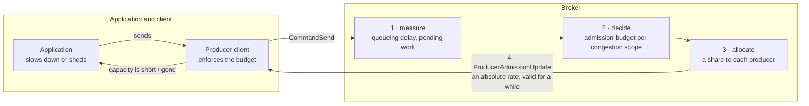
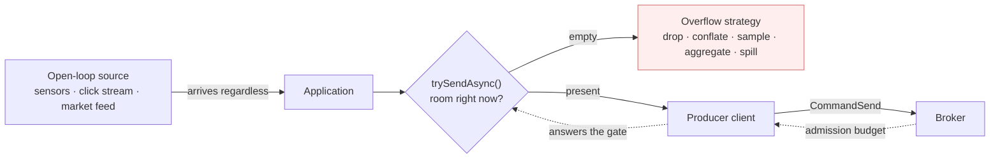
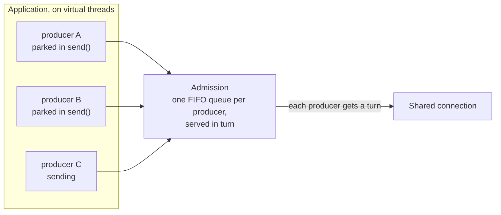

# PIP-495: End-to-end produce backpressure

# Background knowledge

Publishing to Pulsar crosses three boundaries, and each can be overrun independently:

1. **Application → producer client.** The application hands messages to a `Producer`; the client holds them until the broker acknowledges them.
2. **Producer client → broker.** The client writes `CommandSend` frames onto a TCP connection shared with the client's other producers and consumers; the broker holds them until they are persisted.
3. **Broker → storage.** The broker writes entries to BookKeeper and holds them until the write completes.

"Backpressure" here means: when a downstream boundary cannot keep up, the pressure is transmitted upstream so the upstream party slows down, rather than accumulating unbounded work in the middle.

## What exists today

**At boundary 1**, a producer has two behaviours, selected by `blockIfQueueFull`:

- `false` (the default, `ProducerConfigurationData:87`): a send that exceeds available capacity **fails** with `ProducerQueueIsFullError` / `MemoryBufferIsFullError`.
- `true`: the send **parks the calling thread** until capacity exists.

What bounds that capacity is easy to get wrong. `maxPendingMessages` defaults to **`0` — no message-count limit at all** (`ProducerConfigurationData:55`); `PulsarClientImpl:813-819` substitutes 1000 only for an application that left it unset on a client whose memory limit is disabled. So on stock defaults, on **both** the v4 and V5 clients, the client memory limit is the sole bound on a producer's in-flight window.

That limit is `ClientBuilder.memoryLimit`, and it is documented as **a limit on direct memory** (`ClientBuilder:483`, default 64 MiB). It is charged in `ProducerImpl.canEnqueueRequest` in units of `uncompressedSize` — the payload, and only the payload, charged uncompressed even when the buffer retained is the compressed one. (Batching adds a second charge for the batch buffer itself, via `BatchMessageContainerImpl.updateAndReserveBatchAllocatedSize`; what no charge covers is the per-send bookkeeping, which is the subject of the heap budget proposed below.)

**Inside the broker**, `ServerCnxThrottleTracker.ThrottleType` enumerates seven throttling conditions:

| Condition | Blast radius | Publish path? |
|---|---|---|
| `TopicPublishRate` | connection | yes |
| `ResourceGroupPublishRate` | connection | yes |
| `BrokerPublishRate` | connection | yes |
| `IOThreadMaxPendingPublishBytesExceeded` | **every connection on the IO thread** | yes |
| `ConnectionMaxPendingPublishRequestsExceeded` | connection | yes |
| `ConnectionOutboundBufferFull` | connection | indirect — channel writability |
| `ConnectionPauseReceivingCooldownRateLimit` | connection | all commands |

The last two are gated on `pulsarChannelPauseReceivingRequestsIfUnwritable`, default `false` (`ServiceConfiguration:1076`), so neither fires on a stock broker. Of the five that remain, the two memory-pressure conditions are enabled by default while the three **rate** conditions fire only where an operator configured a rate: `maxPublishRatePerTopicInMessages`/`InBytes` and `brokerPublisherThrottlingMaxMessageRate`/`MaxByteRate` all default to `0`, meaning off (`ServiceConfiguration:1286`, `1293`, `1248`, `1255`). So a stock broker has **no publish rate limiting at all**, and the two conditions that can fire are memory-pressure guards that engage only once the broker is already over budget. That is the starting point this proposal argues from: not that Pulsar's limits are applied badly, but that between "nothing is limiting" and "an operator has guessed a number in advance" there is no third option.

**The only action any of them has** is `setAutoRead(false)` on a connection. `ServerCnxThrottleTracker.markThrottled` applies it on the transition into the throttled state.

## What has already been done

Much of this ground was surveyed in *[Apache Pulsar service level objectives and rate limiting](https://codingthestreams.com/pulsar/2023/11/22/pulsar-slos-and-rate-limiting.html)* (2023). Its rate-limiting programme has since shipped — the publish and dispatch limiters run on a lock-free token bucket, `org.apache.pulsar.broker.qos.AsyncTokenBucket`, and `ServerCnxThrottleTracker` tracks throttle conditions individually per `ThrottleType`, so one condition clearing cannot resume a connection another still holds. What it proposed and was never built is what this proposal is about: explicit per-producer flow control, by analogy with consumer permits, and optional per-producer connection isolation.

# Motivation

A Pulsar broker has two instruments for regulating how much is published to it: a rate an operator configured
before the traffic arrived, and `setAutoRead(false)`, which stops the broker reading from a TCP connection.
The first cannot change when conditions do. The second carries no information — a client cannot tell it from a
slow network — and it acts on a connection, which is not the scope of any condition that triggers it. Nothing
the broker measures about its own load reaches a producer, so a producer cannot publish less, and an
application never gets the chance to decide what to give up. The rest of this section is what follows from
that: clusters sized for peak rather than for load, throttling that lands on the wrong tenants, and a client
error model an ordered producer cannot recover from.

### The publish limits a stock broker applies are out-of-memory guards, not capacity management

Two of the five publish-path throttling conditions are enabled by default, and both are memory-occupancy
guards: a connection's pending publish requests (`maxPendingPublishRequestsPerConnection`, default 1000,
`ServiceConfiguration:889`), and pending publish bytes per IO thread — `maxMessagePublishBufferSizeInMB`,
half of direct memory by default (`:1917`), divided by the IO thread count (`ServerCnx:388`).

The other three are rate limits, and all four settings behind them default to `0`, meaning off:
`maxPublishRatePerTopicInMessages`/`InBytes` (`ServiceConfiguration:1286`, `1293`) and
`brokerPublisherThrottlingMaxMessageRate`/`MaxByteRate` (`:1248`, `:1255`). So on a stock broker there is no
publish rate limiting, and what remains fires only once memory is already committed. Between "nothing is
wrong" and "half of direct memory is pending" a stock broker holds no opinion about how much it ought to be
admitting, and no way to express one. The only defence against a peak is to have bought enough hardware to
survive it.

### A configured rate is one number that has to be right for every state the cluster is ever in

Where an operator does set a rate, it is a constant. `PublishRateLimiterImpl.updateTokenBuckets` builds its
token buckets from the configured rate and from nothing else; `ResourceGroupPublishLimiter` does the same from
its resource group's. Resource groups look like the exception and are not:
`ResourceQuotaCalculatorImpl.computeLocalQuota` divides the **configured** total across brokers in proportion
to measured usage — a distribution loop over a number an operator supplied, not a discovery loop over what the
cluster can serve.

That number then has to hold for every state the cluster is subsequently in: every workload mix, every message
size and batch shape, a bookie in recovery, a compaction running, a co-tenant arriving, a GC pause. Set it
near what a healthy cluster serves and it will not fire in a degraded one — the only state in which it was
needed. Set it at what a degraded cluster serves and the difference is hardware idle in every normal hour.
Two of the four knobs are per topic and two are broker-scoped, so topics each obediently under a
conservative per-topic limit can still overload a broker together unless the broker-scoped pair is also set.

Configured rates are not only capacity guesses — they are also ceilings a tenant has purchased, and the
project's own survey names the bet that makes them valuable: rate limiting "constrains tenant usage to
specified quotas, enabling accurate planning and **over-commitment of resources**." This proposal keeps them
for that purpose. What the bet lacks is any way to notice itself going wrong in time to respond
proportionately, which is the gap the same survey names while arguing against PIP-310 — custom limiters
"operate on a topic or namespace, ignoring cluster-wide resource usage and contention" — before calling for
"Pulsar cluster wide capacity management".

No utilisation figure is claimed here, because the project publishes none and one deployment's number would
prove nothing about another's. That is itself the point: with only a configured constant and an emergency
stop, the headroom a conservative constant leaves unused is not a quantity anyone can currently measure. This
proposal therefore ships the queueing-delay and budget metrics, enabled, one release before the controller
that acts on them (*Upgrade*), so the question is settled on each operator's own data.

### Spiky load on an already-loaded cluster, where the balancer does not arrive at all

The failure this proposal is really about is not a steady overload; it is a spike arriving at brokers whose
bookies are already busy. Nothing throttles until memory is committed, at which point the broker stops reading
from connections and publish latency rises for every tenant sharing them.

The load balancer is the mechanism that is supposed to relieve this, and three properties of its shipped
defaults mean it will not.

**Its load number contains nothing about storage.** With default weights — CPU 1.0, bandwidth in and out 1.0,
direct memory 0 — a broker's reported load reduces to `max(CPU%, NIC-in%, NIC-out%)` (`LocalBrokerData:259-265`,
`ServiceConfiguration:3224,3231,3281,3298`). No bookie latency, no pending-add depth, no journal state. **A
cluster whose bottleneck is BookKeeper is invisible to its own load balancer.**

**Its default trigger is relative, so a correlated spike does not fire it.** `ThresholdShedder` skips a broker
unless its smoothed usage reaches the cluster mean plus `loadBalancerBrokerThresholdShedderPercentage`,
default 10 points (`ThresholdShedder:79`). Raise every broker together and the mean rises with them, so
nothing is shed. `AvgShedder` (max–min score gap) and the extensible `TransferShedder` (load standard
deviation above 0.25) behave the same way. The two strategies that would fire on an absolute signal —
`OverloadShedder` at a raw 85%, and `UniformLoadShedder` on a rate ratio with no resource gate at all — are
not the default. So for the case that matters most, the honest statement is not that shedding reacts badly:
**it does not react.**

**And when it is imbalanced enough to fire, it is slow and it pays in the resource that is already scarce.**
Its input is smoothed as `historyUsage * historyPercentage + (1 - historyPercentage) * resourceUsage`
(`ThresholdShedder:177`) with `loadBalancerHistoryResourcePercentage` defaulting to **0.9** — a half-life of
about 6.6 samples — over load reports published no more often than every 5 s and only on a 10% change, with
the shedding pass running once a minute. Then unloading a bundle fences and closes each topic, fails its
managed ledger's in-flight adds with `ManagedLedgerAlreadyClosedException` (`ManagedLedgerImpl:1667`), persists
and closes every cursor, and on the destination performs a **recovering open of the last data ledger**, creates
a new ledger, rewrites the managed-ledger metadata and writes each cursor's ledger again. Every one of those
is a BookKeeper operation, spent on a bookie cluster that was the constraint. The classic shedding path also
has **no in-flight transfer accounting**: `preallocatedBundleData` is written only by `preallocateBundle`,
reached only from `selectBrokerForAssignment`, and a shed bundle's destination is carried instead through a
one-shot affinity map that `ModularLoadManagerWrapper.getLeastLoaded` consumes and returns before any
preallocation happens — so several bundles shed in one pass can be aimed at one broker on reports that reflect
none of them.

Two things this proposal must **not** claim. Shedding is not generally the cause of outages here: a producer
whose topic is fenced receives a `PersistenceError`, which routes into the reconnect path, and the client
resends its whole pending queue transparently. The failure is conditional — it happens when the stall outlives
what is left of `sendTimeoutMs`, and because that clock runs from the head message's creation, a message 25
seconds into a 30-second budget has five seconds, after which `failPendingMessages` fails the entire window.
And where the problem genuinely *is* placement imbalance, shedding is the right answer and this proposal does
not replace it.

What is missing is anything that acts on the timescale of the spike, on the resource that is actually
saturated. Rebalancing is a minutes-scale response to a placement problem, driven by a signal that cannot see
storage. The only party that can act in seconds is the producer, and today it is told nothing.

### When the estimate is wrong, the broker stops reading from the connection

Overload arrives anyway — from a limit set too high, from a limit never set, from a co-tenant, from a slow
bookie. Every condition in *Background* then ends in the same place: `setAutoRead(false)` on a connection
(`ServerCnxThrottleTracker:310`). That instrument has connection resolution, and its problems follow from
that.

**Its blast radius is a connection, and three of the five conditions are not.** `TopicPublishRate`,
`ResourceGroupPublishRate` and `BrokerPublishRate` describe a topic, a resource group and a broker; all three
are enforced by pausing reads on a connection. With `connectionsPerBroker = 1`, an application producing to
twenty topics through one client has all twenty share one connection, so one topic breaching its publish rate
pauses reading for the other nineteen and for every consumer on that client. A well-behaved tenant's latency
is decided by the worst-behaved topic it shares a connection with. This is
[#23403](https://github.com/apache/pulsar/issues/23403); [PIP-385](https://github.com/apache/pulsar/pull/23398)
documents the same problem. `IOThreadMaxPendingPublishBytesExceeded` is wider still, pausing reads on every
connection sharing the IO thread (`ServerCnx:305-312`).

**Pausing reads transmits no information.** The client observes latency and cannot distinguish throttling from
a slow network, a slow bookie, or a GC pause. Nothing the broker can do to a TCP connection changes that,
which is why this proposal adds a signal rather than a better way to stop bytes.

**And it cannot attribute cause, as its own metric demonstrates.** A per-topic publish-rate-limit counter
exists (`OpenTelemetryTopicStats:70`), fed by `ServerCnx.increasePublishLimitedTimesForTopics()`, which
iterates **every producer on the connection** and increments the counter on **every topic it finds** — culprit
and victims alike. The metric cannot tell them apart because the mechanism it reports on cannot either.

Read throttling is kept by this proposal, unchanged, as the involuntary backstop for clients that exceed a
budget they were given or never negotiated one (*Security Considerations*). What changes is that it stops
being the *first* thing that happens.

### The client's error model does not compose with ordered publishing

Start with what is *not* wrong, because the draft of this proposal previously got it wrong. Both admission
failures are delivered **synchronously, on the calling thread, before `sendAsync` returns**: `ProducerImpl:576`
calls `canEnqueueRequest`, which completes the callback in place (`:1132-1143`), which completes the returned
future exceptionally (`:490`) before `internalSendAsync` hands it back (`:419-420`). A refused message never
reaches `pendingMessages` and never consumes a sequence id. This holds on V5 too in the steady state, where
`thenApply` on an already-complete chain head runs inline on the caller (`ScalableTopicProducer:374-379`).

So strict ordering is achievable today. A single-threaded loop that inspects each returned future *before*
issuing the next send never advances past a refusal, and blocking `send()` never refuses at all. Both are
correct. Both are also refusals of the asynchronous model: the first is `sendAsync` used synchronously, and
the second parks the calling thread — which is how an application deadlocks a client IO thread
([#26344](https://github.com/apache/pulsar/issues/26344)).

**The defect is that the API invites the shape in which the check comes too late, and never says the check is
load-bearing.** The natural asynchronous loop collects futures, or attaches a handler, and moves on:

```java
for (Record r : source) {
    futures.add(producer.newMessage().value(r).sendAsync());   // message 5 is refused here
}
```

Message 5 is refused because the client memory limit is momentarily full. Message 6 is offered a moment later,
by which time a broker receipt has arrived on the connection's event loop and released capacity
(`ProducerImpl:1388` → `:1443`), so 6 is accepted and published. The refusal was synchronous; the *release*
that made 6 succeed was not, and that asymmetry is enough. The topic now holds 1–4, 6, and the application has
two ways to try to fix it:

- **Resend 5 without an explicit sequence id.** `updateMessageMetadataSequenceId` assigns a fresh, higher one,
  so 5 is published after 6. Order is broken, silently.
- **Resend 5 with its original sequence id** — what an application publishing an ordered, deduplicated stream
  actually does. On a topic with deduplication enabled, `MessageDeduplication.isDuplicateNormal` finds
  `sequenceId <= lastSequenceIdPersisted` and returns `Dup` (`MessageDeduplication:500`), and `PersistentTopic`
  **acknowledges it without persisting it**: `publishContext.completed(null, -1, -1)`, commented "Immediately
  acknowledge duplicated message" (`PersistentTopic:704`). The client logs a warning and completes the send
  future **successfully**, with `MessageId(-1, -1)` (`ClientCnx:857-867`). The application is told its retry
  succeeded. The message is not in the topic.

Silent reordering or silent loss, and the application cannot tell which it got without comparing message ids
it has no reason to inspect.

**The failure taxonomy runs the opposite way to intuition, and it is what identifies the fix.** A failure that
takes down the *whole* in-flight window — a send timeout through `failPendingMessages` (`ProducerImpl:2380`),
a close, a terminate, a broker `PersistenceError` — is bad for latency and throughput, but it fails messages
in FIFO order and publishes none of the ones behind. It leaves a clean prefix, and an application can replay
from the break in order. The failures that cannot be recovered from are the ones that fail **exactly one
message and keep publishing the rest**: an admission refusal, and a per-message validation failure such as an
incompatible schema. A gap is unrecoverable precisely because the client kept going.

That gives the rule the client API needs. **Ordering survives exactly when the client does not refuse a
message it was asked to send and then accept its successor.** Blocking is correct not because parking is
desirable but because it never creates that gap; `failPendingMessages` is survivable for the same reason.
It follows that an API which *may* refuse is safe only for a source whose answer to refusal is to **drop** —
where the gap is deliberate and the application knows exactly which records it gave up — and that an API which
must preserve order must **accept the message and separately tell the application to stop**. Those are two
different contracts, and *Detailed Design* gives them two different methods.

### The client's memory limit is shared by every producer and allocated to none

`ClientBuilder.memoryLimit` is one `MemoryLimitController` on the client (`PulsarClientImpl:354`), and every
producer draws on it through the same counter. There is no per-producer or per-topic sub-allocation of it.
Charge is taken at admission and released **on acknowledgement from the broker**, not on transmission:
`ackReceived` removes the operation and calls `releaseSemaphoreForSendOp` (`ProducerImpl:1388`, `:1443`).

So the share of the budget a producer holds is proportional to its own round-trip time, and a producer whose
broker is slow or whose connection has dropped keeps its charge for as long as it stays slow — a disconnected
producer is still permitted to enqueue (`ProducerImpl:1098`), so it can go on taking budget it will not
return soon. One stalled destination can therefore occupy most of the client's memory and make every other
producer, on healthy brokers, fail with `MemoryBufferIsFullError` or park.

The predecessor did not have this failure, and the distinction is narrower than it first looks.
`maxPendingMessages` builds a semaphore per `ProducerImpl` — per producer object, per topic partition
(`ProducerImpl:216-220`) — so exhausting one producer's window left every other producer's intact. It was not
removed: it is un-deprecated, still honoured, and still ANDed with the memory limit inside `canEnqueueRequest`.
What changed is the default. PIP-120 (commit `11bfc0e95dc`, #13344) enabled the memory limit and set both
message-count defaults to `0`, for a good reason: a message count is not a memory bound, and it forces an
operator to guess a number per producer on a client that may open hundreds.

That trade should not be reverted, and this proposal does not propose reverting it. What the default change
gave up — accidentally, since a message count was never intended as an isolation mechanism — is **isolation
between producers**, and a single shared byte counter provides none at all. Restoring isolation without
restoring the guessing is the goal.

Three distinctions matter for the fix, and the draft of this proposal previously got all three wrong.

- **Fair access to admission is not a fair share of retained memory.** A round-robin that gives every producer
  an equal turn still lets the producer with the slowest acknowledgements accumulate far more retained bytes
  than its neighbours, because a turn schedules the next reservation while retention is about how long the
  last one is held.
- **A floor is not capacity.** If one producer borrowed 90 MiB of a 100 MiB budget while its neighbours were
  idle, declaring a 50 MiB floor each when a neighbour wakes does not produce the missing 40 MiB — and if the
  borrower is disconnected, the loan is not reclaimable at all. An allocator that promises an immediately
  usable share has to hold capacity back, not derive it retrospectively.
- **The starvation in `MemoryLimitController` is by arrival order, not by size.** Its gate tests
  `current > memoryLimit` and never `current + size > memoryLimit`, so the requested size plays no part and one
  request of any size may cross the limit. What starves a waiter is that `reserveMemory` calls
  `tryReserveMemory` *before* acquiring the mutex, and the non-blocking path calls it directly, so freed
  capacity goes to whoever asks next rather than to whoever has waited longest — against an unfair
  `ReentrantLock` woken by `signalAll()`. A parked waiter of any size can be overtaken indefinitely.

### Heap retention is neither bounded nor accounted

`memoryLimit` is documented as a limit on direct memory (`ClientBuilder:484`). What it charges is the
uncompressed payload plus, for batching producers, the batch buffer's allocation
(`BatchMessageContainerImpl.updateAndReserveBatchAllocatedSize`). What nothing charges is the heap a pending
send retains — the futures, callbacks, metadata and dispatch state per message — so a producer of small
messages exhausts heap long before it approaches its direct-memory limit.

Measured on a heap dump of a client that died this way: the limiter read **92,335,360 of 209,715,200 bytes —
44% of its configured budget — when a 2 GiB heap was exhausted**, with 1,285,311 sends outstanding and **not
one message acknowledged**. Even had every outstanding send been charged, the total would have been 164 MiB
against a 200 MiB limit. The direct-memory limit could not have engaged, because direct memory was never the
resource running out.

### On the V5 client there is no boundary-1 backpressure at all

`ScalableTopicProducer.sendInternalAsync` records a future and appends the send to a per-segment dispatch
chain, then returns. The chain advances after invoking the underlying producer's `sendAsync` without waiting
for its acknowledgement, so a caller that does not await the returned futures is not slowed while the chain is
behind, and the retained dispatch state — the futures, the queued closures, the `inFlightSends` bookkeeping —
is charged against nothing.

The underlying producer's memory limit does engage; what it does not bound is the backlog in front of it. Nor
is there a message-count bound to fall back on: `ProducerBuilderV5` never sets `maxPendingMessages`, so the
semaphore is never constructed (`ProducerImpl:216`), and V5 segment creation bypasses the builder step that
would otherwise substitute 1,000 when the memory limit is disabled (`ProducerBuilderImpl:123`,
`PulsarClientImpl:904`). A V5 client with the memory limit turned off has no boundary-1 bound of any kind.

Neither outcome of the underlying limit is usable backpressure. With the default `blockIfQueueFull(false)`,
the failure surfaces on the returned future — inline on the caller while the segment chain head is already
complete, and on some other thread while a segment producer is still being created, so an application cannot
even rely on the synchronous behaviour v4 happens to have. With `blockIfQueueFull(true)` it is worse: when the predecessor is
already complete, the dispatch runs inline on the calling thread **while `dispatchLock` is held**, so the
caller parks holding a lock every other sender on that producer needs. That is
[#26344](https://github.com/apache/pulsar/issues/26344); the absence of boundary-1 backpressure on V5 is
[#26470](https://github.com/apache/pulsar/issues/26470).

## Goals

### In Scope

- **An application-visible admission signal that does not break ordering.** A way for an application to learn
  that it should stop, which does not require the client to refuse a message it was asked to send — and a
  separate, explicitly refusing call for sources whose answer to congestion is to drop. *Motivation* shows why
  these have to be two contracts and not one.
- **A broker-side admission budget derived from measurement**, not from a rate an operator configured in
  advance, so that a cluster can be run closer to its capacity than peak provisioning requires.
- **An explicit per-producer budget on the wire**, absolute and idempotent, so every client language can
  enforce it and no client has to infer it from timing.
- **Proportional shedding**: when the budget falls, each publishing producer's share falls by roughly the same
  fraction.
- **Client-side adaptation that reduces the load rather than merely rationing it.** A budget denominated in
  batches lets a client answer pressure by forming fewer, larger entries — spending latency the application
  has declared it can spare, to reduce the per-entry work the broker and the bookies actually pay.
- **A blocking publishing mode that can batch.** Today a blocking `send()` force-closes the batch after every
  message, so a single-threaded ordered publisher emits one entry per message and pays a broker round trip for
  each. A staged blocking mode gives that publisher the batching the asynchronous API already has, and gives
  it per-message outcomes, which `flush()` cannot report.
- **Per-producer isolation of the client's memory budget.** One shared counter with no sub-allocation lets a
  single stalled producer hold most of it until its own broker acknowledges. The goal is isolation between
  producers without reintroducing a per-producer message count for an operator to guess.
- **A bounded, accounted heap budget** for pending sends, without redefining `memoryLimit`.
- **Separating the three deadlines that `sendTimeoutMs` conflates**, so that each can be kept: the wait for
  **admission**, which today has no bound at all and on whose expiry nothing has been published; the
  **delivery** deadline for a message already transmitted, which is what `sendTimeoutMs` should mean; and the
  client's own **transport watchdog**, which detects a connection making no progress. Today one 30-second
  number stands for all three, and expiring fails the entire in-flight window.

**What this costs, stated up front.** It adds a broker-to-client command and its negotiation, which every
client eventually has to implement, and it puts a feedback controller on the publish path, with the tuning and
instability risk any controller carries. It also adds application-facing API to interfaces the project cannot
later remove methods from.

### Out of Scope

- **Consumer-side flow control.** `CommandFlow` permits already exist for dispatch and are unchanged.
- **Tenant entitlement.** The word "fairness" covers three different things here, and only two are
  delivered. *Proportionality* — every producer's share falls by roughly the same fraction — is delivered by
  the allocator. *Isolation* — a badly-behaved producer cannot durably deny service to a well-behaved one — is
  delivered on the client by the admission arbiter and the memory allocator, and approximated on the broker.
  *Entitlement* — a tenant is due some share regardless of what it has been using — is **not** delivered, and
  cannot be without an authenticated allocation identity, which is a behaviour contract that cannot be changed
  after it ships.
- **Replacing the configured rate limiters.** `PublishRateLimiterImpl` and `ResourceGroupPublishLimiter` remain as configured ceilings; the adaptive budget is a second constraint below them, never above.
- **Topic-granular placement and the load balancer.** The measurements added here are what a placement decision would need, but changing how topics are assigned to brokers is separate work.
- **A per-producer connection-isolation API**, tracked as [#23403](https://github.com/apache/pulsar/issues/23403) and independently shippable.
- **Ports of the client API to C++, Go, Python and Node.** The wire signal is language-neutral and those clients can enforce it; exposing it to applications is additive per client.

# High Level Design

**One organising idea: close the loop.** Today the broker knows it is overloaded and the application
never finds out. Every mechanism in *Background* ends at the socket — `setAutoRead(false)` stops bytes
and says nothing — so the application learns about congestion as latency, and eventually as a timeout.
An application cannot adapt to a signal it never receives, so the only way to survive peak load is to
buy enough brokers that peak never arrives. That is the overprovisioning this proposal is trying to
remove.

The loop has four parts, and the proposal is the whole loop rather than any one of them:



1. **Measure.** The broker measures how congested it actually is, per congestion scope, from queueing delay
   and outstanding work — not from a rate an operator guessed at in advance. For a topic, the scope that
   matters is its managed ledger and the bookies in that ledger's current ensemble.
2. **Decide.** A controller per scope turns that measurement into an admission budget, raising it while
   there is headroom and cutting it in proportion to how far over it is.
3. **Allocate.** The budget is divided among the producers actually publishing, in proportion to what
   each is already admitted to send.
4. **Tell the client, and let the client tell the application.** The share travels as an explicit, absolute
   number the producer may publish at. The client enforces it and surfaces it to the application — which is
   the part that makes the loop end-to-end, and the part that has to be designed so that acting on it does
   not itself break message ordering.

**Budgets act before read throttling is needed; read throttling stays as the last resort.** A configured rate
limit answers demand it cannot serve by pausing reads on a connection. A budget answers it by telling the
producer what it may have, which the application can respond to while it still has choices: a source that can
be slowed is slowed, and a source that cannot is sampled, conflated or dropped by the party that knows which
of its messages matter. Nothing here is voluntary at the bottom, though. Configured rate limits remain
ceilings, the existing occupancy guards keep protecting the broker regardless of client cooperation, and a
client that exceeds its budget — or never negotiated one — exhausts a bounded allowance and then has reads
paused on its connection exactly as today. The budget changes what happens *first*, and gives the application
a decision it can make in advance; it does not remove the involuntary instrument behind it.

# Detailed Design

## Design & Implementation Details

### What an application can do about backpressure depends on its source

The property that decides which API an application needs is **whether backpressure can reach its
origin** — whether the loop is closed or open. The reactive lineage calls these *cold* and *hot*
sources, and those names are useful shorthand as long as their ambiguity is acknowledged: "hot" is also
used to mean multicast, and the two senses usually travel together but are not the same claim.

**When the loop can be closed, backpressure is lossless.** A file, a database cursor, a topic being
replayed: if the application stops pulling, the source waits. Demand propagates all the way back, and
nothing has to be discarded — the data is produced later instead.


**When it cannot, backpressure is lossy, and the application must choose how.** Sensor readings, clock
ticks, UDP market data, an inbound connection someone else owns: the data arrives whether or not there
is room. "Slow down" is not actionable, because there is no dial. What the application can do is decide
*what to give up* — and the established strategies are all it has: bounded buffering, spilling,
dropping oldest or newest, **conflation** (latest-wins, per key), sampling or pre-aggregation, or
failing fast. Only the application knows which is right for its data.



This is also what a broker is *for*: **a durable log converts an open-loop source into a closed-loop
one.** The topic absorbs the producer's pace, and a consumer with its own cursor reads at whatever rate
it likes and can replay. Consumers already get the closed-loop side, through permits and cursors. This
proposal is about giving producers the same standing — and about being honest that when the log itself
cannot keep up, the conversion has a limit, and the application is the only party that can decide what
happens at it.

**Blocking is the third shape, and virtual threads make it a good one again.** An application whose
calling thread may wait should be able to write the obvious loop. Blocking is the closed-loop model with
the demand signal hidden inside the call; `SubmissionPublisher.submit` and `offer` are the same two
modes side by side in the JDK.



### The application boundary: two methods

Two methods carry the whole interaction — one on `Producer`, one on `TypedMessageBuilder`. The other
public additions are settings rather than surface an application calls per message: a bound on waiting,
and a bound on heap. Nothing is reserved, owned, or presented, and the only thing that expires is a wait
the caller asked to bound — never anything the application holds.

```java
public interface Producer<T> extends Closeable {
    /**
     * Complete once this producer can admit a send; already complete if it can now.
     * Advisory, not a reservation — another producer sharing the budget may take the
     * capacity first. The same future is returned to every caller until it completes.
     */
    default CompletableFuture<Void> whenSendable() {
        return CompletableFuture.completedFuture(null);
    }
}

public interface TypedMessageBuilder<T> extends Serializable {
    /**
     * Send if the producer can admit the message without waiting. Empty means, and only
     * means, "no capacity right now": nothing was enqueued and no exception was built.
     * Every other outcome returns a present future behaving as sendAsync().
     */
    default Optional<CompletableFuture<MessageId>> trySendAsync() { … }
}
```

**A rate and a window compose by conjunction.** The budget the broker sends is a rate with a burst
allowance — a token bucket. Every bound the client already has is a *window*: bytes outstanding
(`memoryLimit`), messages outstanding (`maxPendingMessages`), heap retained (`pendingSendHeapLimit`). A
send is admitted only if it fits **all** of them, so `trySendAsync()` refuses when the token bucket is
empty *or* any window is full, and `whenSendable()` completes when the binding one relents. That is why
the refusal is a plain empty `Optional` rather than a reason code: the reason is operational, not
something an application should branch on, and it is reported as an attribute on
`pulsar.client.producer.send.refused` instead — so an operator can tell "the broker cut my budget" from
"my own heap limit is full".

`trySendAsync()` is **authoritative** and `whenSendable()` is **advisory**, and the split is deliberate.
The advisory signal is what a closed-loop application waits on; the authoritative call is what actually
admits. An application that treats the signal as a reservation is wrong in a way that shows up under
exactly the contention it is trying to handle, so the contract says outright that the correct shape is
*wait, then loop on `trySendAsync()` until it refuses*.

Three properties make this cheap enough to sit on a hot path. The same future is handed to every caller
until it completes, so **waiters are bounded by the producer count, not the message rate**, and the
steady-state "there is room" case allocates nothing. An empty `Optional` is a singleton: refusing costs
no exception, no stack capture, and no schema work, because the decision is taken before the message is
built. And **`trySendAsync()` does not barge** — but the rule is *turn-based, not existence-based*, and the
distinction matters. Refusing merely because some other producer is waiting would let one continuously
blocked neighbour drive an open-loop producer to shed 100% of its data indefinitely: total silent loss,
on the path whose whole purpose is to avoid it. A non-barging refusal therefore means "it is not this
producer's turn under the round-robin", which arrives and passes. A shedding producer cannot starve a
blocked one, and a blocked one cannot mute a shedding one.

The three modes fall out of the two methods:

<!-- this isn't satisfying. 
trySendAsync is fine. 
whenSendable could be eliminated with a new type of sendAsync. Instead of returning CompletableFuture<MessageId>, it should return a result object. On that there could be Optional<CompletableFuture<Void>> whenSendable. When it's Optional.empty(), it means that the send was accepted through the gates on the client side. There would be a direct CompletableFuture<MessageId> too which will eventually return the messageId back. For applications which would like to slow down, they should wait for the completion of whenSendable if it gets provided. Calling another sendAsync when the state is in whenSendable state would fail directly with a refused exception etc. 
For the blocking API there should be a middle ground between current send and the sendAsync APIs. The current reason to avoid using the send API in the blocking API usage is that it's not currently possible to perform batching when using it. there should be a way to perform batching also when using the send API. One solution could be to have a separate flush command which would return the results. It would be mandatory to call flush every n messages. Calling send could throw an exception if there are too many messages that haven't been "flushed". "flush" might be the wrong concept since it's about getting the statuses of the staged messages. 
  -->
| Source | What the application does | Backpressure |
|---|---|---|
| Closed-loop | `whenSendable()`, then pull and `trySendAsync()` until refused | Lossless; reaches the origin |
| Open-loop | `trySendAsync()`, and on empty apply its overflow strategy | Lossy, by the application's choice |
| Blocking | `send()` with `blockIfQueueFull(true)` and `maxSendBlockTime` | Lossless; the thread waits |

```java
// Open-loop: 200k spans/s from a source that cannot be slowed. Shed, never time out.
void onSpan(Span span) {
    var sent = producer.newMessage().value(span).trySendAsync();
    if (sent.isEmpty()) { dropped.increment(); return; }   // the shed decision
    sent.get().exceptionally(e -> { failed.increment(); return null; });
}
```

```java
// Closed-loop: pull the next record only when there is room for it.
void pump() {
    producer.whenSendable().thenRunAsync(() -> {
        for (var r = source.peek(); r != null; r = source.peek()) {
            if (producer.newMessage().value(r).trySendAsync().isEmpty()) break;
            source.advance();
        }
        pump();
    }, appExecutor);
}
```

**What this deletes.** An earlier draft of this proposal reserved capacity into an application-held
`CapacityGrant`, with a request builder, a minimum, a validity deadline, an idempotent release, rules
for presenting a grant to the wrong producer, and three new exception types. Every one of those existed
because ownership had been externalized. Pulsar's own
[reactive client](https://github.com/apache/pulsar-client-reactive) demonstrates the alternative: a
counter acquired when a send is initiated and released on receipt is enough to drive Reactive-Streams
demand back to a cold source, with no capacity object in the application's hands at all. Keeping the
counter inside the client removes the object and every rule that attended it. What that library does
*not* do — and why this is a PIP rather than a dependency — is bound bytes or heap (it has no
interaction with `memoryLimit` whatever), work on the V5 client, or exist inside `pulsar-client`.

### What the client bounds

**A heap budget, not a redefinition.** `ClientBuilder.memoryLimit` is documented as a limit on direct
memory, so charging retained heap against it would silently change the resource being limited.
`pendingSendHeapLimit` is a separate, explicitly named budget for what pending sends retain on the heap,
and `whenSendable()` folds it in with the others.

**Admission is per producer and served in turn.** `connectionsPerBroker` defaults to 1, so a client's
producers share a connection, and capacity handed out in arrival order lets one busy producer hold every
neighbour behind it. Waiters are held in one FIFO queue **per producer** — FIFO within a producer
because Pulsar requires per-producer send order anyway — and those queues are served round-robin with a
byte quantum, over the producers of a connection. This is the two-level shape HTTP/2 uses for its
connection and stream windows. Two rules make it a liveness guarantee rather than a heuristic: the
arbiter services *producers, not waiters*, so a producer with a thousand parked callers gets one
producer's share and not a thousand; and every producer with an open admission path is guaranteed a floor
of `budget / activeProducers`, which it may draw against without consulting anyone.

**This is a queue per producer, and that has a known ceiling.** It is exactly the "fairness queuing"
McKenney describes — a separate FCFS queue per conversation, serviced round-robin — and its cost is
`O(producers)` queues plus `O(producers)` work per service round. At the scale most clients run, tens of
producers, that is the right trade and the simplest thing that works. It stops being so for a client that
fans out to very many producers: a proxy, a Functions runtime, a connector writing to a topic per tenant.
The escape is *stochastic* fairness queuing — a fixed pool of queues with producers hashed onto them,
`O(1)` in both queues and work, with the hash **periodically perturbed** so that two producers that
collide do not collide permanently, which is the failure plain hashing has. Adding shuffle-sharding onto
a small subset of queues with best-of-two selection keeps `O(1)` enqueue and dequeue and isolates a noisy
neighbour without ever needing to know who the neighbours are.

That last property is why it belongs here rather than in a footnote: SFQ delivers **isolation without
entitlement**, which is the same stance this proposal takes on the broker side. It does not promise a
producer its fair share; it promises that a badly-behaved neighbour cannot durably deny service to a
well-behaved one. An implementation may start with per-producer queues and move to SFQ when producer
counts justify it, because nothing in the interface distinguishes them.

Today's `MemoryLimitController` cannot support this and is replaced for the blocking path, and the reason is
worth stating precisely because an earlier draft of this proposal got it wrong. Its gate tests
`current > memoryLimit` and never `current + size > memoryLimit`, so the requested size plays no part in
admission and one request of any size is explicitly allowed to cross the limit. The defect is not size
starvation but **arrival-order barging**: `reserveMemory` calls `tryReserveMemory` before acquiring the mutex,
and the non-blocking path calls it directly, so freed capacity goes to whoever asks next rather than to
whoever has waited longest — against an unfair `ReentrantLock` with a single condition woken by `signalAll()`.
Under a steady stream of arrivals a parked waiter of any size can be overtaken indefinitely.

**Admission is *decided* when a send is accepted, never when it is transmitted.** The byte dimension is
charged at acceptance, where the size is known. The batch dimension cannot be: a batch does not exist
until it is closed, so its token is charged as a **post-paid debt** at the moment a `CommandSend` is
formed, and the bucket may go negative. That is why the budget is a rate with a burst rather than a
window — a debt that settles is meaningless in a window — and it is why nothing downstream of acceptance
re-gates a send.

**Three clocks, where there was one.** `sendTimeoutMs` (default 30 s) conflates waiting for client
capacity with waiting for the broker, and its only implementable shape is a whole-window cliff:
`ProducerImpl.run(Timeout)` measures from the head message's `createdAt` and calls `failPendingMessages`,
failing every in-flight message including one sent milliseconds ago. That multiplier is the
amplification — and the arithmetic is decisive once admission is dynamic. A producer holding 1,000
accepted messages whose allowed rate drops to 20/s needs about 50 seconds to drain. **No tuning
reconciles that with a 30-second deadline.** So the deadline is separated by what it actually measures:

| Clock | Expiry means | Owned by |
|---|---|---|
| `maxSendBlockTime` | The application could not get permission in time; **nothing was published**, and it may sample, drop or defer | the caller |
| Delivery deadline, from first transmission | The outcome is unresolved — it does **not** mean the message was not persisted | the caller, optional |
| Connection watchdog | The transport or the broker has stopped making progress; recover | the client |

`sendTimeoutMs` keeps its present meaning for applications that do not opt in — it is already disabled
when set to zero, and replicators already run that way with a bounded pending count
(`AbstractReplicator:157-158`). What the new modes add is that waiting has a bound *before* admission, where
expiry costs nothing, instead of only after, where it costs a window.

**A budget-limited client should batch harder, and this is the largest single lever in the proposal.**
Denominating the budget in batches is what makes it possible, because it prices the thing the broker and
the bookies actually pay for. A batch is one entry: one add-entry operation, one journal write on each
bookie, one index update, one ledger slot — costs paid per entry and amortised over however many messages
the entry carries. Halving a producer's entry rate at the same byte rate halves that work.

The headroom is not marginal, because **today's default batch is delay-bound, not size-bound**.
`batchingMaxPublishDelayMicros` defaults to **1 ms**, against caps of 1000 messages and 128 KiB
(`ProducerConfigurationData:176,183-184`). A producer at 10,000 messages a second accumulates about ten
messages in a millisecond and closes the batch there — one per cent of the message cap. The entry rate is
set by the clock, not by capacity, and there are roughly two orders of magnitude between the batch a
producer forms today and the batch it is already configured to allow.

**The rule is that a client may spend latency it was given, and no more.** A new
`adaptiveBatchingMaxDelay(Duration)` states the delay the application can tolerate, as distinct from the
delay it prefers; unset, which is the default, nothing changes. When it is set and the producer is
budget-limited, the client extends accretion toward that bound — filling larger entries rather than
sending smaller ones it has no budget for. When the budget is not binding it closes batches as it does
today, so the latency is spent only when it buys something. This deliberately does not reinterpret
`batchingMaxPublishDelayMicros`, whose meaning applications already depend on.

Three properties keep it safe, and each answers a way it could go wrong:

- **It cannot chase the controller.** The client re-evaluates its accretion window when a new
  `ProducerAdmissionUpdate` arrives — every `adaptivePublishBudgetValidityMillis`, three seconds by
  default — not continuously and not per send. The controller runs at 100 ms. Keeping the client an order
  of magnitude slower is what stops the two loops hunting each other, since sparser arrivals lower
  measured queueing delay, which raises the budget, which would otherwise narrow the window again.
- **It cannot grow the client's memory without bound.** A wider window holds more messages in the batch
  container, and that is heap. `pendingSendHeapLimit` is what bounds it — which is the answer to whether
  the heap budget belongs in this proposal: adaptive batching is only safe *because* the heap it widens
  is being bounded for the first time. The byte budget bounds the other axis: bytes are charged per
  message and are invariant under repacking, so a producer cannot manufacture throughput by batching.
- **It cannot exceed what the broker will accept.** Batch growth is capped by `batchingMaxBytes` and by
  the broker's maximum message size, both of which already exist.

**What it does not help.** Chunked messages bypass batching and each chunk becomes its own entry, so a
producer whose messages chunk into `k` pieces is hard-capped at `B/k` entries' worth of throughput with
no adaptation available. That is a real consequence of pricing entries rather than messages, and it is
stated rather than hidden. Nor does a larger batch come free downstream: it is one dispatch unit and one
acknowledgement unit, and for `Key_Shared` subscriptions a 1000-message batch is 1000 bits of ack-set
state. The proposal prices publishing, and the application still chooses the latency it is willing to
trade for it.

### What the broker measures, and what it decides

**The signal is queueing delay, guarded by watermarks.** A configured rate cannot tell a broker whether
it is coping; only its own queues can. The primary input is the delay a publish waits before its
storage write is initiated, with outstanding bytes and outstanding operation counts as independent
safeguards. Three measurement facts constrain any implementation:

- `PendingBytesPerThreadTracker` already counts pending publish bytes per IO thread, but it is charged
  before the producer publish call and released by the IO-thread completion task, so it spans the whole
  path — retained buffers, storage, and the return hop. It is a good occupancy safeguard and a poor
  proxy for storage queue depth.
- Managed-ledger add latency **misses its own initial executor wait**: `asyncAddEntry` submits a task,
  and `OpAddEntry`'s `startTime` is set after that task is dequeued, so time spent waiting for the
  dequeue is invisible. Submission-to-start timing has to be added.
- Completed-operation latency stops producing samples exactly when storage stalls, so an
  oldest-outstanding-operation age is needed alongside it.

**For a topic, the congested resource is its managed ledger and the bookies in that ledger's current
ensemble**, and most of what is needed to see both already exists. Pulsar depends on BookKeeper 4.18.0
(`gradle/libs.versions.toml`), and in that version:

- **The managed ledger already measures most of the delay.** `OpAddEntry.updateLatency()` records both
  creation-to-completion and last-write-initiation-to-completion, and `ManagedLedgerImpl.checkAddTimeout()`
  already peeks the oldest pending operation. `ManagedLedger.getPendingAddEntriesCount()` is public. What is
  missing is the submission-to-dequeue interval noted above, and a continuously sampled age rather than one
  read on a timeout path.
- **BookKeeper already computes a quorum-completion latency and Pulsar throws it away.**
  `AsyncCallback.AddCallback` extends `AddCallbackWithLatency`, whose default `addCompleteWithLatency`
  discards the `qwcLatency` that `PendingAddOp` computed at quorum completion. `OpAddEntry` implements the
  plain callback. Overriding it separates the entry's own quorum time from the delay BookKeeper adds by
  holding a completed add behind an earlier incomplete one. **This needs no BookKeeper change.**
- **Per-bookie pressure is reachable, with two caveats.** `BookieClient.getNumPendingRequests(BookieId, long)`
  and `BookieClient.isWritable(BookieId, long)` are the supported route — reached from
  `ManagedLedgerImpl.bookKeeper` via the public `BookKeeper.getClientCtx().getBookieClient()`, so neither
  reflection nor `BookieClientImpl.lookupClient` is required. The caveats matter. The returned value packs a
  writability bit that must be masked off with `BookieClient.PENDINGREQ_NOTWRITABLE_MASK`; and despite its
  javadoc it is the **pool-wide** count across all channels to that bookie, not the count on the channel this
  ledger uses, which is material because Pulsar opens 16 channels per bookie by default. It is a count of
  outstanding requests from *this broker's* client, shared across every topic using that bookie — not a
  bookie-server queue depth.
- **The current ensemble is `metadata.getAllEnsembles().lastEntry().getValue()`**, not
  `getEnsembleAt(Integer.MAX_VALUE - 1)`: the parameter is a `long`, and that expression returns whichever
  ensemble covers entry 2,147,483,646, which is the last one only if no ensemble begins after it.
  `LedgerManager.registerLedgerMetadataListener` exists for following ensemble changes, but ensembles also
  change on ledger rollover, so a listener has to be re-registered per ledger. `LedgerMetadata` is annotated
  `@LimitedPrivate @Unstable`, so this is a dependency to declare rather than one to assume.

**Ensemble, write quorum and ack quorum aggregate differently, and conflating them is the easy mistake.**
With ensemble size `N`, write quorum `M` and ack quorum `A` (Pulsar defaults `N = M = A = 2`), an entry is
written to `M` rotating ensemble members and completes on `A` acknowledgements. Two aggregations are needed
and they answer different questions. For **completion delay**, take the `A`-th smallest pressure estimate over
each write set — a maximum overstates it whenever `A < M`, and a mean hides a majority that is slow. For
**replica protection**, every member of a write set receives the write whether or not it is needed for the
first `A` acknowledgements, so a uniformly rotating topic sends about `M/N` of its entries to each member, and
a persistently lagging replica should be able to constrain admission through its own scope even while quorum
latency still looks healthy.

**And attribution of waiting is not attribution of causing the wait.** A small producer queued behind
expensive work experiences the same delay it did not cause, so congestion and each producer's admitted
contribution have to be measured separately.

**There is one controller per congestion scope, and it produces a single number.** A scope is a thing
that can be congested independently: a managed ledger, a shared executor, the broker itself. Each runs
its own controller over its own measurements and emits an **admission factor** `f ∈ (0, 1]` — the
fraction of its recent healthy reference rate it is currently willing to admit. One scalar per scope;
the two dimensions on the wire come from allocation, not from running two controllers.

Let `z` be the worst of that scope's normalised pressures — queueing delay against its target,
outstanding bytes and operations against their soft watermarks. **The controller's state is the scalar
`f`, and the recurrence runs on it**, not on a budget:

```
z > 1  →  f ← max(f_min, f · max(0.5, 1 − β(z − 1)))    decrease in proportion to the overload
z < H  →  f ← min(1, f + a)                             only while producers are admission-limited
else   →  f unchanged
```

The two budgets are then recomputed from the same `f`: `R_batch = f · reference_batch` and
`R_byte = f · reference_byte`, where the references are the scope's recent healthy rates in each unit,
frozen during reductions. One state variable, two budgets — which is what makes "one controller per
scope" literally true rather than a figure of speech.

Both clamps are load-bearing and they are different bounds. `max(0.5, …)` floors a **single step**, so
one bad interval cannot collapse the budget; `f_min` floors the **sequence**, so a sustained overload
cannot drive a scope to zero through repeated decreases. Only the sequence floor binds in the end: from
`f = 1`, five consecutive bad periods at the per-step floor reach 0.03, which is 500 ms at the default
control period. And `min(1, …)` is what stops additive increase carrying `f` above its own reference.

This is Breakwater's shape — central AIMD on measured queueing delay, decrease proportional to overload
rather than a blind halving, floored so one bad interval cannot collapse the budget — and Breakwater is
the evidence that AIMD is right *here*, where a server with complete local knowledge must nonetheless
search for a capacity it cannot compute. The increase is frozen while producers are
**demand**-limited — publishing less than the budget already allows — because otherwise the controller
accumulates an imaginary capacity estimate over an idle period and then admits a burst against it. It grows
only while producers are **admission**-limited, where a larger budget would actually be drawn on and the next
measurement therefore tests it. Telling the two apart requires the broker to know whether a producer's share
is binding, which is one reason allocation tracks admitted traffic against allocated budget rather than
throughput alone. Emergency protection is a separate path and is bound by neither floor.

The loop period must exceed the time for a decision to reach clients and change what arrives, or each
adjustment acts on stale evidence.

**Congestion stays at its own scope, and scopes compose by minimum.** A producer belongs to several
scopes at once — its ledger, whatever executor serves it, its broker — and its allowed rate is the
*tightest* of the shares those scopes give it. A stalled ledger therefore shrinks only its own budget,
and only producers on that topic see a smaller number. This is the composition the existing limiters
already use, where topic, resource-group and broker limiters are each consulted and the first to run out
binds (`AbstractTopic:1101-1116`). Without it, slowing everyone for one topic's storage problem would
manufacture exactly the noisy-neighbour behaviour this proposal exists to remove — and that, not the
mechanism, is the claim *Motivation* opens on.

**Allocation: proportional shedding, and no more than that.** Each dimension is allocated separately in
its own units: a producer's share of a scope's batch budget is `R_batch · uᵢ_batch / Σuⱼ_batch`, and its
share of the byte budget is the same expression in bytes. The client is bound by whichever runs out
first. For an unchanged traffic shape this gives every source approximately the same percentage
reduction, which is what an application
can plan around, and splitting one producer's traffic across ten producers does not multiply its share.
Three rules keep it honest, and each closes a way to game it:

- **Measure admitted traffic, not attempted traffic.** Ignoring the signal must never increase an
  allocation.
- **Freeze the reference during reductions.** Recomputing weights from already-throttled traffic
  rewards non-compliance and punishes obedience.
- **Reserve a bounded pool for new and returning producers**, rather than granting each newcomer a free
  burst.

What this deliberately is **not** is fairness. A source already taking 90% of a broker keeps
approximately 90% of it during congestion. Proportional shedding is defensible and implementable without
settling what a tenant is entitled to; calling it fairness would not be. A guarantee that every tenant
makes progress against adversarially created producers needs an authenticated allocation identity, and
that is the follow-up this proposal is the precondition for — see *Fairness*.

### The signal: an absolute budget, not a nudge

```text
ProducerAdmissionUpdate {
    producer_id, producer_generation, update_sequence,
    valid_for_ms,
    batches_per_second, bytes_per_second,
    burst_batches, burst_bytes,
    reason
}
```

It is an **absolute, idempotent snapshot**. "Publish at 80% of your current rate" is ambiguous under a
duplicated update, an idle producer, a reconnect, or two observers with different windows; an absolute
budget is the same information, is safe to repeat, and gives the client a schedule it can actually
enforce.

**The two dimensions are batches and bytes, not messages and bytes**, because those are what the broker
actually spends. One `CommandSend` becomes exactly one BookKeeper entry — `PersistentTopic` hands its
whole `headersAndPayload` to `ledger.asyncAddEntry` (`PersistentTopic:700,734`) — so a batch carrying a
thousand messages costs one add-entry operation, one write to each bookie, and one ledger slot, exactly
as a batch carrying one does. The messages inside are opaque payload at publish time. What a batch count
captures that bytes cannot is the *fixed* cost per entry: a producer sending ten thousand tiny batches a
second is far more expensive than one sending a hundred large ones at the same byte rate, and only the
batch dimension sees the difference.

This is deliberately a different unit from the configured limiters, which count messages
(`handlePublishThrottling(producer, numOfMessages, msgSizeInBytes)`). That is not an inconsistency to
resolve: a configured rate counts what a tenant *buys*, and messages are what a tenant thinks in. The
adaptive budget counts what the broker *spends*. They coexist because they answer different questions,
and the tighter of the two binds.

It is a **command, not only a receipt field**. A receipt field would be a free piggyback while receipts
flow, but a producer that has been told to stop has no outstanding receipts to annotate, and needs to be
told both about further reductions and about permission to resume. Adding the piggyback later is a pure
optimisation.

The lifecycle rules are the part an implementation cannot infer: an initial budget is established at
producer creation, so the first burst is covered; updates are scoped to the producer incarnation and
stale generations discarded — `producer_generation` is the existing producer epoch rather than a new identifier, so a reconnected or fenced-and-recreated producer ignores updates addressed to its predecessor without any new state to keep; on expiry the burst allowances lapse at once and the rate **decays toward
`adaptivePublishMinAdmissionFactor × reference`** rather than to zero or to whatever was granted at
creation — a creation-time budget would be a healthy-cluster number restored precisely when silence most
likely means the opposite, and a reconnect storm would re-arm it for every producer at once. Decay is
monotone in the safe direction, needs one constant already introduced for the controller, and closes the
mute-by-zero hole, since a zero budget expires upward like any other. A control-plane refresh remains
possible throughout;
and a reduction never retroactively invalidates work already transmitted.

**Old clients keep working, and are not trusted to.** The command is sent only after feature
negotiation. A client that does not understand it — or a client that understands it and ignores it —
gets a bounded transition allowance and then the existing involuntary instrument, `setAutoRead(false)`
on its connection. An advisory percentage cannot protect a broker on its own; the signal makes
cooperation *possible*, and connection pausing is what makes enforcement *certain*.

### What this does not fix: where the load is

Throttling is a stopgap, and the design should not pretend otherwise. Kora is explicit that broker-local
backpressure is the temporary state and that the durable response is to move load or add capacity: the
throttled state "is temporary: the high resource usage on a broker normally triggers a rebalance
operation to even out load, or, in rare occasions, when the whole cluster is close to capacity, the
multi-tenant cluster gets expanded." A broker that can only ever say
"publish less" converts a placement problem into a customer-visible slowdown.

Pulsar cannot currently take that step at the granularity the signal produces. Load balancing acts on
**namespace bundles**, and the default `ConsistentHashingTopicBundleAssigner` fixes a topic's bundle by
hashing its name, so a congesting topic can be moved only together with everything else that hashed alongside
it, and splitting is the only lever. The mapping is a documented extension point —
`topicBundleAssignmentStrategy` selects an implementation of `TopicBundleAssignmentStrategy` — so this is a
property of the shipped default rather than of the architecture, which matters because it means the follow-up
work has somewhere to attach.

There is a second gap in the same place, and this proposal supplies the input for it. The balancer's load
number does not include storage at all (*Motivation*), so even a topic-granular placement decision would today
be taken blind to the resource that is most often the constraint. The measurements added here — managed-ledger
queueing delay, outstanding work, and per-bookie pressure on the active ensemble — are what such a decision
would need. Topic-granular placement is the work that would let a cluster answer overload by rebalancing
before it answers by shedding; it is out of scope here, and named because the loop is incomplete without it.

### Fairness

The user-visible goal beyond overload avoidance is that a loaded broker share capacity predictably rather than by arrival order. Proportional shedding is not that, and this proposal is the **precondition** for it rather than its delivery.

A fairness policy would first have to choose an **allocation identity**, and that choice is a behaviour contract that cannot be changed after ship: dividing a *shared* budget — a resource group's, or a broker's — equally between producers hands a tenant running 100 producers a hundred times the capacity of one running a single producer, so producer count is not an entitlement and authentication does not make it one. Proportional shedding avoids that question by not answering it: shares follow admitted usage, so no entitlement is asserted and none is created. A follow-up PIP choosing tenant as the identity can consume the same allocation step. Nor is a pluggable policy seam the interim answer: PIP-310 (*Support Custom Publish Rate Limiters*) asked the same of the rate limiters and was not adopted, on the grounds that fragmenting the implementation serves users worse than fixing the built-in one.

**On AIMD, this proposal reverses an earlier position, and the reversal is worth recording.** An earlier draft argued that AIMD had no place here because every condition acted on already carried an operator-configured rate, leaving no capacity to search for. That is true of *enforcing a purchased quota* and false of the problem this proposal actually addresses: a configured rate is exactly what forces a cluster to be provisioned for peak, and the sustainable capacity of a broker is unknown, varies with workload and storage health, and can only be estimated by measuring. Breakwater is the counterexample that settles it — a single server, with complete knowledge of its own state, running textbook additive-increase/multiplicative-decrease on its own measured queueing delay, because knowing your participants tells you nothing about where the knee is.

The second objection survives in a narrower and more useful form. AIMD has no fixed point: the sawtooth *is* the mechanism, and overshoot is how it finds capacity. That is only a cliff if an overshoot destroys work — which it did in the earlier design, where a slowdown consumed the send-timeout budget of messages already accepted and `failPendingMessages` failed an entire window. Small excursions around a queue target are unremarkable when completed work is acknowledged promptly and the deadline that could destroy a window has been separated from the wait that precedes admission. **Fixing the actuator and the clocks is what makes the controller safe**, and that, rather than an argument against feedback control, is what the earlier draft's cliff was really telling us.

### Connection sharing

Raising `connectionsPerBroker` spreads a client's producers over more connections but cannot isolate one, since it is client-wide. A per-producer isolation API ([#23403](https://github.com/apache/pulsar/issues/23403)) would address what remains and is independently shippable, but it is not specified here, and it delivers less than it appears to: `IOThreadMaxPendingPublishBytesExceeded` throttles every connection sharing an IO thread (`ServerCnx:305-312`), and a producer still draws on the client-wide memory budget whatever socket it owns. A dedicated socket isolates a socket — not client memory, not an IO thread, and not storage.

## What this interface promises

An API is a set of promises, and the useful discipline is to write them down in a form that can be
tested and to be equally explicit about what is *not* promised. That matters more than usual here,
because flow control between a broker and a client is a system of **autonomous agents**: a broker cannot
promise that a client will slow down, and a client cannot promise that an application will. Each party
can only promise its own behaviour. Everything below is written in those terms, and where a promise
depends on another party keeping theirs, it says so.

**`trySendAsync()` — Promise:** it answers immediately, and an empty result means exactly one thing:
there was no capacity at that instant. Nothing was enqueued, nothing was charged against any budget, no
exception was constructed, and no schema work was done. Any other outcome — a closed producer, a schema
failure, a fenced producer — returns a present future that fails, so a caller may treat empty as a
capacity decision and nothing else.
*Testable by:* filling the budget and asserting an empty result with no change to the pending count; and
closing the producer and asserting a present, failed future rather than empty.
**Not promised:** that capacity still exists by the time you act on the answer, or that an admitted
message will be persisted. Admission is not delivery.

**`whenSendable()` — Promise:** the returned future completes when this producer could admit a send, all
of its budgets considered. Concurrent callers receive the same future, and it completes at most once.
*Testable by:* asserting future identity across concurrent callers, and single completion.
**Not promised — and this is the one most likely to be misread: it is not a reservation.** Between its
completion and your send, another producer sharing the budget may take the capacity. The signal exists
so a closed-loop application knows when to *try*, not so it can skip trying. `trySendAsync()` remains
the only authoritative answer.

**`maxSendBlockTime` — Promise:** a blocking send waits at most this long *for admission*, and on expiry
**nothing has been published and nothing is pending**. The application may sample, drop or defer with no
partial state to reason about.
*Testable by:* asserting on expiry that the pending count is unchanged and no message reached the topic.
**Not promised:** anything about a message already transmitted. That is a different deadline, deliberately
separated — see *What the client bounds*.

**`adaptiveBatchingMaxDelay` — Promise:** while a producer is budget-limited, the client may delay
closing a batch by up to this much, and never more. Below it, batching behaves exactly as configured.
*Testable by:* asserting the accretion window never exceeds the bound, and reverts as soon as the budget
stops binding.
**Not promised:** a particular entry rate or a particular latency — only that the latency spent is
bounded by what the application allowed, and only spent while it buys something.

**`pendingSendHeapLimit` — Promise:** the heap retained by pending sends is bounded by this number, and
the gauge reports what is retained whether or not the limit is enforcing.
*Testable by:* a small-message producer bounded in heap where the direct-memory limit does not bind, with
reported usage matching what is retained.

**Admission across a client's own producers — the client promises:** every producer with an open
admission path gets at least `budget / activeProducers`, and the arbiter serves *producers, not
waiters*, so a producer with a thousand parked callers receives one producer's share rather than a
thousand. This is a promise the client can keep unaided, because it controls the whole of it.
*Testable by:* N producers on one connection all making progress under `blockIfQueueFull(true)`, with
none starved.
**Not promised:** equal *throughput* between producers — a producer that does not use its floor does not
accumulate it.

**`ProducerAdmissionUpdate` — the broker promises:** *"for the next `valid_for_ms`, I intend to serve you
at this rate."* It is an absolute, idempotent statement about the broker's own behaviour, safe to repeat
and safe to receive while idle.
**Not promised:** that the rate will hold for the full validity — a later update supersedes it, which is
the point of a control loop. Nor is the client promising to obey. Cooperation is voluntary, which is
precisely why the broker keeps an instrument that does not depend on it: exceeding the budget spends a
bounded allowance and then the connection is paused. The signal makes cooperation *possible*; pausing is
what makes enforcement *certain*.

### The promise the system makes, and the one it refuses to make

**Promise:** an application that asks before it sends will be told when the system cannot take more, in
time to decide what to do about it — and it will be told as *capacity*, a number it can act on, rather
than as latency it can only wait out.

That is the whole of it, and it is deliberately narrower than it could be written. Three things are
**not** promised, and each is refused for a reason:

- **Not that every message will be published.** Under demand that exceeds what the cluster can persist,
  indefinitely, something gives. The proposal changes *who chooses* and *when* — the application, in
  advance, instead of a timeout, afterwards — not whether a choice is necessary.
- **Not fairness.** Shares follow admitted usage, so a source already taking most of a broker keeps most
  of it. Proportional shedding is what can be delivered without settling what a tenant is entitled to;
  calling it fairness would be the over-promise this section exists to prevent.
- **Not bounded latency.** A budget bounds the rate a producer may publish at, not the time any
  particular message takes to persist.

**And one promise is explicitly withdrawn.** `sendTimeoutMs` today reads as a promise that a send either
completes or fails within a bounded time. It cannot keep that promise once admission is dynamic: a
producer holding 1,000 accepted messages whose budget falls to 20/s needs about 50 seconds to drain, and
no tuning reconciles that with a 30-second deadline. Rather than let a promise silently become false
under load, the proposal separates it into the three deadlines it was conflating, each of which can be
kept.

## Public-facing Changes

### Public API

- New: `Producer.whenSendable()` returning `CompletableFuture<Void>`, and `TypedMessageBuilder.trySendAsync()` returning `Optional<CompletableFuture<MessageId>>`. On V5 both live on the async view.
- New: `ProducerBuilder.maxSendBlockTime(Duration)` — a bound on waiting *for admission*, which `sendTimeoutMs` never covered.
- New: `ProducerBuilder.adaptiveBatchingMaxDelay(Duration)` — the accretion delay the client may use while budget-limited.
- New: `ClientBuilder.pendingSendHeapLimit(long)`.
- New, admin API: a per-publisher allocated-budget field on `PublisherStats`, so a tenant asking why it is slower has a per-producer answer without per-producer metric cardinality.
- `Producer` and `TypedMessageBuilder` are `@InterfaceStability.Stable`, so both additions ship as `default` methods. `CODING.md:207-211` asks first for a default that delegates to an existing method: `whenSendable()` has one — a producer that performs no admission control always has capacity, so the default returns a completed future, and third-party implementations remain correct rather than merely compiling. `trySendAsync()` defaults to attempting the send and returning it, which is correct for an implementation without admission control.
- No existing method changes signature or semantics. `memoryLimit` keeps its documented meaning.

### Binary protocol

One new broker-to-client command, `ProducerAdmissionUpdate`, carrying an absolute budget for one producer incarnation: batch and byte rates, burst allowances, a validity period, a monotonic update sequence and a reason. It is sent only after feature negotiation, and it is idempotent — receiving the same update twice, or receiving one while idle, is defined and harmless.

No client-to-broker command is added. A client that does not negotiate the feature never receives it and is throttled exactly as today.

### Configuration

Client:

- `pendingSendHeapLimit` — bound on heap retained by pending sends. **Default 0, meaning disabled, in the release that introduces it; 64 MiB thereafter.** See *Upgrade*.
- `maxSendBlockTime` — bound on waiting for admission. **Default 0, meaning unbounded**, which is today's behaviour for `blockIfQueueFull(true)`.
- `adaptiveBatchingMaxDelay` — the accretion delay the application can tolerate while budget-limited, as distinct from `batchingMaxPublishDelayMicros`, which it does not change. **Default unset**, meaning batching behaves exactly as today. Setting it is how an application trades latency it has to spare for a lower entry rate at the broker and the bookies.

Broker:

- `adaptivePublishAdmissionEnabled` — the master switch. **Default `false` in the release that introduces it, `true` in the next**: the instrumentation ships first so the controller is adopted on measured evidence rather than on this document's arithmetic.
- `adaptivePublishTargetQueueingDelayMillis` — the delay the controller holds publishes at. **Default 5.** It must be derived from the share of the publish SLO left after network time and healthy persistence, and explicitly **not** from `sendTimeoutMs`, which is a failure boundary and not an operating target.
- `adaptivePublishControlPeriodMillis` — the control loop period. **Default 100.** It must exceed the time for a decision to reach clients and change what arrives, or each adjustment acts on stale evidence.
- `adaptivePublishDecreaseFactor` (β) — the multiplicative decrease gain. **Default 0.2.**
- `adaptivePublishIncreaseStep` (a) — the additive increase applied to the admission factor each period, in units of `f`. **Default 0.01**, a 1% increase per period.
- `adaptivePublishIncreaseHeadroomFactor` (H) — how far below target the scope must be before the budget grows. **Default 0.8.**
- `adaptivePublishMinBudgetFactor` — the floor on a **single** decrease. **Default 0.5.**
- `adaptivePublishMinAdmissionFactor` (`f_min`) — the floor on the admission factor itself, distinct from the per-step floor. **Default 0.05**, so sustained overload cannot drive a scope's budget to zero through repeated decreases.
- `adaptivePublishOutstandingBytesWatermarkPercent` — the outstanding-bytes pressure term, as a percentage of the **per-IO-thread** pending-publish bound (`maxMessagePublishBufferSizeInMB` divided by the IO thread count, `ServerCnx:388`) — not of the undivided setting, which measures a different quantity. **Default 25.** It must stay well below 50, because `resumeThresholdPendingBytesPerThread` is exactly half that bound (`ServerCnx:390`): a watermark at 50 would start the controller reducing at the instant the involuntary guard releases, which is a guaranteed interaction between the two.
- `adaptivePublishOutstandingOpsWatermark` — the outstanding-operations pressure term. There is no principled default to derive here; the managed ledger's pending-add queue is unbounded (`ManagedLedgerImpl:361`) and its healthy depth is workload-dependent, so this ships unset and inert until the metrics give operators a basis for it.
- `adaptivePublishBudgetValidityMillis` — the `valid_for_ms` carried on each update. **Default 3000**, an order of magnitude above the control period so a single dropped update is invisible.
- `adaptivePublishOverspendAllowancePercent` — how far a client may exceed its budget before the broker pauses its connection, as a percentage of the budget over one validity period. **Default 20**, sized to absorb a decision already in flight. It is **consumed per producer incarnation and does not refill**: an allowance that refilled every period would grant a permanently non-compliant client a permanent 20% overspend, which is the opposite of its purpose.
- `adaptivePublishNewProducerReservePercent` — the share of each scope's budget held back for new and returning producers rather than allocated by usage. **Default 5.**

Every default here is a starting hypothesis, not a derivation. The metrics below exist so operators can replace them with measured values and the project can revise them on evidence.

### Metrics

Named in the current OTel convention, not the deprecated `pulsar_*` snake-case style — a metric rename inside five years breaks every dashboard built on it.

- `pulsar.broker.publish.queueing.delay` (histogram) — the controller's input: the delay a publish waits before its storage write is initiated. Distinct from end-to-end publish latency, which includes storage and the return hop.
- `pulsar.broker.publish.admission.budget` (gauge; attributes: scope) — the budget the controller currently allows, per scope it is applied at. Read against the queueing-delay histogram, this is how an operator sees the loop working or oscillating.
- `pulsar.broker.publish.admission.allocated` (gauge; attributes: topic, producer) — the share allocated to a producer. Allocation is per producer throughout, and a topic carries many producers, so a topic-only attribute would sum shares that were never one quantity. Where per-producer cardinality is unacceptable this belongs on the existing per-publisher topic stats (`PublisherStats`) rather than as a lower-fidelity metric — which makes it a public-facing addition, listed below.
- `pulsar.broker.publish.admission.updates` (counter; attributes: reason) — updates sent, by why they were sent.
- `pulsar.broker.publish.admission.enforcement` (counter; attributes: topic, action) — where cooperation ended: an allowance exhausted, a connection paused. A non-zero rate here means clients are not honouring budgets, which is an operational fact worth alerting on.
- `pulsar.client.producer.send.refused` (counter, client side; attribute: `reason` ∈ broker budget, memory limit, pending messages, heap limit) — `trySendAsync()` calls that returned empty. This is the application's shed rate and the number a hot-source deployment watches; the attribute is what separates "the broker cut my budget" from "my own limit is full".
- `pulsar.client.producer.pending.send.heap.usage` (gauge, client side) — heap currently retained by pending sends, reported whether or not `pendingSendHeapLimit` is enforcing, which is what makes the staged rollout decidable on evidence.

# Monitoring

The loop is watched as a loop. `pulsar.broker.publish.queueing.delay` against
`pulsar.broker.publish.admission.budget` shows whether the controller is holding its target or hunting;
a budget that oscillates with delay is the signature of a control period shorter than the feedback delay.
`pulsar.broker.publish.admission.enforcement` should be near zero — a sustained non-zero rate means
clients are receiving budgets and not honouring them, and the broker is falling back to pausing
connections. On the client, `pulsar.client.producer.send.refused` is the application's own shed rate and
is the number a hot-source deployment alerts on, because it is the one that corresponds to data not
being published.

# Testing

The failure modes are timing-dependent, so a clean local run is weak evidence. The proposal is not
implementable without at least:

- `trySendAsync()` returns empty **only** for absence of capacity: a closed producer, a schema failure and
  a fenced producer each return a present future that fails, so "empty" carries exactly one meaning.
- `trySendAsync()` participates in producer scheduling rather than barging: it refuses while the producer is
  not eligible for service, and a continuously waiting neighbour does not stop it receiving later turns. The
  second half matters as much as the first — an existence-based refusal would let one blocked neighbour drive
  an open-loop producer to shed everything.
- `whenSendable()` returns the same future to concurrent callers and completes once, so waiters scale
  with producer count and not with message rate.
- Under `blockIfQueueFull(true)`, N producers on one connection all make progress, and a producer parked
  waiting for capacity is served before producers that arrive after it — the defect in today's
  `MemoryLimitController`, whose first reservation attempt happens outside the lock, so freed capacity goes to
  whoever asks next rather than to whoever has waited longest. A size-based starvation test would pass against
  the current code and prove nothing.
- `maxSendBlockTime` expiry leaves **nothing published** and nothing pending, distinguishing it from a
  send timeout, which fails work already accepted.
- A `ProducerAdmissionUpdate` is idempotent: replaying the same update adds no capacity, and a stale
  `producer_generation` or a lower `update_sequence` is discarded. A **newer** update replaces the budget even
  while the producer is idle, which is the case the word "idempotent" must not be read to exclude.
- A budget reduction never fails or reorders work already transmitted.
- A client that negotiates the feature and then ignores its budget exhausts its allowance and has its
  connection paused; a client that does not negotiate is throttled exactly as today.
- The controller holds its queueing-delay target under a step increase in offered load, and does not
  ratchet its budget upward across an idle period.
- Allocation is computed from **admitted** traffic: a producer that ignores its budget does not thereby
  increase its share, and a producer that honours one does not lose share for having honoured it.
- `pendingSendHeapLimit` binds where the direct-memory limit does not: a small-message producer is
  bounded in heap and the reported usage matches what is retained.
- With `adaptiveBatchingMaxDelay` set, a budget-limited producer forms fewer and larger entries at the
  same byte rate, and reverts to its configured batching the moment the budget stops binding — so the
  latency is spent only under pressure.
- Adaptive batching never exceeds `adaptiveBatchingMaxDelay`, `batchingMaxBytes`, or the broker's maximum
  message size, and the widened window stays within `pendingSendHeapLimit`.
- Coverage for batching, chunking, transactions, disabled limits, multiple producers per connection, and
  connection churn.

# Security Considerations

Budgets are per producer, and a producer is already authenticated and authorised for its topic. No new
entitlement is created: shares follow admitted usage, so a producer cannot obtain more capacity than its
traffic already justifies, and configured rate limits remain as ceilings above the adaptive budget.

**The signal is advisory; enforcement is not.** A client that negotiates the feature and then publishes
past its budget is given a bounded transition allowance — enough to absorb a decision in flight — and is
then paused with `setAutoRead(false)`, exactly as today. An advisory percentage alone cannot protect a
broker, and the proposal does not rely on one.

**Allocation is computed from admitted traffic**, which is what stops the obvious attack. If shares were
computed from *attempted* traffic, ignoring a budget would enlarge the next one, and the compliant
tenant would fund the non-compliant one. Freezing the reference during reductions closes the same hole
from the other side, where recomputing weights from already-throttled traffic would penalise obedience.

What remains, and is stated rather than defended: a tenant already occupying most of a broker keeps most
of it during congestion, and a tenant can still enlarge its share over time by publishing more when
capacity is available. Proportional shedding bounds the *rate of change* of that, not the outcome. A
guarantee that every tenant makes progress against adversarially created producers requires an
authenticated allocation identity, which is the follow-up work *Fairness* describes.

The new command carries no credentials and no topic data; it is addressed to a producer incarnation the
client already owns.

# Backward & Forward Compatibility

## Upgrade

Every part is staged, and each stage is decidable on a metric the previous stage shipped.

The broker instrumentation ships first and enabled: `pulsar.broker.publish.queueing.delay` costs one
timestamp per publish and tells an operator what their brokers actually do under load. The controller
ships next, `adaptivePublishAdmissionEnabled=false`, computing a budget and reporting it through
`pulsar.broker.publish.admission.budget` **without enforcing it**, so a cluster can be compared against
its own history before anything changes. It is enabled by default one feature release later.

`pendingSendHeapLimit` ships disabled, with its gauge reporting what *would* have been charged, and is
enabled by default in the following release on that evidence. `maxSendBlockTime` defaults to unbounded,
preserving today's `blockIfQueueFull(true)` behaviour exactly.

Old clients are unaffected: without feature negotiation they receive no `ProducerAdmissionUpdate` and are
throttled as they are today. A new client against an old broker still enforces every bound it owns
locally — `memoryLimit`, `maxPendingMessages`, `pendingSendHeapLimit` — because those were never the
broker's to grant. What is absent is only the broker-derived rate, which is treated as unbounded. So
`trySendAsync()` refuses exactly when a local window is full, and the application gets the API and the
client-side half of the loop, gaining the broker half on upgrade.

Worth stating plainly: on a cluster that has been running at high utilisation because nothing was
stopping it, enabling the controller will *reduce* admitted throughput, and that is the feature working.
The budget and queueing-delay metrics are what distinguish it from a regression.

## Downgrade / Rollback

Reverting the broker stops the command being sent and restores connection-scoped pausing; clients treat
the absence of updates as an unbounded budget, which is today's behaviour. Reverting the client restores
the previous accounting. No persisted state changes, and the wire addition is negotiated rather than
assumed, so rollback is unconditional in either direction.

## Pulsar Geo-Replication Upgrade & Downgrade/Rollback Considerations

Replicator producers publish through the same path and are subject to the same budgets. Two specifics:
a replicator disables its send timeout and bounds its pending messages instead (`AbstractReplicator:157-158`),
which is the shape this proposal generalises; and a replicator that is budget-limited will lag rather
than fail, so replication backlog becomes the visible symptom of a congested destination cluster. Nothing
crosses the replication wire format, so mixed-version clusters are unaffected.

# Alternatives

**Pacing the response stream instead of signalling.** This was the previous design of this proposal: when
a limiter tripped, the broker withheld that producer's `SendReceipt`s rather than pausing its connection,
which needed no protocol change. It is rejected, and the reason is the one Kafka published. Kafka's
original quota design throttled by delaying responses;
[KIP-219](https://cwiki.apache.org/confluence/display/KAFKA/KIP-219+-+Improve+quota+communication)
replaced it after production failures in which a producer hit its request timeout before the delayed
response arrived, disconnected, retried, was throttled again, and "the pattern continues indefinitely
putting more and more load on the cluster". Its diagnosis is exactly the objection this document raises
against connection pausing — "clients have no way to distinguish between timeout scenarios (such as
network partitions) and quota violation scenarios" — and it applies with equal force to pacing. Kafka
answers immediately and mutes afterwards; the principle is **acknowledge completed work promptly, and
regulate future work explicitly**. Pacing also spends the wrong resource: it makes a client hold a
message the broker has already persisted, consuming client memory and the message's own deadline, to
communicate a fact a single field could state.

**A relative signal — "publish at 80% of your current rate".** Rejected as ambiguous. It has no defined
meaning for a producer that is idle, no safe behaviour under a duplicated or reordered update, and two
observers with different windows disagree about what "current" was. An absolute budget carries the same
information, is idempotent, and is something a client can actually schedule against.

**Application-held capacity grants.** The earlier client design reserved capacity into a `CapacityGrant`
the application passed back to each send. Rejected because every rule it needed — ownership, expiry,
idempotent release, wrong-producer rejection, three exception types — existed only because the counter
had been handed to the application. Pulsar's reactive client demonstrates the same demand signalling with
the counter kept inside the client and no capacity object at all.

**Keep configured rate limits and provision for peak.** The status quo, and the thing to beat. It works,
and its cost is the overprovisioning this proposal exists to remove: a limit set for a burst is idle
capacity the rest of the time, and a limit set for the average is an outage during the burst.

**Redefine `memoryLimit` to cover heap.** Rejected as a silent redefinition of a documented direct-memory
limit (`CODING.md:219`).

**Per-producer connection isolation only.** It would reduce noisy neighbours but not overload, and it
cannot isolate client memory, an IO thread, or storage.

# Design decisions

Recorded so a later pass does not re-litigate them, including two reversals within this proposal's own drafting.

**Reversed — response pacing.** An earlier draft throttled by withholding a producer's receipts, on the grounds that it needed no protocol change. Cut once the requirement became an application that can *adapt*: pacing communicates nothing, and the mechanism Kafka retreated from in KIP-219 is the same one. See *Alternatives*.

**Reversed — AIMD.** An earlier draft rejected feedback control because every condition acted on carried a configured rate. That argument holds only for enforcing a purchased quota, and configured rates are what force provisioning for peak. See *Fairness*.

**Cut — application-held capacity grants.** Replaced by two methods and a counter the client keeps. *Add-back:* none needed; a reservation API remains expressible later if a real caller wants atomic multi-message admission. *Tradeoff:* an application batching N messages loops on `trySendAsync()` rather than reserving N up front.

**Cut — a `pendingSendOverheadBytes` tuning knob.** The overhead is message-shape dependent and split across heap and direct pools, so no single global scalar is right. *Tradeoff:* deployments tune `pendingSendHeapLimit`, the quantity they care about.

**Kept — configured rate limits.** The adaptive budget constrains below them and never above. An operator who has sold a rate keeps selling it; what changes is that the broker may allow less when it genuinely cannot serve more.

**Kept — connection pausing.** Not as the primary instrument, but as the involuntary backstop that makes an advisory signal safe to ship.

# General Notes

Two client-side bugs are prerequisites rather than parts of this proposal: [#26470](https://github.com/apache/pulsar/issues/26470) (the V5 async producer applies no backpressure) and [#26469](https://github.com/apache/pulsar/issues/26469) (a double release that can permanently disable the client memory limit). Admission on the client assumes a correctly-accounted window; neither can be left unfixed.

The relationship to [PIP-385](https://github.com/apache/pulsar/pull/23398) should be settled on the mailing list before a vote. PIP-385 proposed an explicit throttling command and stalled; this proposal adopts that position — an explicit, negotiated broker-to-client signal — and adds what makes it useful: a budget derived from measurement rather than configuration, and an application-facing surface to act on it. It should either supersede PIP-385 or be reconciled with it, and that is the author's question to the list rather than a decision to take here.

# Links

- [#26343](https://github.com/apache/pulsar/issues/26343) — no non-blocking backpressure mode; admission control blocks internal threads
- [#26344](https://github.com/apache/pulsar/issues/26344) — V5 producer self-deadlocks a Netty IO thread
- [#26470](https://github.com/apache/pulsar/issues/26470) — V5 async producer applies no backpressure
- [#26469](https://github.com/apache/pulsar/issues/26469) — memory reservation released twice
- [#23403](https://github.com/apache/pulsar/issues/23403) — isolated connections for producers and consumers
- PIP-385: [#23398](https://github.com/apache/pulsar/pull/23398) — rate limit semantics in the protocol
- [RSocket protocol, `LEASE` frame](https://github.com/rsocket/rsocket/blob/master/Protocol.md) — a credit grant with a mandatory time-to-live
- [KIP-219](https://cwiki.apache.org/confluence/display/KAFKA/KIP-219+-+Improve+quota+communication) — Kafka's retreat from throttling by delayed response, and the retry spiral that forced it
- Hotari, L., *[Apache Pulsar service level objectives and rate limiting](https://codingthestreams.com/pulsar/2023/11/22/pulsar-slos-and-rate-limiting.html)*, 2023 — the survey continued under *What has already been done*
- Cho, I. et al., *[Overload Control for μs-scale RPCs with Breakwater](https://www.usenix.org/system/files/osdi20-cho.pdf)*, OSDI 2020, §3.2.1 — central, credit-based AIMD on measured queueing delay: the controller shape this proposal adopts
- Povzner, A. et al., *[Kora: A Cloud-Native Event Streaming Platform for Kafka](https://www.vldb.org/pvldb/vol16/p3822-povzner.pdf)*, PVLDB 16(12), 2023, §5.2.1 — why a CPU limit is triggered on queue depth, and why broker-local backpressure is a stopgap for rebalancing
- Hotari, L., *[Pulsar's namespace bundle centric architecture limits future options](https://codingthestreams.com/pulsar/2022/10/17/namespace-bundle-is-a-limiting-factor.html)*, 2022 — why a topic cannot be placed independently, which is what blocks the rebalance half of the loop
- [apache/pulsar-client-reactive](https://github.com/apache/pulsar-client-reactive) — demand-driven sending with the admission counter kept inside the client
- Adams, B., *[Software is About Promises](https://www.bramadams.dev/software-is-about-promises/)*, 2025 — the discipline behind *What this interface promises*: state the promise concretely, make it testable, and be as explicit about what is not promised
- McKenney, P. E., *Stochastic Fairness Queuing*, INFOCOM 1990 — `O(1)` isolation from noisy neighbours by hashing conversations onto a fixed queue pool and perturbing the hash; see also Brooker, M., *[SFQ: Simple, Stateless, Stochastic Fairness](https://brooker.co.za/blog/2026/02/25/sfq.html)*, 2026, on combining it with shuffle sharding and best-of-two
- Burgess, M., *Promise Theory* — why a design in which one party cannot compel another is best specified as promises each agent makes about its own behaviour
- Mailing list discussion: TBD
- Vote thread: TBD
