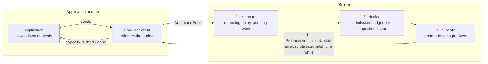
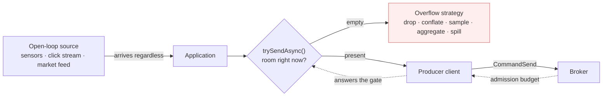
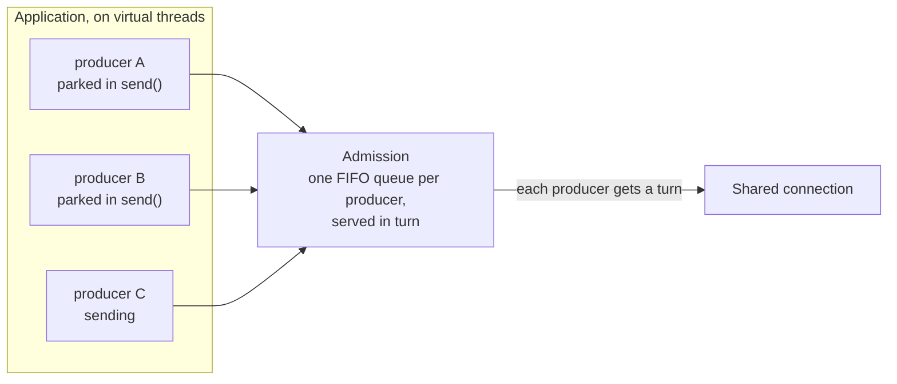

# PIP-495: End-to-end produce backpressure

# Background knowledge

Publishing to Pulsar crosses three boundaries, and each can be overrun independently:

1. **Application → producer client.** The application hands messages to a `Producer`; the client holds them until the broker acknowledges them.
2. **Producer client → broker.** The client writes `CommandSend` frames onto a TCP connection shared with the client's other producers and consumers; the broker holds them until they are persisted.
3. **Broker → storage.** The broker writes entries to BookKeeper and holds them until the write completes.

"Backpressure" here means: when a downstream boundary cannot keep up, the pressure is transmitted upstream so the upstream party slows down, rather than accumulating unbounded work in the middle.

## What exists today

**Between an application and its producer**, a producer has two behaviours, selected by `blockIfQueueFull`:

- `false` (the default, `ProducerConfigurationData:87`): a send that exceeds available capacity **fails** with `ProducerQueueIsFullError` / `MemoryBufferIsFullError`.
- `true`: the send **parks the calling thread** until capacity exists.

What bounds that capacity is easy to get wrong. `maxPendingMessages` defaults to **`0` — no message-count limit at all** (`ProducerConfigurationData:55`); `PulsarClientImpl:813-819` substitutes 1000 only for an application that left it unset on a client whose memory limit is disabled. So on stock defaults the client memory limit is the sole bound on a v4 producer's in-flight window. On V5 it is the sole bound on the *underlying* producers' accounting and does not bound the dispatch backlog in front of them at all — see *Motivation*.

That limit is `ClientBuilder.memoryLimit`, and it is documented as **a limit on direct memory** (`ClientBuilder:484-485`, default 64 MiB). It is charged in `ProducerImpl.canEnqueueRequest` in units of `uncompressedSize` — the uncompressed payload size, even when the buffer retained is the compressed one — plus, for a batching producer, the batch buffer's own allocation via `BatchMessageContainerImpl.updateAndReserveBatchAllocatedSize`. What no charge covers is the per-send heap bookkeeping.

**Inside the broker**, `ServerCnxThrottleTracker.ThrottleType` enumerates seven throttling conditions:

| Condition | Blast radius | Publish path? |
|---|---|---|
| `TopicPublishRate` | connection | yes |
| `ResourceGroupPublishRate` | connection | yes |
| `BrokerPublishRate` | connection | yes |
| `IOThreadMaxPendingPublishBytesExceeded` | **every connection on the IO thread** | yes |
| `ConnectionMaxPendingPublishRequestsExceeded` | connection | yes |
| `ConnectionOutboundBufferFull` | connection | indirect — channel writability |
| `ConnectionPauseReceivingCooldownRateLimit` | connection | all commands except `PING`/`PONG` |

The last two are gated on `pulsarChannelPauseReceivingRequestsIfUnwritable`, default `false` (`ServiceConfiguration:1076`), so neither fires on a stock broker. Which of the remaining five are enabled by default, and what that leaves, is the subject of *Motivation*.

**The only action any of them has** is `setAutoRead(false)` on the connection (`ServerCnxThrottleTracker:310`), applied on the transition into the throttled state and lifted only when every active condition has cleared. It stops the broker reading from the socket, so TCP backpressure builds toward the client; it does not close the connection, stop outbound writes, or affect requests already read.

## What has already been done

Much of this ground was surveyed in *[Apache Pulsar service level objectives and rate limiting](https://codingthestreams.com/pulsar/2023/11/22/pulsar-slos-and-rate-limiting.html)* (2023). Its rate-limiting programme has since shipped — the publish and dispatch limiters run on a lock-free token bucket, `org.apache.pulsar.broker.qos.AsyncTokenBucket`, and `ServerCnxThrottleTracker` tracks throttle conditions individually per `ThrottleType`, so one condition clearing cannot resume a connection another still holds. What it proposed and was never built is what this proposal develops: explicit per-producer flow control, by analogy with consumer permits. Per-producer connection isolation was proposed alongside it and remains separate work.

# Motivation

A Pulsar broker has two instruments for regulating how much is published to it: a rate an operator configured
before the traffic arrived, and `setAutoRead(false)`, which stops the broker reading from a TCP connection.
The first cannot change when conditions do. The second carries no information — a client cannot tell it from a
slow network — and it acts on a connection, which is not the scope of any condition that triggers it. Nothing
the broker measures about its own load reaches a producer, so a producer cannot publish less, and an
application never gets the chance to decide what to give up. The rest of this section is what follows from
that: clusters sized for peak rather than for load, throttling that lands on the wrong tenants, and a client
error model an ordered producer cannot recover from.

### The publish limits a stock broker applies are out-of-memory guards, not capacity management

Two of the five publish-path throttling conditions are enabled by default, and both are memory-occupancy
guards: a connection's pending publish requests (`maxPendingPublishRequestsPerConnection`, default 1000,
`ServiceConfiguration:889`), and pending publish bytes per IO thread — `maxMessagePublishBufferSizeInMB`,
whose default is the larger of 64 MiB and half the maximum direct memory (`:1917-1918`), divided by the IO
thread count (`ServerCnx:388-389`). Setting it to `-1` disables that bound entirely (`ServerCnx:308`).

The other three are rate limits, and all four settings behind them default to `0`, meaning off:
`maxPublishRatePerTopicInMessages`/`InBytes` (`ServiceConfiguration:1286`, `1293`) and
`brokerPublisherThrottlingMaxMessageRate`/`MaxByteRate` (`:1248`, `:1255`). So on a stock broker there is no
publish rate limiting, and what remains fires only once memory is already committed. Between "nothing is
wrong" and "half of direct memory is pending" a stock broker holds no opinion about how much it ought to be
admitting, and no way to express one. The only defence against a peak is to have bought enough hardware to
survive it.

### A configured rate is one number that has to be right for every state the cluster is ever in

Where an operator does set a rate, it is a constant. `PublishRateLimiterImpl.updateTokenBuckets` builds its
token buckets from the configured rate and from nothing else; `ResourceGroupPublishLimiter` does the same from
its resource group's. Resource groups look like the exception and are not:
`ResourceQuotaCalculatorImpl.computeLocalQuota` divides the **configured** total across brokers in proportion
to measured usage — a distribution loop over a number an operator supplied, not a discovery loop over what the
cluster can serve. Confluent's Kora reports the same distinction from the other side: it began with a static
even division of a tenant quota across brokers, which "worked reasonably well on lower subscribed clusters"
and, as clusters scaled, "proved increasingly ineffective … especially true for imbalanced workloads with hot
partitions which sometimes shift over time", because "each broker's quota share may end up being relatively
small, so imbalanced workloads may cause some brokers to throttle excessively, even when overall cluster usage
is below the tenant-wide quota" (§5.2.2). Pulsar's proportional redistribution is a better starting point than
Kora's original static split. It is still distribution of a number, not discovery of one.

That number then has to hold for every state the cluster is subsequently in: every workload mix, every message
size and batch shape, a bookie in recovery, a compaction running, a co-tenant arriving, a GC pause. Set it
near what a healthy cluster serves and it will not fire in a degraded one — the only state in which it was
needed. Set it at what a degraded cluster serves and the difference is hardware idle in every normal hour.
Two of the four knobs are per topic and two are broker-scoped, so topics each obediently under a
conservative per-topic limit can still overload a broker together unless the broker-scoped pair is also set.

Configured rates are not only capacity guesses — they are also ceilings a tenant has purchased, and the
project's own survey names the bet that makes them valuable: rate limiting "constrains tenant usage to
specified quotas, enabling accurate planning and **over-commitment of resources**." This proposal keeps them
for that purpose. What the bet lacks is any way to notice itself going wrong in time to respond
proportionately, which is the gap the same survey names while arguing against PIP-310 — custom limiters
"operate on a topic or namespace, ignoring cluster-wide resource usage and contention" — before calling for
"Pulsar cluster wide capacity management".

No utilisation figure is claimed here, because the project publishes none and one deployment's number would
prove nothing about another's. That is itself the point: with only a configured constant and an emergency
stop, the headroom a conservative constant leaves unused is not a quantity anyone can currently measure. This
proposal therefore ships the queueing-delay and budget metrics, enabled, one release before the controller
that acts on them (*Upgrade*), so the question is settled on each operator's own data.

### Spiky load on an already-loaded cluster, where the balancer does not arrive at all

The failure this proposal is really about is not a steady overload; it is a spike arriving at brokers whose
bookies are already busy. Nothing throttles until memory is committed, at which point the broker stops reading
from connections and publish latency rises for every tenant sharing them.

The load balancer is the mechanism that is supposed to relieve this, and three properties of its shipped
defaults mean it will not.

**Its load number contains nothing about storage.** With default weights — CPU 1.0, bandwidth in and out 1.0,
direct memory 0 — a broker's reported load reduces to `max(CPU%, NIC-in%, NIC-out%)` (`LocalBrokerData:259-265`,
`ServiceConfiguration:3224,3231,3281,3298`). No bookie latency, no pending-add depth, no journal state. **A
cluster whose bottleneck is BookKeeper is invisible to its own load balancer.**

**Its default trigger is relative, so a correlated spike does not fire it.** `ThresholdShedder` skips a broker
unless its smoothed usage reaches the cluster mean plus `loadBalancerBrokerThresholdShedderPercentage`,
default 10 points (`ThresholdShedder:79`). Raise every broker together and the mean rises with them, so
nothing is shed. `AvgShedder` (max–min score gap) and the extensible `TransferShedder` (load standard
deviation above 0.25) behave the same way. `AvgShedder` compares a max–min score gap, and `TransferShedder`
has an imbalance branch on load standard deviation above 0.25 alongside its underloaded- and
overloaded-broker branches. The one strategy that fires on a genuinely absolute signal is `OverloadShedder`, at
a raw 85% resource usage, and it is not the default; `UniformLoadShedder` is not an alternative here either,
since its tests are also relative — a max/min message-rate difference and a throughput ratio — and it has no
resource-usage gate at all. So for the case that matters most, the honest statement is not that shedding
reacts badly: **it does not react.**

**And when it is imbalanced enough to fire, it is slow and it pays in the resource that is already scarce.**
Its input is smoothed as `historyUsage * historyPercentage + (1 - historyPercentage) * resourceUsage`
(`ThresholdShedder:177`) with `loadBalancerHistoryResourcePercentage` defaulting to **0.9**, a half-life of
about 6.6 samples. A sample here is a **shedding pass**, not a load report: the average is advanced when the
shedder runs (`ThresholdShedder:69,152-177`), reusing whatever report it finds, and the shedder runs once a
minute. So the smoothed number a shedding decision is taken on has a half-life of roughly **six and a half
minutes**. Then unloading a bundle fences and closes each topic, fails its
managed ledger's in-flight adds with `ManagedLedgerAlreadyClosedException` (`ManagedLedgerImpl:1667`), persists
and closes every cursor, and on the destination performs a **recovering open of the last data ledger** and creates a new one. Not all
of that lands on BookKeeper — managed-ledger and cursor state can persist to the metadata store instead
(`ManagedCursorImpl:2932-2960`), and a recovered cursor may not need a ledger at all — but the recovering open
and the new ledger do, and they are spent on the bookie cluster that was the constraint. The classic shedding path also
has **no in-flight transfer accounting**: `preallocatedBundleData` is written only by `preallocateBundle`,
reached only from `selectBrokerForAssignment`, and a shed bundle's destination is carried instead through a
one-shot affinity map that `ModularLoadManagerWrapper.getLeastLoaded` consumes and returns before any
preallocation happens — so several bundles shed in one pass can be aimed at one broker on reports that reflect
none of them.

Two things this proposal must **not** claim. Shedding is not generally the cause of outages here: a producer
whose topic is fenced receives a `PersistenceError`, which routes into the reconnect path, and the client
resends its whole pending queue transparently. The failure is conditional — it happens when the stall outlives
what is left of `sendTimeoutMs`, and because that clock runs from the head message's creation, a message 25
seconds into a 30-second budget has five seconds, after which `failPendingMessages` fails the entire window.
And where the problem genuinely *is* placement imbalance, shedding is the right answer and this proposal does
not replace it.

What is missing is anything that acts on the timescale of the spike, on the resource that is actually
saturated. Rebalancing is a minutes-scale response to a placement problem, driven by a signal that cannot see
storage. The only party that can act in seconds is the producer, and today it is told nothing.

### When the estimate is wrong, the broker stops reading from the connection

Overload arrives anyway — from a limit set too high, from a limit never set, from a co-tenant, from a slow
bookie. Every condition in *Background* then ends in the same place: `setAutoRead(false)` on a connection
(`ServerCnxThrottleTracker:310`). That instrument has connection resolution, and its problems follow from
that.

**Its blast radius is a connection, and three of the five conditions are not.** `TopicPublishRate`,
`ResourceGroupPublishRate` and `BrokerPublishRate` describe a topic, a resource group and a broker; all three
are enforced by pausing reads on a connection. With `connectionsPerBroker = 1`, an application producing to
twenty topics on one broker through one client has all twenty share one connection, so one topic breaching its
publish rate pauses reading for the other nineteen and for every consumer of that client on that broker.
(`ConnectionPool` keys a connection by logical address, physical address and slot, so the sharing is per
broker, not per client.) A well-behaved tenant's latency
is decided by the worst-behaved topic it shares a connection with. This is
[#23403](https://github.com/apache/pulsar/issues/23403); [PIP-385](https://github.com/apache/pulsar/pull/23398)
documents the same problem. `IOThreadMaxPendingPublishBytesExceeded` is wider still, pausing reads on every
connection sharing the IO thread (`ServerCnx:305-312`).

**Pausing reads transmits no information.** The client observes latency and cannot distinguish throttling from
a slow network, a slow bookie, or a GC pause. Nothing the broker can do to a TCP connection changes that,
which is why this proposal adds a signal rather than a better way to stop bytes.

**And it cannot attribute cause, as its own metric demonstrates.** A per-topic publish-rate-limit counter
exists (`OpenTelemetryTopicStats:70`), fed by `ServerCnx.increasePublishLimitedTimesForTopics()`, which
iterates **every producer on the connection** and increments the counter on **every topic it finds** — culprit
and victims alike. The metric cannot tell them apart because the mechanism it reports on cannot either.

Read throttling is kept by this proposal, unchanged, as the involuntary backstop for clients that exceed a
budget they were given or never negotiated one (*Security Considerations*). What changes is that it stops
being the *first* thing that happens.

### The client's error model does not compose with ordered publishing

Start with what is *not* wrong, because the draft of this proposal previously got it wrong. Both admission
failures are delivered **synchronously, on the calling thread, before `sendAsync` returns**: `ProducerImpl:576`
calls `canEnqueueRequest`, which completes the callback in place (`:1132-1143`), which completes the returned
future exceptionally (`:490`) before `internalSendAsync` hands it back (`:419-420`). A refused message never
reaches `pendingMessages` and never consumes a sequence id. This holds on V5 too in the steady state, where
`thenApply` on an already-complete chain head runs inline on the caller (`ScalableTopicProducer:374-379`).

So strict ordering is achievable today, by two patterns that both give up the asynchronous model. A
single-threaded loop that inspects each returned future *before* issuing the next send never advances past a
refusal — that is `sendAsync` used synchronously. And `send()` **with `blockIfQueueFull(true)`** never refuses,
because that is the only configuration in which admission waits rather than fails; it parks the calling
thread, which is how an application deadlocks a client IO thread
([#26344](https://github.com/apache/pulsar/issues/26344)). Note the qualification: on the default
`blockIfQueueFull(false)`, blocking `send()` is `sendAsync()` followed by `get()`
(`TypedMessageBuilderImpl:105-120`), so it fails on admission exactly as the asynchronous form does. "Use the
blocking API" is not by itself an answer to this.

**The defect is that the API invites the shape in which the check comes too late, and never says the check is
load-bearing.** The natural asynchronous loop collects futures, or attaches a handler, and moves on:

```java
for (Record r : source) {
    futures.add(producer.newMessage().value(r).sendAsync());   // message 5 is refused here
}
```

Message 5 is refused because the client memory limit is momentarily full. Message 6 is offered a moment later,
by which time a broker receipt has arrived on the connection's event loop and released capacity
(`ProducerImpl:1388-1389` → `:1443`), so 6 is accepted and published. The refusal was synchronous; the *release*
that made 6 succeed was not, and that asymmetry is enough. The topic now holds 1–4, 6, and the application has
two ways to try to fix it:

- **Resend 5 without an explicit sequence id.** `updateMessageMetadataSequenceId` assigns a fresh, higher one,
  so 5 is published after 6. Order is broken, silently.
- **Resend 5 with its original sequence id** — what an application publishing an ordered, deduplicated stream
  actually does. On a topic with deduplication enabled, `MessageDeduplication.isDuplicateNormal` finds
  `sequenceId <= lastSequenceIdPersisted` and returns `Dup` (`MessageDeduplication:500`), and `PersistentTopic`
  **acknowledges it without persisting it**: `publishContext.completed(null, -1, -1)`, commented "Immediately
  acknowledge duplicated message" (`PersistentTopic:704`). The client logs a warning and completes the send
  future **successfully**, with a message id whose ledger and entry are both `-1`
  (`ClientCnx:857-867`, `:877-878` → `ProducerImpl:1407,1423,496`). The application is told its retry
  succeeded. The message is not in the topic.

Silent reordering or silent loss, and the application cannot tell which it got without comparing message ids
it has no reason to inspect.

**Not every mid-stream failure is equally unrecoverable, and the distinction identifies the fix.** A failure
that takes down the *whole* in-flight window — a send timeout through `failPendingMessages`
(`ProducerImpl:2380-2425`), a close, a terminate — fails the outstanding operations in FIFO order and admits none
behind them. That does **not** mean those messages were not published: `failPendingMessages` fails and releases
local operations, it does not retract commands already written, so a message whose receipt was merely late may
well be in the topic. What a whole-window failure gives an application is a *contiguous* set of unresolved
outcomes with a defined boundary, which stable sequence ids and broker deduplication can turn into a safe
replay. It is recoverable in the sense that a protocol for recovering exists.

One error is worth naming because it looks like a whole-window failure and is not. A broker
`PersistenceError` takes `ClientCnx.handleSendError`'s default branch and closes the connection
(`ClientCnx:1208-1220`), after which the producer reconnects and **retransmits its pending queue** — the
application's sends are not failed at all. Retransmission, not failure, is the ordinary response to a
persistence problem, which is why deduplication exists.

The failures with no such protocol are the ones that resolve **exactly one message as failed and keep
publishing the rest**. An admission refusal is one. A per-message validation failure is the other: an
incompatible schema removes the offending operation and continues with its successors
(`ProducerImpl:2692-2740`), and the behaviour that pauses instead is enabled only for replication producers
(`:215`). A gap of this kind is unrecoverable precisely because the client kept going, and because the retry
is then either reordered or, under deduplication, silently discarded.

That gives the rule the client API needs. **A gap that the application can be prevented from creating is worth
more than any protocol for repairing one.** Admission is the one such gap the client can simply decline to
open, because unlike a schema mismatch it has no per-message cause: capacity returns. Blocking `send()` with
`blockIfQueueFull(true)` is correct today for exactly that reason, not because parking is desirable.
It follows that an API which *may* refuse is safe only for a source whose answer to refusal is to **drop** —
where the gap is deliberate and the application knows exactly which records it gave up — and that an API which
must preserve order must **accept the message and separately tell the application to stop**. Those are two
different contracts, and *Detailed Design* gives them two different methods.

### The client's memory limit is shared by every producer and allocated to none

`ClientBuilder.memoryLimit` is one `MemoryLimitController` on the client (`PulsarClientImpl:354`), and every
producer draws on it through the same counter. There is no per-producer or per-topic sub-allocation of it.
Charge is taken at admission and released **on acknowledgement from the broker**, not on transmission:
`ackReceived` removes the operation and calls `releaseSemaphoreForSendOp` (`ProducerImpl:1388-1389`, `:1443`).

So the share of the budget a producer holds is proportional to its own round-trip time, and a producer whose
broker is slow or whose connection has dropped keeps its charge for as long as it stays slow — a disconnected
producer is still permitted to enqueue (`ProducerImpl:1098`), so it can go on taking budget it will not
return soon. One stalled destination can therefore occupy most of the client's memory and make every other
producer, on healthy brokers, fail with `MemoryBufferIsFullError` or park.

The predecessor did not have this failure, and the distinction is narrower than it first looks.
`maxPendingMessages` builds a semaphore per `ProducerImpl` — per producer object, per topic partition
(`ProducerImpl:216-220`) — so exhausting one producer's window left every other producer's intact. It was not
removed: it is un-deprecated, still honoured, and still ANDed with the memory limit inside `canEnqueueRequest`.
What changed is the default. PIP-120 (commit `11bfc0e95dc`, #13344) enabled the memory limit and set both
message-count defaults to `0`, for a good reason: a message count is not a memory bound, and it forces an
operator to guess a number per producer on a client that may open hundreds.

That trade should not be reverted, and this proposal does not propose reverting it. What the default change
gave up — accidentally, since a message count was never intended as an isolation mechanism — is **isolation
between producers**, and a single shared byte counter provides none at all. Restoring isolation without
restoring the guessing is the goal.

Three distinctions matter for the fix, and the draft of this proposal previously got all three wrong.

- **Fair access to admission is not a fair share of retained memory.** A round-robin that gives every producer
  an equal turn still lets the producer with the slowest acknowledgements accumulate far more retained bytes
  than its neighbours, because a turn schedules the next reservation while retention is about how long the
  last one is held.
- **A floor is not capacity.** If one producer borrowed 90 MiB of a 100 MiB budget while its neighbours were
  idle, declaring a 50 MiB floor each when a neighbour wakes does not produce the missing 40 MiB — and if the
  borrower is disconnected, the loan is not reclaimable at all. An allocator that promises an immediately
  usable share has to hold capacity back, not derive it retrospectively.
- **The starvation in `MemoryLimitController` is by arrival order, not by size.** Its gate tests
  `current > memoryLimit` and never `current + size > memoryLimit`, so the requested size plays no part and one
  request of any size may cross the limit. What starves a waiter is that `reserveMemory` calls
  `tryReserveMemory` *before* acquiring the mutex, and the non-blocking path calls it directly, so freed
  capacity goes to whoever asks next rather than to whoever has waited longest — against an unfair
  `ReentrantLock` woken by `signalAll()`. A parked waiter of any size can be overtaken indefinitely.

### Heap retention is neither bounded nor accounted

`memoryLimit` is documented as a limit on direct memory (`ClientBuilder:484`). What it charges is the
uncompressed payload plus, for batching producers, the batch buffer's allocation
(`BatchMessageContainerImpl.updateAndReserveBatchAllocatedSize`). What nothing charges is the heap a pending
send retains — the futures, callbacks, metadata and dispatch state per message — so a producer of small
messages exhausts heap long before it approaches its direct-memory limit.

The evidence is a heap dump from a production client that died this way, and it is offered as a measurement
from one incident rather than as something a reader can re-derive from the source: the limiter read
**92,335,360 of 209,715,200 bytes — 44% of its configured budget — when a 2 GiB heap was exhausted**, with
1,285,311 sends outstanding and **not one message acknowledged**. Even had every outstanding send been charged, the total would have been 164 MiB
against a 200 MiB limit. The direct-memory limit could not have engaged, because direct memory was never the
resource running out.

### On the V5 client nothing bounds what the application hands over

`ScalableTopicProducer.sendInternalAsync` records a future and appends the send to a per-segment dispatch
chain, then returns. The chain advances after invoking the underlying producer's `sendAsync` without waiting
for its acknowledgement, so a caller that does not await the returned futures is not slowed while the chain is
behind, and the retained dispatch state — the futures, the queued closures, the `inFlightSends` bookkeeping —
is charged against nothing.

The underlying producer's memory limit does engage; what it does not bound is the backlog in front of it. Nor
is there a message-count bound to fall back on: `ProducerBuilderV5` never sets `maxPendingMessages`, so the
semaphore is never constructed (`ProducerImpl:216`), and V5 segment creation bypasses the builder step that
would otherwise substitute 1,000 when the memory limit is disabled (`ProducerBuilderImpl:123`,
`PulsarClientImpl:904-915`). A V5 client with the memory limit turned off has no bound of any kind between the application and the wire.

Neither outcome of the underlying limit is usable backpressure. With the default `blockIfQueueFull(false)`,
the failure surfaces on the returned future — inline on the caller while the segment chain head is already
complete, and on some other thread while a segment producer is still being created, so an application cannot
even rely on the synchronous behaviour v4 happens to have. With `blockIfQueueFull(true)` it is worse: when the predecessor is
already complete, the dispatch runs inline on the calling thread **while `dispatchLock` is held**, so the
caller parks holding a lock every other sender on that producer needs. That is
[#26344](https://github.com/apache/pulsar/issues/26344); the absence of application-facing backpressure on V5 is
[#26470](https://github.com/apache/pulsar/issues/26470).

## Goals

### In Scope

- **An application-visible admission signal that does not break ordering.** A way for an application to learn
  that it should stop, which does not require the client to refuse a message it was asked to send — and a
  separate, explicitly refusing call for sources whose answer to congestion is to drop. *Motivation* shows why
  these have to be two contracts and not one.
- **A broker-side admission budget derived from measurement**, not from a rate an operator configured in
  advance, so that a cluster can be run closer to its capacity than peak provisioning requires.
- **An explicit per-producer budget on the wire**, absolute and idempotent, so every client language can
  enforce it and no client has to infer it from timing.
- **Proportional shedding**: when the budget falls, each publishing producer's share falls by roughly the same
  fraction.
- **Client-side adaptation that reduces the load rather than merely rationing it.** A budget denominated in
  batches lets a client answer pressure by forming fewer, larger entries — spending latency the application
  has declared it can spare, to reduce the per-entry work the broker and the bookies actually pay.
- **A blocking publishing mode that can batch.** Today a blocking `send()` force-closes the batch after every
  message, so a single-threaded ordered publisher emits one entry per message and pays a broker round trip for
  each. A staged blocking mode gives that publisher the batching the asynchronous API already has, and gives
  it per-message outcomes, which `flush()` cannot report.
- **Per-producer isolation of the client's memory budget.** One shared counter with no sub-allocation lets a
  single stalled producer hold most of it until its own broker acknowledges. The goal is isolation between
  producers without reintroducing a per-producer message count for an operator to guess.
- **A bounded, accounted heap budget** for pending sends, without redefining `memoryLimit`.
- **Separating the three deadlines that `sendTimeoutMs` conflates**, so that each can be kept: the wait for
  **admission**, which today has no bound at all and on whose expiry nothing has been published; the
  **delivery** deadline for a message already transmitted, which is what `sendTimeoutMs` should mean; and the
  client's own **transport watchdog**, which detects a connection making no progress. Today one 30-second
  number stands for all three, and expiring fails the entire in-flight window.

**What this costs, stated up front.** It adds a broker-to-client command and its negotiation, which every
client eventually has to implement, and it puts a feedback controller on the publish path, with the tuning and
instability risk any controller carries. It also adds application-facing API to interfaces the project cannot
later remove methods from.

### Out of Scope

- **Consumer-side flow control.** `CommandFlow` permits already exist for dispatch and are unchanged.
- **Tenant entitlement.** Three things travel under the word "fairness" here and only two are delivered.
  *Proportionality* — every producer's share falls by roughly the same fraction — and *isolation* — a
  badly-behaved producer cannot durably deny service to a well-behaved one — are delivered. *Entitlement* — a
  tenant is due some share regardless of what it has been using — is not, because it requires choosing an
  allocation identity, and that is a behaviour contract the project cannot change once it ships.
- **Replacing the configured rate limiters.** `PublishRateLimiterImpl` and `ResourceGroupPublishLimiter` remain as configured ceilings; the adaptive budget is a second constraint below them, never above.
- **Topic-granular placement and the load balancer.** The measurements added here are what a placement decision would need, but changing how topics are assigned to brokers is separate work.
- **A per-producer connection-isolation API**, tracked as [#23403](https://github.com/apache/pulsar/issues/23403) and independently shippable.
- **Ports of the client API to C++, Go, Python and Node.** The wire signal is language-neutral and those clients can enforce it; exposing it to applications is additive per client.

# High Level Design

**One organising idea: close the loop.** Today the broker knows it is overloaded and the application
never finds out. Every mechanism in *Background* ends at the socket — `setAutoRead(false)` stops bytes
and says nothing — so the application learns about congestion as latency, and eventually as a timeout.
An application cannot adapt to a signal it never receives, so the only way to survive peak load is to
buy enough brokers that peak never arrives. That is the overprovisioning this proposal is trying to
remove.

The loop has four parts, and the proposal is the whole loop rather than any one of them:



1. **Measure.** The broker measures how congested it actually is, per congestion scope, from queueing delay
   and outstanding work — not from a rate an operator guessed at in advance. For a topic, the scope that
   matters is its managed ledger and the bookies in that ledger's current ensemble.
2. **Decide.** A controller per scope turns that measurement into an admission budget, raising it while
   there is headroom and cutting it in proportion to how far over it is.
3. **Allocate.** The budget is divided among the producers actually publishing, in proportion to what
   each is already admitted to send.
4. **Tell the client, and let the client tell the application.** The share travels as an explicit, absolute
   number the producer may publish at. The client enforces it and surfaces it to the application — which is
   the part that makes the loop end-to-end, and the part that has to be designed so that acting on it does
   not itself break message ordering.

**Budgets act before read throttling is needed; read throttling stays as the last resort.** A configured rate
limit answers demand it cannot serve by pausing reads on a connection. A budget answers it by telling the
producer what it may have, which the application can respond to while it still has choices: a source that can
be slowed is slowed, and a source that cannot is sampled, conflated or dropped by the party that knows which
of its messages matter. Nothing here is voluntary at the bottom, though. Configured rate limits remain
ceilings, the existing occupancy guards keep protecting the broker regardless of client cooperation, and a
client that exceeds its budget — or never negotiated one — exhausts a bounded allowance and then has reads
paused on its connection exactly as today. The budget changes what happens *first*, and gives the application
a decision it can make in advance; it does not remove the involuntary instrument behind it.

# Detailed Design

## Design & Implementation Details

### What an application can do about backpressure depends on its source

The property that decides which API an application needs is **whether backpressure can reach its
origin** — whether the loop is closed or open. The reactive lineage calls these *cold* and *hot*
sources, and those names are useful shorthand as long as their ambiguity is acknowledged: "hot" is also
used to mean multicast, and the two senses usually travel together but are not the same claim.

**When the loop can be closed, backpressure is lossless.** A file, a database cursor, a topic being
replayed: if the application stops pulling, the source waits. Demand propagates all the way back, and
nothing has to be discarded — the data is produced later instead.


**When it cannot, backpressure is lossy, and the application must choose how.** Sensor readings, clock
ticks, UDP market data, an inbound connection someone else owns: the data arrives whether or not there
is room. "Slow down" is not actionable, because there is no dial. What the application can do is decide
*what to give up* — and the established strategies are all it has: bounded buffering, spilling,
dropping oldest or newest, **conflation** (latest-wins, per key), sampling or pre-aggregation, or
failing fast. Only the application knows which is right for its data.



This is also what a broker is *for*: **a durable log converts an open-loop source into a closed-loop
one.** The topic absorbs the producer's pace, and a consumer with its own cursor reads at whatever rate
it likes and can replay. Consumers already get the closed-loop side, through permits and cursors. This
proposal is about giving producers the same standing — and about being honest that when the log itself
cannot keep up, the conversion has a limit, and the application is the only party that can decide what
happens at it.

**Blocking is the third shape, and virtual threads make it a good one again.** An application whose
calling thread may wait should be able to write the obvious loop. Blocking is the closed-loop model with
the demand signal hidden inside the call; `SubmissionPublisher.submit` and `offer` are the same two
modes side by side in the JDK.



### The application boundary

*Motivation* established the rule this section implements: **ordering survives exactly when the client does
not refuse a message it was asked to send and then accept its successor.** That splits the application-facing
surface in two, by what the application does when there is no capacity.

- A source whose answer is to **drop** wants a call that refuses. The gap is deliberate, the application knows
  which records it gave up, and nothing needs to be replayed.
- A source that must **keep order** wants a call that never refuses. It accepts the message and separately
  says "stop after this one", so there is no gap to repair.

Those are `trySendAsync()` and `submitAsync()`. An application uses one or the other for a given stream; the
mistake the API has to prevent is reaching for the refusing one and then retrying the refusal.

```java
public interface TypedMessageBuilder<T> extends Serializable {

    /**
     * Send only if the producer can admit this message now. An empty result means, and only
     * means, "no capacity at this instant": nothing was enqueued and no sequence id was
     * consumed. Every other outcome returns a present future that behaves as sendAsync().
     *
     * <p>Safe for a source that responds to an empty result by dropping, sampling or
     * conflating. Retrying an empty result on a stream that must stay ordered is a defect:
     * the next message may already have been published. Use submitAsync() instead.
     */
    default Optional<CompletableFuture<MessageId>> trySendAsync() { … }

    /**
     * Accept this message and report whether the producer wants the caller to stop.
     * Never refuses for lack of capacity, so it never opens a gap in an ordered stream.
     *
     * <p>The returned submission always carries the acknowledgement future. It carries a
     * whenSendable() future only when the producer has run out of budget with this message;
     * the caller must await that future before submitting again.
     */
    default SendSubmission submitAsync() { … }
}

/** The outcome of submitAsync(): what happened to this message, and whether to continue. */
public interface SendSubmission {

    /** Completes with the message id once persisted, or fails. Acceptance is not delivery. */
    CompletableFuture<MessageId> messageId();

    /**
     * Empty means the producer will accept another message now. Present means it will not:
     * await this future before the next submitAsync() on this producer. Its presence is
     * fixed when the submission is returned; the future may already be complete.
     */
    Optional<CompletableFuture<Void>> whenSendable();
}
```

**Why it can promise never to refuse: a reserved submission slot per producer.** A budget cannot be enforced
by a call that always accepts unless the accepting call is also the one that closes the gate. An
admission-capable producer therefore holds a reservation outside the capacity available to ordinary
admission; ordinary sends draw on the rest. When a submission finds the ordinary budget exhausted it takes the
reservation, and the same atomic step that installs the message closes the gate and populates
`whenSendable()`.

**What the reservation has to cover is a whole message, not one permit**, and that is the first place a naive
version of this breaks. A chunked message is not one message to the admission path: the non-blocking path
pre-acquires `totalChunks - 1` further permits before transmitting anything (`ProducerImpl:656-664`), and a
batching producer's container allocates and grows a buffer of its own. So the reservation is defined against a
declared **submission envelope** — a maximum logical-message size the producer advertises at creation — and
covers the pending-message positions, the accounted bytes and the retained heap that a message within that
envelope can require, chunks included. A message larger than the envelope is not a capacity refusal; it is a
validation failure, reported as one, exactly as an over-large message is today.

Three consequences follow, and none of them is optional:

- **The gate reopens on the reservation, not on ordinary capacity.** It is not enough for another producer to
  free bytes: the producer must have restored a reservation sufficient for the next submission, atomically.
  Otherwise a producer that obeyed the contract can be woken by a neighbour's release, find that neighbour has
  taken the capacity again, and have neither ordinary capacity nor an unused reservation.
- **The reservation is held for the producer's lifetime, including while idle.** Releasing it on idleness and
  re-acquiring it on wake-up would reintroduce precisely the unfunded-admission race it exists to prevent.
  A disconnected producer keeps it too, since its charge is not released until acknowledgement or terminal
  cleanup.
- **Therefore the number of admission-capable producers on a client is bounded**, and the bound is
  `budget / envelope`. This is a real limit and the proposal states it rather than discovering it in
  production: a client that opens ten thousand producers cannot fund ten thousand envelopes out of a 64 MiB
  default budget. It does not need to. `submitAsync()` exists for a producer publishing **one ordered stream**,
  and a client with ten thousand producers is fanning out, not publishing one ordered stream; that shape is
  served by `trySendAsync()` and `sendAsync()`, neither of which reserves anything. Producer creation fails
  when a reservation cannot be funded, so the limit is discovered at creation and not at the first message.

Within the envelope, that bounds the overshoot exactly: **at most one message per admission-capable producer
beyond the ordinary budget.** It is the same shape as a Netty write-buffer high watermark, where a write past
the mark is still queued and writability goes false — with one deliberate departure. Netty and Vert.x let a
writer keep writing indefinitely after the mark; here the second `submitAsync()` while a `whenSendable()` is
outstanding throws `SendNotReadyException` **synchronously, and before the builder is consumed** — this is a
check on producer state, not on capacity, so unlike an admission decision it does not need the message's size
and can be taken before any serialisation work. Ignoring the signal is a programming error, and reporting it
through the returned future would recreate the late-discovery problem this API exists to remove.

**`submitAsync()` requires one serialised submission coordinator per producer — which is not the same as one
thread.** A coordinator may hop executors between messages, and a single producer may carry several
independently ordered streams as long as something serialises their submissions. What the contract forbids is
two coordinators racing, which has no meaning for an ordered stream anyway. Integrations have to respect this
rather than being exempt from it: a Reactive Streams adapter that has already requested several items when the
gate closes must hold them in its own bounded queue, because rule 2.13 does not permit an exception to escape
`onNext`. That is an integration requirement, not an argument against the contract — the alternative, a
rejection reported through the returned future, would make a non-accepted message structurally
indistinguishable from an accepted one whose delivery failed, which is the failure this API exists to remove.

**`Producer.whenSendable()` survives, but only for one job.** A producer-level readiness signal is largely
subsumed by the submission, and in the post-send case it is worse than subsumed — it is dangerous, because
between its completion and the send another producer sharing the client's budget can take the capacity. What
it is still needed for is the *pre-pull* case: a closed-loop application should be able to learn that it can publish
**before** it fetches the next record from its source, opens a cursor, or asks its upstream for another item.
Deleting it would force an application to acquire a message in order to find out that it should not have. So
it stays, narrowed to that, and it is honest about what it is not:

```java
public interface Producer<T> extends Closeable {
    /**
     * Advisory: completes when this producer has ordinary admission capacity, so a caller can
     * decide whether to acquire the next message. Not a reservation — another producer sharing
     * the client's budget may take the capacity first. submitAsync() is what actually admits,
     * and it holds a reserved slot precisely so that a race here cannot cost you the message.
     */
    default CompletableFuture<Void> whenSendable() { … }
}
```

The reserved slot is what makes this composition safe: the advisory can be wrong about capacity without
costing the application the message it fetched on the strength of it.

**The three modes.**

| Source | What the application does | On congestion |
|---|---|---|
| Ordered, can be slowed | `whenSendable()` to decide whether to pull; `submitAsync()` to publish; await `whenSendable()` when present | Slows; nothing is lost, nothing reordered |
| Can be dropped | `trySendAsync()`, and on empty apply its overflow strategy | Loses deliberately, by the application's own rule |
| Blocking | `send()`, or `stage()` + `collect()` when batching matters | Waits, bounded by `maxSendBlockTime` |

```java
// Drop: 200k spans/s from a source that cannot be slowed. Shed, never reorder, never time out.
void onSpan(Span span) {
    var sent = producer.newMessage().value(span).trySendAsync();
    if (sent.isEmpty()) { dropped.increment(); return; }   // the shed decision
    sent.get().exceptionally(e -> { failed.increment(); return null; });
}
```

```java
// Ordered: publish until told to stop, then resume when told it may.
void pump() {
    while (true) {
        var submission = producer.newMessage().value(source.next()).submitAsync();
        submission.messageId().exceptionally(this::onSendFailed);

        var pause = submission.whenSendable();
        if (pause.isPresent()) {                  // out of budget; this message was still accepted
            pause.get().thenRunAsync(this::pump, appExecutor);
            return;
        }
    }
}
```

That example is the whole argument in ten lines. `source.next()` is consumed unconditionally, because
`submitAsync()` cannot have refused it for want of capacity — there is no state in which the application is
left holding a record the client would not take and has to decide where to put. Consuming is not the same as
*committing*, and the example is deliberately silent about the source's checkpoint: acceptance is not delivery,
so an application that must not lose data still advances its durable read position on `messageId()`, not here.
What this removes is the need for a second, different recovery path for the case where the client simply had
no room. The loop is tight while there is budget and costs
one executor hop when there is not, instead of one per message. And the only place `Producer.whenSendable()`
is needed is *before* the first iteration, or after a long idle period, where the application would otherwise
have to pull a record from its source in order to discover that it should not have.

### Blocking publishing that can batch

The blocking API has a defect that is independent of everything above, and it is worth stating exactly,
because the usual description of it is wrong. Blocking `send()` does **not** wait out
`batchingMaxPublishDelayMicros`. It force-closes the batch: `TypedMessageBuilderImpl.send()` calls
`producer.triggerFlush()` whenever the returned future is not already complete (`:110-114`), which runs
`batchMessageAndSend` on the shared container (`ProducerImpl:2460-2466`), and
`BatchMessageContainerImpl.createOpSendMsg` then takes its `messages.size() == 1` branch (`:296`) and emits a
plain, un-batched entry.

So a single-threaded blocking publisher — which is what an ordered publisher is — produces **one entry per
message and pays a broker round trip for each**, for ordinary non-chunked sends to a persistent topic. It is
round-trip-bound, not clock-bound. Two qualifications keep this honest: with M concurrent blocking senders, batches of up to M do
form, because one thread's `triggerFlush` sweeps up what the others have already enqueued — so batching is
uncontrollable rather than impossible; and a blocking caller can already batch today by issuing N
`sendAsync()` calls and then `flush()`. What that pattern cannot do is tell the caller **which** message
failed.

`flush()` cannot be extended to tell it, and the reason is not only that the name is taken. Its v4
implementation closes the batch and then returns a future derived solely from `lastSendFuture`, wrapped so
that it reports that one future's exception **at most once** (`ProducerImpl:2445-2457`, `:1225-1232`). It
observes one message and forgets its failure after one caller. The V5 async view's `flush()` has a third
semantics again — it waits on a snapshot of caller-visible futures without forcing the batch closed
(`ScalableTopicProducer:432-434`). A results-returning `flush()` would contradict both.

The new operation is therefore separate: stage a message without waiting for it, then collect the outcomes.

```java
public interface TypedMessageBuilder<T> extends Serializable {
    /**
     * Stage this message for batched transmission and return once it has been accepted,
     * without waiting for the broker. Returns an index identifying it in the list collect()
     * will return. Blocks while admission is unavailable, bounded by maxSendBlockTime;
     * throws if maxStagedMessages outcomes are already awaiting collection.
     */
    default long stage() throws PulsarClientException { … }
}

public interface Producer<T> extends Closeable {
    /**
     * Close the current batch, wait for every staged message to reach a terminal outcome, and
     * return them in staging order. Does not stop at the first failure.
     */
    default List<SendOutcome> collect() throws PulsarClientException { … }
}

public interface SendOutcome {
    long index();                      // as returned by stage(), so the caller can map back to its source record
    Optional<MessageId> messageId();   // present iff acknowledged
    Optional<Throwable> error();
    PublicationStatus status();        // ACKNOWLEDGED, NOT_PUBLISHED, or UNKNOWN
}
```

`stage()` is a terminal operation on the builder, like `send()` and `submitAsync()`, so the staged mode reads
the same way as every other publishing mode:

```java
// Blocking, batched, ordered. Collect at least every maxStagedMessages.
for (var batch : source.batches()) {
    for (var record : batch) {
        producer.newMessage().value(record).stage();
    }
    for (var outcome : producer.collect()) {
        if (outcome.status() != ACKNOWLEDGED) { recover(outcome); }
    }
}
```

**Whether `stage()` blocks or throws is not a preference; each bound admits only one answer.** There are two
different bounds and they behave oppositely:

- **Outstanding sends** are bounded by admission. `stage()` **blocks** here, because what releases admission —
  an acknowledgement, a terminal failure, a batch flush — happens on the client's own threads whether or not
  the caller ever calls `collect()`. Waiting can make progress, so waiting is correct.
- **Uncollected outcomes** are bounded by `maxStagedMessages`. `stage()` **throws** here, because the only
  thing that can drain that buffer is the caller's own `collect()`. Waiting cannot make progress, so waiting
  would deadlock the one thread able to release it.

That is what makes "you must collect every N messages" a contract rather than a convention: the client can
detect the omission and say so, at the point where it happened.

**"Waiting can make progress" is a conditional, and the conditions are load-bearing.** It is false if nothing
will ever resolve the outstanding sends, and that state is reachable today: a connection that is down, a
`sendTimeoutMs` of `0`, and `maxSendBlockTime` at its unbounded default leave `stage()` waiting with no
acknowledgement coming and no timeout task installed (`ProducerImpl:281`). Two rules close it. A staged
producer must have a **finite admission deadline** — `maxSendBlockTime` is not optional for `stage()`, and a
producer configured for staging with neither it nor a send timeout is rejected at creation rather than
allowed to wedge. And a staged batch must retain an **autonomous flush**: today's batch timer is scheduled
independently of any application call (`ProducerImpl:2469-2481`), and an implementation that instead held a
batch until `collect()` would introduce exactly the caller-dependent deadlock this design is arguing against.
`collect()` needs the same treatment — it takes an optional deadline, and on expiry returns the outcomes it
has with the rest marked `UNKNOWN` rather than waiting forever.

**Ordering across a failure is the point of collecting in order.** On the first failure the buffer stops
accepting new staged messages. Messages already accepted run to their terminal outcomes and appear in the
returned list, so the application can see exactly where the break is and what happened after it.

That transition is between threads — failures are recorded on an IO thread while `stage()` runs on the
caller's — so it has to be specified rather than assumed. **Recording the first failure and accepting a staged
message are serialised by the same state machine**: a `stage()` that is waiting for admission is woken when a
failure is recorded and re-checks that state as part of committing acceptance, not on entry. A check at method
entry, or a separately visible failure flag, would let a message be accepted after the failure it was supposed
to stop at. Outcome capacity is reserved at acceptance, including for sends that have not completed, so a
staged message can always be reported. The list must
not pretend the suffix was never executed — it was — which is why `status()` distinguishes `NOT_PUBLISHED`,
usable only where the client can prove the message never reached the broker, from `UNKNOWN`, which is what a
timeout or a lost acknowledgement produces. An application that needs an all-or-nothing unit wraps the unit in
a transaction and commits after collecting; that is what transactions are for, and this API does not
approximate them.

This shape is JDBC's `addBatch`/`executeBatch` — index-correlated outcomes for a staged group — with the one
place JDBC is wrong for us corrected: JDBC lets a driver choose whether to continue after a failure, and here
the successors have already been transmitted, so the outcome list has to say what became of them rather than
leave it implementation-defined.

### What the client bounds

**A rate and a window compose by conjunction.** The budget the broker sends is a rate with a burst
allowance — a token bucket. Every bound the client already has is a *window*: bytes outstanding
(`memoryLimit`), messages outstanding (`maxPendingMessages`), heap retained (`pendingSendHeapLimit`). A
send is admitted only if it fits **all** of them, so `trySendAsync()` refuses when the token bucket is empty
*or* any window is full, `submitAsync()` returns a present `whenSendable()` in the same condition, and that
future completes when the binding constraint relents. The application is not told which one was binding: the
refusal is a plain empty `Optional` and the signal a plain `CompletableFuture<Void>`, because the reason is
operational rather than something an application should branch on. It is reported to operators instead, as an
attribute on `pulsar.client.producer.send.refused` — which is what separates "the broker cut my budget" from
"my own heap limit is full".

**The reserved slot is a window too, and it is deliberately outside the others.** `submitAsync()` can promise
never to refuse only because one pending-message position and one maximum-sized payload's worth of bytes are
held back from ordinary admission at producer creation. Every configured window is therefore effectively
`configured − reserved` for ordinary sends, and an implementation must size the client's budgets so that a
producer's reservation is available before it reports itself created. A producer that cannot fund its
reservation fails at creation rather than at its first message.

**A heap budget, not a redefinition.** `ClientBuilder.memoryLimit` is documented as a limit on direct
memory, so charging retained heap against it would silently change the resource being limited.
`pendingSendHeapLimit` is a separate, explicitly named budget for what pending sends retain on the heap, and
admission folds it in with the others. It is the bound that matters most on the V5 client, whose dispatch
chain retains futures and queued closures that no existing charge covers at all.

**Two different problems share the word "fair" here, and they need different mechanisms.** *Motivation* set
them apart: scheduling **who admits next** is not the same as bounding **how much each producer may still be
holding**. A round-robin turn does nothing about a producer whose acknowledgements are slow, because a turn
governs the next reservation while retention governs how long the last one is kept.

**Scheduling: admission is per producer and served in turn.** `connectionsPerBroker` defaults to 1, so a
client's producers share a connection, and capacity handed out in arrival order lets one busy producer hold
every neighbour behind it. Waiters are held in one FIFO queue **per producer** — FIFO within a producer
because Pulsar requires per-producer send order anyway — and those queues are served round-robin with a byte
quantum. This is the two-level shape HTTP/2 uses for its connection and stream windows, and one rule makes it
a liveness guarantee rather than a heuristic: the arbiter services *producers, not waiters*, so a producer
with a thousand parked callers gets one producer's share and not a thousand. It also fixes today's
arrival-order barging, because a parked waiter holds a position rather than re-racing whoever asks next.

**Allocation: retained bytes are capped per account, with borrowing.** The client's memory budget — direct and
heap alike — is divided by a demand-aware max-min rule rather than by usage share. Each account competing for
capacity gets an equal share of the budget less a reserve; unused shares are lent to accounts that have
demand; and a lent share comes back as the borrower's own sends complete. Two properties are what the
proportional rule used on the broker cannot give here. It does not entrench an incumbent, which matters
because the client's problem is precisely that one stalled producer took most of the budget while its
neighbours were idle. And the client can act on a new ceiling without waiting for a network round trip,
because it sees every charge and release locally.

Three definitions have to be pinned down or this is not implementable, and the draft previously left all three
open.

- **An account is a logical topic**, so that partition producers and V5 segment producers inherit one share
  rather than each opening a top-level one — otherwise a client enlarges its own entitlement by partitioning.
  The consequence is that this delivers **isolation between topics, not between producers on one topic**: a
  stalled partition can still consume the share of its healthy siblings. Anything finer needs a second
  allocation level, and this proposal does not add one.
- **Demand is an explicit registration, not an inference.** An account has demand if it holds retained bytes,
  has a blocking waiter, has an outstanding `whenSendable()`, or was refused by `trySendAsync()` within a
  bounded recent window. The last case has to be recorded deliberately, because a refusing call leaves no
  enqueued send from which demand could otherwise be observed.
- **Allocation runs off the per-message path.** Recomputing a max-min division on every acquisition would be
  work proportional to the account population on the hot path. Shares are recomputed on membership change and
  on an interval, and acquisitions are made against issued credit under an epoch, so a ceiling change and an
  acquisition cannot interleave into an over-admission. Credit already issued stays accounted until it is
  returned, which is the same reason a shrinking ceiling never lowers usage.

Three rules make it implementable rather than aspirational:

- **The reserve is not borrowable.** *Motivation* showed that a floor derived retrospectively is not capacity:
  once a producer has borrowed 90 MiB of a 100 MiB budget, declaring a share for a waking neighbour does not
  produce the bytes, and if the borrower is disconnected they are not reclaimable at all. Only capacity held
  back is immediately usable, so a bounded reserve is withheld from borrowing and is what a newly active
  producer draws on.
- **Shrinking a ceiling never lowers usage.** When an account's ceiling falls below what it currently holds,
  it is refused further admission until it drains. Its charge is not adjusted, because the bytes are really
  retained, and allocation therefore *converges* after a membership change rather than reclaiming instantly.
- **Every path that spends the budget honours the reservations.** This is the rule that makes the arithmetic
  true rather than nominal. Today a batch container grows its buffer through `forceReserveMemory`
  (`BatchMessageContainerImpl:385-394`), which increments usage without testing capacity at all, and key-based
  batching creates one such container per key. Left alone, that lets ordinary sends consume bytes the design
  was treating as reserved. So admission reserves conservatively for what a message will *become* — payload
  retention, batch-buffer growth, chunk operations and the per-send heap — and later allocations draw on that
  reservation and reconcile the unused part, instead of adding to the counter behind admission's back.

An oversized message is the case a strict fit test cannot serve: a message larger than its account's ceiling
would never be admissible. It draws on the producer's reservation, which is sized for the declared submission
envelope precisely so that this case terminates rather than looping.

**This is a queue per producer, and that has a known ceiling.** It is exactly the "fairness queuing"
McKenney describes — a separate FCFS queue per conversation, serviced round-robin — and its cost is
`O(producers)` queues plus `O(producers)` work per service round. At the scale most clients run, tens of
producers, that is the right trade and the simplest thing that works. It stops being so for a client that
fans out to very many producers: a proxy, a Functions runtime, a connector writing to a topic per tenant.
The escape is *stochastic* fairness queuing — a fixed pool of queues with producers hashed onto them,
`O(1)` in both queues and work, with the hash **periodically perturbed** so that two producers that
collide do not collide permanently, which is the failure plain hashing has. Adding shuffle-sharding onto
a small subset of queues with best-of-two selection keeps `O(1)` enqueue and dequeue and isolates a noisy
neighbour without ever needing to know who the neighbours are.

That last property is why it belongs here rather than in a footnote: SFQ delivers **isolation without
entitlement**, which is the same stance this proposal takes on the broker side. It does not promise a producer
its fair share; it promises that a badly-behaved neighbour cannot durably deny service to a well-behaved one.
An implementation may start with per-producer queues and move to SFQ when producer counts justify it, because
nothing in the interface distinguishes them. Note that this applies to the *scheduling* half only — retained
bytes still need a per-account ceiling, and hashing accounts onto a queue pool does not provide one.

Today's `MemoryLimitController` cannot support this and is replaced — for every path that charges it, not
only the blocking one, since the bypasses above are on the non-blocking path. The reason it cannot support it is
worth stating precisely because an earlier draft of this proposal got it wrong. Its gate tests
`current > memoryLimit` and never `current + size > memoryLimit`, so the requested size plays no part in
admission and one request of any size is explicitly allowed to cross the limit. The defect is not size
starvation but **arrival-order barging**: `reserveMemory` calls `tryReserveMemory` before acquiring the mutex,
and the non-blocking path calls it directly, so freed capacity goes to whoever asks next rather than to
whoever has waited longest — against an unfair `ReentrantLock` with a single condition woken by `signalAll()`.
Under a steady stream of arrivals a parked waiter of any size can be overtaken indefinitely.

**Admission is *decided* when a send is accepted, never when it is transmitted.** The byte dimension is
charged at acceptance, where the size is known. The batch dimension cannot be: a batch does not exist
until it is closed, so its token is charged as a **post-paid debt** at the moment a `CommandSend` is
formed, and the bucket may go negative. That is why the budget is a rate with a burst rather than a
window — a debt that settles is meaningless in a window — and it is why nothing downstream of acceptance
re-gates a send.

**Three clocks, where there was one.** `sendTimeoutMs` (default 30 s) is often described as bounding a send
end to end, and it does not. Its only implementable shape is a whole-window cliff:
`ProducerImpl.run(Timeout)` measures from the head operation's `createdAt` and calls `failPendingMessages`
(`ProducerImpl:2329-2347`, `:2356-2358`), failing every in-flight message including one accepted milliseconds ago.

What it covers, and what it does not, both matter here, and an earlier draft of this proposal got both wrong.

It does **not** cover waiting for client admission. The reservation happens first, in `canEnqueueRequest`
(`ProducerImpl:576`, `:1124-1130`), and the operation whose `createdAt` starts the clock is not created until
afterwards (`:1661`, `:1675`, `:1695`). A producer blocked in `MemoryLimitController.reserveMemory` is waiting
on a condition with no deadline of any kind (`MemoryLimitController:112-116`). **The most important wait an
application can experience is the one clock that does not exist.**

Nor is the problem that a budget cut leaves accepted messages draining slowly: admission is decided at
acceptance and nothing re-gates a message afterwards, so accepted work transmits as fast as the connection
allows.

What *is* true is that the clock starts before transmission. `createdAt` is set when the operation is created,
and for a producer whose batch has not been flushed the timer instead uses the container's first-added
timestamp plus the configured batching delay (`ProducerImpl:2341-2342`) — so a message can spend its budget
waiting to be sent rather than waiting for the broker. This proposal makes that larger deliberately, because
adaptive batching widens the accretion window precisely when the producer is budget-limited. A deadline that
runs from operation creation measures two unrelated waits added together and answers the sum by failing the
whole window. So the deadline is separated by what it actually measures:

| Clock | Expiry means | Owned by |
|---|---|---|
| `maxSendBlockTime`, on the blocking paths `send()` and `stage()` | Permission did not arrive in time for **this** message; nothing was published and nothing is pending for it, so the application may sample, drop or defer with no partial state | the caller |
| A bound the caller puts on waiting for `whenSendable()` | Permission to send the **next** message did not arrive. It says nothing about the message already accepted, whose outcome is on `messageId()` | the caller |
| Delivery deadline, from first transmission | The outcome is unresolved — it does **not** mean the message was not persisted | the caller, optional |
| Connection watchdog | The transport or the broker has stopped making progress; recover | the client |

`sendTimeoutMs` keeps its present meaning for applications that do not opt in — it is already disabled when
set to zero, and replicators already run that way with a bounded pending count (`AbstractReplicator:157-158`).
The new API opts in by construction: `maxSendBlockTime` bounds the blocking waits in `send()` and `stage()`,
where expiry means nothing was published; the delivery deadline runs from first transmission; and the
asynchronous path needs no new setting at all, because a wait on `whenSendable()` is a `CompletableFuture` the
application can bound itself. That is a simplification worth noting: the deadline that mattered most is the one
the application can now express on its own terms.

One implementation rule goes with it. The readiness future is **shared** — the same instance is handed to every
caller — so an application must not call `orTimeout` on it directly: `orTimeout` completes *that* future
exceptionally and returns the same object, so one caller's deadline would fail every other caller's wait and
could not later complete normally. The client therefore hands out a `copy()` rather than its internal future,
and its own gate state never depends on what a caller does to the object it was given. An application bounds
its wait on the copy.

**A budget-limited client should batch harder, and this is the largest single lever in the proposal.**
Denominating the budget in batches is what makes it possible, because it prices the thing the broker and
the bookies actually pay for. A batch is one entry, and an entry carries a fixed cost independent of how many
messages ride in it: one add-entry operation and its completion tracking on each bookie in the write quorum,
one journal record, one index update, one ledger slot, one entry in the broker's cache, and downstream one
dispatch unit and one acknowledgement unit.

**What halving the entry rate does not halve is physical storage IO**, and the proposal should not claim it
does. BookKeeper's journal already groups entries into shared writes and fsyncs, so the durability cost is
amortised across whatever arrives in the same window whether or not the client batched it. What batching
removes is the *per-entry* work above — protocol frames, completion objects, index and metadata entries, cache
occupancy, and ack-set state — which is real, is what the batch dimension prices, and is a smaller effect than
a naive "half the entries, half the work" would suggest.

The headroom is not marginal, because **today's default batch is delay-bound, not size-bound**.
`batchingMaxPublishDelayMicros` defaults to **1 ms**, against caps of 1000 messages and 128 KiB
(`ProducerConfigurationData:176,183-184`). A producer at 10,000 messages a second accumulates about ten
messages in a millisecond and closes the batch there — one per cent of the message cap. The entry rate is
set by the clock, not by capacity, and there are roughly two orders of magnitude between the batch a
producer forms today and the batch it is already configured to allow.

**The rule is that a client may spend latency it was given, and no more.** A new
`adaptiveBatchingMaxDelay(Duration)` states the delay the application can tolerate, as distinct from the
delay it prefers; unset, which is the default, nothing changes. When it is set and the producer is
budget-limited, the client extends accretion toward that bound — filling larger entries rather than
sending smaller ones it has no budget for. When the budget is not binding it closes batches as it does
today, so the latency is spent only when it buys something. This deliberately does not reinterpret
`batchingMaxPublishDelayMicros`, whose meaning applications already depend on.

Three properties keep it safe, and each answers a way it could go wrong:

- **It cannot chase the controller.** Three cadences are involved and they are deliberately separate: the
  controller's period (`adaptivePublishControlPeriodMillis`, 100 ms), how often an update is *sent*, and how
  often the client re-evaluates its accretion window (`adaptiveBatchingReevaluationMillis`, default 1000).
  `valid_for_ms` is none of these — it is how long a budget stays good, not how often one arrives. The client
  re-evaluates on its own interval rather than per send, and keeping it an order of magnitude slower than the
  controller is what stops the two loops hunting each other, since sparser arrivals lower measured queueing
  delay, which raises the budget, which would otherwise narrow the window again.
- **It cannot grow the client's memory without bound.** A wider window holds more messages in the batch
  container, and that is heap. `pendingSendHeapLimit` is what bounds it — which is the answer to whether
  the heap budget belongs in this proposal: adaptive batching is only safe *because* the heap it widens
  is being bounded for the first time. The byte budget bounds the other axis: bytes are charged per
  message and are invariant under repacking, so a producer cannot manufacture throughput by batching.
- **It cannot exceed what the broker will accept.** Batch growth is capped by `batchingMaxBytes` and by
  the broker's maximum message size, both of which already exist.

**What it does not help.** Chunked messages bypass batching and each chunk becomes its own entry, so a
producer whose messages chunk into `k` pieces is hard-capped at `B/k` entries' worth of throughput with
no adaptation available. That is a real consequence of pricing entries rather than messages, and it is
stated rather than hidden. Nor does a larger batch come free downstream: it is one dispatch unit and one
acknowledgement unit, and for `Key_Shared` subscriptions a 1000-message batch is 1000 bits of ack-set
state. The proposal prices publishing, and the application still chooses the latency it is willing to
trade for it.

### What the broker measures, and what it decides

**The signal is queueing delay, guarded by watermarks.** A configured rate cannot tell a broker whether
it is coping; only its own queues can. The primary input is the delay a publish waits before its
storage write is initiated, with outstanding bytes and outstanding operation counts as independent
safeguards. Three measurement facts constrain any implementation:

- `PendingBytesPerThreadTracker` already counts pending publish bytes per IO thread, but it is charged
  before the producer publish call and released by the IO-thread completion task, so it spans the whole
  path — retained buffers, storage, and the return hop. It is a good occupancy safeguard and a poor
  proxy for storage queue depth.
- Managed-ledger add latency **misses its own initial executor wait**: `asyncAddEntry` submits a task,
  and `OpAddEntry`'s `startTime` is set after that task is dequeued, so time spent waiting for the
  dequeue is invisible. Submission-to-start timing has to be added.
- Completed-operation latency stops producing samples exactly when storage stalls, so an
  oldest-outstanding-operation age is needed alongside it.

**For a topic, the congested resource is its managed ledger and the bookies in that ledger's current
ensemble**, and most of what is needed to see both already exists. Pulsar depends on BookKeeper 4.18.0
(`gradle/libs.versions.toml`), and in that version:

- **The managed ledger already measures most of the delay.** `OpAddEntry.updateLatency()` records both
  creation-to-completion and last-write-initiation-to-completion, and `ManagedLedgerImpl.checkAddTimeout()`
  already peeks the oldest pending operation. `ManagedLedger.getPendingAddEntriesCount()` is public. What is
  missing is the submission-to-dequeue interval noted above, and a continuously sampled age rather than one
  read on a timeout path.
- **BookKeeper already computes a quorum-completion latency and Pulsar throws it away.**
  `AsyncCallback.AddCallback` extends `AddCallbackWithLatency`, whose default `addCompleteWithLatency`
  discards the `qwcLatency` that `PendingAddOp` computed at quorum completion. `OpAddEntry` implements the
  plain callback. Overriding it separates the entry's own quorum time from the delay BookKeeper adds by
  holding a completed add behind an earlier incomplete one. **This needs no BookKeeper change.**
- **Per-bookie pressure is reachable, with two caveats.** `BookieClient.getNumPendingRequests(BookieId, long)`
  and `BookieClient.isWritable(BookieId, long)` are the supported route — reached from
  `ManagedLedgerImpl.bookKeeper` via the public `BookKeeper.getClientCtx().getBookieClient()`, so neither
  reflection nor `BookieClientImpl.lookupClient` is required. The caveats matter. The returned value packs a
  writability bit that must be masked off with `BookieClient.PENDINGREQ_NOTWRITABLE_MASK`; and despite its
  javadoc it is the **pool-wide** count across all channels to that bookie, not the count on the channel this
  ledger uses, which is material because Pulsar opens 16 channels per bookie by default. It is a count of
  outstanding requests from *this broker's* client, shared across every topic using that bookie — not a
  bookie-server queue depth.
- **The current ensemble is `metadata.getAllEnsembles().lastEntry().getValue()`**, not
  `getEnsembleAt(Integer.MAX_VALUE - 1)`: the parameter is a `long`, and that expression returns whichever
  ensemble covers entry 2,147,483,646, which is the last one only if no ensemble begins after it.
  `LedgerManager.registerLedgerMetadataListener` exists for following ensemble changes, but ensembles also
  change on ledger rollover, so a listener has to be re-registered per ledger. `LedgerMetadata` is annotated
  `@LimitedPrivate @Unstable`, so this is a dependency to declare rather than one to assume.

**Ensemble, write quorum and ack quorum aggregate differently, and conflating them is the easy mistake.**
With ensemble size `N`, write quorum `M` and ack quorum `A` (Pulsar defaults `N = M = A = 2`), an entry is
written to `M` rotating ensemble members and completes on `A` acknowledgements. Two aggregations are needed
and they answer different questions. For **completion delay**, take the `A`-th smallest pressure estimate over
each write set — a maximum overstates it whenever `A < M`, and a mean hides a majority that is slow. For
**replica protection**, every member of a write set receives the write whether or not it is needed for the
first `A` acknowledgements, so a uniformly rotating topic sends about `M/N` of its entries to each member, and
a persistently lagging replica should be able to constrain admission through its own scope even while quorum
latency still looks healthy.

**And attribution of waiting is not attribution of causing the wait.** A small producer queued behind
expensive work experiences the same delay it did not cause, so congestion and each producer's admitted
contribution have to be measured separately.

Kora reached the same conclusion from the opposite direction and is worth citing for it. Its CPU limit is the
one resource it cannot attribute — "there is no easy way to measure and attribute CPU usage to a tenant" — so
rather than approximate an attribution it changed the signal: "to protect CPU, request backpressure is
triggered when request queues reach a certain threshold" (§5.2.1). That is the same trade this proposal makes.
A queue is a measurement of the server's own state that needs no attribution to be correct, which is exactly
why it is usable where a per-producer cost model is not.

**There is one controller per congestion scope, and it produces a single number.** A scope is a thing
that can be congested independently: a managed ledger, a shared executor, the broker itself. Each runs
its own controller over its own measurements and emits an **admission factor** `f ∈ (0, 1]` — the
fraction of its recent healthy reference rate it is currently willing to admit. One scalar per scope;
the two dimensions on the wire come from allocation, not from running two controllers.

Let `z` be the worst of that scope's normalised pressures — queueing delay against its target,
outstanding bytes and operations against their soft watermarks. **The controller's state is the scalar
`f`, and the recurrence runs on it**, not on a budget:

```
z > 1  →  f ← max(f_min, f · max(0.5, 1 − β(z − 1)))    decrease in proportion to the overload
z < H  →  f ← min(1, f + a)                             only while producers are admission-limited
else   →  f unchanged
```

The two budgets are then recomputed from the same `f`: `R_batch = f · reference_batch` and
`R_byte = f · reference_byte`, where the references are the scope's recent healthy rates in each unit,
frozen during reductions. One state variable, two budgets — which is what makes "one controller per
scope" literally true rather than a figure of speech.

Both clamps are load-bearing and they are different bounds. `max(0.5, …)` floors a **single step**, so
one bad interval cannot collapse the budget; `f_min` floors the **sequence**, so a sustained overload
cannot drive a scope to zero through repeated decreases. Only the sequence floor binds in the end: from
`f = 1`, from `f = 1`, five consecutive bad periods at the per-step floor
give 0.5, 0.25, 0.125, 0.0625 and then `f_min` — the sequence floor binds at the fifth step, 500 ms at the
default control period, which is what stops the per-step floor alone from taking `f` to 0.031 and beyond. And `min(1, …)` is what stops additive increase carrying `f` above its own reference.

This is Breakwater's shape — central AIMD on measured queueing delay, decrease proportional to overload
rather than a blind halving, floored so one bad interval cannot collapse the budget — and Breakwater is
the evidence that AIMD is right *here*, where a server with complete local knowledge must nonetheless
search for a capacity it cannot compute. The increase is frozen while producers are
**demand**-limited — publishing less than the budget already allows — because otherwise the controller
accumulates an imaginary capacity estimate over an idle period and then admits a burst against it. It grows
only while producers are **admission**-limited, where a larger budget would actually be drawn on and the next
measurement therefore tests it. Telling the two apart requires the broker to know whether a producer's share
is binding, which is one reason allocation tracks admitted traffic against allocated budget rather than
throughput alone. Emergency protection is a separate path and is bound by neither floor.

The loop period must exceed the time for a decision to reach clients and change what arrives, or each
adjustment acts on stale evidence.

**A reduction is deferred until the overload persists, which is a lesson taken from production rather than
from theory.** Kora reports that the sensitivity of exactly this kind of feedback loop was a real problem: "if
the throughput on a partition varies significantly and unpredictably within a short time span, the dynamic
quota algorithm may cause frequent and brief throttling events, which can degrade the tail latency of the
system", and their answer was **lazy throttling** — postponing the throttling decision until usage crosses a
threshold rather than acting on the first sample (§5.2.2). The measured result was that tenants meeting a
99.95% bandwidth SLO, defined as no more than five minutes of throttled time per week, rose "from 99% to over
99.9%".

This proposal adopts the same idea in the form its own controller allows: a scope must measure `z > 1` for
`adaptivePublishSustainedPeriods` consecutive control periods before `f` is reduced, where the default is 2.
The cost is one extra control period of latency before a genuine overload is answered — 100 ms at the default
— and what it buys is that a single noisy interval, a GC pause, or one slow bookie response does not propagate
a budget cut to every producer on the topic and back. Increase needs no equivalent, because it is already
bounded by the additive step and gated on producers being admission-limited.

The asymmetry is deliberate and it is the opposite of the usual one. AIMD normally reacts instantly to
congestion and cautiously to headroom. Here a reduction is what costs the application something it may not be
able to recover — a shed message, a paused source — so the cheap direction is to wait one more period before
inflicting it. The involuntary guards are still instantaneous, which is what makes the deferral safe: this is
a delay before the *voluntary* mechanism engages, not before the broker protects itself.

**Congestion stays at its own scope, and scopes compose by minimum.** A producer belongs to several
scopes at once — its ledger, whatever executor serves it, its broker — and its allowed rate is the
*tightest* of the shares those scopes give it. A stalled ledger therefore shrinks only its own budget,
and only producers on that topic see a smaller number. This is the composition the existing limiters
already use, where topic, resource-group and broker limiters are each consulted and the first to run out
binds (`AbstractTopic:1101-1116`). Without it, slowing everyone for one topic's storage problem would
manufacture exactly the noisy-neighbour behaviour this proposal exists to remove — and that, not the
mechanism, is the claim *Motivation* opens on.

**Allocation: proportional shedding, and no more than that.** Each dimension is allocated separately in
its own units: a producer's share of a scope's batch budget is `R_batch · uᵢ_batch / Σuⱼ_batch`, and its
share of the byte budget is the same expression in bytes. The client is bound by whichever runs out
first. For an unchanged traffic shape this gives every source approximately the same percentage
reduction, which is what an application
can plan around, and splitting one producer's traffic across ten producers does not multiply its share.
Three rules keep it honest, and each closes a way to game it:

- **Measure admitted traffic, not attempted traffic.** Ignoring the signal must never increase an
  allocation.
- **Freeze the reference during reductions.** Recomputing weights from already-throttled traffic
  rewards non-compliance and punishes obedience.
- **Reserve a bounded pool for new and returning producers**, rather than granting each newcomer a free
  burst.

**This is deliberately not fairness, and the reason is a decision the project cannot take back.** A source
already taking 90% of a broker keeps approximately 90% of it during congestion. Delivering more than that
means choosing an **allocation identity**, and an identity is a behaviour contract that cannot be changed
after it ships. Producer count will not serve: dividing a shared budget equally between producers hands a
tenant running 100 producers a hundred times the capacity of one running a single producer, and
authenticating those producers does not make that an entitlement. Tenant would serve, and a follow-up PIP
choosing it can consume this allocation step unchanged — but choosing it here would settle, silently, a
question the project has not discussed.

Proportional shedding avoids that question by not answering it: shares follow admitted usage, so no
entitlement is asserted and none is created. Nor is a pluggable policy seam the interim answer — PIP-310
(*Support Custom Publish Rate Limiters*) asked exactly that of the rate limiters and was not adopted, on the
grounds that fragmenting the implementation serves users worse than fixing the built-in one. What this
proposal delivers is the mechanism a fairness policy would need; what it withholds is the policy.

### The signal: an absolute budget, not a nudge

```text
ProducerAdmissionUpdate {
    producer_id, producer_generation, update_sequence,
    valid_for_ms,
    batches_per_second, bytes_per_second,
    burst_batches, burst_bytes,
    fallback_batches_per_second, fallback_bytes_per_second,
    reason
}
```

It is an **absolute, idempotent snapshot**. "Publish at 80% of your current rate" is ambiguous under a
duplicated update, an idle producer, a reconnect, or two observers with different windows; an absolute budget
is the same information, is safe to repeat, and gives the client a schedule it can actually enforce.

The shape is not novel, which is a point in its favour. DynamoDB's Global Admission Control is the same
arrangement: each request router keeps a **local token bucket** and refills it from a central service that
estimates global consumption and hands back that client's share for the next time unit, on the order of every
few seconds, with the central state held in memory and harmless to lose. This proposal's
`adaptivePublishBudgetValidityMillis` default of 3000 is the same order, arrived at independently from the
requirement that a single dropped update be invisible. Two differences are worth naming rather than glossing:
GAC distributes a quota the customer **purchased**, so its total is known in advance, whereas the controller
here has to **discover** the total; and GAC's local buckets live in the service's own request routers, whereas
these live in clients the broker does not control — which is precisely why the involuntary backstop is
retained and why allocation is computed from admitted rather than attempted traffic.

**On starting a producer, and on everybody starting at once.** A recorded objection to adaptive publish
limiting on `dev@pulsar.apache.org` is that "a topic should be allowed to burst up to the SOP/SLA as soon as
produce starts" and "shouldn't have to wait for tokens to fill up", together with the converse worry that if
many topics accumulate the right to burst and then draw it simultaneously, the cluster falls over. Both are
answered by construction, and it is worth being explicit about how.

A producer does not accumulate anything. There is no stored entitlement to spend later: a budget is a rate
with a bounded burst, established at producer creation from the scope's current admission factor, and
recomputed from measurement thereafter. A producer that has been idle for an hour has exactly the same budget
as one that has been publishing, which is what the first half of the objection asks for and is also why the
second half does not follow — idleness earns nothing.

What does need bounding is the aggregate of the burst allowances, because those *are* simultaneous by
definition. The constraint is that `Σ burst_i` over a scope's producers, plus its newcomer reserve, must be
survivable at the scope's involuntary limits — so the burst allowance is sized per producer as a fraction of
its own allocated rate rather than as a constant, and `adaptivePublishNewProducerReservePercent` bounds the
newcomers' share of the same total. An implementation that hands every producer a fixed burst independent of
its share reintroduces exactly the failure the objection describes.

**The two dimensions are batches and bytes, not messages and bytes**, because those are what the broker
actually spends. For an accepted, non-duplicate publish to a persistent topic, one `CommandSend` becomes
exactly one BookKeeper entry — `PersistentTopic` hands its whole `headersAndPayload` to
`ledger.asyncAddEntry` (`PersistentTopic:698-705,734-736`) — so a batch carrying a thousand messages costs one
add-entry operation, one write to each bookie in the quorum, and one ledger slot, exactly as a batch carrying
one does. The messages inside are opaque payload at publish time. Three cases do not follow that rule and are
priced accordingly: a chunked message produces one entry per chunk, a message the broker deduplicates produces
none, and a non-persistent topic produces none.

What a batch count captures that bytes cannot is the *fixed* cost per entry: a producer sending ten thousand
tiny batches a second is far more expensive than one sending a hundred large ones at the same byte rate, and
only the batch dimension sees the difference.

This is deliberately a different unit from the configured limiters, which count messages
(`handlePublishThrottling(producer, numOfMessages, msgSizeInBytes)`). That is not an inconsistency to
resolve: a configured rate counts what a tenant *buys*, and messages are what a tenant thinks in. The
adaptive budget counts what the broker *spends*. They coexist because they answer different questions,
and the tighter of the two binds.

It is a **command, not only a receipt field**. A receipt field would be a free piggyback while receipts
flow, but a producer that has been told to stop has no outstanding receipts to annotate, and needs to be
told both about further reductions and about permission to resume. Adding the piggyback later is a pure
optimisation.

The lifecycle rules are the part an implementation cannot infer, and they are stated here as rules rather
than as prose because an earlier draft described an expiry behaviour that was not self-consistent.

- **Creation.** An initial budget is established when the producer is created, so its first burst is covered
  without a round trip.
- **Incarnation.** Updates are scoped to the producer incarnation, and stale generations are discarded.
  `producer_generation` is the existing producer epoch rather than a new identifier, so a reconnected or
  fenced-and-recreated producer ignores updates addressed to its predecessor with no new state to keep.
- **Supersession.** A higher `update_sequence` replaces the budget, including for a producer that is idle.
  Replaying an update that has already been applied adds nothing. Those two together are what "idempotent"
  means here; it does not mean an update to an idle producer is ignored.
- **Expiry.** When `valid_for_ms` elapses with no newer update, the burst allowances lapse at once and the
  rate **converges to the fallback rate carried on the last update** — not to zero, and not to whatever was
  granted at creation. A creation-time budget is a healthy-cluster number that would be restored precisely
  when silence most likely means the opposite, and a reconnect storm would re-arm it for every producer at
  the same moment.

  Convergence is toward the fallback **from either side**, and it is worth being explicit that this is not a
  monotone decrease. A producer whose last budget was above the fallback moves down, which is the safe
  direction. A producer whose last budget was *below* it — including one that was cut to zero — moves up,
  which is what stops a lost or withheld update muting a producer permanently. The broker retains its
  involuntary instrument for the case where that recovery is not warranted, which is why letting it recover
  is safe.

  The fallback is carried on the wire as `fallback_batches_per_second` and `fallback_bytes_per_second` rather
  than computed by the client, because the client does not know the scope's reference rate and should not be
  given a formula whose inputs it cannot see. The broker sets it to
  `adaptivePublishMinAdmissionFactor × reference`.
- **No retroactivity.** A reduction never invalidates work already transmitted, and a control-plane refresh
  remains possible throughout.

**Old clients keep working, and are not trusted to.** The command is sent only after feature
negotiation. A client that does not understand it — or a client that understands it and ignores it —
gets a bounded transition allowance and then the existing involuntary instrument, `setAutoRead(false)`
on its connection. An advisory percentage cannot protect a broker on its own; the signal makes
cooperation *possible*, and pausing reads on the connection is what makes enforcement *certain*.

### What this does not fix: where the load is

Throttling is a stopgap, and the design should not pretend otherwise. Kora is explicit that broker-local
backpressure is the temporary state and that the durable response is to move load or add capacity: the
throttled state "is temporary: the high resource usage on a broker normally triggers a rebalance
operation to even out load, or, in rare occasions, when the whole cluster is close to capacity, the
multi-tenant cluster gets expanded." A broker that can only ever say
"publish less" converts a placement problem into a customer-visible slowdown.

Pulsar cannot currently take that step at the granularity the signal produces. Load balancing acts on
**namespace bundles**, and the default `ConsistentHashingTopicBundleAssigner` fixes a topic's bundle by
hashing its name, so a congesting topic can be moved only together with everything else that hashed alongside
it, and splitting is the only lever. The mapping is a documented extension point —
`topicBundleAssignmentStrategy` selects an implementation of `TopicBundleAssignmentStrategy` — so this is a
property of the shipped default rather than of the architecture, which matters because it means the follow-up
work has somewhere to attach.

There is a second gap in the same place, and this proposal supplies the input for it. The balancer's load
number does not include storage at all (*Motivation*), so even a topic-granular placement decision would today
be taken blind to the resource that is most often the constraint. The measurements added here — managed-ledger
queueing delay, outstanding work, and per-bookie pressure on the active ensemble — are what such a decision
would need. Topic-granular placement is the work that would let a cluster answer overload by rebalancing
before it answers by shedding; it is out of scope here, and named because the loop is incomplete without it.

### Connection sharing

Raising `connectionsPerBroker` spreads a client's producers over more connections but cannot isolate one, since it is client-wide. A per-producer isolation API ([#23403](https://github.com/apache/pulsar/issues/23403)) would address what remains and is independently shippable, but it is not specified here, and it delivers less than it appears to: `IOThreadMaxPendingPublishBytesExceeded` throttles every connection sharing an IO thread (`ServerCnx:305-312`), and a producer still draws on the client-wide memory budget whatever socket it owns. A dedicated socket isolates a socket — not client memory, not an IO thread, and not storage.

## What this interface promises

An API is a set of promises, and the useful discipline is to write them down in a form that can be
tested and to be equally explicit about what is *not* promised. That matters more than usual here,
because flow control between a broker and a client is a system of **autonomous agents**: a broker cannot
promise that a client will slow down, and a client cannot promise that an application will. Each party
can only promise its own behaviour. Everything below is written in those terms, and where a promise
depends on another party keeping theirs, it says so.

**`trySendAsync()` — Promise:** it answers immediately, and an empty result means exactly one thing: there
was no capacity at that instant. Nothing was enqueued, nothing was charged against any budget, and no sequence
id was consumed. Any other outcome — a closed producer, a schema failure, a fenced producer — returns a
present future that fails, so a caller may treat empty as a capacity decision and nothing else.
*Testable by:* filling the budget and asserting an empty result with no change to the pending count; and
closing the producer and asserting a present, failed future rather than empty.
**Not promised:** that no work was done before the refusal — the builder serialises the payload in order to
know its size, so "cheap" means no exception and no enqueue, not no encoding. Nor that capacity still exists
by the time you act on the answer, nor that an admitted message will be persisted. Admission is not delivery.
**And explicitly not promised: that retrying an empty result preserves order.** It does not, and that is why
`submitAsync()` exists.

**`submitAsync()` — Promise:** a message within the producer's declared submission envelope is accepted. It is
not refused for lack of capacity under any budget, so **capacity can never be the reason a gap appears in the
stream.** The returned `SendSubmission` always carries the acknowledgement future, and carries a present
`whenSendable()` exactly when the producer will not accept another message until it completes; whether it is
present is fixed when the submission is returned.
*Testable by:* publishing a numbered sequence through `submitAsync()` on a single partition, under a budget
repeatedly cut to zero and restored, then asserting from the topic that the sequence is complete and in order.
**Not promised, and the boundary is where reviewers should press:**

- **Not delivery.** Acceptance is not persistence. `messageId()` can still fail on a timeout, a fenced
  producer or a broker error, and a whole-window failure resolves a contiguous group of outcomes without
  proving any of them unpublished.
- **Not a gap-free stream across other failure causes.** What is removed is the *capacity* gap. A per-message
  validation failure — an incompatible schema is the realistic one — still fails one message while its
  successors publish (`ProducerImpl:2692-2715`). *General Notes* names extending the existing pause-on-failure
  behaviour, today enabled only for replication producers (`:2679-2690`), as the follow-up that would close it.
- **Not order across routing boundaries.** The scope is the one Pulsar already guarantees and no wider: a
  single partition, and per key where key-based batching reorders across keys by design
  (`BatchMessageKeyBasedContainer:99`). A partitioned producer has no cross-partition barrier, and on V5 a
  segment replacement can let a message routed to the new segment publish before a retry of one that met the
  old segment (`ScalableTopicProducer:313`).
- **Not order across a transaction boundary.** `internalSendWithTxnAsync` defers admission behind topic
  registration with the coordinator (`ProducerImpl:519`), so a later send that needs no registration can be
  admitted first. An implementation must take submission ownership *before* that deferral, or the guarantee
  does not hold on the transactional path.
- **Not tolerance of a second `submitAsync()` while a `whenSendable()` is outstanding.** That throws
  `SendNotReadyException` synchronously: ignoring the signal is a defect, and the reservation that funds the
  promise has already been spent.

**`Producer.whenSendable()` — Promise:** the returned future completes when this producer has admission
capacity for another submission, so a caller can decide whether to acquire the next message from its source.
Concurrent callers observe the same readiness event, and each receives an independent future — completing,
cancelling or timing out the one you were given affects neither the producer's state nor another caller's wait.
*Testable by:* completing one caller's future exceptionally and asserting a concurrent caller still completes
normally when capacity returns.
**Not promised — and this is the one most likely to be misread: it is not a reservation.** Between its
completion and your send, another producer sharing the client's budget may take the capacity. It is advisory,
and it is safe to be advisory only because `submitAsync()` holds a reserved slot: an application that fetched
a record on the strength of this signal cannot be left holding a record the client will not take.

**`maxSendBlockTime` — Promise:** a blocking send waits at most this long *for admission*, and on expiry
**nothing has been published and nothing is pending**. The application may sample, drop or defer with no
partial state to reason about.
*Testable by:* asserting on expiry that the pending count is unchanged and no message reached the topic.
**Not promised:** anything about a message already transmitted. That is a different deadline, deliberately
separated — see *What the client bounds*.

**`adaptiveBatchingMaxDelay` — Promise:** while a producer is budget-limited, the client may delay closing a
batch by up to this much, and never more. Below it, batching behaves exactly as configured, and it returns
there within one `adaptiveBatchingReevaluationMillis` of the budget ceasing to bind.
*Testable by:* asserting the accretion window never exceeds the bound, and returns to the configured behaviour
within the stated re-evaluation delay.
**Not promised:** a particular entry rate or a particular latency — only that the latency spent is
bounded by what the application allowed, and only spent while it buys something.

**`pendingSendHeapLimit` — Promise:** the heap the *client* retains for pending sends is bounded by this
number, and the gauge reports what is charged whether or not the limit is enforcing. The accounting
specification enumerates the structures it covers — the pending operation, its callbacks and futures, the
message metadata, the batch container's bookkeeping, and on V5 the queued dispatch closures. It deliberately
excludes the application's own object graph: a `TypedMessageBuilder` holds the caller's `T value` until
serialisation, and a small encoded message can come from a large graph the client has no way to size. What is
bounded is what the client owns.
*Testable by:* a small-message producer bounded in heap where the direct-memory limit does not bind, with
reported usage matching what is retained.

**`stage()` and `collect()` — Promise:** `stage()` returns only once the message has been accepted, and the
index it returns identifies that message in the list `collect()` returns. `collect()` returns one outcome per
staged message, in staging order, each with a terminal status. A `NOT_PUBLISHED` outcome means the client can
prove the message never reached the broker; anything it cannot prove is `UNKNOWN`.
*Testable by:* a run in which message *k* fails, asserting that outcomes for every message after *k* are also
present and terminal, and that no outcome is labelled `NOT_PUBLISHED` for a message that was transmitted.
**Not promised:** that the messages after a failure were not published. They may well have been — the API
exists to say what became of them, not to pretend the suffix never ran. An all-or-nothing unit needs a
transaction.

**Admission across a client's own producers — the client promises two separate things.** For *scheduling*: the
arbiter serves producers, not waiters, so a producer with a thousand parked callers receives one producer's
share rather than a thousand, and a parked waiter is served ahead of producers that arrive after it. For
*retained bytes*: each account's holding is capped, unused capacity is lent, and a bounded reserve is withheld
from lending so that a newly active producer has capacity that exists rather than a share computed after the
fact. These are promises the client can keep unaided, because it controls the whole of both.
*Testable by:* N producers on one connection all making progress under `blockIfQueueFull(true)` with none
starved; and one producer whose acknowledgements are stalled being unable to grow its retained bytes past its
ceiling while a neighbour is waiting.
**Not promised:** equal *throughput* between producers — a producer that does not use its share does not
accumulate it. Nor immediate reclamation: bytes already retained by a borrower are returned as its sends
complete, not on demand, which is why the reserve exists.

**`ProducerAdmissionUpdate` — the broker promises:** *"for the next `valid_for_ms`, I intend to serve you
at this rate."* It is an absolute, idempotent statement about the broker's own behaviour, safe to repeat
and safe to receive while idle.
**Not promised:** that the rate will hold for the full validity — a later update supersedes it, which is
the point of a control loop. Nor is the client promising to obey. Cooperation is voluntary, which is
precisely why the broker keeps an instrument that does not depend on it: exceeding the budget spends a
bounded allowance, after which the broker pauses reads on its connection — which also delays every other
producer and consumer sharing that socket, and is exactly why it is the last resort rather than the first.

### The promise the system makes, and the one it refuses to make

**Promise:** an application that asks before it sends will be told when the system cannot take more, in
time to decide what to do about it — and it will be told as *capacity*, a number it can act on, rather
than as latency it can only wait out.

That is the whole of it, and it is deliberately narrower than it could be written. Three things are
**not** promised, and each is refused for a reason:

- **Not that every message will be published.** Under demand that exceeds what the cluster can persist,
  indefinitely, something gives. The proposal changes *who chooses* and *when* — the application, in
  advance, instead of a timeout, afterwards — not whether a choice is necessary.
- **Not fairness.** Shares follow admitted usage, so a source already taking most of a broker keeps most
  of it. Proportional shedding is what can be delivered without settling what a tenant is entitled to;
  calling it fairness would be the over-promise this section exists to prevent.
- **Not bounded latency.** A budget bounds the rate a producer may publish at, not the time any
  particular message takes to persist.

**And one promise is narrowed rather than withdrawn.** `sendTimeoutMs` today reads as a promise that a send
either completes or fails within a bounded time of the application handing it over. It keeps that meaning for
applications that do not opt in. What the proposal will not do is extend it to cover waiting for admission,
because a deadline that starts before transmission measures two unrelated waits and answers the sum by failing
the entire in-flight window. Applications that opt into the new API get three bounds they can reason about
separately, and each of the three can actually be kept.

## Public-facing Changes

### Public API

Additions to `pulsar-client-api`:

- `TypedMessageBuilder.submitAsync()` returning a new type `SendSubmission`, whose members are
  `CompletableFuture<MessageId> messageId()` and `Optional<CompletableFuture<Void>> whenSendable()`.
- `TypedMessageBuilder.trySendAsync()` returning `Optional<CompletableFuture<MessageId>>`.
- `Producer.whenSendable()` returning `CompletableFuture<Void>` — advisory, for deciding whether to acquire
  the next message.
- `TypedMessageBuilder.stage()` returning a `long` index — a terminal operation like `send()` — and
  `Producer.collect()` returning `List<SendOutcome>`; the new types `SendOutcome` and `PublicationStatus`.
- `SendNotReadyException extends IllegalStateException`, thrown when `submitAsync()` is called while a
  `whenSendable()` from the same producer is outstanding, and `StagedSendsUncollectedException` for a `stage()`
  that would exceed `maxStagedMessages`. Both are programming errors, so both are unchecked.
- `ProducerBuilder.maxSendBlockTime(Duration)`, `ProducerBuilder.adaptiveBatchingMaxDelay(Duration)`,
  `ProducerBuilder.maxStagedMessages(int)`, `ClientBuilder.pendingSendHeapLimit(long)`.
- Admin API: a per-publisher allocated-budget field on `PublisherStats`, so a tenant asking why it is slower
  has a per-producer answer without per-producer metric cardinality.

On V5 the message-level additions live on the async view, alongside the existing `sendAsync`.

**Compatibility, and an honest problem with it.** `Producer` and `TypedMessageBuilder` are
`@InterfaceStability.Stable`, so every addition must be a `default` method. `CODING.md:207-211` asks first for
a default that delegates to an existing method, and **that guidance cannot be followed safely here**, which
this proposal states rather than papers over. A `trySendAsync()` that delegated to `sendAsync()` would be
wrong twice: `sendAsync()` can block on a third-party implementation configured with `blockIfQueueFull(true)`,
and it can fail with a capacity error, neither of which the `trySendAsync()` contract permits. A
`whenSendable()` that returned a completed future would assert capacity that a third-party producer never
promised. A default that compiles and lies is worse than one that refuses.

The additions therefore default to `UnsupportedOperationException`, and `Producer` gains
`default boolean supportsAdmissionControl() { return false; }` so an application can ask rather than catch.
The built-in producers return `true` and implement the whole group together; a third-party producer inherits
an honest "not supported" until it opts in deliberately. This is a real cost of the design and the alternative
was considered and rejected: see *Alternatives*.

No existing method changes signature or semantics. `sendAsync()`, `send()`, `flush()` and `flushAsync()` are
untouched, and `memoryLimit` keeps its documented meaning.

One consequence of the reservation has to be stated here rather than left implicit: **admission control is
opted into at producer creation**, through the submission envelope. A producer that does not opt in reserves
nothing and keeps exactly the admission capacity it has today. Without that rule, subtracting a reservation
from every window would silently reduce the capacity of an existing producer that never calls any new method —
which would be a semantic change to `send()` in all but name, and is the sort of thing that turns a
compatible-looking PIP into a regression report.

### Binary protocol

One new broker-to-client command, `ProducerAdmissionUpdate`, carrying an absolute budget for one producer incarnation: batch and byte rates, burst allowances, the fallback rates to converge to if it expires, a validity period, a monotonic update sequence and a reason. It is sent only after feature negotiation, and it is idempotent — receiving the same update twice, or receiving one while idle, is defined and harmless.

No client-to-broker command is added. A client that does not negotiate the feature never receives it and is throttled exactly as today.

### Configuration

Client:

- `pendingSendHeapLimit` — bound on heap retained by pending sends. **Default 0, meaning disabled, in the release that introduces it; 64 MiB thereafter.** See *Upgrade*.
- `maxSendBlockTime` — bound on waiting for admission in the **blocking** paths, `send()` and `stage()`. **Default 0, meaning unbounded**, which is today's behaviour for `blockIfQueueFull(true)`. The asynchronous path needs no equivalent: a wait on `whenSendable()` is a future the application owns and can bound with `orTimeout`.
- `maxStagedMessages` — how many staged sends may be awaiting `collect()` before `stage()` refuses. **Default 1000.** This is the mandatory-checkpoint bound: it is a count of *uncollected outcomes*, not of outstanding sends, which is why exceeding it throws rather than blocks.
- `adaptiveBatchingMaxDelay` — the accretion delay the application can tolerate while budget-limited, as distinct from `batchingMaxPublishDelayMicros`, which it does not change. **Default unset**, meaning batching behaves exactly as today. Setting it is how an application trades latency it has to spare for a lower entry rate at the broker and the bookies.
- `adaptiveBatchingReevaluationMillis` — how often a budget-limited client re-evaluates its accretion window. **Default 1000**, an order of magnitude above the controller's period so the two loops cannot hunt each other, and distinct from `valid_for_ms`, which is how long a budget remains good rather than how often one arrives.

Broker:

- `adaptivePublishAdmissionEnabled` — **enforcement**, not calculation. When `false` the controller still runs and reports its budget through `pulsar.broker.publish.admission.budget`, and no `ProducerAdmissionUpdate` is sent; when `true` the budgets are allocated and sent. **Default `false` in the release that introduces it, `true` in the next**, so the controller is adopted on measured evidence rather than on this document's arithmetic. Calculation is disabled only by disabling the instrumentation itself.
- `adaptivePublishTargetQueueingDelayMillis` — the delay the controller holds publishes at. **Default 5.** It must be derived from the share of the publish SLO left after network time and healthy persistence, and explicitly **not** from `sendTimeoutMs`, which is a failure boundary and not an operating target.
- `adaptivePublishControlPeriodMillis` — the control loop period. **Default 100.** It must exceed the time for a decision to reach clients and change what arrives, or each adjustment acts on stale evidence.
- `adaptivePublishSustainedPeriods` — how many consecutive control periods must measure `z > 1` before the admission factor is reduced. **Default 2.** This is Kora's *lazy throttling* in the form this controller allows: it costs one extra control period before a genuine overload is answered, and prevents a single noisy interval from propagating a budget cut to every producer and back. Increase has no equivalent gate; the involuntary guards have none either.
- `adaptivePublishDecreaseFactor` (β) — the multiplicative decrease gain. **Default 0.2.**
- `adaptivePublishIncreaseStep` (a) — the additive increase applied to the admission factor each period, in units of `f`. **Default 0.01**, a 1% increase per period.
- `adaptivePublishIncreaseHeadroomFactor` (H) — how far below target the scope must be before the budget grows. **Default 0.8.**
- `adaptivePublishMinBudgetFactor` — the floor on a **single** decrease. **Default 0.5.**
- `adaptivePublishMinAdmissionFactor` (`f_min`) — the floor on the admission factor itself, distinct from the per-step floor. **Default 0.05**, so sustained overload cannot drive a scope's budget to zero through repeated decreases.
- `adaptivePublishOutstandingBytesWatermarkPercent` — the outstanding-bytes pressure term, as a percentage of the **per-IO-thread** pending-publish bound (`maxMessagePublishBufferSizeInMB` divided by the IO thread count, `ServerCnx:388-389`) — not of the undivided setting, which measures a different quantity. **Default 25.** It must stay well below 50, because `resumeThresholdPendingBytesPerThread` is exactly half that bound (`ServerCnx:390`): a watermark at 50 would start the controller reducing at the instant the involuntary guard releases, which is a guaranteed interaction between the two.
- `adaptivePublishOutstandingOpsWatermark` — the outstanding-operations pressure term. There is no principled default to derive here; the managed ledger's pending-add queue is unbounded (`ManagedLedgerImpl:361`) and its healthy depth is workload-dependent, so this ships unset and inert until the metrics give operators a basis for it.
- `adaptivePublishBudgetValidityMillis` — the `valid_for_ms` carried on each update. **Default 3000**, an order of magnitude above the control period so a single dropped update is invisible.
- `adaptivePublishOverspendAllowancePercent` — how far a client may exceed its budget before the broker pauses reads on its connection, as a percentage of the budget over one validity period. **Default 20**, sized to absorb a decision already in flight. It is **consumed per producer incarnation and does not refill**: an allowance that refilled every period would grant a permanently non-compliant client a permanent 20% overspend, which is the opposite of its purpose.
- `adaptivePublishNewProducerReservePercent` — the share of each scope's budget held back for new and returning producers rather than allocated by usage. **Default 5.**

Every default here is a starting hypothesis, not a derivation. The metrics below exist so operators can replace them with measured values and the project can revise them on evidence.

### Metrics

Named in the current OTel convention, not the deprecated `pulsar_*` snake-case style — a metric rename inside five years breaks every dashboard built on it.

- `pulsar.broker.publish.queueing.delay` (histogram) — the controller's input: the delay a publish waits before its storage write is initiated. Distinct from end-to-end publish latency, which includes storage and the return hop.
- `pulsar.broker.publish.admission.budget` (gauge; attributes: scope) — the budget the controller currently allows, per scope it is applied at. Read against the queueing-delay histogram, this is how an operator sees the loop working or oscillating.
- `pulsar.broker.publish.admission.allocated` (gauge; attributes: topic, producer) — the share allocated to a producer. Allocation is per producer throughout, and a topic carries many producers, so a topic-only attribute would sum shares that were never one quantity. Where per-producer cardinality is unacceptable this belongs on the existing per-publisher topic stats (`PublisherStats`) rather than as a lower-fidelity metric — which makes it a public-facing addition, listed below.
- `pulsar.broker.publish.admission.updates` (counter; attributes: reason) — updates sent, by why they were sent.
- `pulsar.broker.publish.admission.enforcement` (counter; attributes: topic, action) — where cooperation ended: an allowance exhausted, reads paused on a connection. A non-zero rate here means clients are not honouring budgets, which is an operational fact worth alerting on.
- `pulsar.client.producer.send.refused` (counter, client side; attribute: `reason` ∈ broker budget, memory limit, pending messages, heap limit) — `trySendAsync()` calls that returned empty. This is the application's shed rate, the number a deployment with a droppable source alerts on, because it is the one that corresponds to data not being published; the attribute is what separates "the broker cut my budget" from "my own limit is full".
- `pulsar.client.producer.send.paused` (counter, client side; same `reason` attribute) — `submitAsync()` calls that returned a present `whenSendable()`. This is the ordered-source counterpart, and it means something different: nothing was lost, the application was asked to slow down. Watching the two together is how an operator tells shedding apart from throttling, which is exactly the distinction the current `setAutoRead(false)` cannot express.
- `pulsar.client.producer.admission.wait` (histogram, client side) — how long callers waited for admission, in `whenSendable()`, `send()` and `stage()`. This is the number that says whether the budget is costing the application latency, and it is separate from publish latency, which is what happens after admission.
- `pulsar.client.producer.pending.send.heap.usage` (gauge, client side) — heap currently retained by pending sends, reported whether or not `pendingSendHeapLimit` is enforcing, which is what makes the staged rollout decidable on evidence.

# Monitoring

The loop is watched as a loop. `pulsar.broker.publish.queueing.delay` against
`pulsar.broker.publish.admission.budget` shows whether the controller is holding its target or hunting;
a budget that oscillates with delay is the signature of a control period shorter than the feedback delay.
`pulsar.broker.publish.admission.enforcement` should be near zero — a sustained non-zero rate means
clients are receiving budgets and not honouring them, and the broker is falling back to pausing
connections. On the client, the pair matters more than either half:
`pulsar.client.producer.send.refused` is data the application chose not to publish, and
`pulsar.client.producer.send.paused` is the application being asked to slow down without losing anything.
A deployment with a droppable source alerts on the first; one publishing an ordered stream should never see it
at all, and watches the second against `pulsar.client.producer.admission.wait` to see what the budget is
costing it in latency.

# Testing

The failure modes are timing-dependent, so a clean local run is weak evidence. The proposal is not
implementable without at least:

- `trySendAsync()` returns empty **only** for absence of capacity: a closed producer, a schema failure and
  a fenced producer each return a present future that fails, so "empty" carries exactly one meaning.
- `submitAsync()` never refuses for lack of capacity. With the ordinary budget exhausted it still accepts,
  returns a present `whenSendable()`, and the message is published; the pending count rises by exactly one
  beyond the ordinary budget and no further, which is the reserved slot doing its job.
- Calling `submitAsync()` again while a `whenSendable()` is outstanding throws `SendNotReadyException`
  **synchronously**, before the builder is consumed — asserted by observing that the message can be submitted
  successfully after the signal completes, so nothing was consumed by the throw.
- **The ordering property, end to end.** A single producer publishes a numbered sequence through
  `submitAsync()` under a budget that is repeatedly cut to zero and restored; a consumer reads the topic and
  asserts the sequence is complete and in order. The same test through `sendAsync()` on a constrained memory
  limit is expected to show a gap, which is what the new method exists to prevent.
- A producer creation that cannot fund its reserved slot fails at creation, not at its first message.
- `trySendAsync()` participates in producer scheduling rather than barging: it refuses while the producer is
  not eligible for service, and a continuously waiting neighbour does not stop it receiving later turns. The
  second half matters as much as the first — an existence-based refusal would let one blocked neighbour drive
  an open-loop producer to shed everything.
- `whenSendable()` gives concurrent callers independent futures over one shared readiness event: timing out or
  cancelling one leaves the others and the producer's own gate state untouched. Waiters still scale with
  producer count rather than with message rate.
- Under `blockIfQueueFull(true)`, N producers on one connection all make progress, and a producer parked
  waiting for capacity is served before producers that arrive after it — the defect in today's
  `MemoryLimitController`, whose first reservation attempt happens outside the lock, so freed capacity goes to
  whoever asks next rather than to whoever has waited longest. A size-based starvation test would pass against
  the current code and prove nothing.
- `maxSendBlockTime` expiry leaves **nothing published** and nothing pending, distinguishing it from a
  send timeout, which fails work already accepted.
- A `ProducerAdmissionUpdate` is idempotent: replaying the same update adds no capacity, and a stale
  `producer_generation` or a lower `update_sequence` is discarded. A **newer** update replaces the budget even
  while the producer is idle, which is the case the word "idempotent" must not be read to exclude.
- A budget reduction never fails or reorders work already transmitted.
- A client that negotiates the feature and then ignores its budget exhausts its allowance and has its
  connection paused; a client that does not negotiate is throttled exactly as today.
- The controller holds its queueing-delay target under a step increase in offered load, and does not
  ratchet its budget upward across an idle period.
- Allocation is computed from **admitted** traffic: a producer that ignores its budget does not thereby
  increase its share, and a producer that honours one does not lose share for having honoured it.
- `pendingSendHeapLimit` binds where the direct-memory limit does not: a small-message producer is
  bounded in heap and the reported usage matches what is retained.
- With `adaptiveBatchingMaxDelay` set, a budget-limited producer forms fewer and larger entries at the same
  byte rate, and reverts to its configured batching within one `adaptiveBatchingReevaluationMillis` of the
  budget ceasing to bind — so the latency is spent only under pressure, and the test asserts the bound rather
  than an immediate reversion.
- Adaptive batching never exceeds `adaptiveBatchingMaxDelay`, `batchingMaxBytes`, or the broker's maximum
  message size, and the widened window stays within `pendingSendHeapLimit`.
- `stage()` **blocks** while admission is unavailable and **throws** once `maxStagedMessages` outcomes are
  uncollected — the second asserted with a producer whose sends have all completed, proving the refusal is
  about uncollected results and not about outstanding work.
- `stage()` waiting for admission is woken by a *failure* as well as by capacity, and does not accept the
  message it was about to accept: a failure recorded between the wait and the acceptance stops the stream at
  that point.
- A staged producer with neither `maxSendBlockTime` nor a send timeout is rejected at creation, and one whose
  connection is down does not wait indefinitely in `stage()`.
- `collect()` returns outcomes in staging order, indexed to match `stage()`'s return values, and does not stop
  at the first failure: a run in which message *k* fails returns terminal outcomes for every message after it
  too, each labelled `ACKNOWLEDGED`, `NOT_PUBLISHED` or `UNKNOWN`, and `NOT_PUBLISHED` appears only where the
  client can prove the message never reached the broker.
- A staged blocking publisher forms multi-message batches where a `send()` loop forms one entry per message,
  at the same byte rate — the defect this mode exists to fix.
- Third-party `Producer` and `TypedMessageBuilder` implementations that do not override the new methods still
  compile and run, report `supportsAdmissionControl() == false`, and throw `UnsupportedOperationException`
  rather than silently mis-implementing a contract.
- Coverage for batching, chunking, transactions, disabled limits, multiple producers per connection, and
  connection churn.

# Security Considerations

Budgets are per producer, and a producer is already authenticated and authorised for its topic. No new
entitlement is created: shares follow admitted usage, so a producer cannot obtain more capacity than its
traffic already justifies, and configured rate limits remain as ceilings above the adaptive budget.

**The signal is advisory; enforcement is not.** A client that negotiates the feature and then publishes
past its budget is given a bounded transition allowance — enough to absorb a decision in flight — and is
then paused with `setAutoRead(false)`, exactly as today. An advisory percentage alone cannot protect a
broker, and the proposal does not rely on one.

**Allocation is computed from admitted traffic**, which is what stops the obvious attack. If shares were
computed from *attempted* traffic, ignoring a budget would enlarge the next one, and the compliant
tenant would fund the non-compliant one. Freezing the reference during reductions closes the same hole
from the other side, where recomputing weights from already-throttled traffic would penalise obedience.

What remains is a limitation rather than a hole, and it is stated rather than defended: a tenant already
occupying most of a broker keeps most of it during congestion, and can enlarge its share over time by
publishing more when capacity is available. Proportional shedding bounds the rate of change of that, not the
outcome. In particular, **creating more producers does not help an attacker** — shares follow admitted traffic
and splitting one producer's traffic across ten does not multiply it — but neither does the design promise
that a tenant which has never used capacity can obtain it during congestion. That promise needs an allocation
identity, which is out of scope.

The new command carries no credentials and no topic data; it is addressed to a producer incarnation the
client already owns.

# Backward & Forward Compatibility

## Upgrade

Every part is staged, and each stage is decidable on a metric the previous stage shipped.

The broker instrumentation ships first and enabled: `pulsar.broker.publish.queueing.delay` costs one
timestamp per publish and tells an operator what their brokers actually do under load. The controller
ships next, `adaptivePublishAdmissionEnabled=false`, computing a budget and reporting it through
`pulsar.broker.publish.admission.budget` **without enforcing it**, so a cluster can be compared against
its own history before anything changes. It is enabled by default one feature release later.

`pendingSendHeapLimit` ships disabled, with its gauge reporting what *would* have been charged, and is
enabled by default in the following release on that evidence. `maxSendBlockTime` defaults to unbounded,
preserving today's `blockIfQueueFull(true)` behaviour exactly.

Old clients are unaffected: without feature negotiation they receive no `ProducerAdmissionUpdate` and are
throttled as they are today.

**A new client against an old broker gets most of the value**, which matters because it decides whether an
application can adopt the API before its operator upgrades. Every bound the client owns locally —
`memoryLimit`, `maxPendingMessages`, `pendingSendHeapLimit`, the per-producer scheduling and the retained-byte
ceilings — is enforced regardless, because none of those was ever the broker's to grant. Only the
broker-derived rate is absent, and it is treated as unbounded. So `trySendAsync()` refuses exactly when a local
window is full, `submitAsync()` returns a present `whenSendable()` in the same condition, and `stage()` and
`collect()` work unchanged. **The ordering guarantee in particular is entirely client-side**, so an application
that adopts `submitAsync()` to stop losing ordering gets that on the day it upgrades its client, and gains the
adaptive budget later.

Worth stating plainly: on a cluster that has been running at high utilisation because nothing was
stopping it, enabling the controller will *reduce* admitted throughput, and that is the feature working.
The budget and queueing-delay metrics are what distinguish it from a regression.

## Downgrade / Rollback

Reverting the broker stops the command being sent. Read throttling was never removed, so there is nothing to
restore: a reverted broker simply falls back to it sooner. Two cases must not be conflated, and the client
distinguishes them by **negotiation, never by silence**. An unbounded broker budget applies only where the
handshake established that the peer does not support or has not enabled admission control. Once a budget has
been established on a connection, updates that stop arriving are a failure rather than a permission, and
follow the expiry rules — the burst allowances lapse and the rate converges to the fallback the last update
carried. Silence alone cannot tell a rolled-back broker from a stalled control channel, so it is never read as
either.

Reverting the client restores the previous accounting. No persisted state changes and no existing wire field
changes meaning, so rollback is unconditional in either direction.

## Pulsar Geo-Replication Upgrade & Downgrade/Rollback Considerations

Replicator producers publish through the same path and are subject to the same budgets. Two specifics:
a replicator disables its send timeout and bounds its pending messages instead (`AbstractReplicator:157-158`),
which is the shape this proposal generalises; and a replicator that is budget-limited will lag rather
than fail, so replication backlog becomes the visible symptom of a congested destination cluster. Nothing
crosses the replication wire format, so mixed-version clusters are unaffected.

# Alternatives

**Pacing the response stream instead of signalling.** This was the previous design of this proposal: when
a limiter tripped, the broker withheld that producer's `SendReceipt`s rather than pausing reads on its connection,
which needed no protocol change. It is rejected, and the reason is the one Kafka published. Kafka's
original quota design throttled by delaying responses;
[KIP-219](https://cwiki.apache.org/confluence/display/KAFKA/KIP-219+-+Improve+quota+communication)
replaced it after production failures in which a producer hit its request timeout before the delayed
response arrived, disconnected, retried, was throttled again, and "the pattern continues indefinitely
putting more and more load on the cluster". Its diagnosis is exactly the objection this document raises
against throttling by pausing reads — "clients have no way to distinguish between timeout scenarios (such as
network partitions) and quota violation scenarios" — and it applies with equal force to pacing. Kafka
answers immediately and mutes afterwards; the principle is **acknowledge completed work promptly, and
regulate future work explicitly**. Pacing also spends the wrong resource: it makes a client hold a
message the broker has already persisted, consuming client memory and the message's own deadline, to
communicate a fact a single field could state.

**Allocate in proportion to a configured quota rather than to admitted usage.** This is what Kora does — "the
tenant quotas are auto-tuned proportionally to their total quota allocation on the broker" (§5.2.1) — and it
is better than usage-proportional allocation in one important way: it does not entrench an incumbent, because
a tenant's share during overload reflects what it bought rather than what it happened to be sending. It is
rejected here for a reason specific to Pulsar rather than to the mechanism. Kora's tenants all have quotas;
Pulsar's publish rate limits all default to `0`, and resource groups are optional, so on the deployments this
proposal is aimed at there is no configured number to be proportional *to*. Falling back to equal shares where
no quota exists would silently make producer count an entitlement, which *Allocation* explains this proposal
must not do. Where a deployment does use resource groups, quota-proportional allocation within a group is a
natural follow-up and the allocation step is the same one.

**A relative signal — "publish at 80% of your current rate".** Rejected as ambiguous. It has no defined
meaning for a producer that is idle, no safe behaviour under a duplicated or reordered update, and two
observers with different windows disagree about what "current" was. An absolute budget carries the same
information, is idempotent, and is something a client can actually schedule against.

**Application-held capacity grants.** The earlier client design reserved capacity into a `CapacityGrant`
the application passed back to each send. Rejected because every rule it needed — ownership, expiry,
idempotent release, wrong-producer rejection, three exception types — existed only because the counter
had been handed to the application. Pulsar's reactive client demonstrates the same demand signalling with
the counter kept inside the client and no capacity object at all.

**Keep configured rate limits and provision for peak.** The status quo, and the thing to beat. It works,
and its cost is the overprovisioning this proposal exists to remove: a limit set for a burst is idle
capacity the rest of the time, and a limit set for the average is an outage during the burst.

**Delegating `default` implementations for the new interface methods.** `CODING.md:207-211` prefers a default
that delegates to an existing method over one that throws, and this proposal does not follow that guidance —
deliberately, and this is the place to argue it. A `trySendAsync()` delegating to `sendAsync()` would block on
an implementation configured with `blockIfQueueFull(true)` and could fail with the very capacity error the
contract says it never produces; a `whenSendable()` returning a completed future would assert capacity on
behalf of a producer that never agreed to bound anything. Both compile, both pass a signature review, and both
break the guarantee the caller was given. `UnsupportedOperationException` plus
`Producer.supportsAdmissionControl()` costs one extra method and makes the gap visible; the alternative hides
it in third-party implementations until an application depends on it.

**A single method with a mode parameter**, `sendAsync(AdmissionMode)`, instead of `trySendAsync()` and
`submitAsync()`. Rejected because the two differ in their *return type* and their failure model, not merely in
behaviour: one may return nothing, the other must return a stop signal. A mode parameter would force a union
return type on both, and the compiler would stop distinguishing the case an application must never confuse —
the one that can leave a gap from the one that cannot.

**Redefine `memoryLimit` to cover heap.** Rejected as a silent redefinition of a limit whose javadoc says it bounds direct
memory (`ClientBuilder:484-485`).

**Per-producer connection isolation only.** It would reduce noisy neighbours but not overload, and it
cannot isolate client memory, an IO thread, or storage.

# Design decisions

Recorded so a later pass does not re-litigate them, including two reversals within this proposal's own drafting.

**Reversed — response pacing.** An earlier draft throttled by withholding a producer's receipts, on the grounds that it needed no protocol change. Cut once the requirement became an application that can *adapt*: pacing communicates nothing, and the mechanism Kafka retreated from in KIP-219 is the same one. See *Alternatives*.

**Reversed — AIMD.** An earlier draft rejected feedback control on the grounds that every condition acted on
already carried an operator-configured rate, so there was no capacity to search for. That is true of
*enforcing a purchased quota* and false of the problem this proposal addresses: a configured rate is precisely
what forces provisioning for peak, and a broker's sustainable capacity is unknown, varies with workload and
storage health, and can only be estimated by measuring. Breakwater settles it — a single server with complete
knowledge of its own state still runs textbook AIMD on its own measured queueing delay, because knowing your
participants tells you nothing about where the knee is.

The second objection survives in a narrower and more useful form. AIMD has no fixed point: the sawtooth *is*
the mechanism, and overshoot is how it finds capacity. That is only a cliff if an overshoot destroys work —
which it did in the earlier design, where a slowdown consumed the send-timeout budget of messages already
accepted and `failPendingMessages` failed an entire window. Excursions around a queue target are unremarkable
once completed work is acknowledged promptly and the deadline that could destroy a window has been separated
from the wait that precedes admission. **Fixing the actuator and the clocks is what makes the controller
safe** — which is what the earlier draft's cliff was really telling us.

**Reversed — a producer-level readiness signal as the primary mechanism.** An earlier draft made
`Producer.whenSendable()` the way an application learned to slow down, paired with a `trySendAsync()` that
refused. Both halves were wrong for an ordered stream: a producer-level signal is not a reservation, so acting
on it can still meet a refusal, and a refusal mid-stream is exactly what breaks ordering. `submitAsync()`
attaches the signal to a send that has already been accepted, which removes the race and the gap together.
`whenSendable()` survives only for the pre-pull decision, where being advisory costs nothing. *Add-back:* an
application that wants the old shape can still write it with `whenSendable()` and `trySendAsync()`.

**Cut — application-held capacity grants.** Replaced by a counter the client keeps and a signal attached to an accepted send. *Add-back:* none needed; a reservation API remains expressible later if a real caller wants atomic multi-message admission — and `stage()`/`collect()` covers the common case of it. *Tradeoff:* an application admitting N messages at once loops rather than reserving N up front.

**Cut — a `pendingSendOverheadBytes` tuning knob.** The overhead is message-shape dependent and split across heap and direct pools, so no single global scalar is right. *Tradeoff:* deployments tune `pendingSendHeapLimit`, the quantity they care about.

**Kept — configured rate limits.** The adaptive budget constrains below them and never above. An operator who has sold a rate keeps selling it; what changes is that the broker may allow less when it genuinely cannot serve more.

**Kept — read throttling.** `setAutoRead(false)` is not the primary instrument any more, but it remains the involuntary backstop that makes an advisory signal safe to ship, and the existing occupancy guards keep protecting the broker regardless of client cooperation.

# General Notes

Two client-side bugs are prerequisites rather than parts of this proposal: [#26470](https://github.com/apache/pulsar/issues/26470) (the V5 async producer applies no backpressure) and [#26469](https://github.com/apache/pulsar/issues/26469) (a double release that can permanently disable the client memory limit). Admission on the client assumes a correctly-accounted window; neither can be left unfixed.

The relationship to [PIP-385](https://github.com/apache/pulsar/pull/23398) should be settled on the mailing list before a vote. PIP-385 proposed an explicit throttling command and stalled; this proposal adopts that position — an explicit, negotiated broker-to-client signal — and adds what makes it useful: a budget derived from measurement rather than configuration, and an application-facing surface to act on it. It should either supersede PIP-385 or be reconciled with it, and that is the author's question to the list rather than a decision to take here.

# Links

- [#26343](https://github.com/apache/pulsar/issues/26343) — no non-blocking backpressure mode; admission control blocks internal threads
- [#26344](https://github.com/apache/pulsar/issues/26344) — V5 producer self-deadlocks a Netty IO thread
- [#26470](https://github.com/apache/pulsar/issues/26470) — V5 async producer applies no backpressure
- [#26469](https://github.com/apache/pulsar/issues/26469) — memory reservation released twice
- [#23403](https://github.com/apache/pulsar/issues/23403) — isolated connections for producers and consumers
- PIP-385: [#23398](https://github.com/apache/pulsar/pull/23398) — rate limit semantics in the protocol
- [RSocket protocol, `LEASE` frame](https://github.com/rsocket/rsocket/blob/master/Protocol.md) — a credit grant with a mandatory time-to-live
- [KIP-219](https://cwiki.apache.org/confluence/display/KAFKA/KIP-219+-+Improve+quota+communication) — Kafka's retreat from throttling by delayed response, and the retry spiral that forced it
- Hotari, L., *[Apache Pulsar service level objectives and rate limiting](https://codingthestreams.com/pulsar/2023/11/22/pulsar-slos-and-rate-limiting.html)*, 2023 — the survey continued under *What has already been done*
- Cho, I. et al., *[Overload Control for μs-scale RPCs with Breakwater](https://www.usenix.org/system/files/osdi20-cho.pdf)*, OSDI 2020, §3.2.1 — central, credit-based AIMD on measured queueing delay: the controller shape this proposal adopts
- Povzner, A. et al., *[Kora: A Cloud-Native Event Streaming Platform for Kafka](https://www.vldb.org/pvldb/vol16/p3822-povzner.pdf)*, PVLDB 16(12), 2023 — the closest production analogue, and cited here four times for different things: §5.2.1 for triggering backpressure on queue depth because CPU cannot be attributed to a tenant, for auto-tuning proportionally to quota allocation, and for broker-local backpressure being a stopgap before rebalancing; §5.2.2 for why static division of a quota across brokers fails as clusters scale, and for *lazy throttling* as the damping a feedback loop of this kind needs in production
- Elhemali, M. et al., *[Amazon DynamoDB: A Scalable, Predictably Performant, and Fully Managed NoSQL Database Service](https://www.usenix.org/conference/atc22/presentation/elhemali)*, USENIX ATC 2022 — Global Admission Control: a local token bucket at each request router refilled every few seconds from a central estimator, with ephemeral central state. The same arrangement as this proposal's client-side bucket and broker-side allocator, arrived at for a quota that is known rather than discovered
- Pollack, K. T. et al., *Quota enforcement for high-performance distributed storage systems*, MSST 2007 — the shared quota service Kora cites as its lineage
- [PIP-310 discussion, `dev@pulsar.apache.org`](https://www.mail-archive.com/dev@pulsar.apache.org/msg16882.html) — where Kora and DynamoDB were first raised for Pulsar, and where the objection this proposal answers under *The signal* was recorded
- Hotari, L., *[Pulsar's namespace bundle centric architecture limits future options](https://codingthestreams.com/pulsar/2022/10/17/namespace-bundle-is-a-limiting-factor.html)*, 2022 — why a topic cannot be placed independently, which is what blocks the rebalance half of the loop
- [apache/pulsar-client-reactive](https://github.com/apache/pulsar-client-reactive) — demand-driven sending with the admission counter kept inside the client
- [`java.util.concurrent.SubmissionPublisher`](https://docs.oracle.com/en/java/javase/21/docs/api/java.base/java/util/concurrent/SubmissionPublisher.html) — `submit` and `offer` as the same two contracts this proposal splits `submitAsync()` and `trySendAsync()` along: accept and report pressure, or refuse and let the caller drop
- [Netty `WriteBufferWaterMark`](https://netty.io/4.1/api/io/netty/channel/WriteBufferWaterMark.html) — a write past the high mark is still accepted while writability goes false, which is the shape `submitAsync()` follows; the deliberate departure is that ignoring the signal here is an error rather than merely permitted
- [`java.sql.Statement.executeBatch`](https://docs.oracle.com/en/java/javase/21/docs/api/java.sql/java/sql/Statement.html) — index-correlated outcomes for a staged group, the precedent for `stage()`/`collect()`; the place it is wrong for Pulsar is that it leaves post-failure behaviour implementation-defined, where here the successors have already been transmitted
- Adams, B., *[Software is About Promises](https://www.bramadams.dev/software-is-about-promises/)*, 2025 — the discipline behind *What this interface promises*: state the promise concretely, make it testable, and be as explicit about what is not promised
- McKenney, P. E., *Stochastic Fairness Queuing*, INFOCOM 1990 — `O(1)` isolation from noisy neighbours by hashing conversations onto a fixed queue pool and perturbing the hash; see also Brooker, M., *[SFQ: Simple, Stateless, Stochastic Fairness](https://brooker.co.za/blog/2026/02/25/sfq.html)*, 2026, on combining it with shuffle sharding and best-of-two
- Burgess, M., *Promise Theory* — why a design in which one party cannot compel another is best specified as promises each agent makes about its own behaviour
- Mailing list discussion: TBD
- Vote thread: TBD
