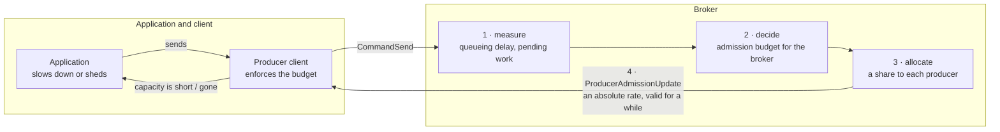
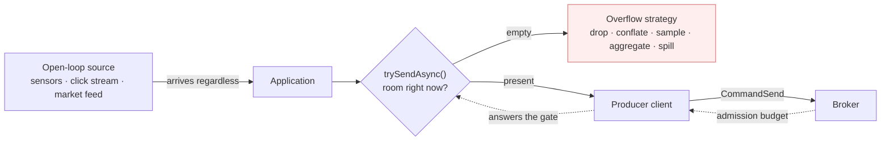
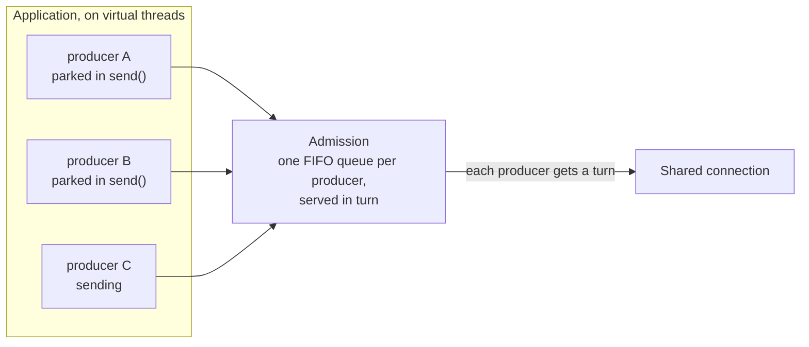

# PIP-495: End-to-end produce backpressure

# Background knowledge

Publishing to Pulsar crosses three boundaries, and each can be overrun independently:

1. **Application → producer client.** The application hands messages to a `Producer`; the client holds them until the broker acknowledges them.
2. **Producer client → broker.** The client writes `CommandSend` frames onto a TCP connection shared with the client's other producers and consumers; the broker holds them until they are persisted.
3. **Broker → storage.** The broker writes entries to BookKeeper and holds them until the write completes.

"Backpressure" here means: when a downstream boundary cannot keep up, the pressure is transmitted upstream so the upstream party slows down, rather than accumulating unbounded work in the middle.

## What exists today

**At boundary 1**, a producer has two behaviours, selected by `blockIfQueueFull`:

- `false` (the default, `ProducerConfigurationData:87`): a send that exceeds available capacity **fails** with `ProducerQueueIsFullError` / `MemoryBufferIsFullError`.
- `true`: the send **parks the calling thread** until capacity exists.

What bounds that capacity is easy to get wrong. `maxPendingMessages` defaults to **`0` — no message-count limit at all** (`ProducerConfigurationData:55`); `PulsarClientImpl:819` substitutes 1000 only when the client memory limit is disabled. So on stock defaults, on **both** the v4 and V5 clients, the client memory limit is the sole bound on a producer's in-flight window.

That limit is `ClientBuilder.memoryLimit`, and it is documented as **a limit on direct memory** (`ClientBuilder:483`, default 64 MiB). It is charged in `ProducerImpl.canEnqueueRequest` in units of `uncompressedSize` — the payload, and only the payload, charged uncompressed even when the buffer retained is the compressed one. (Batching adds a second charge for the batch buffer itself, via `BatchMessageContainerImpl.updateAndReserveBatchAllocatedSize`; what no charge covers is the per-send bookkeeping, which is the subject of the heap budget proposed below.)

**Inside the broker**, `ServerCnxThrottleTracker.ThrottleType` enumerates seven throttling conditions:

| Condition | Blast radius | Publish path? |
|---|---|---|
| `TopicPublishRate` | connection | yes |
| `ResourceGroupPublishRate` | connection | yes |
| `BrokerPublishRate` | connection | yes |
| `IOThreadMaxPendingPublishBytesExceeded` | **every connection on the IO thread** | yes |
| `ConnectionMaxPendingPublishRequestsExceeded` | connection | yes |
| `ConnectionOutboundBufferFull` | connection | indirect — channel writability |
| `ConnectionPauseReceivingCooldownRateLimit` | connection | all commands |

The last two are gated on `pulsarChannelPauseReceivingRequestsIfUnwritable`, default `false` (`ServiceConfiguration:1076`), so neither fires on a stock broker. Of the five that remain, the two memory-pressure conditions are enabled by default while the three **rate** conditions fire only where an operator configured a rate: `maxPublishRatePerTopicInMessages`/`InBytes` and `brokerPublisherThrottlingMaxMessageRate`/`MaxByteRate` all default to `0`, meaning off (`ServiceConfiguration:1286`, `1293`, `1248`, `1255`). Everything below concerns deployments that set them — which is what multi-tenant operation requires.

**The only action any of them has** is `setAutoRead(false)` on a connection. `ServerCnxThrottleTracker.markThrottled` applies it on the transition into the throttled state.

## What has already been done

Much of this ground was surveyed in *[Apache Pulsar service level objectives and rate limiting](https://codingthestreams.com/pulsar/2023/11/22/pulsar-slos-and-rate-limiting.html)* (2023). Its rate-limiting programme has since shipped — the publish and dispatch limiters run on a lock-free token bucket, `org.apache.pulsar.broker.qos.AsyncTokenBucket`, and `ServerCnxThrottleTracker` tracks throttle conditions individually per `ThrottleType`, so one condition clearing cannot resume a connection another still holds. What it proposed and was never built is what this proposal is about: explicit per-producer flow control, by analogy with consumer permits, and optional per-producer connection isolation.

# Motivation

Pulsar does not lack limits. The problems are that they collapse into one blunt action applied at the wrong scope, that the client-side ones offer no usable third option, that heap retention is neither bounded nor accounted, and that on the newest client the bound does not engage at all. The consequence reaches past stability: a tenant whose tail latency is decided by whoever it is multiplexed with cannot be given a service objective anyone can promise.

### The lever is connection-scoped; three of the five conditions are not

`TopicPublishRate`, `ResourceGroupPublishRate` and `BrokerPublishRate` describe a topic, a resource group and a broker. All are enforced by pausing a connection.

With `connectionsPerBroker = 1`, an application producing to twenty topics through one client has all twenty share a connection. One topic breaching its publish rate stops reads for the other nineteen and for every consumer on that client. A well-behaved tenant's latency is decided by the worst-behaved topic it shares a connection with. This is [#23403](https://github.com/apache/pulsar/issues/23403); [PIP-385](https://github.com/apache/pulsar/pull/23398) documents the same problem.

### The mechanism cannot attribute cause, and its own metric shows it

`setAutoRead(false)` transmits no information: the client sees latency and cannot distinguish throttling from a slow network, a slow bookie, or a GC pause. Nothing the broker can do to a TCP connection changes that, which is why this proposal adds a signal rather than a better way to stop bytes: the application is told how much it may publish, and can act on it while it still has choices.

Metrics exist — a connection rate-limit counter, a throttled-connections gauge, and a per-topic publish-rate-limit counter (`OpenTelemetryTopicStats:69`). What is missing is attribution and duration. The per-topic counter is fed by `ServerCnx.increasePublishLimitedTimesForTopics()` (`ServerCnx:4471-4480`), which iterates **every producer on the connection** and increments the counter on **every topic it finds** — culprit and victims alike. The metric is systematically misattributed because the mechanism it reports on cannot tell them apart either, and the connection counter is not labelled by condition.

### The client offers no third option

`blockIfQueueFull` forces a choice between discarding work and parking a thread. Neither suits an asynchronous application: failing throws away work that could have been paced; parking defeats the point of an async API and can wedge a shared executor. There is no way to say *"tell me when you have room; I will decide what to do meanwhile."* This is [#26343](https://github.com/apache/pulsar/issues/26343).

Parking has produced real deadlocks: a send issued from a client IO thread parks that thread on memory only that same thread can release ([#26344](https://github.com/apache/pulsar/issues/26344)).

### Heap retention is neither bounded nor accounted

`memoryLimit` bounds direct memory. A pending unbatched send also retains **heap** — the `MessageMetadata`, the `MessageImpl`, the `OpSendMsg`, the send callback, and the chain of `CompletableFuture` stages carrying the result back — on the order of 1–2 KiB per pending send depending on message shape and JVM settings (measured on JDK 21 with ZGC, where compressed oops are off).

Nothing bounds that heap. Because the direct charge counts payload only, a producer of small messages exhausts heap long before it approaches its direct-memory limit. Measured on a heap dump of a client that died this way: the limiter read **92,335,360 of 209,715,200 bytes — 44% of its configured budget — when a 2 GiB heap was exhausted**, with 1,285,311 sends outstanding and **not one message acknowledged**. Even had every outstanding send been charged, the total would have been 164 MiB against a 200 MiB limit: the direct-memory limit could not have engaged, because direct memory was never the resource running out.

### On the V5 client there is no boundary-1 backpressure at all

`ScalableTopicProducer.sendInternalAsync` appends to a per-segment dispatch chain and returns, so a caller that does not await the returned futures is not slowed while the chain is behind — whatever the underlying producer's limit is.

When that limit does engage, neither outcome is usable backpressure. With the default `blockIfQueueFull(false)`, `ProducerQueueIsFullError` surfaces asynchronously on the returned future, long after the caller has moved on. With `blockIfQueueFull(true)` it is worse: once the chain has caught up, `appendToDispatchChain` runs the dispatch inline on the calling thread **while holding the dispatch lock**, so the caller parks holding a lock every other producer thread needs — which is [#26344](https://github.com/apache/pulsar/issues/26344). The absence of boundary-1 backpressure on V5 is [#26470](https://github.com/apache/pulsar/issues/26470).

## Goals

### In Scope

- **An application-visible signal.** A non-blocking way for an application to learn whether a send will be admitted now, and to be told when capacity returns — so that an application can adapt instead of discovering congestion as latency.
- **A broker-side admission budget derived from measurement**, not from a rate an operator configured in advance, so that a cluster can be run closer to its capacity than peak provisioning requires.
- **An explicit per-producer budget on the wire**, absolute and idempotent, so every client language can enforce it and no client has to infer it from timing.
- **Proportional shedding**: when the budget falls, each publishing producer's share falls by roughly the same fraction.
- A bounded, accounted **heap budget** for pending sends, without redefining `memoryLimit`.
- **Admission that is fair across producers sharing a connection**, and safe to block on under virtual threads.
- Separating the three deadlines that `sendTimeoutMs` conflates.

**What this costs, stated up front.** It adds a broker-to-client command and its negotiation, which is a protocol surface the project has to maintain and every client eventually has to implement. It puts a feedback controller on the publish path, with the tuning and instability risk any controller carries. And it does not make enforcement voluntary: a client that ignores the signal is given a bounded allowance and then the existing involuntary instrument, `setAutoRead(false)`. The signal makes cooperation possible; connection pausing is what keeps enforcement certain.

**What it does not deliver.** Proportional shedding is not fairness — a source already taking most of a broker keeps most of it — and it deliberately asserts no entitlement, which is what lets it ship without settling what a tenant is owed. The loop is also incomplete: a broker that can only answer overload by shedding, and never by moving load, converts a placement problem into a customer-visible slowdown. See *What this does not fix*.

### Out of Scope

- **Consumer-side flow control.** `CommandFlow` permits already exist for dispatch and are unchanged.
- **A fairness or entitlement policy.** Analysed in *Fairness*; this proposal is its precondition.
- **Replacing the configured rate limiters.** `PublishRateLimiterImpl` and `ResourceGroupPublishLimiter` remain as ceilings a tenant has purchased; the adaptive budget is a second constraint below them, never above.
- **Topic-granular placement and the load balancer.** The measurements added here are what a placement decision would need, but changing how topics are assigned to brokers is separate work.
- **A per-producer connection-isolation API**, tracked as [#23403](https://github.com/apache/pulsar/issues/23403) and independently shippable.
- **Ports of the client API to C++, Go, Python and Node.** The wire signal is language-neutral and those clients can enforce it; exposing it to applications is additive per client.

# High Level Design

**One organising idea: close the loop.** Today the broker knows it is overloaded and the application
never finds out. Every mechanism in *Background* ends at the socket — `setAutoRead(false)` stops bytes
and says nothing — so the application learns about congestion as latency, and eventually as a timeout.
An application cannot adapt to a signal it never receives, so the only way to survive peak load is to
buy enough brokers that peak never arrives. That is the overprovisioning this proposal is trying to
remove.

The loop has four parts, and the proposal is the whole loop rather than any one of them:



1. **Measure.** The broker measures how congested it actually is, from queueing delay and outstanding
   work — not from a rate an operator guessed at in advance.
2. **Decide.** A controller turns that measurement into an admission budget for the broker, raising it
   while there is headroom and cutting it in proportion to how far over it is.
3. **Allocate.** The budget is divided among the producers actually publishing, in proportion to what
   each is already admitted to send.
4. **Tell the client, and let the client tell the application.** The share travels as an explicit,
   absolute number the producer may publish at. The client enforces it, and — this is the part that
   makes it end-to-end — surfaces it through two methods the application can act on.

**What replaces "throttle" is "publish less".** A configured rate limit answers demand it cannot serve
by stopping a connection. A budget answers it by telling the producer what it may have, which the
application can respond to while it still has choices: a source that can be slowed is slowed, and a
source that cannot is sampled, conflated or dropped by the only party that knows which of its messages
matter. Both outcomes succeed. Neither is an outage.

**This does not conjure capacity.** Under demand that exceeds what the cluster can persist, indefinitely,
something must give: the application slows its source, holds the work elsewhere, or discards it
deliberately. What the loop changes is that the choice is made by the application, in advance, instead of
by a timeout, afterwards.

# Detailed Design

## Design & Implementation Details

### What an application can do about backpressure depends on its source

The property that decides which API an application needs is **whether backpressure can reach its
origin** — whether the loop is closed or open. The reactive lineage calls these *cold* and *hot*
sources, and those names are useful shorthand as long as their ambiguity is acknowledged: "hot" is also
used to mean multicast, and the two senses usually travel together but are not the same claim.

**When the loop can be closed, backpressure is lossless.** A file, a database cursor, a topic being
replayed: if the application stops pulling, the source waits. Demand propagates all the way back, and
nothing has to be discarded — the data is produced later instead.


**When it cannot, backpressure is lossy, and the application must choose how.** Sensor readings, clock
ticks, UDP market data, an inbound connection someone else owns: the data arrives whether or not there
is room. "Slow down" is not actionable, because there is no dial. What the application can do is decide
*what to give up* — and the established strategies are all it has: bounded buffering, spilling,
dropping oldest or newest, **conflation** (latest-wins, per key), sampling or pre-aggregation, or
failing fast. Only the application knows which is right for its data.



This is also what a broker is *for*: **a durable log converts an open-loop source into a closed-loop
one.** The topic absorbs the producer's pace, and a consumer with its own cursor reads at whatever rate
it likes and can replay. Consumers already get the closed-loop side, through permits and cursors. This
proposal is about giving producers the same standing — and about being honest that when the log itself
cannot keep up, the conversion has a limit, and the application is the only party that can decide what
happens at it.

**Blocking is the third shape, and virtual threads make it a good one again.** An application whose
calling thread may wait should be able to write the obvious loop. Blocking is the closed-loop model with
the demand signal hidden inside the call; `SubmissionPublisher.submit` and `offer` are the same two
modes side by side in the JDK.



### The application boundary: two methods

The whole application-facing surface is one method on `Producer` and one on `TypedMessageBuilder`.
Nothing is reserved, owned, presented, or expired.

```java
public interface Producer<T> extends Closeable {
    /**
     * Complete once this producer can admit a send; already complete if it can now.
     * Advisory, not a reservation — another producer sharing the budget may take the
     * capacity first. The same future is returned to every caller until it completes.
     */
    default CompletableFuture<Void> whenSendable() {
        return CompletableFuture.completedFuture(null);
    }
}

public interface TypedMessageBuilder<T> extends Serializable {
    /**
     * Send if the producer can admit the message without waiting. Empty means, and only
     * means, "no capacity right now": nothing was enqueued and no exception was built.
     * Every other outcome returns a present future behaving as sendAsync().
     */
    default Optional<CompletableFuture<MessageId>> trySendAsync() { … }
}
```

`trySendAsync()` is **authoritative** and `whenSendable()` is **advisory**, and the split is deliberate.
The advisory signal is what a closed-loop application waits on; the authoritative call is what actually
admits. An application that treats the signal as a reservation is wrong in a way that shows up under
exactly the contention it is trying to handle, so the contract says outright that the correct shape is
*wait, then loop on `trySendAsync()` until it refuses*.

Three properties make this cheap enough to sit on a hot path. The same future is handed to every caller
until it completes, so **waiters are bounded by the producer count, not the message rate**, and the
steady-state "there is room" case allocates nothing. An empty `Optional` is a singleton: refusing costs
no exception, no stack capture, and no schema work, because the decision is taken before the message is
built. And **`trySendAsync()` does not barge** — it refuses when another producer sharing the budget is
already waiting, which is what stops a shedding producer from starving a blocked one.

The three modes fall out of the two methods:

| Source | What the application does | Backpressure |
|---|---|---|
| Closed-loop | `whenSendable()`, then pull and `trySendAsync()` until refused | Lossless; reaches the origin |
| Open-loop | `trySendAsync()`, and on empty apply its overflow strategy | Lossy, by the application's choice |
| Blocking | `send()` with `blockIfQueueFull(true)` and `maxSendBlockTime` | Lossless; the thread waits |

```java
// Open-loop: 200k spans/s from a source that cannot be slowed. Shed, never time out.
void onSpan(Span span) {
    var sent = producer.newMessage().value(span).trySendAsync();
    if (sent.isEmpty()) { dropped.increment(); return; }   // the shed decision
    sent.get().exceptionally(e -> { failed.increment(); return null; });
}
```

```java
// Closed-loop: pull the next record only when there is room for it.
void pump() {
    producer.whenSendable().thenRunAsync(() -> {
        for (var r = source.peek(); r != null; r = source.peek()) {
            if (producer.newMessage().value(r).trySendAsync().isEmpty()) break;
            source.advance();
        }
        pump();
    }, appExecutor);
}
```

**What this deletes.** An earlier draft of this proposal reserved capacity into an application-held
`CapacityGrant`, with a request builder, a minimum, a validity deadline, an idempotent release, rules
for presenting a grant to the wrong producer, and three new exception types. Every one of those existed
because ownership had been externalized. Pulsar's own
[reactive client](https://github.com/apache/pulsar-client-reactive) demonstrates the alternative: a
counter acquired when a send is initiated and released on receipt is enough to drive Reactive-Streams
demand back to a cold source, with no capacity object in the application's hands at all. Keeping the
counter inside the client removes the object and every rule that attended it. What that library does
*not* do — and why this is a PIP rather than a dependency — is bound bytes or heap (it has no
interaction with `memoryLimit` whatever), work on the V5 client, or exist inside `pulsar-client`.

### What the client bounds

**A heap budget, not a redefinition.** `ClientBuilder.memoryLimit` is documented as a limit on direct
memory, so charging retained heap against it would silently change the resource being limited.
`pendingSendHeapLimit` is a separate, explicitly named budget for what pending sends retain on the heap,
and `whenSendable()` folds it in with the others.

**Admission is per producer and served in turn.** `connectionsPerBroker` defaults to 1, so a client's
producers share a connection, and capacity handed out in arrival order lets one busy producer hold every
neighbour behind it. Waiters are held in one FIFO queue **per producer** — FIFO within a producer
because Pulsar requires per-producer send order anyway — and those queues are served round-robin with a
byte quantum, over the producers of a connection. This is the two-level shape HTTP/2 uses for its
connection and stream windows. Two rules make it a liveness guarantee rather than a heuristic: the
arbiter services *producers, not waiters*, so a producer with a thousand parked callers gets one
producer's share and not a thousand; and every producer with an open admission path is guaranteed a floor
of `budget / activeProducers`, which it may draw against without consulting anyone.

Today's `MemoryLimitController` cannot support this and is replaced for the blocking path: it is an
unfair `ReentrantLock` with a single condition, `signalAll()` only on the downward edge, and a
`while (!tryReserveMemory(size)) await()` loop — a thundering herd in which a producer needing 1 MiB
loses indefinitely to producers needing 1 KiB.

**Three clocks, where there was one.** `sendTimeoutMs` (default 30 s) conflates waiting for client
capacity with waiting for the broker, and its only implementable shape is a whole-window cliff:
`ProducerImpl.run(Timeout)` measures from the head message's `createdAt` and calls `failPendingMessages`,
failing every in-flight message including one sent milliseconds ago. That multiplier is the
amplification — and the arithmetic is decisive once admission is dynamic. A producer holding 1,000
accepted messages whose allowed rate drops to 20/s needs about 50 seconds to drain. **No tuning
reconciles that with a 30-second deadline.** So the deadline is separated by what it actually measures:

| Clock | Expiry means | Owned by |
|---|---|---|
| `maxSendBlockTime` | The application could not get permission in time; **nothing was published**, and it may sample, drop or defer | the caller |
| Delivery deadline, from first transmission | The outcome is unresolved — it does **not** mean the message was not persisted | the caller, optional |
| Connection watchdog | The transport or the broker has stopped making progress; recover | the client |

`sendTimeoutMs` keeps its present meaning for applications that do not opt in — it is already disabled
when set to zero, and replicators already run that way with a bounded pending count
(`AbstractReplicator:153`). What the new modes add is that waiting has a bound *before* admission, where
expiry costs nothing, instead of only after, where it costs a window.

### What the broker measures, and what it decides

**The signal is queueing delay, guarded by watermarks.** A configured rate cannot tell a broker whether
it is coping; only its own queues can. The primary input is the delay a publish waits before its
storage write is initiated, with outstanding bytes and outstanding operation counts as independent
safeguards. Three measurement facts constrain any implementation:

- `PendingBytesPerThreadTracker` already counts pending publish bytes per IO thread, but it is charged
  before the producer publish call and released by the IO-thread completion task, so it spans the whole
  path — retained buffers, storage, and the return hop. It is a good occupancy safeguard and a poor
  proxy for storage queue depth.
- Managed-ledger add latency **misses its own initial executor wait**: `asyncAddEntry` submits a task,
  and `OpAddEntry`'s `startTime` is set after that task is dequeued, so time spent waiting for the
  dequeue is invisible. Submission-to-start timing has to be added.
- Completed-operation latency stops producing samples exactly when storage stalls, so an
  oldest-outstanding-operation age is needed alongside it.

**And attribution of waiting is not attribution of causing the wait.** A small producer queued behind
expensive work experiences the same delay it did not cause, so congestion and each producer's admitted
contribution have to be measured separately.

**The controller.** Let `z` be the worst of the normalised pressures — queueing delay against its
target, outstanding bytes and operations against their soft watermarks. The broker's admission budget
`R` moves multiplicatively down and additively up:

```
z > 1     →  R ← R · max(0.5, 1 − β(z − 1))     decrease in proportion to the overload
z < 0.8   →  R ← R + A                          only while producers are demand-limited
otherwise →  R unchanged
```

This is Breakwater's shape — central AIMD on measured queueing delay, decrease proportional to overload
rather than a blind halving, floored so one bad interval cannot collapse the budget — and Breakwater is
the evidence that AIMD is right *here*, where a server with complete local knowledge must nonetheless
search for a capacity it cannot compute. The increase is frozen while producers are demand-limited, or
the controller accumulates an imaginary capacity estimate over an idle period and then admits a burst
against it. Emergency protection is a separate path and is not bound by the 0.5 floor.

The loop period must exceed the time for a decision to reach clients and change what arrives, or each
adjustment acts on stale evidence. Congestion is applied **at its own scope**: a single stalled ledger
constrains its topic, a congested executor constrains its users, and only broker-wide pressure
constrains the broker. Slowing everyone for one topic's storage problem would manufacture exactly the
noisy-neighbour behaviour this proposal exists to remove.

**Allocation: proportional shedding, and no more than that.** The budget is divided among producers in
proportion to what each is *already admitted to send*: `rᵢ = R · uᵢ / Σuⱼ`. For an unchanged message
mix this gives every source approximately the same percentage reduction, which is what an application
can plan around, and splitting one producer's traffic across ten producers does not multiply its share.
Three rules keep it honest, and each closes a way to game it:

- **Measure admitted traffic, not attempted traffic.** Ignoring the signal must never increase an
  allocation.
- **Freeze the reference during reductions.** Recomputing weights from already-throttled traffic
  rewards non-compliance and punishes obedience.
- **Reserve a bounded pool for new and returning producers**, rather than granting each newcomer a free
  burst.

What this deliberately is **not** is fairness. A source already taking 90% of a broker keeps
approximately 90% of it during congestion. Proportional shedding is defensible and implementable without
settling what a tenant is entitled to; calling it fairness would not be. A guarantee that every tenant
makes progress against adversarially created producers needs an authenticated allocation identity, and
that is the follow-up this proposal is the precondition for — see *Fairness*.

### The signal: an absolute budget, not a nudge

```text
ProducerAdmissionUpdate {
    producer_id, producer_generation, update_sequence,
    valid_for_ms,
    messages_per_second, bytes_per_second,
    burst_messages, burst_bytes,
    reason
}
```

It is an **absolute, idempotent snapshot**. "Publish at 80% of your current rate" is ambiguous under a
duplicated update, an idle producer, a reconnect, or two observers with different windows; an absolute
budget is the same information, is safe to repeat, and gives the client a schedule it can actually
enforce. It carries both dimensions because bytes alone do not capture the cost of small messages.

It is a **command, not only a receipt field**. A receipt field would be a free piggyback while receipts
flow, but a producer that has been told to stop has no outstanding receipts to annotate, and needs to be
told both about further reductions and about permission to resume. Adding the piggyback later is a pure
optimisation.

The lifecycle rules are the part an implementation cannot infer: an initial budget is established at
producer creation, so the first burst is covered; updates are scoped to the producer incarnation and
stale generations discarded; expiry stops new admission while leaving a control-plane refresh possible;
and a reduction never retroactively invalidates work already transmitted.

**Old clients keep working, and are not trusted to.** The command is sent only after feature
negotiation. A client that does not understand it — or a client that understands it and ignores it —
gets a bounded transition allowance and then the existing involuntary instrument, `setAutoRead(false)`
on its connection. An advisory percentage cannot protect a broker on its own; the signal makes
cooperation *possible*, and connection pausing is what makes enforcement *certain*.

### What this does not fix: where the load is

Throttling is a stopgap, and the design should not pretend otherwise. Kora is explicit that broker-local
backpressure is the temporary state and that the durable response is to move load or add capacity: high
usage "normally triggers a rebalance operation to even out load, or, in rare occasions, when the whole
cluster is close to capacity, the multi-tenant cluster gets expanded." A broker that can only ever say
"publish less" converts a placement problem into a customer-visible slowdown.

Pulsar cannot currently take that step at the granularity the signal produces. Load balancing acts on
**namespace bundles**, and a topic's bundle is fixed by the hash of its name — there is no way to assign
a topic to a bundle, and splitting is the only lever on placement. So the broker can identify precisely
which producer is congesting it and cannot move that topic anywhere. The measurements this proposal adds
are the input a placement decision would need, and topic-granular placement is the work that would let a
cluster answer overload by rebalancing before it answers by shedding. That is out of scope here and is
named because the loop is incomplete without it.

### Fairness

The user-visible goal beyond overload avoidance is that a loaded broker share capacity predictably rather than by arrival order. Proportional shedding is not that, and this proposal is the **precondition** for it rather than its delivery.

A fairness policy would first have to choose an **allocation identity**, and that choice is a behaviour contract that cannot be changed after ship: dividing a *shared* budget — a resource group's, or a broker's — equally between producers hands a tenant running 100 producers a hundred times the capacity of one running a single producer, so producer count is not an entitlement and authentication does not make it one. Proportional shedding avoids that question by not answering it: shares follow admitted usage, so no entitlement is asserted and none is created. A follow-up PIP choosing tenant as the identity can consume the same allocation step. Nor is a pluggable policy seam the interim answer: PIP-310 (*Support Custom Publish Rate Limiters*) asked the same of the rate limiters and was not adopted, on the grounds that fragmenting the implementation serves users worse than fixing the built-in one.

**On AIMD, this proposal reverses an earlier position, and the reversal is worth recording.** An earlier draft argued that AIMD had no place here because every condition acted on already carried an operator-configured rate, leaving no capacity to search for. That is true of *enforcing a purchased quota* and false of the problem this proposal actually addresses: a configured rate is exactly what forces a cluster to be provisioned for peak, and the sustainable capacity of a broker is unknown, varies with workload and storage health, and can only be estimated by measuring. Breakwater is the counterexample that settles it — a single server, with complete knowledge of its own state, running textbook additive-increase/multiplicative-decrease on its own measured queueing delay, because knowing your participants tells you nothing about where the knee is.

The second objection survives in a narrower and more useful form. AIMD has no fixed point: the sawtooth *is* the mechanism, and overshoot is how it finds capacity. That is only a cliff if an overshoot destroys work — which it did in the earlier design, where a slowdown consumed the send-timeout budget of messages already accepted and `failPendingMessages` failed an entire window. Small excursions around a queue target are unremarkable when completed work is acknowledged promptly and the deadline that could destroy a window has been separated from the wait that precedes admission. **Fixing the actuator and the clocks is what makes the controller safe**, and that, rather than an argument against feedback control, is what the earlier draft's cliff was really telling us.

### Connection sharing

Raising `connectionsPerBroker` spreads a client's producers over more connections but cannot isolate one, since it is client-wide. A per-producer isolation API ([#23403](https://github.com/apache/pulsar/issues/23403)) would address what remains and is independently shippable, but it is not specified here, and it delivers less than it appears to: `IOThreadMaxPendingPublishBytesExceeded` throttles every connection sharing an IO thread (`ServerCnx:305-312`), and a producer still draws on the client-wide memory budget whatever socket it owns. A dedicated socket isolates a socket — not client memory, not an IO thread, and not storage.

## Public-facing Changes

### Public API

- New: `Producer.whenSendable()` returning `CompletableFuture<Void>`, and `TypedMessageBuilder.trySendAsync()` returning `Optional<CompletableFuture<MessageId>>`. On V5 both live on the async view.
- New: `ProducerBuilder.maxSendBlockTime(Duration)` — a bound on waiting *for admission*, which `sendTimeoutMs` never covered.
- New: `ClientBuilder.pendingSendHeapLimit(long)`.
- New, read-only: `Producer.admissionState()` exposing the current budget, its reason and its validity, for applications that want to size their own shedding rather than react send-by-send.
- `Producer` and `TypedMessageBuilder` are `@InterfaceStability.Stable`, so both additions ship as `default` methods. `CODING.md:207-211` asks first for a default that delegates to an existing method: `whenSendable()` has one — a producer that performs no admission control always has capacity, so the default returns a completed future, and third-party implementations remain correct rather than merely compiling. `trySendAsync()` defaults to attempting the send and returning it, which is correct for an implementation without admission control.
- No existing method changes signature or semantics. `memoryLimit` keeps its documented meaning.

### Binary protocol

One new broker-to-client command, `ProducerAdmissionUpdate`, carrying an absolute budget for one producer incarnation: message and byte rates, burst allowances, a validity period, a monotonic update sequence and a reason. It is sent only after feature negotiation, and it is idempotent — receiving the same update twice, or receiving one while idle, is defined and harmless.

No client-to-broker command is added. A client that does not negotiate the feature never receives it and is throttled exactly as today.

### Configuration

Client:

- `pendingSendHeapLimit` — bound on heap retained by pending sends. **Default 0, meaning disabled, in the release that introduces it; 64 MiB thereafter.** See *Upgrade*.
- `maxSendBlockTime` — bound on waiting for admission. **Default 0, meaning unbounded**, which is today's behaviour for `blockIfQueueFull(true)`.

Broker:

- `adaptivePublishAdmissionEnabled` — the master switch. **Default `false` in the release that introduces it, `true` in the next**: the instrumentation ships first so the controller is adopted on measured evidence rather than on this document's arithmetic.
- `adaptivePublishTargetQueueingDelayMillis` — the delay the controller holds publishes at. **Default 5.** It must be derived from the share of the publish SLO left after network time and healthy persistence, and explicitly **not** from `sendTimeoutMs`, which is a failure boundary and not an operating target.
- `adaptivePublishControlPeriodMillis` — the control loop period. **Default 100.** It must exceed the time for a decision to reach clients and change what arrives, or each adjustment acts on stale evidence.
- `adaptivePublishDecreaseFactor` (β) and `adaptivePublishIncreaseStep` (A) — the multiplicative decrease gain and the additive increase step. **Defaults 0.2 and 1% of the recent healthy reference rate per period.**
- `adaptivePublishMinBudgetFactor` — the floor on a single decrease. **Default 0.5**, so one bad interval cannot collapse the budget. Emergency memory protection is a separate path and is not bound by it.

Every default here is a starting hypothesis, not a derivation. The metrics below exist so operators can replace them with measured values and the project can revise them on evidence.

### Metrics

Named in the current OTel convention, not the deprecated `pulsar_*` snake-case style — a metric rename inside five years breaks every dashboard built on it.

- `pulsar.broker.publish.queueing.delay` (histogram) — the controller's input: the delay a publish waits before its storage write is initiated. Distinct from end-to-end publish latency, which includes storage and the return hop.
- `pulsar.broker.publish.admission.budget` (gauge; attributes: scope) — the budget the controller currently allows, per scope it is applied at. Read against the queueing-delay histogram, this is how an operator sees the loop working or oscillating.
- `pulsar.broker.publish.admission.allocated` (gauge; attributes: topic) — the share allocated to a producer, so a tenant asking "why am I slower" has an answer that is not a guess.
- `pulsar.broker.publish.admission.updates` (counter; attributes: reason) — updates sent, by why they were sent.
- `pulsar.broker.publish.admission.enforcement` (counter; attributes: topic, action) — where cooperation ended: an allowance exhausted, a connection paused. A non-zero rate here means clients are not honouring budgets, which is an operational fact worth alerting on.
- `pulsar.client.producer.send.refused` (counter, client side) — `trySendAsync()` calls that returned empty. This is the application's shed rate and the number a hot-source deployment actually watches.
- `pulsar.client.producer.pending.send.heap.usage` (gauge, client side) — heap currently retained by pending sends, reported whether or not `pendingSendHeapLimit` is enforcing, which is what makes the staged rollout decidable on evidence.

# Monitoring

The loop is watched as a loop. `pulsar.broker.publish.queueing.delay` against
`pulsar.broker.publish.admission.budget` shows whether the controller is holding its target or hunting;
a budget that oscillates with delay is the signature of a control period shorter than the feedback delay.
`pulsar.broker.publish.admission.enforcement` should be near zero — a sustained non-zero rate means
clients are receiving budgets and not honouring them, and the broker is falling back to pausing
connections. On the client, `pulsar.client.producer.send.refused` is the application's own shed rate and
is the number a hot-source deployment alerts on, because it is the one that corresponds to data not
being published.

# Testing

The failure modes are timing-dependent, so a clean local run is weak evidence. The proposal is not
implementable without at least:

- `trySendAsync()` returns empty **only** for absence of capacity: a closed producer, a schema failure and
  a fenced producer each return a present future that fails, so "empty" carries exactly one meaning.
- `trySendAsync()` does not barge: with a producer already waiting on the shared budget, a second
  producer's `trySendAsync()` refuses even where capacity momentarily exists.
- `whenSendable()` returns the same future to concurrent callers and completes once, so waiters scale
  with producer count and not with message rate.
- Under `blockIfQueueFull(true)`, N producers on one connection all make progress, and a producer needing
  a large message is not starved indefinitely by producers needing small ones — the defect in today's
  `MemoryLimitController` wait loop.
- `maxSendBlockTime` expiry leaves **nothing published** and nothing pending, distinguishing it from a
  send timeout, which fails work already accepted.
- A `ProducerAdmissionUpdate` is idempotent: replaying one, or delivering one to an idle producer,
  changes nothing. A stale `producer_generation` or a lower `update_sequence` is discarded.
- A budget reduction never fails or reorders work already transmitted.
- A client that negotiates the feature and then ignores its budget exhausts its allowance and has its
  connection paused; a client that does not negotiate is throttled exactly as today.
- The controller holds its queueing-delay target under a step increase in offered load, and does not
  ratchet its budget upward across an idle period.
- Allocation is computed from **admitted** traffic: a producer that ignores its budget does not thereby
  increase its share, and a producer that honours one does not lose share for having honoured it.
- `pendingSendHeapLimit` binds where the direct-memory limit does not: a small-message producer is
  bounded in heap and the reported usage matches what is retained.
- Coverage for batching, chunking, transactions, disabled limits, multiple producers per connection, and
  connection churn.

# Security Considerations

Budgets are per producer, and a producer is already authenticated and authorised for its topic. No new
entitlement is created: shares follow admitted usage, so a producer cannot obtain more capacity than its
traffic already justifies, and configured rate limits remain as ceilings above the adaptive budget.

**The signal is advisory; enforcement is not.** A client that negotiates the feature and then publishes
past its budget is given a bounded transition allowance — enough to absorb a decision in flight — and is
then paused with `setAutoRead(false)`, exactly as today. An advisory percentage alone cannot protect a
broker, and the proposal does not rely on one.

**Allocation is computed from admitted traffic**, which is what stops the obvious attack. If shares were
computed from *attempted* traffic, ignoring a budget would enlarge the next one, and the compliant
tenant would fund the non-compliant one. Freezing the reference during reductions closes the same hole
from the other side, where recomputing weights from already-throttled traffic would penalise obedience.

What remains, and is stated rather than defended: a tenant already occupying most of a broker keeps most
of it during congestion, and a tenant can still enlarge its share over time by publishing more when
capacity is available. Proportional shedding bounds the *rate of change* of that, not the outcome. A
guarantee that every tenant makes progress against adversarially created producers requires an
authenticated allocation identity, which is the follow-up work *Fairness* describes.

The new command carries no credentials and no topic data; it is addressed to a producer incarnation the
client already owns.

# Backward & Forward Compatibility

## Upgrade

Every part is staged, and each stage is decidable on a metric the previous stage shipped.

The broker instrumentation ships first and enabled: `pulsar.broker.publish.queueing.delay` costs one
timestamp per publish and tells an operator what their brokers actually do under load. The controller
ships next, `adaptivePublishAdmissionEnabled=false`, computing a budget and reporting it through
`pulsar.broker.publish.admission.budget` **without enforcing it**, so a cluster can be compared against
its own history before anything changes. It is enabled by default one feature release later.

`pendingSendHeapLimit` ships disabled, with its gauge reporting what *would* have been charged, and is
enabled by default in the following release on that evidence. `maxSendBlockTime` defaults to unbounded,
preserving today's `blockIfQueueFull(true)` behaviour exactly.

Old clients are unaffected: without feature negotiation they receive no `ProducerAdmissionUpdate` and are
throttled as they are today. A new client against an old broker sees `whenSendable()` complete
immediately and `trySendAsync()` behave as `sendAsync()`, which is the correct degradation — the client
enforces nothing it has not been told.

Worth stating plainly: on a cluster that has been running at high utilisation because nothing was
stopping it, enabling the controller will *reduce* admitted throughput, and that is the feature working.
The budget and queueing-delay metrics are what distinguish it from a regression.

## Downgrade / Rollback

Reverting the broker stops the command being sent and restores connection-scoped pausing; clients treat
the absence of updates as an unbounded budget, which is today's behaviour. Reverting the client restores
the previous accounting. No persisted state changes, and the wire addition is negotiated rather than
assumed, so rollback is unconditional in either direction.

## Pulsar Geo-Replication Upgrade & Downgrade/Rollback Considerations

Replicator producers publish through the same path and are subject to the same budgets. Two specifics:
a replicator disables its send timeout and bounds its pending messages instead (`AbstractReplicator:153`),
which is the shape this proposal generalises; and a replicator that is budget-limited will lag rather
than fail, so replication backlog becomes the visible symptom of a congested destination cluster. Nothing
crosses the replication wire format, so mixed-version clusters are unaffected.

# Alternatives

**Pacing the response stream instead of signalling.** This was the previous design of this proposal: when
a limiter tripped, the broker withheld that producer's `SendReceipt`s rather than pausing its connection,
which needed no protocol change. It is rejected, and the reason is the one Kafka published. Kafka's
original quota design throttled by delaying responses;
[KIP-219](https://cwiki.apache.org/confluence/display/KAFKA/KIP-219+-+Improve+quota+communication)
replaced it after production failures in which a producer hit its request timeout before the delayed
response arrived, disconnected, retried, was throttled again, and "the pattern continues indefinitely
putting more and more load on the cluster". Its diagnosis is exactly the objection this document raises
against connection pausing — "clients have no way to distinguish between timeout scenarios (such as
network partitions) and quota violation scenarios" — and it applies with equal force to pacing. Kafka
answers immediately and mutes afterwards; the principle is **acknowledge completed work promptly, and
regulate future work explicitly**. Pacing also spends the wrong resource: it makes a client hold a
message the broker has already persisted, consuming client memory and the message's own deadline, to
communicate a fact a single field could state.

**A relative signal — "publish at 80% of your current rate".** Rejected as ambiguous. It has no defined
meaning for a producer that is idle, no safe behaviour under a duplicated or reordered update, and two
observers with different windows disagree about what "current" was. An absolute budget carries the same
information, is idempotent, and is something a client can actually schedule against.

**Application-held capacity grants.** The earlier client design reserved capacity into a `CapacityGrant`
the application passed back to each send. Rejected because every rule it needed — ownership, expiry,
idempotent release, wrong-producer rejection, three exception types — existed only because the counter
had been handed to the application. Pulsar's reactive client demonstrates the same demand signalling with
the counter kept inside the client and no capacity object at all.

**Keep configured rate limits and provision for peak.** The status quo, and the thing to beat. It works,
and its cost is the overprovisioning this proposal exists to remove: a limit set for a burst is idle
capacity the rest of the time, and a limit set for the average is an outage during the burst.

**Redefine `memoryLimit` to cover heap.** Rejected as a silent redefinition of a documented direct-memory
limit (`CODING.md:219`).

**Per-producer connection isolation only.** It would reduce noisy neighbours but not overload, and it
cannot isolate client memory, an IO thread, or storage.

# Design decisions

Recorded so a later pass does not re-litigate them, including two reversals within this proposal's own drafting.

**Reversed — response pacing.** An earlier draft throttled by withholding a producer's receipts, on the grounds that it needed no protocol change. Cut once the requirement became an application that can *adapt*: pacing communicates nothing, and the mechanism Kafka retreated from in KIP-219 is the same one. See *Alternatives*.

**Reversed — AIMD.** An earlier draft rejected feedback control because every condition acted on carried a configured rate. That argument holds only for enforcing a purchased quota, and configured rates are what force provisioning for peak. See *Fairness*.

**Cut — application-held capacity grants.** Replaced by two methods and a counter the client keeps. *Add-back:* none needed; a reservation API remains expressible later if a real caller wants atomic multi-message admission. *Tradeoff:* an application batching N messages loops on `trySendAsync()` rather than reserving N up front.

**Cut — a `pendingSendOverheadBytes` tuning knob.** The overhead is message-shape dependent and split across heap and direct pools, so no single global scalar is right. *Tradeoff:* deployments tune `pendingSendHeapLimit`, the quantity they care about.

**Kept — configured rate limits.** The adaptive budget constrains below them and never above. An operator who has sold a rate keeps selling it; what changes is that the broker may allow less when it genuinely cannot serve more.

**Kept — connection pausing.** Not as the primary instrument, but as the involuntary backstop that makes an advisory signal safe to ship.

# General Notes

Two client-side bugs are prerequisites rather than parts of this proposal: [#26470](https://github.com/apache/pulsar/issues/26470) (the V5 async producer applies no backpressure) and [#26469](https://github.com/apache/pulsar/issues/26469) (a double release that can permanently disable the client memory limit). Admission on the client assumes a correctly-accounted window; neither can be left unfixed.

The relationship to [PIP-385](https://github.com/apache/pulsar/pull/23398) should be settled on the mailing list before a vote. PIP-385 proposed an explicit throttling command and stalled; this proposal adopts that position — an explicit, negotiated broker-to-client signal — and adds what makes it useful: a budget derived from measurement rather than configuration, and an application-facing surface to act on it. It should either supersede PIP-385 or be reconciled with it, and that is the author's question to the list rather than a decision to take here.

# Links

- [#26343](https://github.com/apache/pulsar/issues/26343) — no non-blocking backpressure mode; admission control blocks internal threads
- [#26344](https://github.com/apache/pulsar/issues/26344) — V5 producer self-deadlocks a Netty IO thread
- [#26470](https://github.com/apache/pulsar/issues/26470) — V5 async producer applies no backpressure
- [#26469](https://github.com/apache/pulsar/issues/26469) — memory reservation released twice
- [#23403](https://github.com/apache/pulsar/issues/23403) — isolated connections for producers and consumers
- PIP-385: [#23398](https://github.com/apache/pulsar/pull/23398) — rate limit semantics in the protocol
- [RSocket protocol, `LEASE` frame](https://github.com/rsocket/rsocket/blob/master/Protocol.md) — a credit grant with a mandatory time-to-live
- [KIP-219](https://cwiki.apache.org/confluence/display/KAFKA/KIP-219+-+Improve+quota+communication) — Kafka's retreat from throttling by delayed response, and the retry spiral that forced it
- Hotari, L., *[Apache Pulsar service level objectives and rate limiting](https://codingthestreams.com/pulsar/2023/11/22/pulsar-slos-and-rate-limiting.html)*, 2023 — the survey continued under *What has already been done*
- Cho, I. et al., *[Overload Control for μs-scale RPCs with Breakwater](https://www.usenix.org/system/files/osdi20-cho.pdf)*, OSDI 2020, §3.2.1 — central, credit-based AIMD on measured queueing delay: the controller shape this proposal adopts
- Povzner, A. et al., *[Kora: A Cloud-Native Event Streaming Platform for Kafka](https://www.vldb.org/pvldb/vol16/p3822-povzner.pdf)*, PVLDB 16(12), 2023, §5.2.1 — why a CPU limit is triggered on queue depth, and why broker-local backpressure is a stopgap for rebalancing
- Hotari, L., *[Pulsar's namespace bundle centric architecture limits future options](https://codingthestreams.com/pulsar/2022/10/17/namespace-bundle-is-a-limiting-factor.html)*, 2022 — why a topic cannot be placed independently, which is what blocks the rebalance half of the loop
- [apache/pulsar-client-reactive](https://github.com/apache/pulsar-client-reactive) — demand-driven sending with the admission counter kept inside the client
- Mailing list discussion: TBD
- Vote thread: TBD
